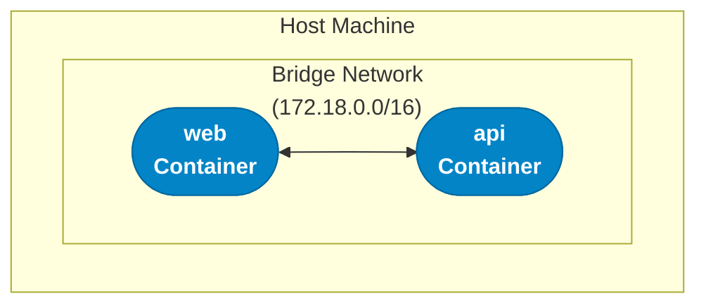
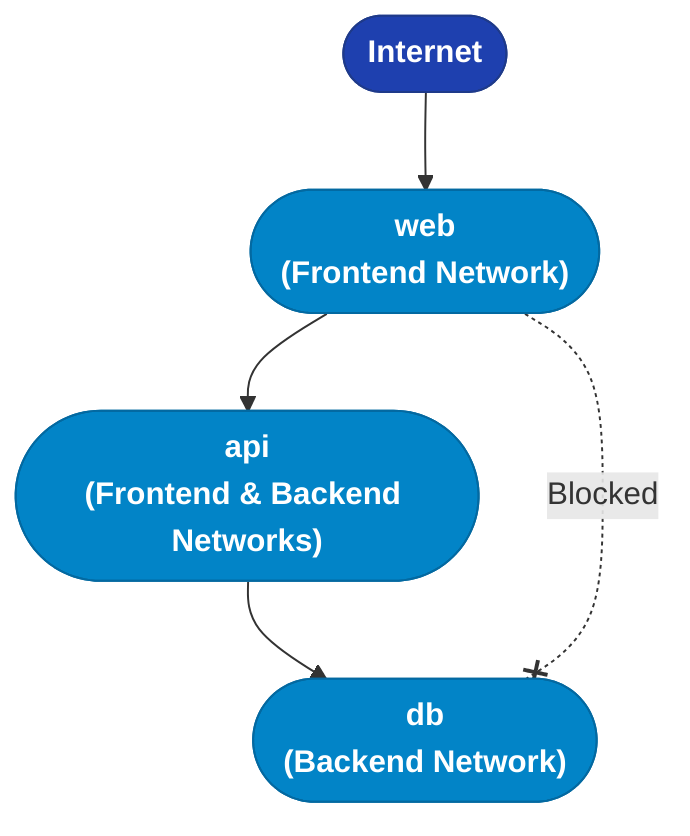

# Lecture 04: Docker Networking and Volumes

## Learning Objectives

By the end of this lecture, you will be able to:

- Understand Docker networking fundamentals
- Create and manage custom networks
- Configure container communication
- Work with different network drivers
- Understand Docker storage architecture
- Create and manage volumes
- Use bind mounts effectively
- Implement data persistence strategies
- Troubleshoot networking and storage issues

---

## Part 1: Docker Networking

## 1. Introduction to Docker Networking

### Why Networking Matters

**Containers need to communicate**:
- Web app → Database
- API → Redis cache
- Frontend → Backend services
- Container → External internet

**Docker provides**:
- Automatic DNS resolution
- Network isolation
- Port mapping
- Multiple network drivers

### Default Networking Behavior

**When you run a container**:
```bash
docker run -d --name web nginx
```

**Docker automatically**:
1. Creates a virtual network interface
2. Assigns an IP address
3. Connects to default bridge network
4. Provides DNS resolution

```
Container "web"
├─ IP: 172.17.0.2
├─ Network: bridge (default)
└─ DNS: Resolves container names
```

---

## 2. Docker Network Types

### Bridge Network (Default)

**Bridge** = Private internal network on the host

```bash
# Containers on same bridge can communicate
docker network create my-bridge
docker run -d --name web --network my-bridge nginx
docker run -d --name api --network my-bridge python:3.11

# web can reach api at hostname "api"
```



**Characteristics**:
- Best for single-host deployments
- Network isolation
- Container-to-container communication
- Cannot span multiple hosts

### Host Network

**Host** = Container uses host's network directly

```bash
docker run -d --network host nginx
```

```
Container shares host network namespace
├─ No IP isolation
├─ Direct access to host ports
└─ No port mapping needed
```

**Characteristics**:
- Best performance (no NAT)
- No port mapping overhead
- Port conflicts with host
- Less isolation

**When to use**: High-performance requirements, monitoring tools

### None Network

**None** = No networking

```bash
docker run -d --network none nginx
```

**Characteristics**:
- Maximum isolation
- No network access at all
- **Use case**: Processing sensitive data, batch jobs

### Overlay Network

**Overlay** = Multi-host network (Docker Swarm)

```bash
docker network create -d overlay my-overlay
```

**Characteristics**:
- Spans multiple Docker hosts
- Encrypted by default
- Requires Docker Swarm mode

---

## 3. Working with Networks

### Creating Networks

```bash
# Create bridge network
docker network create my-network

# Create with specific subnet
docker network create --subnet=172.20.0.0/16 my-network

# Create with custom driver
docker network create -d bridge my-bridge

# Create with labels
docker network create --label env=production my-network
```

### Managing Networks

```bash
# List networks
docker network ls

# Inspect network
docker network inspect my-network

# Remove network
docker network rm my-network

# Remove unused networks
docker network prune

# Connect running container to network
docker network connect my-network my-container

# Disconnect
docker network disconnect my-network my-container
```

### Running Containers on Custom Networks

```bash
# Run on specific network
docker run -d --name web --network my-network nginx

# Connect to multiple networks
docker run -d --name gateway \
  --network frontend \
  --network backend \
  nginx

# Assign specific IP
docker run -d --name web \
  --network my-network \
  --ip 172.20.0.10 \
  nginx
```

---

## 4. Container Communication

### DNS Resolution

**Containers can reach each other by name**:

```bash
# Create network
docker network create app-network

# Run containers
docker run -d --name db --network app-network postgres:15
docker run -d --name api --network app-network myapi

# From 'api' container
docker exec api ping db
# PING db (172.20.0.2): 56 data bytes
```

**How it works**:
```
api container
├─ Looks up hostname "db"
├─ Docker DNS resolves to 172.20.0.2
└─ Connection established
```

### Network Aliases

**Multiple names for same container**:

```bash
docker run -d \
  --name db \
  --network app-network \
  --network-alias database \
  --network-alias postgres \
  postgres:15

# Now accessible as:
# - db
# - database
# - postgres
```

### Port Publishing

**Expose container to host/external network**:

```bash
# Publish single port
docker run -d -p 8080:80 nginx
# Host:8080 → Container:80

# Publish on specific interface
docker run -d -p 127.0.0.1:8080:80 nginx
# Only localhost can access

# Publish random port
docker run -d -P nginx
# Docker assigns random host port

# Find assigned port
docker port nginx
# 80/tcp -> 0.0.0.0:32768
```

### Container-to-Host Communication

**Access host services from container**:

```bash
# Linux: Use host.docker.internal (Docker Desktop)
docker run -e DB_HOST=host.docker.internal myapp

# Linux native: Use host IP
docker run -e DB_HOST=172.17.0.1 myapp

# Or use host network mode
docker run --network host myapp
```

---

## 5. Network Patterns and Examples

### Pattern 1: Frontend-Backend Separation

```bash
# Create networks
docker network create frontend
docker network create backend

# Backend services (database)
docker run -d --name db --network backend postgres:15

# API (both networks)
docker run -d --name api \
  --network frontend \
  --network backend \
  myapi

# Frontend (frontend only)
docker run -d --name web \
  -p 80:80 \
  --network frontend \
  nginx
```



web CANNOT access db directly!

### Pattern 2: Service Mesh

```yaml
# docker-compose.yml
version: '3.8'

services:
  frontend:
    image: frontend:latest
    networks:
      - public

  api-gateway:
    image: gateway:latest
    networks:
      - public
      - services

  auth-service:
    image: auth:latest
    networks:
      - services
      - data

  user-service:
    image: users:latest
    networks:
      - services
      - data

  database:
    image: postgres:15
    networks:
      - data

networks:
  public:
  services:
  data:
    internal: true  # No external access
```

### Pattern 3: Development Environment

```bash
# App can reach all development services by name
docker network create dev-network

docker run -d --name postgres --network dev-network postgres:15
docker run -d --name redis --network dev-network redis:7
docker run -d --name mailhog --network dev-network mailhog/mailhog

# App
docker run -d --name app \
  --network dev-network \
  -e DB_HOST=postgres \
  -e REDIS_HOST=redis \
  -e MAIL_HOST=mailhog \
  myapp
```

---

## 6. Understanding Docker Storage

### Storage Architecture

```
Container Layer (Read-Write)
↓
Image Layers (Read-Only)
├─ Layer 4: App code
├─ Layer 3: Dependencies
├─ Layer 2: Runtime
└─ Layer 1: Base OS
```

**Problem**: Container layer is ephemeral!

```bash
docker run --name app myapp
# Write data to /data/file.txt

docker stop app
docker rm app
# Data is GONE!
```

### Storage Types

| Type | Description | Use Case |
|------|-------------|----------|
| **tmpfs** | In-memory | Temporary sensitive data |
| **Bind Mount** | Host directory | Development, configs |
| **Volume** | Docker-managed | Production databases |

```
┌─────────────────────────────┐
│      Host Filesystem        │
│                             │
│  /var/lib/docker/volumes/   │ ← Volumes
│  /host/path/                │ ← Bind mounts
│  (RAM)                      │ ← tmpfs
└─────────────────────────────┘
         ↓
┌─────────────────────────────┐
│      Container              │
│      /app/data              │
└─────────────────────────────┘
```

---

## 7. Docker Volumes

### Creating Volumes

```bash
# Create volume
docker volume create my-data

# Create with driver options
docker volume create --driver local \
  --opt type=nfs \
  --opt device=:/path/to/share \
  my-nfs-volume

# List volumes
docker volume ls

# Inspect volume
docker volume inspect my-data

# Remove volume
docker volume rm my-data

# Remove unused volumes
docker volume prune
```

### Using Volumes

```bash
# Mount volume
docker run -d \
  --name db \
  -v my-data:/var/lib/postgresql/data \
  postgres:15

# Anonymous volume (Docker creates name)
docker run -d \
  --name db \
  -v /var/lib/postgresql/data \
  postgres:15

# Read-only volume
docker run -d \
  --name web \
  -v my-content:/usr/share/nginx/html:ro \
  nginx
```

### Volume Details

**Where are volumes stored?**

```bash
# Linux
/var/lib/docker/volumes/<volume-name>/_data

# Mac/Windows (Docker Desktop)
# Inside Docker VM
docker run --rm -v /:/host alpine ls /host/var/lib/docker/volumes
```

**Volume advantages**:
- Docker manages location
- Portable across hosts
- Safer than bind mounts
- Can be pre-populated
- Volume drivers (NFS, cloud storage)

---

## 8. Bind Mounts

### Using Bind Mounts

```bash
# Absolute path
docker run -d \
  --name web \
  -v /home/user/html:/usr/share/nginx/html \
  nginx

# Relative path (from current directory)
docker run -d \
  --name web \
  -v $(pwd)/html:/usr/share/nginx/html \
  nginx

# Read-only
docker run -d \
  --name web \
  -v $(pwd)/html:/usr/share/nginx/html:ro \
  nginx
```

### Development Workflow

```bash
# Live code reloading
docker run -d \
  --name dev-app \
  -v $(pwd)/src:/app/src \
  -v $(pwd)/static:/app/static \
  -p 5000:5000 \
  myapp
```

**Edit code on host → Changes immediately in container!**

### Bind Mount Considerations

**Pros**:
- Easy access to files on host
- Perfect for development
- Configuration files

**Cons**:
- Host path must exist
- Permission issues
- Less portable
- Security concerns

---

## 9. Volume Management Patterns

### Pattern 1: Database Persistence

```bash
# Create volume
docker volume create postgres-data

# Run database with volume
docker run -d \
  --name postgres \
  -v postgres-data:/var/lib/postgresql/data \
  -e POSTGRES_PASSWORD=secret \
  postgres:15

# Data persists even if container is removed!
docker stop postgres
docker rm postgres

# Start new container with same data
docker run -d \
  --name postgres-new \
  -v postgres-data:/var/lib/postgresql/data \
  -e POSTGRES_PASSWORD=secret \
  postgres:15
```

### Pattern 2: Volume Backup

```bash
# Backup volume to tar file
docker run --rm \
  -v postgres-data:/data \
  -v $(pwd):/backup \
  alpine tar czf /backup/backup.tar.gz -C /data .

# Restore from backup
docker run --rm \
  -v postgres-data:/data \
  -v $(pwd):/backup \
  alpine sh -c "cd /data && tar xzf /backup/backup.tar.gz"
```

### Pattern 3: Data Migration

```bash
# Copy data from one volume to another
docker run --rm \
  -v old-volume:/from \
  -v new-volume:/to \
  alpine sh -c "cp -av /from/. /to/"
```

### Pattern 4: Development + Production

```yaml
# docker-compose.yml
services:
  db:
    image: postgres:15
    volumes:
      # Development: bind mount for easy access
      - ./init-scripts:/docker-entrypoint-initdb.d
      # Production: named volume for data
      - postgres-data:/var/lib/postgresql/data

volumes:
  postgres-data:
```

---

## 10. tmpfs Mounts

### Using tmpfs

```bash
# Mount tmpfs
docker run -d \
  --name app \
  --tmpfs /app/temp:rw,size=100m,mode=1770 \
  myapp

# Multiple tmpfs mounts
docker run -d \
  --tmpfs /tmp \
  --tmpfs /run \
  myapp
```

### Use Cases

**Perfect for**:
- Sensitive temporary data
- High-performance temp files
- Session data
- Cache files

**Example: Secure API tokens**:
```bash
docker run -d \
  --name api \
  --tmpfs /secrets:mode=700 \
  myapi

# Tokens stored in RAM only, never on disk
```

---

## 11. Practical Examples

### Example 1: Web App with Persistent Data

```bash
# Create volumes
docker volume create app-data
docker volume create app-logs

# Run application
docker run -d \
  --name webapp \
  -p 8080:8080 \
  -v app-data:/app/data \
  -v app-logs:/app/logs \
  -v $(pwd)/config:/app/config:ro \
  mywebapp

# Logs and data persist
# Config is read-only from host
```

### Example 2: ML Model Serving

```bash
# Volume for models
docker volume create ml-models

# Copy model to volume
docker run --rm \
  -v ml-models:/models \
  -v $(pwd):/host \
  alpine cp /host/model.pt /models/

# Serve model
docker run -d \
  --name model-api \
  -p 8080:8080 \
  -v ml-models:/models:ro \
  pytorch/pytorch:latest \
  python serve.py --model /models/model.pt
```

### Example 3: Complete Stack with Compose

```yaml
version: '3.8'

services:
  # Application
  app:
    build: ./app
    ports:
      - "8000:8000"
    volumes:
      # Development: live reload
      - ./app/src:/app/src
      # Production: persistent uploads
      - app-uploads:/app/uploads
      # Logs
      - app-logs:/app/logs
    networks:
      - app-network
    depends_on:
      - db
      - redis

  # Database
  db:
    image: postgres:15
    volumes:
      - db-data:/var/lib/postgresql/data
      - ./db/init.sql:/docker-entrypoint-initdb.d/init.sql:ro
    environment:
      POSTGRES_PASSWORD: ${DB_PASSWORD}
    networks:
      - app-network

  # Cache
  redis:
    image: redis:7-alpine
    volumes:
      - redis-data:/data
    networks:
      - app-network

volumes:
  db-data:
  redis-data:
  app-uploads:
  app-logs:

networks:
  app-network:
```

---

## 12. Troubleshooting

### Network Troubleshooting

**Issue: Containers can't communicate**

```bash
# Check network
docker network inspect my-network

# Verify both containers on same network
docker inspect container1 | grep NetworkMode
docker inspect container2 | grep NetworkMode

# Test connectivity
docker exec container1 ping container2

# Check DNS
docker exec container1 nslookup container2

# Debug with network utilities
docker run --rm --network my-network nicolaka/netshoot
```

**Issue: Port already in use**

```bash
# Find what's using port
sudo lsof -i :8080
sudo netstat -tulpn | grep 8080

# Kill process or use different port
docker run -p 8081:8080 myapp
```

### Storage Troubleshooting

**Issue: Permission denied**

```bash
# Check volume permissions
docker exec mycontainer ls -la /data

# Fix permissions
docker exec mycontainer chown -R appuser:appuser /data

# Or in Dockerfile
USER appuser
VOLUME /data
```

**Issue: Volume not mounting**

```bash
# Check volume exists
docker volume ls

# Inspect volume
docker volume inspect my-volume

# Check mount in container
docker inspect mycontainer | grep Mounts -A 10

# Verify path
docker exec mycontainer ls -la /mount/path
```

**Issue: Out of disk space**

```bash
# Check Docker disk usage
docker system df

# Check volumes
docker system df -v

# Clean up
docker volume prune
docker system prune -a --volumes
```

---

## 13. Best Practices

### Networking Best Practices

- **Use custom networks** instead of default bridge
- **Segment networks** by function (frontend, backend, data)
- **Use internal networks** for sensitive services
- **Name containers** for easy DNS resolution
- **Document port mappings** in Compose files
- **Use health checks** to verify connectivity

### Storage Best Practices

- **Use named volumes** for production data
- **Use bind mounts** for development only
- **Never store secrets** in volumes
- **Backup volumes** regularly
- **Set resource limits** on tmpfs mounts
- **Use read-only mounts** when possible
- **Clean up unused volumes** periodically

### Security Best Practices

```yaml
services:
  app:
    networks:
      - frontend
    volumes:
      - app-data:/data
      - ./config:/config:ro  # Read-only
    read_only: true           # Read-only filesystem
    tmpfs:
      - /tmp                  # Writable tmpfs

  db:
    networks:
      - backend
    volumes:
      - db-data:/var/lib/postgresql/data
    # No port mapping - not exposed externally
```

---

## Key Takeaways

### Networking

- **Bridge networks** isolate containers
- **Containers** resolve each other by name (DNS)
- **Custom networks** better than default bridge
- **Network segmentation** improves security
- **Port mapping** exposes services externally
- **Host network** for performance, less isolation

### Storage

- **Volumes** for production data persistence
- **Bind mounts** for development
- **tmpfs** for temporary sensitive data
- **Named volumes** are Docker-managed and portable
- **Backup volumes** before major changes
- **Use read-only mounts** when data shouldn't change

---

## Quick Reference

### Network Commands

```bash
# Create network
docker network create my-network

# Run on network
docker run --network my-network myapp

# Connect to network
docker network connect my-network mycontainer

# Inspect network
docker network inspect my-network

# List networks
docker network ls
```

### Volume Commands

```bash
# Create volume
docker volume create my-volume

# Use volume
docker run -v my-volume:/data myapp

# List volumes
docker volume ls

# Inspect volume
docker volume inspect my-volume

# Backup volume
docker run --rm -v my-volume:/data -v $(pwd):/backup alpine tar czf /backup/backup.tar.gz -C /data .

# Remove volume
docker volume rm my-volume
```

---

## What's Next?

In the next lecture, we'll cover:
- **Docker Best Practices**: Security, optimization, production
- **Image optimization**: Multi-stage builds, layer caching
- **Security hardening**: Non-root users, scanning
- **Production readiness**: Health checks, logging, monitoring

Continue to `lecture-notes/05-best-practices.md`

