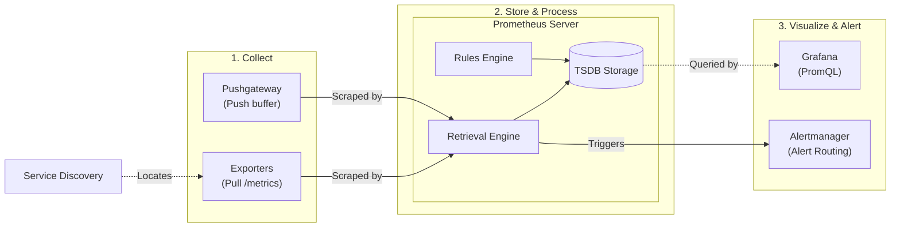
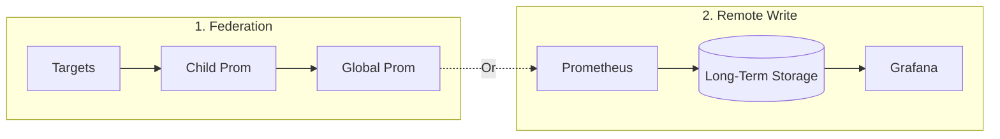

# Lecture 02: Prometheus Metrics Pipeline for AI Infrastructure

## Lecture Overview
Prometheus has become the de facto standard for metrics collection in cloud-native environments. This lecture explains how to design, deploy, and operate a Prometheus-based metrics stack tailored to AI infrastructure workloads. You will learn the Prometheus data model, configuration patterns, exporter ecosystem, PromQL query design, and strategies for scaling the pipeline in production.

## Table of Contents
1. [Prometheus Architecture Deep Dive](#1-prometheus-architecture-deep-dive)
2. [Installing and Configuring Prometheus](#2-installing-and-configuring-prometheus)
3. [Exporters for AI Infrastructure](#3-exporters-for-ai-infrastructure)
4. [PromQL Essentials](#4-promql-essentials)
5. [Alerting with Prometheus and Alertmanager](#5-alerting-with-prometheus-and-alertmanager)
6. [Scaling Prometheus](#6-scaling-prometheus)
7. [Security and Multi-Tenancy](#7-security-and-multi-tenancy)
8. [Operational Best Practices](#8-operational-best-practices)
9. [Prometheus for ML-Specific Metrics](#9-prometheus-for-ml-specific-metrics)
10. [Additional Resources](#10-additional-resources)
11. [Summary](#11-summary)

---

## 1. Prometheus Architecture Deep Dive

Prometheus is a monitoring system that periodically collects metrics from applications, stores them as time-series data, lets you query them using PromQL, visualizes them through Grafana, and sends alerts through Alertmanager.




### 1.1 Core Components
- **Prometheus Server:** Scrapes targets, stores time-series data, runs PromQL queries, triggers alerts.
- **Exporters:** Processes that expose metrics over HTTP in the Prometheus exposition format.
- **Pushgateway:** Buffer for ephemeral/short-lived jobs (use sparingly).
- **Alertmanager:** Manages alert routing, deduplication, and notification.
- **Service Discovery:** Mechanism for discovering scrape targets (Kubernetes API, Consul, file-based, EC2, etc.).

### 1.2 Pull vs Push Model
- Prometheus **pulls** metrics from targets on a configured interval, simplifying auth and lifecycle management.
- Pushgateway acts as a bridge for batch jobs that cannot be scraped. Avoid using it for long-lived services.

### 1.3 Data Flow
1. Target exposes metrics via HTTP endpoint (default `/metrics`).
2. Prometheus scrapes the endpoint at a configured interval (`scrape_interval`).
3. Samples stored in a custom time-series database (TSDB) with retention policy (default 15 days).
4. Recording rules aggregate/transform metrics into new series.
5. PromQL queries fetch data for dashboards, alerts, and automation.

### 1.4 Storage Internals
- TSDB organizes data in 2-hour blocks (~128 MB each).
- Samples stored as chunks; uses write-ahead log (WAL) for durability.
- Compaction merges blocks and applies retention policy.
- High cardinality (many unique combination of metric name + labels) inflates memory usage and query time.

---

## 2. Installing and Configuring Prometheus

### 2.1 Quickstart with Docker Compose
Create a minimal stack for local experimentation:
```yaml
# docker-compose.prometheus.yml
version: "3.8"

services:
  prometheus:
    image: prom/prometheus:v2.51.0
    container_name: prometheus
    ports:
      - "9090:9090"
    volumes:
      - ./prometheus/prometheus.yml:/etc/prometheus/prometheus.yml:ro
      - prometheus-data:/prometheus
    command:
      - "--config.file=/etc/prometheus/prometheus.yml"
      - "--storage.tsdb.retention.time=15d"
      - "--web.enable-lifecycle"

volumes:
  prometheus-data:
```
Run `docker compose -f docker-compose.prometheus.yml up -d`.

### 2.2 Configuration File Anatomy (`prometheus.yml`)
```yaml
global:
  scrape_interval: 15s
  evaluation_interval: 30s
  scrape_timeout: 10s

scrape_configs:
  - job_name: 'prometheus'
    static_configs:
      - targets: ['localhost:9090']

  - job_name: 'node_exporter'
    static_configs:
      - targets: ['node-exporter:9100']
```

**Key sections:**
- `global`: defaults for scrape frequency and rule evaluation.
- `scrape_configs`: list of jobs to scrape.
- `static_configs`: static target lists; in production use service discovery (e.g., Kubernetes).
- `relabel_configs`: modify labels or drop targets at scrape time.

### 2.3 Service Discovery Patterns
- **Kubernetes:** Use `kubernetes_sd_configs` to discover pods, services, or endpoints. Apply relabeling to select desired targets.
- **Files:** `file_sd_configs` reads JSON/YAML files listing targets; integrate with deployment tooling.
- **Cloud Providers:** Use EC2, Azure, or GCE discovery to auto-register instances.

**Example: Kubernetes Pod Scrape**
```yaml
scrape_configs:
  - job_name: 'kubernetes-pods'
    kubernetes_sd_configs:
      - role: pod
    relabel_configs:
      - source_labels: [__meta_kubernetes_pod_annotation_prometheus_io_scrape]
        action: keep
        regex: true
      - source_labels: [__meta_kubernetes_pod_annotation_prometheus_io_path]
        target_label: __metrics_path__
        regex: (.+)
      - source_labels: [__address__, __meta_kubernetes_pod_annotation_prometheus_io_port]
        action: replace
        regex: (.+):(?:\d+);(\d+)
        replacement: ${1}:${2}
        target_label: __address__
```

---

## 3. Exporters for AI Infrastructure

### What is an Exporter?
An exporter is simply a small application that:
- Collects metrics from some system.
- Converts them into Prometheus format.
- Exposes them on a `/metrics` HTTP endpoint.

Instead of Prometheus logging into every machine and figuring out how to read CPU, GPU, Redis, PostgreSQL, etc., each exporter gathers the information and presents it in a standard Prometheus format.

### 3.1 Common Exporters
- **Node Exporter:** Host-level metrics (CPU, memory, disk). Essential baseline.
- **cAdvisor / kube-state-metrics:** Container and Kubernetes metrics.
- **Blackbox Exporter:** Synthetic probe of HTTP/HTTPS/TCP endpoints.
- **DCGM Exporter:** NVIDIA GPU metrics (SM utilization, temperature, ECC errors).
- **Prometheus Python Client:** Instrument custom applications and pipelines.
- **Kafka Exporter, Redis Exporter, Postgres Exporter:** Observe platform dependencies.

### 3.2 Custom Exporter Design
When off-the-shelf exporters are insufficient:
1. Use Prometheus client libraries (Python, Go, Java, Rust).
2. Expose `/metrics` endpoint with relevant metric families (counters, gauges, histograms, summaries).
3. Ensure thread/process safety in metric registration.
4. Limit cardinality (avoid per-request labels).
5. Provide health endpoint and integration tests.

**Python Example:**
```python
from prometheus_client import start_http_server, Gauge
import random
import time

GPU_MEM_UTIL = Gauge(
    "gpu_memory_utilization",
    "Percentage of GPU memory used",
    ["gpu_id", "model_name"]
)

def collect_metrics():
    while True:
        for gpu in range(4):
            GPU_MEM_UTIL.labels(gpu_id=gpu, model_name="vision-transformer").set(random.uniform(20, 90))
        time.sleep(10)

if __name__ == "__main__":
    start_http_server(8000)
    collect_metrics()
```

### 3.3 Exporter Configuration Best Practices
- Run exporters as sidecars for per-pod metrics or DaemonSets for node-level metrics.
- Use TLS/Basic auth for scraping endpoints over untrusted networks.
- Monitor exporter health (uptime, scrape failures).
- Document version compatibility (e.g., DCGM exporter + driver versions).

---

## 4. PromQL Essentials

Prometheus Query Language (PromQL) is the core analytical engine of Prometheus. It allows you to select, filter, aggregate, and compute time-series metrics in real-time. In AI platforms, writing precise PromQL queries is essential for measuring service performance, detecting hardware bottlenecks (such as GPU starvation), and calculating SLO error budgets.

### 4.1 Data Model Recap
- Metrics identified by **metric name** + set of **label key/value pairs**.
- **Sample:** (`metric_name{label1="value1", ...}`, timestamp, value).
- Vector types: instant vector (samples at single time), range vector (samples over duration).

### 4.2 Querying Basics
- Instant query: `http_requests_total{job="api", status="500"}`
- Range query: `rate(http_requests_total{job="api"}[5m])`
- Aggregation: `sum(rate(http_requests_total[5m])) by (status)`
- Filtering with regex: `{pod=~"ml-inference-.*"}`

### 4.3 Functions You Must Know
- `rate()` / `irate()` – per-second rate for counters.
- `increase()` – total increase over range (useful for counts).
- `avg_over_time()`, `max_over_time()` – detect trends.
- `histogram_quantile()` – compute quantiles from histogram buckets.
- `sum by(...)`, `avg without(...)` – grouping modifiers.
- `label_replace()` – manipulate labels on the fly.

### 4.4 Example Queries for AI Workloads
**GPU Utilization:**
```promql
avg by (cluster, gpu) (DCGM_FI_DEV_GPU_UTIL)
```

**Batch Inference Throughput:**
```promql
rate(ai_infra_batch_predictions_total{job="batch-runner"}[10m])
```

**Error Budget Burn Rate (SLO 99% latency < 300 ms):**
```promql
(1 - sum(rate(ai_infra_inference_latency_seconds_bucket{le="0.3"}[1m])) /
     sum(rate(ai_infra_inference_latency_seconds_count[1m])))
    / (1 - 0.99)
```

**Data Pipeline Backlog:**
```promql
max by (pipeline) (ai_infra_pipeline_queue_length{pipeline=~"feature-.*"})
```

### 4.5 Recording Rules
- Pre-compute expensive queries or standardize SLO calculations.
- Store rules in `rules/*.yml` and reference via `rule_files` in `prometheus.yml`.

Example:
```yaml
groups:
  - name: inference_slo.rules
    interval: 30s
    rules:
      - record: slo:inference_latency:ratio
        expr: |
          sum(rate(ai_infra_inference_latency_seconds_bucket{le="0.3"}[5m])) /
          sum(rate(ai_infra_inference_latency_seconds_count[5m]))
      - record: slo:inference_latency:burn_rate
        expr: (1 - slo:inference_latency:ratio) / (1 - 0.99)
```

Benefits:
- Reduces dashboard load times.
- Ensures consistent calculations across dashboards, alerts.

---

## 5. Alerting with Prometheus and Alertmanager

Collecting metrics is only useful if you can proactively act on failures. Prometheus evaluates alerting rules written in PromQL at a regular interval and forwards active alerts to Alertmanager. Alertmanager then handles deduplication, grouping, silencing, and routing of those notifications to your communication channels (such as Slack, PagerDuty, or email).

### 5.1 Alerting Rules
Define alerting expressions using PromQL.

```yaml
groups:
  - name: inference_alerts.rules
    rules:
      - alert: InferenceLatencyHigh
        expr: slo:inference_latency:burn_rate{cluster="prod"} > 2
        for: 10m
        labels:
          severity: page
        annotations:
          summary: "Inference latency SLO burn rate high in {{ $labels.cluster }}"
          description: "Burn rate {{ $value }} exceeds threshold. Check runbook go/inference-latency."
```

### 5.2 Alertmanager Configuration
- Handles deduplication, grouping, routing to receivers (PagerDuty, Slack, email).
```yaml
route:
  receiver: pagerduty-prod
  group_by: ['alertname', 'cluster']
  routes:
    - matchers:
        severity = 'page'
      receiver: pagerduty-prod
    - matchers:
        severity = 'ticket'
      receiver: jira-triage

receivers:
  - name: pagerduty-prod
    pagerduty_configs:
      - routing_key: ${PAGERDUTY_KEY}
```

### 5.3 Alert Hygiene
- Add `for` clause to avoid transient spikes.
- Include links to Grafana dashboards, runbooks, and trace search.
- Test alerts in staging using simulated metrics or test environment.
- Regularly review alert noise; remove or tune false positives.

---

## 6. Scaling Prometheus

As your AI clusters expand, a single Prometheus instance can become a bottleneck due to high memory consumption and disk I/O from millions of active metric series. Scaling Prometheus requires transitioning from a standalone instance to a distributed, highly available architecture—utilizing techniques like federation, horizontal sharding, and remote storage backends like Thanos or Mimir.



### 6.1 Federation
**Federation** splits the monitoring workload hierarchically. Instead of one massive server scraping every target everywhere, you deploy local "child" Prometheus servers in separate environments (like development, staging, or region-specific clusters) to scrape local workloads. Then, a single "global" Prometheus server scrapes only the aggregated data from these child servers, keeping its workload light and fast.
- Lower-tier Prometheus servers scrape workloads in specific regions/clusters.
- Top-level Prometheus federates aggregated metrics (sums, averages).
- Useful for multi-region, multi-team setups.

### 6.2 Sharding & Horizontal Scaling
**Horizontal Scaling & Sharding** splits the workload across multiple parallel servers when a single instance runs out of memory. Instead of routing all metrics to one place, you distribute the targets across multiple instances (sharding). Tools like **Thanos** or **Mimir** aggregate these sharded servers: they receive metrics via *Remote Write*, save them to cheap cloud object storage (S3/GCS) for long-term historical records, and let you query all of them at once from a single dashboard.
- Use **Prometheus Operator** or **Cortex/Mimir/Thanos** for horizontal scalability, long-term storage, and high availability.
- **Thanos** adds object-storage backed historical data + query layer across multiple Prometheus instances.
- **Cortex/Mimir** is fully distributed TSDB supporting massive scale.

### 6.3 HA Setup Considerations
**High Availability (HA)** ensures that if one monitoring server goes down, you don't lose visibility. To achieve this, you run Prometheus servers in identical pairs (active-active), where both servers scrape the exact same targets. If one server crashes, the other keeps running. Downstream tools like Thanos deduplicate the duplicate metrics automatically so your dashboards don't show double the data.
- Run Prometheus in pairs (active-active) scraping the same targets; dedup queries in Thanos.
- Ensure Alertmanager runs as a cluster of at least three replicas for consensus.
- Store persistent data on SSD-backed disks; plan backup strategy.

### 6.4 Retention and Storage Management
**Retention & Storage Management** is about keeping your server database size under control. As Prometheus scrapes metrics, local disk usage continuously grows. You manage this by setting a retention time (e.g., discard data older than 15 days) and using remote storage engines to automatically offload historical metrics to cheap object storage, keeping local server disks fast and lean.
- Configure `--storage.tsdb.retention.size` or `--storage.tsdb.retention.time`.
- Offload long-term metrics to remote storage (Thanos, Cortex, VictoriaMetrics).
- Monitor cardinality: use `prometheus_tsdb_head_series` and `prometheus_tsdb_head_memory_allocations_bytes`.

---

## 7. Security and Multi-Tenancy

Prometheus was originally designed under the assumption that it would run inside a fully trusted internal network, meaning it lacks built-in authentication, authorization, or strict user access isolation. Operating Prometheus securely in modern, shared cloud-native environments requires wrapping endpoints with reverse proxies (or mutual TLS), defining strict Kubernetes Role-Based Access Control (RBAC), and partitioning metric spaces logically between different engineering teams.

### 7.1 Securing Prometheus
- Restrict access to `/` and `/api` endpoints via reverse proxy, mutual TLS, or OAuth proxy.
- Use RBAC when running in Kubernetes; limit permissions.
- Scrubbing secrets: avoid embedding credentials in labels; use environment variables or secret mounts.

### 7.2 Multi-Tenant Considerations
- Namespaces/label conventions per team (e.g., `team="ml-platform"`).
- Quotas via rate limits on remote write or query concurrency.
- Governance: implement retention policies per team, cost attribution dashboards.

---

## 8. Operational Best Practices

### 8.1 Runbooks
- Document restart procedure, alert triage steps, common query references.
- Provide `kubectl` commands or systemctl instructions for restart.
- Maintain GitOps repository for Prometheus configuration and dashboard JSON.

### 8.2 Observability of Prometheus Itself
- Scrape Prometheus metrics:
  - `prometheus_tsdb_head_samples_appended_total`
  - `prometheus_engine_query_duration_seconds`
  - `prometheus_notifications_dropped_total`
- Set alerts for high scrape failure ratios, query latency, disk usage.

### 8.3 Testing Configuration
- Validate configuration changes with `promtool check config prometheus.yml`.
- Test rules: `promtool test rules rules/*.yml`.
- Use `--web.enable-lifecycle` for safe hot-reloads (`curl -X POST http://localhost:9090/-/reload`).

### 8.4 Change Management
- Store configs and rules in Git.
- Enforce code review and automated linting (Promtool, promql lints).
- Provide staging Prometheus environment mirroring production load.

---

## 9. Prometheus for ML-Specific Metrics

### 9.1 Instrumenting Training Pipelines
- Expose metrics from training jobs: epoch durations, loss, learning rate.
- Use sidecar exporters or embed metrics in training script.
- In distributed training (Horovod, Ray, PyTorch DDP), aggregate metrics centrally.

### 9.2 Monitoring Feature Stores
- Track feature freshness, ingestion latency, row counts per feature table.
- Monitor data quality check counts (success vs failure).

### 9.3 Inference Services
- Capture request latency with histograms (e.g., `inference_latency_seconds`).
- Include labels for model version, model type, region.
- Monitor CPU/GPU utilization, queue length, concurrency.
- Integrate drift detectors by exposing metrics such as PSI (population stability index).

### 9.4 Cost and Efficiency Metrics
- Export cost per request, GPU hours per job, energy consumption.
- Combine with Grafana dashboards for FinOps visibility.

---

## 10. Additional Resources
- Prometheus Docs: https://prometheus.io/docs/introduction/overview/
- Robust Perception blog (Julius Volz, Brian Brazil) – deep dives into Prometheus usage.
- “Monitoring Distributed Systems” (Cloud Native Patterns series).
- Thanos and Cortex documentation for horizontally scalable Prometheus.
- NVIDIA DCGM exporter documentation for GPU monitoring.
- PromQL tutorials by Grafana Labs.

---

## 11. Summary
- Prometheus offers a flexible pull-based metrics pipeline ideal for cloud-native AI infrastructure.
- Exporters and service discovery extend coverage across infrastructure, platform, and ML workloads.
- PromQL enables powerful analytics—recording rules and alerting turn those insights into action.
- Scaling strategies (federation, Thanos, Mimir) support large-scale deployments.
- Integrating ML-specific metrics expands observability beyond traditional infrastructure signals.

Next, Lecture 03 will layer Grafana on top of Prometheus to build meaningful dashboards and alert workflows for your AI platform.
