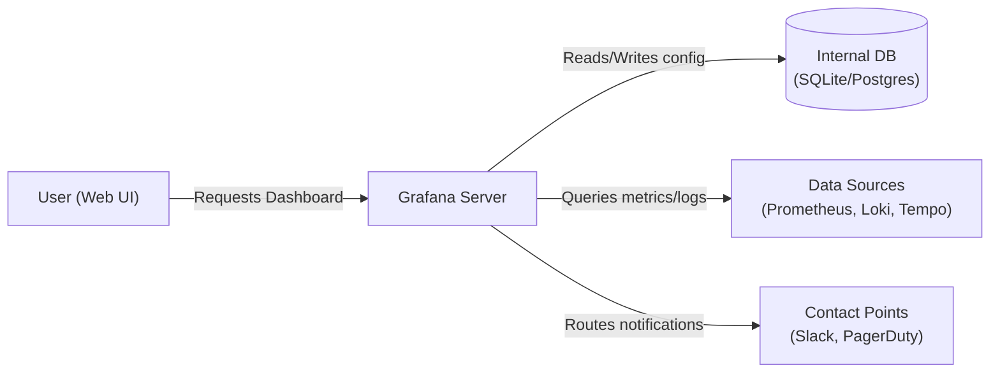
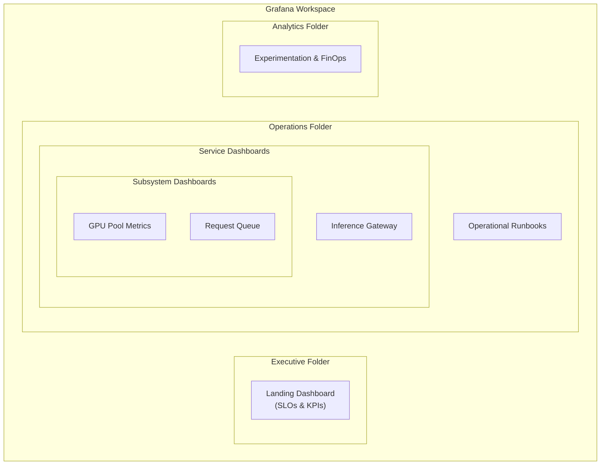

# Lecture 03: Grafana Dashboards & Visualization for AI Infrastructure

## Lecture Overview
Grafana transforms raw Prometheus metrics into actionable insights by combining flexible dashboards, rich visualization options, and alerting workflows. This lecture shows how to design dashboards that accelerate on-call response, communicate platform health to stakeholders, and capture the nuances of AI/ML workloads. You will learn dashboard architecture, panel composition, Grafana data modeling, templating, sharing, provisioning, and alert configuration that complements your Prometheus pipeline.

## Table of Contents
1. [Introduction to Grafana](#1-introduction-to-grafana)
2. [Dashboard Strategy & Information Architecture](#2-dashboard-strategy--information-architecture)
3. [Data Source Configuration](#3-data-source-configuration)
4. [Building Panels that Drive Action](#4-building-panels-that-drive-action)
5. [Dashboard Templating & Variables](#5-dashboard-templating--variables)
6. [Grafana Alerting](#6-grafana-alerting)
7. [Provisioning Dashboards as Code](#7-provisioning-dashboards-as-code)
8. [Enhancing Dashboards with Annotations & Exemplars](#8-enhancing-dashboards-with-annotations--exemplars)
9. [Case Studies & Panel Recipes](#9-case-studies--panel-recipes)
10. [Access Control & Collaboration](#10-access-control--collaboration)
11. [Performance Optimization](#11-performance-optimization)
12. [Integrating Logs & Traces](#12-integrating-logs--traces)
13. [Compliance, Auditing & Cost Visibility](#13-compliance-auditing--cost-visibility)
14. [Additional Resources](#14-additional-resources)

---

## 1. Introduction to Grafana

### 1.1 Why Grafana?
- **Unified observability:** Connects to Prometheus, Loki, Tempo, Elasticsearch, CloudWatch, Datadog, and more.
- **Composable dashboards:** Drag-and-drop panels, repeatable layouts, variable templating.
- **Alerting & reporting:** Define thresholds, route notifications, schedule reports.
- **Collaboration:** Share dashboard snapshots, annotate timelines, embed in docs.
- **Infrastructure-as-code:** Provision dashboards via JSON or Grafana provisioning files.

### 1.2 Grafana Architecture



- **Grafana server:** Handles authentication, data source configuration, dashboard rendering.
- **Backend data sources:** Prometheus, Loki, etc. Grafana does not store time-series data by default (except for alerting state).
- **Dashboards & folders:** Stored in Grafana’s database or via provisioned files.
- **Alerting & notification policies:** Manage alert rules and contact points centrally.

Grafana can be deployed via Docker, Kubernetes, or managed offerings (Grafana Cloud, AWS Managed Grafana). Multiple environments (dev/staging/prod) recommended to validate dashboards prior to production.

---

## 2. Dashboard Strategy & Information Architecture

An effective dashboard strategy ensures that engineers and stakeholders get the right information at the right time. Organizing dashboards by information hierarchy—from high-level business health down to specific service and hardware diagnostics—prevents cognitive overload and drastically reduces the Mean Time to Resolution (MTTR) during incidents.



### 2.1 Dashboard Taxonomy
1. **Landing Dashboard (Executive Overview):**
   - Business KPIs, SLO adherence, incident status.
   - Suitable for leadership, product management.
2. **Service Dashboard (On-call Triage):**
   - High-cardinality metrics, latency histograms, error breakdowns, resource saturation.
   - Targets on-call engineers.
3. **Subsystem Dashboard (Focused):**
   - Specific components (feature store, training pipeline, inference gateway).
   - Deep dive for owners.
4. **Operational Runbooks:**
   - Panel + instructions for recurring tasks (capacity planning, deployment readiness).
5. **Experiment / Analytics Dashboard:**
   - Model performance metrics, A/B test outcomes, cost dashboards.

### 2.2 Layout Principles
- **Narrative Flow:** Arrange panels from top-level health to granular diagnostics (left-to-right or top-to-bottom).
- **Focus on Actions:** On-call dashboards should emphasize SLI compliance, error budget burn, alerts, capacity.
- **Avoid Clutter:** Limit to 6–8 panels per row; use tabs for supplementary data.
- **Responsive Design:** Use row collapses, navigation links, and consistent panel heights to support different screen sizes.
- **Color semantics:** Red = critical, orange = warning, green = healthy; maintain consistent thresholds across dashboards.

### 2.3 Collaborating Across Teams
- Define ownership metadata (panel description includes owner + Slack channel).
- Establish review cadence (e.g., monthly dashboard audits).
- Gather feedback from stakeholders (what questions are they attempting to answer?).

---

## 3. Data Source Configuration

### 3.1 Prometheus Data Source
1. Access Grafana UI → **Configuration** → **Data sources** → **Add data source** → Prometheus.
2. Provide URL (e.g., `http://prometheus:9090` in Docker Compose).
3. Configure authentication (basic auth, TLS certs, bearer token).
4. Enable/disable query caching (Grafana OSS v10+).
5. Save & test connection.

### 3.2 Additional Sources
- **Loki:** For logs; combine with panels to correlate metrics and log events.
- **Tempo/Jaeger:** Distributed tracing; use exemplars to link to traces.
- **Elasticsearch/OpenSearch:** Query log indices and connect via Loki/Elastic panels.
- **PostgreSQL/BigQuery:** For business metrics, cost data.

Unified dashboards often combine multiple data sources for context: metrics + logs + traces + incidents.

---

## 4. Building Panels that Drive Action

### 4.1 Panel Types
- **Time series:** Default Prometheus visualization; supports annotations, stacked series.
- **Stat:** Single value with thresholds; great for SLO compliance, cost.
- **Table:** Display top-N lists, aggregated metrics (`sum by` results).
- **Bar gauge:** Visualize distribution, queue length.
- **Heatmap:** Model performance across cohorts, GPU utilization vs time.
- **Histogram:** Latency buckets, inference time distribution.
- **Logs & Traces:** Embedded panels for Loki, Tempo.
- **Geomap:** Regional traffic distribution (if geospatial data available).

### 4.2 Best Practices
- Normalize units (ms vs seconds, bytes vs mebibytes).
- Set appropriate time ranges (default 6 hours for on-call, 30 days for exec dashboards).
- Provide panel descriptions and drilling guidance (e.g., “Click to view traces in Tempo via exemplar”).
- Align axes across similar panels to compare trends.
- Use transformations to enrich data (calculate percentages, rename fields, merge results).

### 4.3 Example Panel: Inference Latency
- **Query:** `histogram_quantile(0.99, sum(rate(ai_infra_inference_latency_seconds_bucket[5m])) by (le))`
- **Visualization:** Time series with thresholds at 200ms (warning), 300ms (critical).
- **Annotations:** Deploy events via Grafana annotations (link to Git SHA, change log).
- **Transformations:** Add 7-day moving average for trend detection.

### 4.4 Example Panel: GPU Fleet Health
- **Query:** `avg by (cluster, gpu) (DCGM_FI_DEV_GPU_UTIL)`
- **Panel Type:** Heatmap (GPU ID vs time).
- **Thresholds:** Highlight >85% utilization sustained for >30 min.
- **Drilldown:** Panel links to GPU node dashboard with node exporter metrics.

---

## 5. Dashboard Templating & Variables

### 5.1 Variable Types
- **Query variables:** Dynamic lists from Prometheus (e.g., `label_values(job)`).
- **Constant variables:** Hard-coded values reused across panels.
- **Interval variables:** Control range vector durations (e.g., `5m`, `1h`).
- **Custom variables:** Manual enumerations (`prod`, `staging`, `dev`).
- **Datasource variables:** Switch between clusters without duplicating dashboards.

### 5.2 Creating Variables
1. Dashboard settings → Variables → Add variable.
2. Example: `cluster` variable using label values.
   ```promql
   label_values(kube_pod_info, cluster)
   ```
3. Use `${cluster}` in queries: `rate(ai_infra_inference_requests_total{cluster="${cluster}"}[5m])`.
4. Chain variables (e.g., select `team`, filter `service` variable by team label).

### 5.3 Repeating Panels & Rows
- Repeat panel across variable values (per region, per model).
- Combine with dynamic thresholds (panel overrides).
- Ensure dashboards remain performant (limit repeats for high cardinality; consider pagination via custom filters).

---

## 6. Grafana Alerting

### 6.1 Alert Rule Types
- **Grafana managed alerts (Unified Alerting):** Works across data sources.
- **Prometheus alerting integration:** Use Prometheus alert rules; Grafana displays via Alertmanager data source.

### 6.2 Creating an Alert Rule
1. Select panel → Alert tab → “Create alert rule from panel”.
2. Define query, reduction (last, avg), condition (is above/below threshold).
3. Configure evaluation interval, no-data behavior, for duration.
4. Set alert rule labels (service, severity, environment).
5. Map to contact points (Slack, email, PagerDuty).

**Example:** Alert when inference error rate >1% for 10 minutes.
```promql
sum(rate(ai_infra_inference_errors_total{cluster="${cluster}"}[5m])) /
sum(rate(ai_infra_inference_requests_total{cluster="${cluster}"}[5m])) * 100
```
Condition: `WHEN last() OF query (A) IS ABOVE 1`.

### 6.3 Alert Grouping & Routing
- Configure notification policies (Grafana Alerting UI):
  - Group alerts by `cluster` and `service`.
  - Route severity=critical to on-call pager; severity=warning to Slack channel.
- Set silence windows for planned maintenance; use labels for automation (e.g., `maintenance="true"` suppresses alerts).

### 6.4 Alert Runbooks
- Link to runbooks using panel descriptions or annotations (`go/runbook-inference-latency`).
- Include steps: log queries, dashboard sections, rollbacks.

---

## 7. Provisioning Dashboards as Code

### 7.1 Why Provision?
- Ensure consistency across environments.
- Enable code review, testing, and versioning in Git.
- Automate deployments via CI/CD or GitOps (e.g., Argo CD, Flux).

### 7.2 Folder Provisioning
`provisioning/dashboards/dashboard.yml`:
```yaml
apiVersion: 1
providers:
  - name: ai-infra-dashboards
    folder: AI Infrastructure
    type: file
    disableDeletion: false
    allowUiUpdates: false
    options:
      path: /var/lib/grafana/dashboards
```

Dashboard JSON stored under `/var/lib/grafana/dashboards/`. Generate JSON via Grafana UI (Dashboard → Share → Export).

### 7.3 Terraform Provider
- Use `grafana_dashboard` resource to manage dashboards via Terraform.
- Combine with `grafana_folder`, `grafana_data_source`, and `grafana_notification_policy`.

### 7.4 Testing Dashboards-as-Code
- Use `grafana-toolkit` or `grizzly` for validating JSON dashboards.
- Add CI check to lint JSON, confirm required panels exist, variable queries valid.

---

## 8. Enhancing Dashboards with Annotations & Exemplars

### 8.1 Annotations
- Mark deploys, incidents, feature flags directly on time-series charts.
- Integrate with GitOps pipeline (e.g., Argo CD posts annotation via Grafana API).
- Provide context: “Model version 2025-10-17 deployed” or “Incident INC-2245 resolved”.

### 8.2 Exemplars
- Combine metrics with trace exemplars by enabling exemplars in Prometheus (OpenTelemetry instrumentation).
- Hover over high latency data point → link to specific trace in Tempo/Jaeger.
- Helps root cause latency spikes faster by correlating metrics with request traces.

---

## 9. Case Studies & Panel Recipes

### 9.1 Inference Gateway Dashboard
**Sections:**
1. **SLI Overview:** Stat panels for 99% latency, error rate, request volume, error budget remaining.
2. **Latency Breakdown:** Time series for P50/P90/P99, histogram bucket heatmap.
3. **Traffic & Errors:** Stacked area for request rate per status code; table listing top error codes by region.
4. **Resources:** GPU utilization heatmap, pod CPU/memory saturation.
5. **Experiments:** Feature toggle state, canary vs baseline comparison.
6. **Alerts & Runbooks:** Panel linking to open incidents, runbook link, pager state.

**Key Panels:**
- `histogram_quantile(0.99, sum(rate(ai_infra_inference_latency_seconds_bucket[5m])) by (le))`
- `sum by (status) (rate(ai_infra_inference_requests_total[5m]))`
- `avg by (deployment) (container_cpu_utilization_seconds_total{container="inference-gateway"})`

### 9.2 Training Pipeline Dashboard
Focus on orchestrator (Airflow/Kubeflow):
1. DAG success/failure ratios.
2. Task duration by type (ETL, feature engineering, training).
3. Resource usage (CPU/GPU hours).
4. Queue length and backlog metrics.
5. Cost per run (combine with FinOps data source).
6. Alert summary (delayed DAGs, repeated failures).

### 9.3 Data Quality Dashboard
Leverage metrics from Great Expectations / custom checks:
- Freshness for feature tables (stat panel + sparklines).
- Null ratio trends per feature.
- Schema drift detection (table with latest alerts).
- Data validation failure counts by severity.
- Impact analysis (downstream models affected).

---

## 10. Access Control & Collaboration

### 10.1 RBAC
- Grafana roles: Viewer, Editor, Admin.
- Use folder permissions to restrict sensitive dashboards (e.g., compliance metrics).
- integrate SSO via OAuth, SAML, or LDAP (Okta, Azure AD).

### 10.2 Sharing Dashboards
- **Snapshot sharing:** Generates JSON snapshot; scrub sensitive data before sharing externally.
- **Embed mode:** iFrames for internal portals (ensure authentication).
- **Public dashboards:** Use caution; restrict to sanitized data.

### 10.3 Documentation
- Every dashboard should link to documentation in README or Confluence.
- Provide “How to interpret this dashboard” section: what normal looks like, known caveats.
- Store screenshot updates for training materials (on-call runbook).

---

## 11. Performance Optimization

### 11.1 Query Optimization
- Use recording rules for heavy PromQL expressions.
- Cache queries (Grafana Enterprise/Cloud) or run Grafana in front of Mimir/Thanos with query caching.
- Limit dashboard time range for expensive panels; use panel-specific time range.
- Avoid repeating panels with high-cardinality queries.

### 11.2 Dashboard Performance Diagnostics
- Grafana Explore → `Profile` to check query timings.
- Examine Prometheus metrics: `grafana_http_request_duration_seconds`.
- Monitor Grafana backend load (CPU, memory).
- Evaluate nested transformations and reduce complexity if dashboard is slow.

---

## 12. Integrating Logs & Traces

### 12.1 Logs Panel (Loki)
- Add Loki data source.
- Create panel with log query: `{app="inference-gateway", level="error"} |= "timeout"`.
- Use log labels to pivot by region, model, customer.
- Combine with Prometheus panel using dashboard links.

### 12.2 Trace Panel (Tempo/Jaeger)
- Query for slowest spans: `service="inference-gateway" operation="GET /predict"`.
- Enable exemplars by instrumenting service with OpenTelemetry; attach trace IDs to Prometheus metrics (`exemplars`).

### 12.3 Unified Observability Flow
- Panel correlates metrics (latency), logs (errors), trace (call graph). Provide “Investigate in Tempo” button.
- Document workflow in runbook: start with metrics panel → click exemplar → inspect trace → open relevant logs.

---

## 13. Compliance, Auditing & Cost Visibility

### 13.1 Audit Trails
- Grafana keeps audit logs (Enterprise feature) or integrate with logging pipeline capturing dashboard changes, user actions.
- Ensure dashboards tracking PII follow governance (masking, restricted view).

### 13.2 Cost Dashboards
- Import cost data (AWS CUR, GCP billing export).
- Combine ingestion cost, GPU cost, storage cost with usage metrics.
- Compute cost per 1,000 predictions, cost per training epoch.
- Provide FinOps and leadership visibility into spend vs budget.

### 13.3 Compliance Monitoring
- Create dashboards for security policy adherence: TLS certificate expiration, unauthorized access attempts, drift in compliance metrics (e.g., fairness).
- Pair with alerting for compliance breaches.

---

## 14. Additional Resources
- Grafana Labs Tutorials (https://grafana.com/tutorials/)
- “Building Effective Dashboards” (GrafanaCON talks).
- Grafana Play (https://play.grafana.org) for live examples.
- “Observability Engineering” (Chapters on dashboard design).
- Grafana Terraform provider documentation.
- Honeycomb + Grafana blog posts on SLO dashboards.
