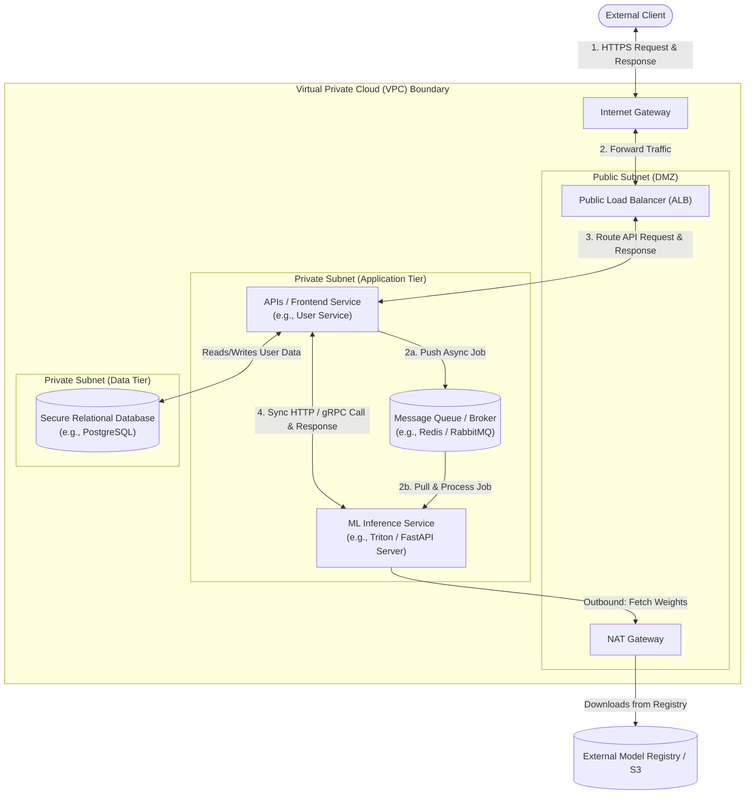

# Lecture 01: Cloud Computing Fundamentals

## Lecture Overview

Cloud computing has revolutionized how organizations build, deploy, and scale applications—particularly critical for AI/ML infrastructure where compute demands are massive and variable. This lecture establishes foundational cloud concepts: service and deployment models, the economic drivers behind cloud adoption, major cloud providers and their ecosystems, and how cloud architecture principles enable the flexibility and scale required for modern AI workloads.

### Key Learning Objectives
*   **Differentiate Service Models**: Distinguish between IaaS, PaaS, SaaS, and FaaS/Serverless, and learn how to select the optimal model for various ML workflows.
*   **Evaluate Deployment Models**: Navigate the tradeoffs of Public, Private, Hybrid, and Multi-Cloud environments.
*   **Compare Cloud Ecosystems**: Understand and map the core AI/ML offerings across AWS, Google Cloud, and Microsoft Azure.
*   **Apply Architecture Principles**: Design reliable, stateless, and scalable cloud systems using modern cloud-native technologies (Containers, Kubernetes, and IaC).
*   **Understand Cloud Economics**: Implement FinOps principles to manage cloud spend and avoid common budget pitfalls.


---

## Table of Contents
1. [What is Cloud Computing?](#1-what-is-cloud-computing)
2. [Cloud Service Models](#2-cloud-service-models)
3. [Cloud Deployment Models](#3-cloud-deployment-models)
4. [Core Cloud Infrastructure Concepts](#4-core-cloud-infrastructure-concepts)
5. [Major Cloud Providers Overview](#5-major-cloud-providers-overview)
6. [Cloud Economics and FinOps](#6-cloud-economics-and-finops)
7. [Cloud Architecture Principles](#7-cloud-architecture-principles)
8. [Cloud-Native Technologies](#8-cloud-native-technologies)
9. [What's Next?](#whats-next)
10. [Further Reading](#further-reading)

---

## 1. What is Cloud Computing?

### 1.1 Definition and Core Characteristics

**Cloud computing** is the on-demand delivery of compute, storage, databases, networking, software, and other IT resources over the internet with pay-as-you-go pricing.

**Five Essential Characteristics** (per NIST definition):

1. **On-Demand Self-Service**: Provision resources automatically without human intervention from the provider
2. **Broad Network Access**: Services accessible over the network via standard mechanisms (web, API, CLI)
3. **Resource Pooling**: Provider's resources serve multiple customers using multi-tenant models
4. **Rapid Elasticity**: Scale resources up or down quickly, often automatically
5. **Measured Service**: Usage is monitored, controlled, and reported (pay for what you use)

**Example:** Instead of buying physical servers, you click a button (or run a CLI command) to launch a virtual machine in AWS that's billed by the hour. If you need 100 servers for a training job, you can spin them up in minutes and terminate them when done.

### 1.2 The Evolution of Cloud Computing

**Timeline:**

- **Pre-2000s**: On-premises data centers, capital expenditure (CapEx) heavy, slow provisioning
- **2006**: AWS launches EC2 (Elastic Compute Cloud), democratizing access to compute
- **2008**: Google App Engine (PaaS), Microsoft Azure announced
- **2010s**: Explosion of cloud services (storage, databases, ML platforms, IoT, serverless)
- **2020s**: Multi-cloud, hybrid cloud, edge computing, cloud-native AI/ML platforms

**Key Drivers:**
- **Virtualization technology** matured (VMware, KVM, Xen) enabling efficient multi-tenancy
- **High-speed networking** made remote data centers viable
- **APIs and automation** enabled self-service provisioning
- **Open-source software** lowered costs and increased flexibility

### 1.3 Why Cloud Computing Matters for AI/ML

AI/ML workloads have unique characteristics that make cloud computing particularly valuable:

**1. Variable Compute Demands**
- Training: Massive compute for hours/days, then nothing
- Inference: Spiky traffic patterns based on user demand
- **Cloud solution**: Scale up for training, scale down to zero, auto-scale inference based on traffic

**2. Specialized Hardware Requirements**
- GPUs, TPUs, custom accelerators (AWS Inferentia, Google TPU)
- Expensive to purchase and maintain
- **Cloud solution**: Rent GPUs only when needed, access latest hardware without CapEx

**3. Experimentation and Iteration**
- Data scientists need to try different models, hyperparameters, datasets
- **Cloud solution**: Spin up multiple environments, run parallel experiments, pay only for usage

**4. Global Scale**
- ML models may serve users worldwide
- **Cloud solution**: Deploy to multiple regions, use CDNs, low-latency edge inference

**5. Managed ML Services**
- Cloud providers offer SageMaker (AWS), Vertex AI (GCP), Azure ML
- **Cloud solution**: Focus on modeling, not infrastructure plumbing

**Real-World Example:**
> OpenAI trained GPT-3 on thousands of GPUs in Azure for months. The cost would have been prohibitive with on-premises infrastructure, and the GPUs would sit idle post-training. Cloud enabled:
> - Burst to massive scale for training
> - Release GPUs after training
> - Global inference deployment via Azure regions
> - Managed infrastructure (Azure handles hardware failures, networking, security)

---

## 2. Cloud Service Models

Cloud services are categorized by the level of abstraction and control they provide.

### 2.1 Infrastructure as a Service (IaaS)

**Definition:** Rent virtualized compute, storage, and networking resources. You manage the OS, runtime, data, and applications.

**What You Control:**
- Operating system (Linux, Windows)
- Applications and middleware
- Runtime (Python, Node.js, Java)
- Data

**What Provider Controls:**
- Virtualization layer
- Physical servers, storage, networking
- Data center facilities

**Examples:**
- **AWS EC2**: Virtual machines in the cloud
- **Google Compute Engine**: VMs on Google infrastructure
- **Azure Virtual Machines**: Microsoft's VM offering

**Use Cases:**
- Lift-and-shift migrations (move existing apps to cloud)
- Custom configurations requiring OS-level control
- Legacy applications not designed for PaaS/SaaS

**Pros:**
- Maximum flexibility and control
- Can replicate on-premises environments
- Supports any software stack

**Cons:**
- You manage OS patches, security hardening, scaling
- More operational overhead than PaaS/SaaS

**Example Architecture:**
```
[Your Application]
    ↓
[Your Runtime (Python, CUDA)]
    ↓
[Your OS (Ubuntu 22.04)]
    ↓
[IaaS - AWS EC2 Instance]
    ↓
[AWS Hypervisor]
    ↓
[AWS Physical Hardware]
```

### 2.2 Platform as a Service (PaaS)

**Definition:** Provide a managed platform where you deploy applications without managing the underlying infrastructure.

**What You Control:**
- Application code
- Data
- Configuration

**What Provider Controls:**
- Operating system
- Runtime and frameworks
- Middleware, databases
- Servers, storage, networking

**Examples:**
- **Google App Engine**: Deploy apps, Google handles scaling
- **AWS Elastic Beanstalk**: Deploy web apps, AWS manages servers
- **Heroku**: Git push to deploy, fully managed
- **Azure App Service**: Managed web app hosting

**Use Cases:**
- Web applications, APIs, microservices
- Focus on code, not infrastructure
- Rapid development and deployment

**Pros:**
- Faster development (no server management)
- Auto-scaling, load balancing built-in
- Reduced operational complexity

**Cons:**
- Less control (can't customize OS)
- Vendor lock-in (tied to platform APIs)
- May not support all frameworks/languages

**Example Workflow:**
```bash
# Deploy to Google App Engine
gcloud app deploy app.yaml

# Google automatically:
# - Provisions servers
# - Configures load balancer
# - Auto-scales based on traffic
# - Manages OS updates
```

### 2.3 Software as a Service (SaaS)

**Definition:** Fully managed applications accessed over the internet. You consume the software; provider manages everything.

**What You Control:**
- User data
- Configuration settings

**What Provider Controls:**
- Everything else (application, runtime, OS, infrastructure)

**Examples:**
- **Google Workspace** (Gmail, Docs, Sheets): Productivity suite
- **Salesforce**: CRM platform
- **Slack**: Team collaboration
- **Snowflake**: Data warehouse (SaaS model for databases)

**Use Cases:**
- Standard business applications
- No desire to manage infrastructure
- Pay per user/seat

**Pros:**
- Zero infrastructure management
- Accessible from anywhere
- Automatic updates and patches

**Cons:**
- Minimal customization
- Data residency concerns
- Vendor lock-in

**Example:** Instead of hosting your own email server (Exchange), use Gmail. Google manages servers, spam filtering, backups, security patches.

### 2.4 Function as a Service (FaaS) / Serverless

**Definition:** Execute code in response to events without provisioning servers. Pay only for execution time.

**What You Control:**
- Function code (Python, Node.js, Go, etc.)
- Triggers and event sources

**What Provider Controls:**
- Runtime environment
- Scaling, availability, infrastructure

**Examples:**
- **AWS Lambda**: Run code in response to events (S3 uploads, API Gateway requests)
- **Google Cloud Functions**: Event-driven functions
- **Azure Functions**: Serverless compute

**Use Cases:**
- Event-driven workflows (process uploaded images, trigger on database changes)
- Batch processing (transform data files)
- Inference serving (lightweight models)
- Backend APIs (REST endpoints)

**Pros:**
- Extreme cost efficiency (pay per invocation, down to millisecond granularity)
- Auto-scaling to zero (no cost when idle)
- No server management

**Cons:**
- Cold starts (initial invocation delay)
- Execution time limits (AWS Lambda: 15 minutes max)
- State management challenges (functions are stateless)

**Example Lambda Function:**
```python
# AWS Lambda function to resize images uploaded to S3
import boto3
from PIL import Image

def lambda_handler(event, context):
    # Event triggered when image uploaded to S3
    bucket = event['Records'][0]['s3']['bucket']['name']
    key = event['Records'][0]['s3']['object']['key']

    # Download image, resize, upload to new bucket
    s3 = boto3.client('s3')
    img = Image.open(s3.get_object(Bucket=bucket, Key=key)['Body'])
    img.thumbnail((200, 200))
    # Upload resized image...

    return {'statusCode': 200, 'body': 'Image resized'}
```

**When Lambda is invoked:**
- AWS provisions a container, runs your code, returns result
- You're billed for execution time (rounded to nearest 1ms)
- Container may be reused for subsequent invocations (warm start)

### 2.5 Choosing the Right Service Model

| Criterion | IaaS | PaaS | SaaS | FaaS |
|-----------|------|------|------|------|
| **Control** | High | Medium | Low | Medium |
| **Flexibility** | High | Medium | Low | High (for code) |
| **Management Overhead** | High | Low | None | Very Low |
| **Time to Deploy** | Days-Weeks | Hours-Days | Minutes | Minutes |
| **Scalability** | Manual/Auto (you configure) | Auto (platform handles) | Auto (provider handles) | Auto (infinite scale) |
| **Cost Model** | Pay for instances (hourly) | Pay for apps/usage | Pay per user/seat | Pay per invocation |
| **Best For** | Custom stacks, legacy apps | Web apps, APIs | Business apps | Event-driven, batch |

**Decision Tree:**
- **Need OS-level control?** → IaaS
- **Building web app/API, want less ops?** → PaaS
- **Using standard business software?** → SaaS
- **Event-driven, unpredictable traffic?** → FaaS

**For AI/ML:**
- **Training large models:** IaaS (EC2 with GPUs) or managed services (SageMaker)
- **Model serving (high throughput):** IaaS (ECS/EKS with GPUs)
- **Model serving (light, event-driven):** FaaS (Lambda with container support)
- **End-to-end ML platform:** PaaS/SaaS (SageMaker, Vertex AI)

---

## 3. Cloud Deployment Models

How and where cloud infrastructure is deployed affects cost, control, compliance, and performance.

### 3.1 Public Cloud

**Definition:** Cloud infrastructure owned and operated by a third-party provider, shared among multiple customers (multi-tenancy).

**Examples:** AWS, Google Cloud, Microsoft Azure, IBM Cloud, Oracle Cloud

**Characteristics:**
- **Shared Infrastructure**: Resources are pooled and dynamically allocated
- **Internet Access**: Accessed over public internet (or dedicated connections like AWS Direct Connect)
- **Pay-as-you-go**: No upfront CapEx, operational expense (OpEx) model

**Pros:**
- **No CapEx**: No hardware to buy
- **Elasticity**: Scale to thousands of servers instantly
- **Global Reach**: Regions worldwide
- **Innovation**: Access latest services (ML, serverless, databases)

**Cons:**
- **Data Residency**: Data stored in provider's data centers (compliance concerns)
- **Vendor Lock-In**: Tight integration with provider services
- **Internet Dependency**: Requires network connectivity

**Use Cases:**
- Startups and SMBs (no upfront investment)
- Variable workloads (ML training, web apps)
- Global applications

### 3.2 Private Cloud

**Definition:** Cloud infrastructure dedicated to a single organization, hosted on-premises or by a third party.

**Examples:**
- **OpenStack**: Open-source private cloud platform
- **VMware vSphere**: Virtualization platform for private clouds
- **AWS Outposts**: AWS infrastructure in your data center

**Characteristics:**
- **Dedicated Resources**: Not shared with other organizations
- **On-Premises or Hosted**: Can be in your data center or provider's facility
- **Custom Security**: Full control over security policies

**Pros:**
- **Control**: Complete control over infrastructure
- **Compliance**: Easier to meet regulatory requirements (data never leaves your premises)
- **Performance**: Predictable performance (no noisy neighbors)

**Cons:**
- **High CapEx**: Must purchase hardware
- **Limited Elasticity**: Scaling constrained by owned capacity
- **Operational Overhead**: Manage infrastructure team

**Use Cases:**
- Financial services, healthcare (strict compliance)
- Government agencies
- Organizations with sensitive data

### 3.3 Hybrid Cloud

**Definition:** Combination of public and private clouds, interconnected to allow data and application portability.

**Example Architectures:**
- **Sensitive data in private cloud**, general workloads in public cloud
- **Development/test in public cloud**, production in private cloud
- **Bursting**: Run on-premises normally, burst to public cloud for spikes

**Technologies:**
- **AWS Outposts**: Extends AWS services into your data center
- **Azure Arc**: Manage Azure services across on-premises, multi-cloud
- **Google Anthos**: Kubernetes-based multi-cloud platform
- **VPN/Direct Connect**: Secure connectivity between environments

**Pros:**
- **Flexibility**: Best of both worlds
- **Cost Optimization**: Use public cloud for variable workloads, private for steady-state
- **Compliance**: Keep sensitive data on-premises

**Cons:**
- **Complexity**: Managing two environments
- **Integration Challenges**: Data synchronization, networking
- **Cost**: May pay for both environments

**Use Case Example (Healthcare):**
- **Private Cloud**: Patient health records (HIPAA compliance, sensitive data)
- **Public Cloud (AWS)**: ML model training on anonymized data, inference APIs
- **Hybrid Connectivity**: VPN tunnel, data sync for model updates

### 3.4 Multi-Cloud

**Definition:** A cloud deployment strategy where an organization utilizes two or more public cloud providers (e.g., AWS, GCP, and Microsoft Azure) to run their workloads.

While a hybrid cloud bridges on-premises and public environments, a multi-cloud strategy focuses on leveraging the unique strengths of different public cloud vendors.

#### Motivations: Why Go Multi-Cloud?
*   **Avoid Vendor Lock-In**: Mitigate the business and technical risks of relying on a single provider, making it easier to negotiate pricing and migrate workloads.
*   **Best-of-Breed Services**: Choose the absolute best tool for each specific job (e.g., AWS for reliable virtual machine compute, GCP for advanced big data analytics, and Azure for enterprise active directory management).
*   **Geographic Availability**: Deploy applications in specific regions where a particular cloud provider has better latency, local data residency compliance, or localized network connectivity.
*   **Cost & Negotiating Leverage**: Maintain leverage in contract renewals by keeping workloads portable, forcing providers to compete for your spend.

#### The Challenges of Multi-Cloud
*   **Increased Complexity**: Managing distinct cloud APIs, identities, networking setups, and billing portals increases operational overhead.
*   **Data Egress Costs**: Cloud providers charge high fees to transfer data out of their networks. Moving large datasets between clouds (e.g., from AWS S3 to GCP BigQuery) can quickly become cost-prohibitive.
*   **Skills & Talent Gap**: Engineering teams must be trained to deploy, secure, and troubleshoot across multiple different cloud ecosystems.
*   **Security & Compliance**: Standardizing security policies and maintaining a consistent IAM (Identity and Access Management) posture is significantly harder across multiple clouds.

#### Mitigation Strategies
*   **Platform Abstraction**: Use vendor-agnostic container orchestration platforms like **Kubernetes** to run workloads identically on any cloud provider.
*   **Infrastructure as Code (IaC)**: Utilize toolsets like **Terraform** to define, provision, and version multi-cloud environments via a unified declarative config.
*   **Centralized Observability & Management**: Implement platform-wide monitoring and security hubs (e.g., Datadog or Prometheus/Grafana) that aggregate telemetry data across all active clouds.

**Example Multi-Cloud Architecture:**
```
AWS:
  - EC2 for compute
  - S3 for data lake
  - SageMaker for model training

GCP:
  - BigQuery for analytics
  - Vertex AI for AutoML

Azure:
  - Active Directory for identity
  - Azure Functions for event processing

Connection: VPN/Peering between VPCs
Orchestration: Terraform manages all three
Monitoring: Datadog aggregates metrics from all providers
```

### 3.5 Edge and Fog Computing

**Edge Computing:** Processing data near the source (e.g., IoT devices, factories) rather than in central cloud data centers.

**Why?**
- **Latency**: Autonomous vehicles can't wait for round-trip to AWS (milliseconds matter)
- **Bandwidth**: Sending terabytes of video to cloud is expensive
- **Privacy**: Process sensitive data locally
- **Reliability**: Work offline if internet fails

**Examples:**
- **AWS Greengrass**: Run Lambda functions on edge devices
- **Azure IoT Edge**: Deploy containers to edge
- **Google Cloud IoT Edge**: ML inference on edge devices

**AI/ML Use Case:** Deploy trained model to edge device (smartphone, camera) for real-time inference, send only aggregated data or model updates to cloud.

---

## 4. Core Cloud Infrastructure Concepts

To effectively design and deploy AI/ML systems in the cloud, you must understand the basic plumbing of cloud infrastructure—specifically how resources are isolated, structured geographically, and connected securely.

### 4.1 Tenancy: Single-Tenancy vs. Multi-Tenancy

In cloud computing, **Tenancy** describes how physical server resources are shared among different customers (tenants).

*   **Multi-Tenancy (Shared Infrastructure)**: 
    *   **Concept**: Multiple customers share the same physical hardware (CPU, memory, storage) but are logically isolated via software layers (hypervisors or container runtimes).
    *   **Pros & Cons**: Highly cost-effective and elastic, but carries a theoretical risk of resource contention ("noisy neighbors") or security leaks between tenants.
    *   **AI/ML Context**: Standard for general workloads, dev environments, and serverless inference.
*   **Single-Tenancy (Dedicated Infrastructure)**:
    *   **Concept**: A single customer has exclusive access to physical hardware (e.g., dedicated hosts or bare-metal servers). No sharing at the hardware level.
    *   **Pros & Cons**: Maximum performance, zero noisy-neighbor risk, and strict security compliance, but significantly more expensive.
    *   **AI/ML Context**: Crucial for training massive LLMs that saturate GPU clusters, where even minor resource jitter or network bottlenecks degrade distributed training speed.

---

### 4.2 Virtual Private Cloud (VPC) & Networking Terms

A **Virtual Private Cloud (VPC)** is your isolated, private network environment within a public cloud provider. It gives you complete control over your virtual networking environment.

Key networking components inside a VPC include:

1.  **Subnets**: A division of your VPC's IP address range.
    *   **Public Subnet**: Connected directly to the Internet Gateway. Instances here can have public IPs and be reached from the public internet. Often hosts load balancers or public-facing APIs.
    *   **Private Subnet**: Isolated from the public internet. Instances here only have private IPs and are highly secure. Typically hosts database clusters, ML training jobs, and internal microservices.
2.  **Internet Gateway (IGW)**: The router that connects your VPC to the public internet.
3.  **NAT Gateway (Network Address Translation)**: A managed service in a public subnet that allows resource instances in a private subnet to securely connect *out* to the internet (e.g., to download OS updates, Python libraries, or model weights) while preventing the internet from initiating connections *in* to them.
4.  **Route Tables**: Rules that determine where network traffic from subnets or gateways is directed.
5.  **Security Groups (SG) & Network Access Control Lists (NACLs)**:
    *   **Security Groups**: Stateful virtual firewalls that control inbound/outbound traffic at the *instance* level (e.g., allowing port 443 only).
    *   **NACLs**: Stateless firewalls that control traffic at the *subnet* level.

---

### 4.3 Regions and Availability Zones (AZs)

Cloud infrastructure is organized hierarchically across the globe:
*   **Region**: A physical geographic location (e.g., `us-east-1` in N. Virginia or `eu-west-1` in Ireland) that contains multiple, isolated, and physically separate data centers.
*   **Availability Zone (AZ)**: One or more discrete data centers within a region, equipped with redundant power, networking, and cooling. AZs are connected via low-latency, high-bandwidth fiber optic cables.
    *   *AI/ML Tip*: To build fault-tolerant inference apps, distribute your compute instances across multiple AZs. However, for high-performance distributed training, keep training nodes in the *same* AZ (and ideally the same placement group) to minimize latency during weight synchronization.

---

### 4.4 Cloud Storage Paradigms

Cloud providers offer three primary storage abstractions, each serving distinct roles in AI/ML workflows:

1.  **Object Storage** (e.g., AWS S3, Google Cloud Storage, Azure Blob Storage):
    *   **Concept**: A flat storage service where data is stored as objects (files + metadata) rather than in a file hierarchy. Highly scalable, durable, and accessed via HTTP APIs.
    *   **AI/ML Use Case**: Storing massive training datasets, raw data lakes, and saving final model weights/checkpoints.
2.  **Block Storage** (e.g., AWS EBS, GCP Persistent Disk, Azure Managed Disks):
    *   **Concept**: Virtual hard drives attached directly to a single virtual machine. Offers low latency and high IOPS (Input/Output Operations Per Second).
    *   **AI/ML Use Case**: High-performance local disk storage for training nodes to read active batches, hold OS runtimes, or serve as local caching.
3.  **File Storage** (e.g., AWS EFS, GCP Filestore, Azure Files):
    *   **Concept**: A managed network file system (NFS) that can be mounted simultaneously by multiple servers or containers.
    *   **AI/ML Use Case**: Storing shared configurations, libraries, or model checkpoints that multiple distributed nodes need to access concurrently.

---

### 4.5 Load Balancing and Traffic Routing

A **Load Balancer** distributes incoming network traffic across a pool of backend servers (e.g., API servers, model instances) to ensure high availability and responsiveness.

*   **Application Load Balancer (ALB)**: Works at the application layer (Layer 7), routing traffic based on HTTP/HTTPS headers, cookies, or URL paths (e.g., routing `/v1/models/predict` to inference containers and `/v1/admin` to management instances).
*   **Network Load Balancer (NLB)**: Works at the transport layer (Layer 4 TCP/UDP) for high-performance routing with ultra-low latency.
*   **AI/ML Use Case**: Distributing incoming user inference requests across an auto-scaled replica set of Triton, TorchServe, or FastAPI inference servers.

---

### 4.6 Identity and Access Management (IAM)

**IAM** is the authorization framework used to securely control access to cloud resources.

*   **Least Privilege**: The core security principle that users and services should only be given the absolute minimum permissions required to perform their tasks.
*   **Users, Groups, and Roles**: Instead of hardcoding sensitive credentials in source code or server environments, you assign **IAM Roles** or **Service Accounts** to compute instances.
*   **AI/ML Use Case**: Granting an EC2 training instance temporary access via an IAM Role to pull a dataset from a protected S3 bucket without exposing access keys.

---

### 4.7 Networking and Connection Flow

The diagram below illustrates how a user request flows from the public internet into a private subnet within a VPC, highlighting where each core concept fits:



---

## 5. Major Cloud Providers Overview

### 5.1 Amazon Web Services (AWS)

**Market Position:** Market leader (~32% global market share as of 2024), launched 2006.

**Strengths:**
- **Breadth of Services**: 200+ services covering every conceivable need
- **Global Infrastructure**: 33 regions, 105 availability zones (most extensive)
- **Maturity**: Longest track record, extensive documentation and community
- **ML Services**: SageMaker (end-to-end ML platform), Rekognition (computer vision), Comprehend (NLP)

**Core Services for AI/ML:**
- **Compute**: EC2 (VMs), ECS/EKS (containers), Lambda (serverless)
- **Storage**: S3 (object storage), EBS (block storage), EFS (file storage)
- **Database**: RDS (relational), DynamoDB (NoSQL), Redshift (data warehouse)
- **ML**: SageMaker, Bedrock (foundation models), Trainium/Inferentia (custom chips)
- **Networking**: VPC, CloudFront (CDN), Route 53 (DNS)
- **Security**: IAM, KMS (encryption), Secrets Manager

**Pricing Model:**
- **On-Demand**: Pay per hour/second (most expensive, no commitment)
- **Reserved Instances**: 1-3 year commitment (up to 72% savings)
- **Spot Instances**: Bid on spare capacity (up to 90% savings, can be terminated)
- **Savings Plans**: Flexible commitment to $ amount (similar savings to reserved)

**When to Choose AWS:**
- Most mature ecosystem
- Need broadest service catalog
- Already invested in AWS (avoid multi-cloud complexity)
- Leveraging AWS-specific services (SageMaker, Bedrock)

### 5.2 Google Cloud Platform (GCP)

**Market Position:** Third (~10% market share), launched 2008.

**Strengths:**
- **Data and Analytics**: BigQuery (best-in-class data warehouse), Dataflow (stream processing)
- **AI/ML Leadership**: Vertex AI, TPUs (Tensor Processing Units), TensorFlow integration
- **Kubernetes**: GKE (Google Kubernetes Engine) - Google invented Kubernetes
- **Networking**: Premium global network, low-latency inter-region connectivity
- **Innovation**: Often first to market with new technologies

**Core Services for AI/ML:**
- **Compute**: Compute Engine (VMs), GKE (Kubernetes), Cloud Run (serverless containers)
- **Storage**: Cloud Storage (object), Persistent Disk (block), Filestore (file)
- **Database**: Cloud SQL (relational), Firestore (NoSQL), BigQuery (analytics)
- **ML**: Vertex AI (unified ML platform), TPUs, AutoML, pre-trained APIs
- **Data**: BigQuery, Dataflow, Pub/Sub (messaging)

**Pricing Model:**
- **Per-second Billing**: More granular than AWS (EC2 bills per hour on older instances)
- **Sustained Use Discounts**: Automatic discounts for running instances all month (up to 30%)
- **Committed Use Discounts**: 1-3 year commitments
- **Preemptible VMs**: Like AWS Spot (up to 80% savings)

**When to Choose GCP:**
- Data-heavy workloads (BigQuery is exceptional)
- TensorFlow/Kubernetes-centric workflows
- Want Google's AI expertise (TPUs, Vertex AI)
- Prefer simpler, cleaner UI (GCP console is often praised)

### 5.3 Microsoft Azure

**Market Position:** Second (~23% market share), launched 2010.

**Strengths:**
- **Enterprise Integration**: Seamless with Microsoft ecosystem (Windows Server, Active Directory, Office 365)
- **Hybrid Cloud**: Azure Arc for on-premises integration
- **Developer Tools**: Visual Studio, GitHub (owned by Microsoft), Azure DevOps
- **AI Services**: Azure OpenAI Service (access to GPT models), Cognitive Services

**Core Services for AI/ML:**
- **Compute**: Virtual Machines, AKS (Kubernetes), Azure Functions (serverless)
- **Storage**: Blob Storage (object), Disk Storage (block), Azure Files (file)
- **Database**: Azure SQL, Cosmos DB (NoSQL), Synapse Analytics (data warehouse)
- **ML**: Azure ML, Cognitive Services, Azure OpenAI, Azure Databricks
- **Integration**: Logic Apps, Service Bus, Event Grid

**Pricing Model:**
- **Pay-as-you-go**: Standard billing
- **Reserved Instances**: 1-3 year commitments
- **Azure Hybrid Benefit**: Bring your Windows Server licenses (cost savings)
- **Spot VMs**: Like AWS Spot

**When to Choose Azure:**
- Microsoft shop (Windows, .NET, SQL Server)
- Need Azure AD integration
- Hybrid cloud requirements
- Using Azure OpenAI Service (GPT-4 access)

### 5.4 Other Providers (Brief Mentions)

- **Oracle Cloud**: Strong for Oracle databases, Autonomous Database
- **IBM Cloud**: Watson AI services, mainframe integration
- **Alibaba Cloud**: Dominant in China
- **DigitalOcean, Linode**: Simple, developer-friendly, lower-cost alternatives (no ML services)

### 5.5 Service Comparison Matrix

| Category | AWS | GCP | Azure |
|----------|-----|-----|-------|
| **VMs** | EC2 | Compute Engine | Virtual Machines |
| **Containers** | ECS, EKS | GKE, Cloud Run | AKS, Container Instances |
| **Serverless** | Lambda | Cloud Functions, Cloud Run | Azure Functions |
| **Object Storage** | S3 | Cloud Storage | Blob Storage |
| **Data Warehouse** | Redshift | BigQuery | Synapse Analytics |
| **ML Platform** | SageMaker | Vertex AI | Azure ML |
| **Kubernetes** | EKS | GKE | AKS |
| **Regions (2024)** | 33 | 39 | 60+ |

---

## 6. Cloud Economics and FinOps

### 6.1 Why Cloud is Cost-Effective (When Done Right)

**Traditional On-Premises Costs:**
- **Hardware CapEx**: Servers, storage, networking gear ($50K-$500K+ upfront)
- **Data Center**: Power, cooling, physical security, rent
- **Staff**: Admins, network engineers, security team
- **Overprovisioning**: Must buy for peak capacity (sits idle 80% of time)
- **Depreciation**: Hardware loses value, needs replacement every 3-5 years

**Cloud Costs (OpEx Model):**
- **Pay-as-you-go**: Pay only for what you use
- **Elasticity**: Scale down when idle (ML training: scale to zero after job completes)
- **No Data Center**: Provider handles facilities, power, cooling
- **Shared Staff**: Provider's team manages hardware, you focus on apps

**Break-Even Example:**
- **On-Prem**: $100K servers + $20K/year operations = $100K + $100K over 5 years = $200K
- **Cloud**: $3K/month for equivalent capacity = $180K over 5 years
- **But**: Cloud scales down to $500/month when idle = $90K over 5 years (55% savings)

**Key Insight:** Cloud wins when workloads are **variable**. For steady-state 24/7 workloads, on-prem may be cheaper.

### 6.2 Cloud Pricing Models Explained

**1. On-Demand Pricing**
- **Pay per hour/second** for resources
- **No commitment**, start/stop anytime
- **Most expensive**, but most flexible
- **Use case**: Development, testing, unpredictable workloads

**2. Reserved Instances / Committed Use**
- **1-3 year commitment** to specific instance type/region
- **Up to 72% discount** vs on-demand
- **Payment options**: All upfront (max discount), partial upfront, no upfront
- **Use case**: Predictable baseline workload (database server running 24/7)

**3. Spot / Preemptible Instances**
- **Bid on spare capacity**, up to 90% discount
- **Can be terminated** with 2-minute notice (AWS) or 30 seconds (GCP)
- **Use case**: Fault-tolerant workloads (batch processing, ML training with checkpointing)

**4. Savings Plans (AWS)**
- **Commit to $/hour** of usage (e.g., $100/hour) for 1-3 years
- **Flexible**: Can change instance types, regions
- **Up to 72% discount**
- **Use case**: Broad commitment without locking to specific instances

**Example Pricing (AWS EC2 p3.2xlarge, 1 GPU):**
- **On-Demand**: $3.06/hour = $2,200/month if run 24/7
- **1-Year Reserved**: $1.40/hour = $1,008/month (54% savings)
- **3-Year Reserved**: $0.93/hour = $670/month (70% savings)
- **Spot**: $0.92/hour = $662/month (70% savings, interruptible)

### 6.3 Common Cost Pitfalls

**1. Idle Resources**
- **Problem**: Developers launch instances for testing, forget to terminate
- **Solution**: Tagging policies, auto-shutdown schedules, cost alerts

**2. Data Transfer (Egress Fees)**
- **Problem**: Data OUT of cloud is expensive ($0.09/GB in AWS)
- **Scenario**: Training on 10TB dataset, pulling results to on-prem = $900 egress fee
- **Solution**: Process data in cloud, only transfer results; use AWS S3 Transfer Acceleration

**3. Over-Provisioning**
- **Problem**: Launch largest instance "to be safe"
- **Solution**: Start small, monitor, right-size based on metrics

**4. Wrong Pricing Model**
- **Problem**: Running 24/7 database on on-demand pricing
- **Solution**: Buy reserved instances for baseline, use spot for variable load

**5. Lack of Visibility**
- **Problem**: No one knows where costs come from
- **Solution**: Cost allocation tags, AWS Cost Explorer, Billing alerts

### 6.4 FinOps Best Practices

**FinOps** = Financial Operations for Cloud. Brings finance, engineering, and business together to optimize cloud spending.

**Core Practices:**

**1. Visibility**
- **Tag everything**: Owner, project, environment, cost center
- **Use Cost Explorer**: Drill down by service, region, tag
- **Set up billing dashboards**: Real-time cost visibility

**2. Optimization**
- **Right-sizing**: Match instance size to actual usage (downsize over-provisioned)
- **Reserved/Spot instances**: For predictable/flexible workloads
- **Auto-scaling**: Scale down during off-hours
- **S3 storage classes**: Move infrequent data to Glacier (99% cost reduction)

**3. Governance**
- **Budgets and alerts**: Alert when spending exceeds threshold
- **Spending limits**: Prevent runaway costs (set budget caps)
- **Approval workflows**: Require approval for large instance types

**4. Accountability**
- **Chargeback**: Allocate costs back to teams based on tags
- **Cost reviews**: Monthly reviews with teams
- **Cost KPIs**: Track cost per user, cost per request, cost per model training run

**Example Cost Optimization:**
```
Initial State:
  - 10 x EC2 m5.large instances (on-demand, 24/7)
  - Cost: $700/month

After Optimization:
  - 3 x Reserved instances (baseline, 24/7): $210/month
  - 7 x Auto-scaling group (scale down at night): $350/month average
  - Savings: $140/month (20%)

After Further Optimization:
  - Move dev/test to spot instances: -$100/month
  - Right-size (some workloads only need m5.small): -$80/month
  - Final cost: $380/month (46% savings)
```

---

## 7. Cloud Architecture Principles

### 7.1 Design for Failure

**Traditional Mindset:** Build resilient servers, hope they don't fail.
**Cloud Mindset:** Assume everything fails, design for resilience.

**Principles:**

**1. Redundancy**
- **Multiple Availability Zones**: Deploy across 2-3 AZs in a region
- **Load Balancing**: Distribute traffic, auto-detect failures
- **Database Replication**: Multi-AZ RDS, read replicas

**2. Health Checks and Auto-Recovery**
- **EC2 Auto Recovery**: Automatically restart failed instances
- **ECS/Kubernetes**: Replace failed containers
- **Route 53 Health Checks**: Failover DNS to healthy region

**3. Graceful Degradation**
- **Circuit Breakers**: Stop calling failed service, return cached/default response
- **Fallback**: If recommendation API fails, show popular items

**Example:**
```
User Request → Load Balancer
                  ├─> App Server 1 (AZ-A) ✓
                  ├─> App Server 2 (AZ-B) ✗ (failed, LB stops routing here)
                  └─> App Server 3 (AZ-C) ✓

Auto-Scaling Group detects failure → Launches replacement in AZ-B
```

### 7.2 Scalability and Elasticity

**Scalability:** Ability to handle increased load.
**Elasticity:** Ability to scale up AND down automatically.

**Vertical Scaling (Scale Up):** Increase instance size (t2.micro → t2.large)
- **Pros**: Simple, no code changes
- **Cons**: Downtime to resize, limited by largest instance size

**Horizontal Scaling (Scale Out):** Add more instances
- **Pros**: No downtime, near-infinite scale
- **Cons**: Requires stateless design, load balancing

**Auto-Scaling:**
- **Metric-based**: Scale when CPU > 70% for 5 minutes
- **Schedule-based**: Scale up at 9am, down at 6pm
- **Predictive**: ML-based prediction of traffic patterns

**Example Auto-Scaling Policy:**
```yaml
# AWS Auto-Scaling Group
ScalingPolicy:
  TargetTrackingScaling:
    TargetValue: 70  # Keep CPU at 70%
    ScaleInCooldown: 300  # Wait 5min before scaling down
    ScaleOutCooldown: 60  # Wait 1min before scaling up
```

### 7.3 Loose Coupling and Microservices

**Tight Coupling (Monolith):**
```
[Web UI] ← → [Business Logic] ← → [Database]
(Single application, one failure crashes everything)
```

**Loose Coupling (Microservices):**
```
[Web UI] → [API Gateway]
              ├─> [User Service] → [User DB]
              ├─> [Inference Service] → [Model Storage]
              └─> [Analytics Service] → [Data Warehouse]

(Independent services, communicate via APIs, failures isolated)
```

**Benefits:**
- **Independent Scaling**: Scale inference service independently
- **Independent Deployment**: Deploy new model without touching user service
- **Fault Isolation**: Inference failure doesn't crash analytics

**Technologies:**
- **API Gateway**: AWS API Gateway, Kong, Nginx
- **Service Mesh**: Istio, Linkerd (for service-to-service communication)
- **Message Queues**: SQS, Pub/Sub (async communication)

### 7.4 Statelessness

**Stateful Server (Bad):**
```python
# Server stores session in memory
sessions = {}

@app.route('/login')
def login():
    sessions[user_id] = session_data  # Problem: only on this server!
```

**Problem**: User's next request may hit different server, session lost.

**Stateless Server (Good):**
```python
# Store session in external store (Redis, DynamoDB)
@app.route('/login')
def login():
    redis.set(user_id, session_data)  # All servers access same Redis
```

**Benefits:**
- **Any server can handle any request**
- **Easy to scale horizontally**
- **Servers disposable** (can be replaced anytime)

**For ML Inference:**
- **Model loaded from S3/EFS**, not bundled in image (allows quick updates)
- **Request state in database**, not in-memory
- **GPUs stateless**: Any inference request can run on any GPU instance

### 7.5 Security Best Practices

**1. Least Privilege (IAM)**
- Grant minimum permissions required
- Use IAM roles (not access keys)
- Enable MFA for sensitive operations

**2. Defense in Depth**
- **Multiple layers**: Firewall, security groups, application auth, encryption
- **WAF (Web Application Firewall)**: Block SQL injection, XSS attacks

**3. Encryption**
- **At Rest**: Encrypt S3 buckets, EBS volumes, RDS databases
- **In Transit**: HTTPS/TLS for all communications
- **Key Management**: Use KMS (Key Management Service), rotate keys

**4. Network Segmentation**
- **Public Subnet**: Load balancers, bastions (internet-facing)
- **Private Subnet**: Application servers (no direct internet access)
- **Data Subnet**: Databases (no internet, only accessible from app subnet)

**5. Monitoring and Logging**
- **CloudTrail**: Log all API calls (who did what, when)
- **GuardDuty**: Threat detection (suspicious activity)
- **Config**: Track resource configuration changes

**Example Secure Architecture:**
```
Internet
  ↓
[WAF] → [ALB in Public Subnet]
           ↓
       [App Servers in Private Subnet]
           ↓
       [RDS in Data Subnet (no internet)]

Security Groups:
  - ALB: Allow 443 from internet
  - App: Allow traffic only from ALB security group
  - RDS: Allow traffic only from App security group
```

---

## 8. Cloud-Native Technologies

### 8.1 Containers and Kubernetes

**Containers (Docker):** Package application + dependencies in isolated runtime environment.

**Why Containers in Cloud?**
- **Consistent environments**: Dev = Staging = Production
- **Fast startup**: Seconds vs minutes for VMs
- **Efficient resource usage**: Share OS kernel, lighter than VMs

**Kubernetes:** Container orchestration platform for deploying, scaling, and managing containerized applications.

**Cloud Kubernetes Services:**
- **AWS EKS** (Elastic Kubernetes Service): Managed Kubernetes on AWS
- **GCP GKE** (Google Kubernetes Engine): Google's managed Kubernetes
- **Azure AKS** (Azure Kubernetes Service): Microsoft's managed Kubernetes

**Benefits for AI/ML:**
- **GPU Sharing**: Multiple containers share GPU
- **Model Serving**: Deploy models as containers, Kubernetes handles scaling
- **Workflow Orchestration**: Kubeflow for ML pipelines on Kubernetes

### 8.2 Infrastructure as Code (IaC)

**Problem:** Clicking in console is error-prone, not repeatable.
**Solution:** Define infrastructure in code, version control it, review changes.

**Tools:**
- **Terraform**: Multi-cloud IaC (works with AWS, GCP, Azure)
- **AWS CloudFormation**: AWS-specific IaC
- **Pulumi**: IaC in Python, TypeScript, Go

**Example Terraform:**
```hcl
# Define EC2 instance
resource "aws_instance" "ml_server" {
  ami           = "ami-0c55b159cbfafe1f0"
  instance_type = "p3.2xlarge"  # GPU instance

  tags = {
    Name = "ml-training-server"
    Environment = "production"
  }
}

# Apply: terraform apply
# Infrastructure is created from code, can be reviewed in Git
```

**Benefits:**
- **Version Control**: Track infrastructure changes in Git
- **Peer Review**: Code review before deploying infrastructure
- **Repeatability**: Deploy identical environments (dev, staging, prod)
- **Documentation**: Code IS the documentation

### 8.3 Serverless Architectures

**Serverless = No server management** (not literally no servers).

**Components:**
- **Functions**: AWS Lambda, Google Cloud Functions
- **Storage**: S3, DynamoDB
- **API Gateway**: Expose functions as REST APIs
- **Event Sources**: S3 uploads, database changes, schedules

**Example Serverless ML Inference:**
```
User Request → API Gateway
                 ↓
              Lambda Function
                 ↓ (loads model from S3)
              [Model Inference]
                 ↓
              Return Prediction

Cost: $0.20 per 1M requests + compute time
      (vs $100/month for always-on EC2)
```

**When Serverless Works:**
- **Low/Variable Traffic**: Cost-effective for sporadic usage
- **Event-Driven**: Respond to events (file uploads, webhooks)
- **Lightweight Models**: Fits in memory, runs in < 15 minutes

**When Serverless Doesn't Work:**
- **Large Models**: > 10GB doesn't fit in Lambda
- **Long-Running**: Training jobs > 15 minutes
- **High Throughput**: Cold starts hurt latency


---

## What's Next?

**Lecture 02** dives deep into **AWS Core Services**—EC2, S3, RDS, IAM—with hands-on CLI walkthroughs and real-world examples. You'll learn to provision infrastructure, manage storage, and secure resources.

**Preparation:**
1. Sign up for AWS Free Tier account
2. Install AWS CLI and configure credentials
3. Review VPC and networking basics (we'll cover in detail in Lecture 03)

---

## Further Reading

- **AWS Well-Architected Framework**: https://aws.amazon.com/architecture/well-architected/
- **Google Cloud Architecture Framework**: https://cloud.google.com/architecture/framework
- **Cloud FinOps Foundation**: https://www.finops.org/
- **NIST Cloud Computing Definition**: https://csrc.nist.gov/publications/detail/sp/800-145/final
- **The Phoenix Project** (Book): DevOps principles applicable to cloud
- **Cloud Computing: Concepts, Technology & Architecture** (Book): Comprehensive cloud fundamentals
