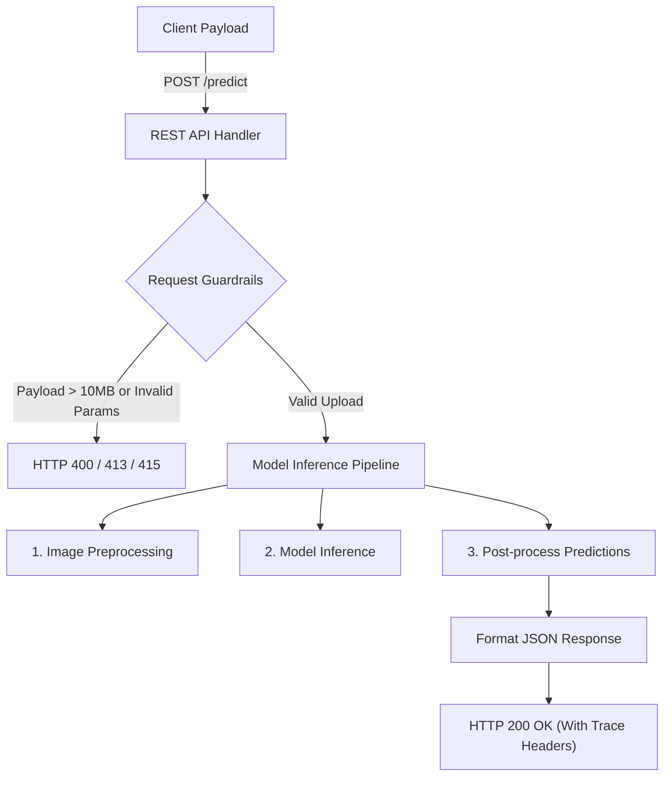

# 1.1: Detailed Requirements Specification

---

## Table of Contents

1. [Model Serving & Inference](#model-serving--inference)
2. [REST API Serving & Security](#rest-api-serving--security)
3. [System Error Handling & Observability](#system-error-handling--observability)
4. [Assessment Rubric](#assessment-rubric)
5. [Appendix: Integration Examples](#appendix-integration-examples)

## Model Serving & Inference

### Model Selection and Loading
*   **Description:** The service must successfully instantiate and initialize the pre-trained image classification model in memory during application startup before exposing route listeners.

> [!TIP]
> **Developer's Thought Process: Slicing Model Selection**
> 
> | Architectural Aspect | Key Decision / Options | Senior Rationale & Guidelines |
> | :--- | :--- | :--- |
> | **1. Weight Availability** | • **ResNet-50** (~97MB weights)<br>• **MobileNetV2** (~14MB weights) | *Prefer pre-trained weights (`torchvision.models`) over training from scratch.* Use MobileNetV2 for lightweight footprints and fast dev cycles. |
> | **2. Resource & SLA Bounds** | • **P99 Latency:** < 1000ms<br>• **Memory Budget:** < 2GB RAM | Match your choice to the hosting budget. MobileNetV2 loads and runs in milliseconds, easily meeting memory targets. |
> | **3. Deployment Flexibility** | • **Hardcoded Model Name** (Anti-pattern)<br>• **Environment Variable Decoupling** (Best practice) | Read `MODEL_NAME` dynamically. Enables instant model swaps in production without rebuilding the container. |

---

### Model Inference Pipeline
*   **Description:** Accept image uploads via HTTP POST, execute preprocessing transformations, run the deep learning model forward pass, and return sorted classifications while intercepting pipeline execution failures.

> [!NOTE]
> **Developer's Thought Process: Slicing the Inference Steps**
> 
> | Pipeline Phase | Primary Security & Technical Challenges | Engineering Rationale & Implementation |
> | :--- | :--- | :--- |
> | **1. File Ingestion** | Prevent directory traversal attacks; block corrupted files or malicious script uploads. | • **Process strictly in memory** (`io.BytesIO`).<br>• **Verify magic bytes** (actual content headers), not just file extensions. |
> | **2. Channel & Aspect Normalization** | Model expects `[3, 224, 224]` RGB. Client uploads can be RGBA, grayscale, or rectangular formats. | • Convert all color spaces to **3-channel RGB**.<br>• Use **center-cropping** to resize to `224x224` without distorting image subjects. |
> | **3. Gradient & Memory Overhead** | Gradient graph tracing consumes massive CPU/memory during inference passes. | Wrap inference inside a zero-gradient context (`torch.no_grad()`) to keep memory footprints low. |
> | **4. Framework Exception Safety** | Invalid shapes can cause low-level framework assertions that crash the main API server process. | • **Validate input shapes** (`[1, 3, 224, 224]`) before running prediction calls.<br>• Catch framework-specific execution errors. |

---

### Operational & Performance Constraints
*   **Description:** Operational performance metrics, resource bounds, and lifecycle constraints for model serving.

> [!IMPORTANT]
> **Developer's Thought Process: Slicing Operational Constraints**
> 
> | Constraint Area | Core System SLA Requirements | Implementation Guidelines |
> | :--- | :--- | :--- |
> | **1. Concurrency Limits** | Process >= 10 concurrent requests without P95 latency degradation on CPU. | Keep the main prediction thread clean of blocking filesystem actions (I/O) during execution. |
> | **2. Startup Boot SLA** | Application must be ready to receive requests within **30 seconds** from boot. | **Instaboot Pattern:** Pre-cache and download model weights into the container image during Docker build. |
> | **3. Graceful Shutdown** | Drain active connections and safely exit within **10 seconds** of termination. | Trap `SIGTERM` signals. Stop accepting network requests but let current inference calls finish. |


---

## REST API Serving & Security

> [!TIP]
> **Developer's Thought Process: Slicing the REST API Design**
> *   **What endpoints do we build?** You need `POST /predict` for running predictions, `GET /health` for load-balancer health monitoring, and `GET /info` to expose model parameters and limits.
> *   **How do we format responses?** Always return clean JSON with `snake_case` keys and ISO 8601 UTC timestamps. Include headers like `X-Correlation-ID` and `X-Response-Time` to trace request pathways and latency.
> *   **How do we validate input?** Enforce `multipart/form-data` uploads, check file size limits, and validate that `top_k` query parameters are integers between 1 and 10.
> *   **How do we secure the routes?** Process all files in-memory (never write to local disk) and inject standard security headers (`X-Frame-Options: DENY` and `X-Content-Type-Options: nosniff`) into all JSON payloads.

**Request Execution Flow:**


---

### `/predict` Endpoint
*   **Description:** Primary interface for running predictions on user-submitted images.
*   **HTTP Method:** `POST`
*   **Content-Type:** `multipart/form-data`
*   **Request Schema:**
    *   `file`: Binary file payload (Required).
    *   `top_k`: Integer between 1 and 10 representing predictions count (Optional, Default: 5).
*   **Success Response (200 OK):**
    ```json
    {
      "success": true,
      "predictions": [
        {
          "class": "golden_retriever",
          "confidence": 0.89,
          "rank": 1
        }
      ],
      "latency_ms": 234,
      "timestamp": "2026-10-18T10:30:45Z"
    }
    ```

### `/health` Endpoint
*   **Description:** Health check endpoint for monitoring and load balancers.
*   **HTTP Method:** `GET`
*   **Success Response (200 OK):**
    ```json
    {
      "status": "healthy",
      "model_loaded": true,
      "model_name": "mobilenet_v2",
      "uptime_seconds": 3600,
      "timestamp": "2026-10-18T10:30:45Z"
    }
    ```
*   **Failure Response (503 Service Unavailable):**
    ```json
    {
      "status": "unhealthy",
      "model_loaded": false,
      "reason": "Model weights failed to load",
      "timestamp": "2026-10-18T10:30:45Z"
    }
    ```

### `/info` Endpoint
*   **Description:** Exposes metadata detailing the current deployment and constraints.
*   **HTTP Method:** `GET`
*   **Success Response (200 OK):**
    ```json
    {
      "model": {
        "name": "mobilenet_v2",
        "framework": "pytorch",
        "version": "2.0.0",
        "input_shape": [224, 224, 3],
        "output_classes": 1000
      },
      "api": {
        "version": "1.0.0",
        "endpoints": ["/predict", "/health", "/info"]
      },
      "limits": {
        "max_file_size_mb": 10,
        "max_image_dimension": 4096,
        "timeout_seconds": 30
      }
    }
    ```

### Request Validation & Formatting
*   **Request Inputs:** Verify incoming prediction calls use `multipart/form-data` with a non-empty `file` parameter. Check query limits: if the optional `top_k` parameter is provided, validate it falls strictly in the `1 to 10` range, rejecting anomalies with `HTTP 400 Bad Request`.
*   **Response Payloads:** Emit all outputs as valid JSON (`Content-Type: application/json`) using `snake_case` keys and ISO 8601 UTC timestamps (e.g. `2026-10-18T10:30:45Z`).

### API Security & Operational Constraints

*   **Security & Sandbox Policies:**
    *   *Volatile Isolation:* Process uploads entirely in-memory using `BytesIO` streams. Never write payloads to disk to eliminate directory traversal or file injection risks.
    *   *Payload Guardrails:* Enforce upload size limits strictly under 10MB and reject image dimensions exceeding 10,000x10,000 pixels.
    *   *Browser Defense:* Inject HTTP security headers (`X-Frame-Options: DENY`, `X-Content-Type-Options: nosniff`, and `X-XSS-Protection: 1; mode=block`) in all responses.

*   **Throughput & Observability:**
    *   *Target Scaling:* Process at least 10 concurrent requests without P95 latency degradation. Keep execution stateless to support horizontal load scaling.
    *   *Request Tracing:* Inject custom tracing response headers: `X-Correlation-ID` containing the request UUID, and `X-Response-Time` recording the server processing latency in milliseconds.

*   **Clean Code & Configuration:**
    *   *Standard Alignment:* Follow PEP 8 style guides, using explicit type hints on all functions and Google-style docstrings.
    *   *Complexity Budgets:* Enforce strict code limits: functions must not exceed 50 lines, and files must not exceed 500 lines.
    *   *Decoupled Parameters:* Load port bindings, filesystem cache paths, and model names from environment variables; zero hardcoding.

---

## System Error Handling & Observability

> [!NOTE]
> **Developer's Thought Process: Slicing Error Handling & Observability**
> *   **How do we handle crashes and errors?** We must prevent raw Python tracebacks from escaping to the user, as they leak backend implementation details. Catch every exception at the route boundary and format it into a standardized JSON structure.
> *   **How do we deal with resource limits (OOM & Timeouts)?** ML inference is memory and CPU intensive. If memory is exhausted, catch the exception, clear local PyTorch caches, and return an HTTP 503 code. To avoid threads hanging forever, enforce a strict 30-second execution timeout.
> *   **How do we structure logs for aggregation?** Standard print statements are useless in production. Use structured JSON logging and attach a unique `correlation_id` to every request. This lets you trace a request's logs across multiple server nodes.

---

### Error Handling & Observability Constraints

*   **Error Responses & Resilience:**
    *   *Structured Outputs:* Emit all errors using a standard JSON structure containing the error code, message, ISO 8601 timestamp, and request correlation ID.
    *   *HTTP Mapping:* Map internal anomalies to proper HTTP statuses: `HTTP 400` for invalid files, `HTTP 413` for size limits, `HTTP 503` for OOM, and `HTTP 504` for timeouts.
    *   *OOM Safeguard:* Intercept memory exceptions during forward passes, clear execution caches, and return `HTTP 503 Service Unavailable` with a 60-second `Retry-After` header.
    *   *Timeout Ceiling:* Enforce a strict 30-second timeout per request. Cancel model inference calls and return `HTTP 504 Gateway Timeout` if breached.

*   **Observability & Logging:**
    *   *Structured JSON Logs:* Output all logs in structured JSON format containing log level, ISO timestamp, correlation ID, and message.
    *   *SLA Error Tracking:* Target a service error rate of < 1% under active load. Ensure logs separate client-driven warnings from actual server failures.
    *   *Data Leak Protections:* Never log image binary payloads, local machine file paths, or system credentials.

*   **Quality Assurance & Testing:**
    *   *Unit Coverage:* Achieve `> 80%` code coverage across all helper modules (config, preprocessing, loader).
    *   *Integration Testing:* Test full API endpoints, validating error responses, timeouts, OOM recovery, and invalid payload formats.