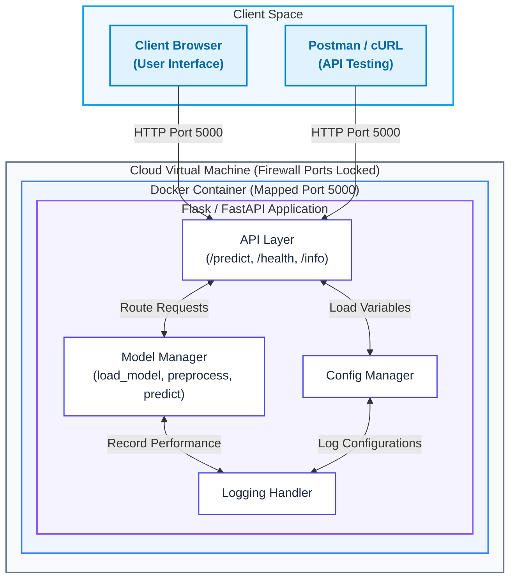
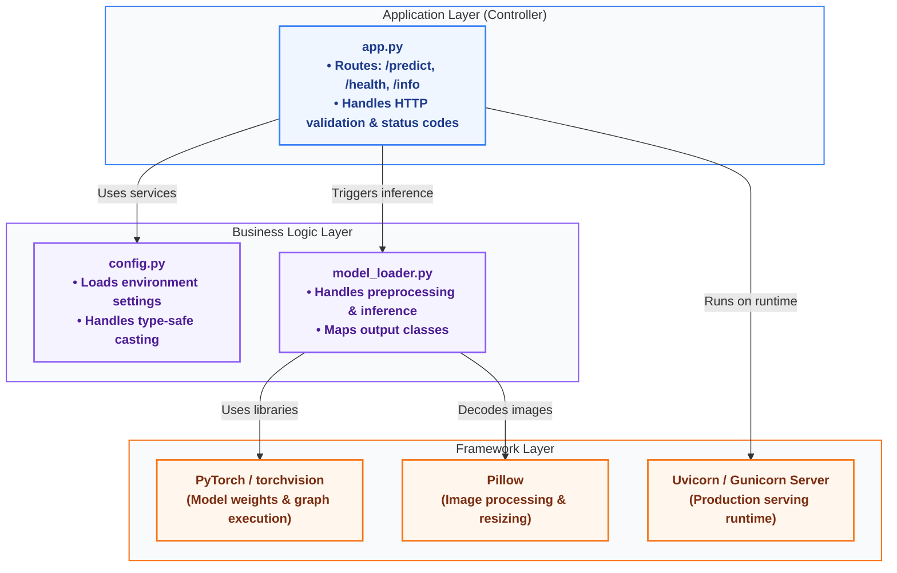
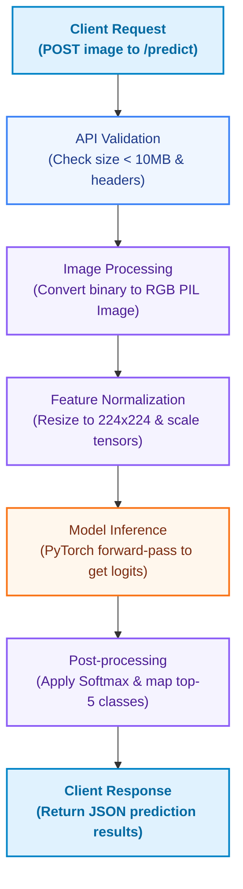
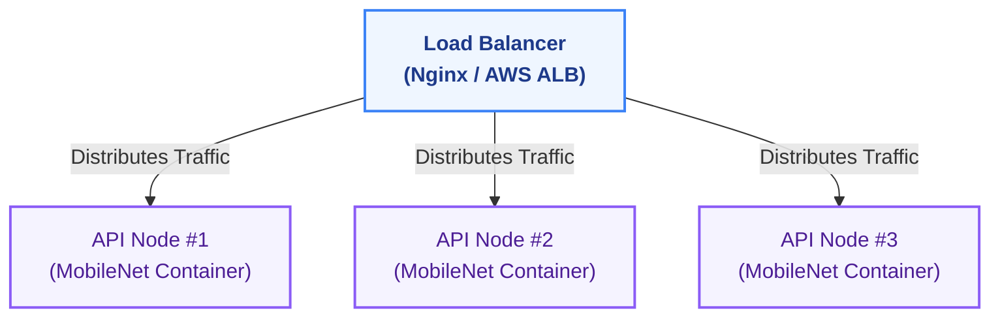

# 1.2: High Level System Architecture

---

## Table of Contents

1. [System Overview](#system-overview)
2. [Architecture Diagrams](#architecture-diagrams)
3. [Component Design](#component-design)
4. [Data Flow](#data-flow)
5. [Technology Stack Justifications](#technology-stack-justifications)
6. [Design Decisions](#design-decisions)
7. [Scalability Considerations](#scalability-considerations)
8. [Security Architecture](#security-architecture)
9. [Monitoring & Observability](#monitoring--observability)

---

## System Overview

This project implements a REST API for serving predictions from a pre-trained image classification model. The system follows a **stateless, containerized microservice architecture pattern** that is commonly used in production ML systems.

### Key Characteristics
*   **Stateless:** No server-side session state, enabling seamless horizontal scaling.
*   **Containerized:** Docker packaging ensures consistency across local and cloud environments.
*   **Synchronous:** Request-response pattern with blocking inference.
*   **Single-model:** Serves one model version at a time (no dynamic routing/AB testing).
*   **CPU-optimized:** Designed for CPU-bound model inference, avoiding costly GPU runtimes.

> [!NOTE]  
> **Design Philosophy:** We prioritize **Simplicity** (easy to debug), **Reliability** (graceful error recovery), **Observability** (structured logging), and **Maintainability** (clear separation of concerns).

---

## Architecture Diagrams

#### High-Level Service Architecture



### Component Architecture



---

## Component Design

The software modules of the prediction API are decoupled to ensure single responsibility, enabling independent testability and clear separation of concerns. Below are the key classes and structural interfaces that implement the web routing, ML inference, and configuration boundaries:

### 1. API Serving Layer ([app.py](src/app.py))
Responsible for processing incoming HTTP payloads, enforcing headers, validating media boundaries, and handling response formats.

```python
class ModelAPI:
    def __init__(self, model_loader: ModelLoader, config: Config):
        """Inject dependencies for serving predictions"""
        pass

    def predict(self) -> Response:
        """POST /predict - Accepts image files, returns JSON list of top-5 classifications"""
        pass

    def health(self) -> Response:
        """GET /health - Verifies model loader is active, returns 200 OK or 503 Service Unavailable"""
        pass
```

### 2. Model Loader ([model_loader.py](src/model_loader.py))
Responsible for caching model weights, decoding images using Pillow, scaling features, and performing inference.

```python
class ModelLoader:
    def __init__(self, model_name: str, device: str = "cpu"):
        """Initialize and choose device context"""
        pass

    def load_model(self) -> None:
        """Load pretrained weight graphs into runtime memory"""
        pass

    def preprocess(self, image: PIL.Image) -> torch.Tensor:
        """Resize to 224x224 and normalize using ImageNet constants"""
        pass

    def predict(self, image: PIL.Image, top_k: int = 5) -> List[Prediction]:
        """Perform forward pass and extract top_k confidence scores"""
        pass
```

### 3. Configuration Management ([config.py](src/config.py))
Encapsulates system configuration loaded from [env template](.env.example). Ensure strong type casting.

---

## Data Flow

The system processes prediction requests through a linear, synchronous execution pipeline. Incoming binary payload data is progressively validated, decoded, transformed into tensor format, evaluated by the model runtime, and formatted as a JSON response:



### Normal Prediction Execution Trace
1.  **Client Request:** Client POSTs a binary image file (`multipart/form-data`) to `/predict`.
2.  **API Validation:** Server checks payload size (< 10MB) and HTTP Content-Type headers.
3.  **Image Processing:** Converts uploaded binary to RGB PIL Image.
4.  **Feature Normalization:** Resizes to `224x224` and applies tensor scaling.
5.  **Model Inference:** Performs PyTorch forward-pass, returning float logits.
6.  **Post-processing:** Applies Softmax to output, maps predictions to ImageNet classes, and returns JSON.

---

## Design Decisions

| Architectural Tradeoff | Chosen Option | Justification |
| :--- | :--- | :--- |
| **Inference Processing** | **Synchronous / Blocking** | Simplifies design. ML inference is CPU-bound, making complex async logic redundant for single requests. |
| **Model Lifecycle** | **Loaded once at startup** | Maximizes serving speed. Avoids loading models per-request (which takes several seconds). |
| **Inference Hardware** | **CPU Only** | Minimizes instance costs and driver complexity (no CUDA configurations required for learning). |
| **State Storage** | **In-memory execution** | Avoids local disk reads/writes. Reduces security risks and enhances performance. |

---

## Scalability Considerations

### Horizontal Scaling Design
Because the API nodes are stateless, you can easily scale them by deploying multiple container instances behind a Load Balancer (such as Nginx or AWS ALB):



### Performance Bottlenecks & Optimization Paths
1.  **Network Bandwidth:** High-resolution image payloads will clog network channels. Always compress payloads on the client-side.
2.  **Memory Consumption:** Serving ResNet-50 requests simultaneously can lead to Out-Of-Memory (OOM) exceptions. Limit concurrent execution processes using Gunicorn or Uvicorn worker settings.

---

## Security Architecture

We apply a **Defense-in-Depth** model:
*   **Network Security:** Limit inbound access via firewalls / VM Security Groups. Only expose Port 5000 to public traffic. Keep SSH (Port 22) locked down to administrator IPs.
*   **Input Validation:** Enforce payload size limits (< 10MB) to prevent Denial of Service (DoS) memory exhaustion.
*   **Execution Isolation:** Do not persist upload logs to local storage, and run the container service as a non-root user.

---

## Monitoring & Observability

### Logging Standards
Log messages must output to standard out in a structured layout (such as JSON) for parsing.
*   `INFO` – Lifecycle operations (e.g. `Model loaded successfully in 3.4 seconds`) and request completion metrics (e.g. `/predict - status: 200 - latency: 120ms`).
*   `WARN` – Non-fatal issues (e.g. `File size near limit: 9.8MB`).
*   `ERROR` – Failed operations (e.g. `Corrupted image structure received`).
*   `CRITICAL` – Startup blockers (e.g. `Failed to download model weights`).
