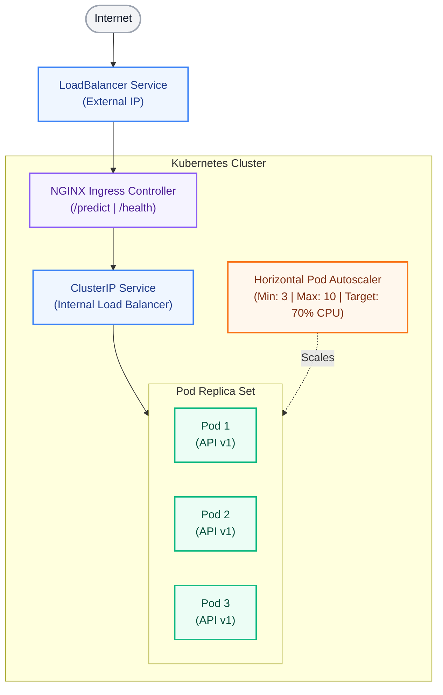
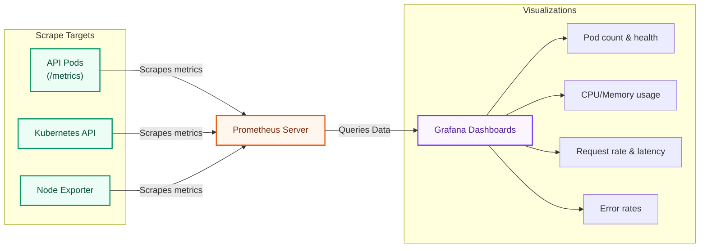

# 2.0: README - Kubernetes Model Serving

## Overview

Transform your basic FastAPI model serving application from Project 01 into a production-grade, scalable Kubernetes deployment. This project teaches container orchestration fundamentals, auto-scaling, load balancing, rolling updates, and comprehensive monitoring using industry-standard tools.

### Real-World Scenario

Your simple model API from Project 01 was a success! The business now requires:
- **High availability**: 99.9% uptime guarantee
- **Scalability**: Handle 1000+ requests per second during peak hours
- **Zero-downtime deployments**: Updates without service interruption
- **Observability**: Real-time metrics and alerting

Enter Kubernetes - the de facto standard for container orchestration that solves all these challenges.

---

## Learning Objectives

By completing this project, you will be able to:

1. **Deploy containerized applications to Kubernetes** using Deployments, Services, and ConfigMaps
2. **Implement auto-scaling** with Horizontal Pod Autoscaler (HPA) based on CPU and memory metrics
3. **Configure load balancing** using Kubernetes Services and Ingress controllers
4. **Perform rolling updates** with zero downtime and automatic rollback capabilities
5. **Set up monitoring infrastructure** with Prometheus and Grafana
6. **Package applications with Helm** for repeatable, configurable deployments
7. **Implement health checks** using liveness and readiness probes
8. **Manage application configuration** with ConfigMaps and Secrets
9. **Debug Kubernetes deployments** using kubectl, logs, and monitoring tools
10. **Optimize resource allocation** with requests and limits

---

## Architecture Overview

### High-Level Architecture



### Monitoring Architecture



---

## Technology Stack

### Core Technologies

| Component | Technology | Purpose |
|-----------|------------|---------|
| **Orchestration** | Kubernetes 1.28+ | Container orchestration and scheduling |
| **Local Cluster** | Minikube / Kind | Local development and testing |
| **Cloud Platform** | EKS / GKE / AKS | Production Kubernetes cluster |
| **Package Manager** | Helm 3.12+ | Application templating and deployment |
| **Monitoring** | Prometheus + Grafana | Metrics collection and visualization |
| **Ingress** | NGINX Ingress Controller | HTTP routing and load balancing |
| **CLI Tools** | kubectl, helm | Cluster management |

### Recommended Tools

- **K9s** - Terminal UI for Kubernetes cluster management
- **Lens** - Kubernetes IDE with visual cluster exploration
- **kubectx/kubens** - Quick context and namespace switching
- **stern** - Multi-pod log tailing
- **k6** - Load testing tool

---

## Project Structure

```
project-02-kubernetes-serving/
├── 2.0-README.md                      # This file
├── 2.1-requirements.md                    # Detailed requirements
├── 2.2-architecture.md                    # Architecture documentation
├── 2.3-how-to-execute-this-solution-and-host-pods.md # Step-by-step execution & hosting guide
│
├── src/
│   ├── app.py                        # Enhanced API from Project 01 (STUB)
│   ├── model.py                      # Model loading logic (STUB)
│   ├── metrics.py                    # Prometheus metrics (STUB)
│   └── requirements.txt              # Python dependencies
│
├── kubernetes/
│   ├── deployment.yaml               # K8s Deployment manifest (STUB)
│   ├── service.yaml                  # K8s Service manifest (STUB)
│   ├── ingress.yaml                  # Ingress configuration (STUB)
│   ├── hpa.yaml                      # Horizontal Pod Autoscaler (STUB)
│   ├── configmap.yaml                # Application configuration (STUB)
│   └── secrets.yaml.example          # Secrets template
│
├── monitoring/
│   ├── servicemonitor.yaml           # Prometheus ServiceMonitor (STUB)
│   └── grafana-dashboard.json        # Grafana dashboard template
│
├── tests/
│   ├── test_k8s.py                   # Kubernetes deployment tests (STUB)
│   ├── test_api.py                   # API integration tests (STUB)
│   └── load-test.js                  # K6 load test script (STUB)
│
└── docs/
    ├── SETUP.md                      # Setup instructions
    ├── OPERATIONS.md                 # Operational runbook
    └── TROUBLESHOOTING.md            # Common issues and solutions
```

---

## Requirements & Architecture

For the complete list of functional and non-functional requirements, please see the dedicated [2.1-requirements.md](2.1-requirements.md) file. Detailed system designs and network layouts are documented in the [2.2-architecture.md](2.2-architecture.md) file.

---

## Getting Started

### Prerequisites

Before starting this project, ensure you have:

1. **Completed Project 01**: Understanding of FastAPI model serving
2. **Docker installed**: For building container images
3. **Basic Linux/Unix knowledge**: Command line proficiency
4. **Git**: Version control basics
5. **Cloud account** (optional): AWS, GCP, or Azure for production deployment

### Execution Guide

For step-by-step instructions on building, hosting, and verifying the serving API on a local Kubernetes cluster, please refer to the dedicated [2.3-how-to-execute-this-solution-and-host-pods.md](2.3-how-to-execute-this-solution-and-host-pods.md) guide.

