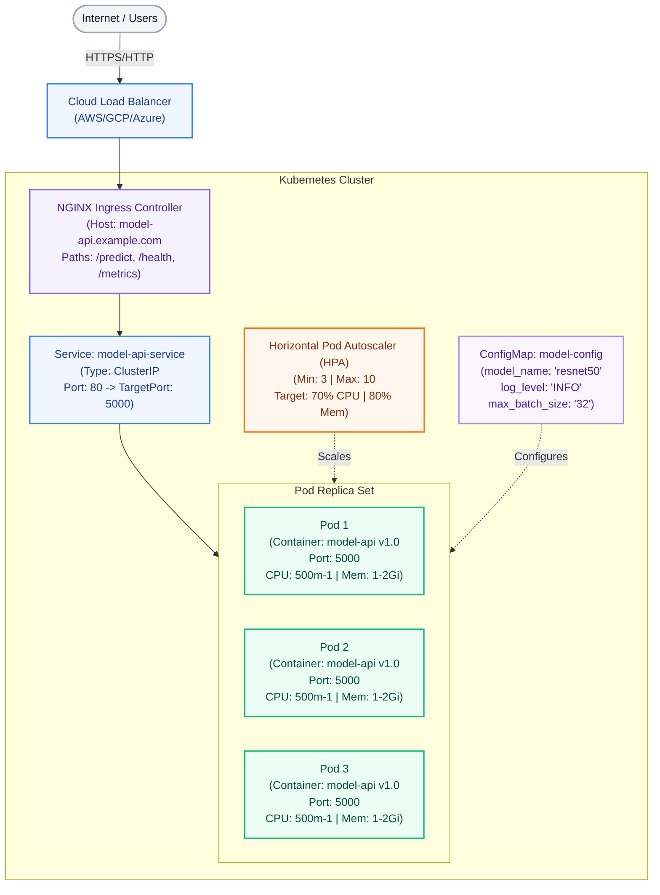
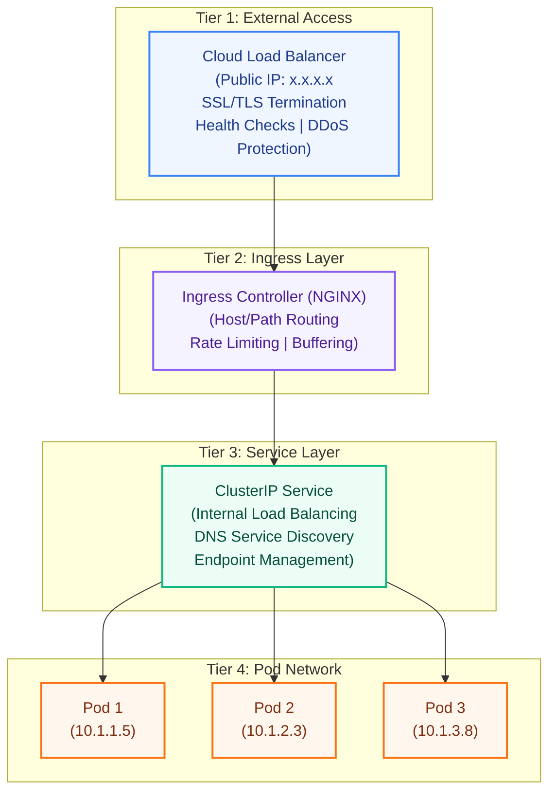
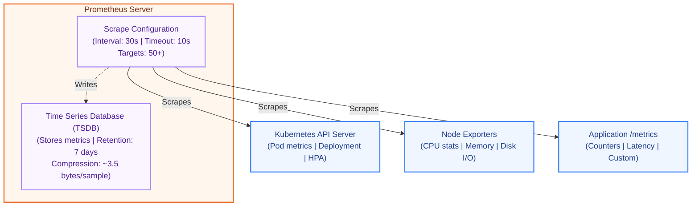
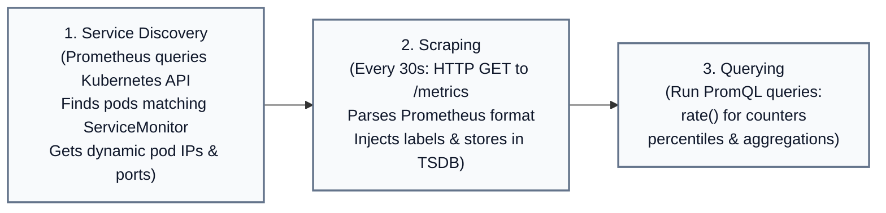
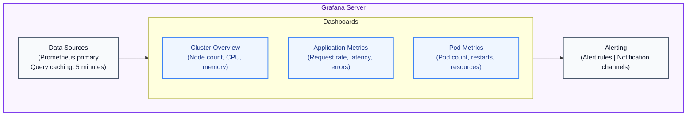
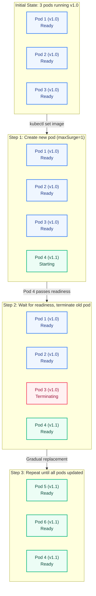
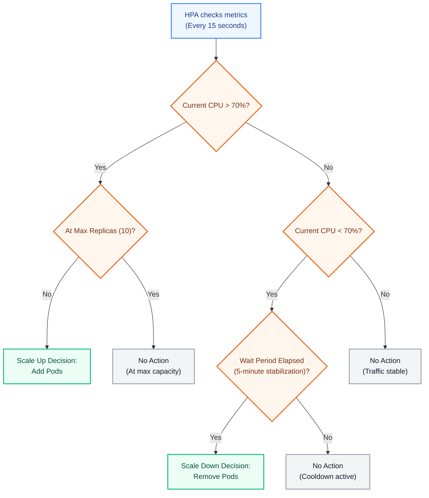

# 2.2: Architecture Documentation

## Table of Contents
1. [System Overview](#system-overview)
2. [Kubernetes Architecture](#kubernetes-architecture)
3. [Component Details](#component-details)
4. [Network Architecture](#network-architecture)
5. [Monitoring Architecture](#monitoring-architecture)
6. [Deployment Architecture](#deployment-architecture)
7. [Scaling Architecture](#scaling-architecture)
8. [High Availability Design](#high-availability-design)

---

## System Overview

### Purpose
Transform a simple model serving API into a production-grade, highly available, auto-scaling system using Kubernetes orchestration. This architecture demonstrates industry-standard practices for deploying ML inference services at scale.

### Key Characteristics
- **Highly Available:** Multiple replicas with automatic failover
- **Scalable:** Auto-scaling from 3 to 10 pods based on load
- **Resilient:** Self-healing with health checks and automatic restarts
- **Observable:** Comprehensive metrics and monitoring
- **Maintainable:** Zero-downtime deployments and rollbacks

### Architecture Style
- **Microservices:** Single-purpose model serving API
- **Container Orchestration:** Kubernetes-managed lifecycle
- **Cloud-Native:** Infrastructure-as-code, declarative configuration

---

## Kubernetes Architecture

### High-Level Architecture Diagram



---

## Component Details

### 1. Deployment

**Purpose:** Manages pod lifecycle and rolling updates

**Specification:**
```yaml
apiVersion: apps/v1
kind: Deployment
metadata:
  name: model-api
  namespace: ml-serving
spec:
  replicas: 3
  strategy:
    type: RollingUpdate
    rollingUpdate:
      maxSurge: 1        # Can create 1 extra pod during update
      maxUnavailable: 0  # Always maintain minimum replicas
```

**Key Features:**
- **Declarative Management:** Desired state specified, Kubernetes maintains it
- **Self-Healing:** Automatically replaces failed pods
- **Rolling Updates:** Gradual replacement for zero downtime
- **Rollback Support:** Maintains revision history

**Pod Template:**
```yaml
template:
  spec:
    containers:
    - name: model-api
      image: model-api:v1.0
      ports:
      - containerPort: 5000
      resources:
        requests:
          cpu: 500m
          memory: 1Gi
        limits:
          cpu: 1000m
          memory: 2Gi
```

---

### 2. Service (ClusterIP)

**Purpose:** Stable network endpoint for pod communication

**How It Works:**
1. Service selector matches pod labels: `app: model-api`
2. Service creates Endpoints object listing pod IPs
3. kube-proxy configures iptables rules for load balancing
4. DNS entry created: `model-api-service.ml-serving.svc.cluster.local`

**Load Balancing Algorithm:**
- **Default:** Round-robin across healthy endpoints
- **Session Affinity:** Optional ClientIP-based affinity

**Service Discovery:**
```bash
# Within cluster, any pod can access:
curl http://model-api-service/health
curl http://model-api-service.ml-serving/health
curl http://model-api-service.ml-serving.svc.cluster.local/health
```

---

### 3. Service (LoadBalancer)

**Purpose:** External access to application

**Cloud Provider Integration:**
- **AWS EKS:** Provisions Classic ELB or Network Load Balancer
- **GCP GKE:** Provisions TCP/UDP Load Balancer
- **Azure AKS:** Provisions Azure Load Balancer

**Behavior:**
```yaml
spec:
  type: LoadBalancer
  ports:
  - port: 80           # External port
    targetPort: 5000   # Container port
  selector:
    app: model-api
```

**Traffic Flow:**
```
Internet → Cloud LB (x.x.x.x:80) → Node IP:NodePort → Pod IP:5000
```

---

### 4. Ingress (NGINX)

**Purpose:** HTTP/HTTPS routing and SSL/TLS termination

**Why Use Ingress:**
- **Cost Efficiency:** Single load balancer for multiple services
- **Advanced Routing:** Path-based, host-based routing
- **SSL/TLS Termination:** Centralized certificate management
- **Rate Limiting:** Request throttling and protection

**Routing Rules:**
```yaml
spec:
  rules:
  - host: model-api.example.com
    http:
      paths:
      - path: /predict
        pathType: Prefix
        backend:
          service:
            name: model-api-service
            port:
              number: 80
```

**Ingress Controller Architecture:**
```
┌────────────────────────────────────────┐
│   Ingress Controller (NGINX Pod)       │
│                                        │
│   - Watches Ingress resources          │
│   - Generates nginx.conf               │
│   - Reloads NGINX on changes           │
│   - Exposes LoadBalancer Service       │
└────────────────────────────────────────┘
```

---

### 5. Horizontal Pod Autoscaler (HPA)

**Purpose:** Automatically adjust replica count based on metrics

**Control Loop:**
```
┌─────────────────────────────────────────────────────────────┐
│                    HPA Control Loop                         │
│                                                             │
│  1. Every 15 seconds:                                       │
│     - Query Metrics Server for current CPU/Memory           │
│     - Calculate: current / target = ratio                   │
│                                                             │
│  2. Calculate desired replicas:                             │
│     desiredReplicas = ceil(currentReplicas * ratio)         │
│                                                             │
│  3. Apply scaling policies:                                 │
│     - Check min/max limits (3-10)                           │
│     - Apply stabilization window                            │
│     - Apply scale-up/down policies                          │
│                                                             │
│  4. Update Deployment if needed                             │
└─────────────────────────────────────────────────────────────┘
```

**Example Calculation:**
```
Current Replicas: 3
Current CPU: 85% (above target of 70%)
Ratio: 85 / 70 = 1.21

Desired Replicas = ceil(3 * 1.21) = 4

Action: Scale from 3 → 4 pods
```

**Scaling Behavior:**
```yaml
behavior:
  scaleUp:
    stabilizationWindowSeconds: 0      # Scale up immediately
    policies:
    - type: Percent
      value: 100                       # Can double pod count
      periodSeconds: 30
    - type: Pods
      value: 2                         # Or add max 2 pods
      periodSeconds: 30
    selectPolicy: Max                  # Use most aggressive

  scaleDown:
    stabilizationWindowSeconds: 300    # Wait 5 min before scale down
    policies:
    - type: Percent
      value: 50                        # Max 50% reduction
      periodSeconds: 60
```

---

### 6. ConfigMap

**Purpose:** External configuration management

**Benefits:**
- **Separation of Concerns:** Config separate from code
- **Environment-Specific:** Different configs for dev/staging/prod
- **No Image Rebuilds:** Update config without new image
- **Kubernetes-Native:** Integrated with pod lifecycle

**Usage Patterns:**

**Pattern 1: Environment Variables**
```yaml
env:
- name: MODEL_NAME
  valueFrom:
    configMapKeyRef:
      name: model-config
      key: model_name
```

**Pattern 2: Volume Mount (for files)**
```yaml
volumes:
- name: config-volume
  configMap:
    name: model-config

volumeMounts:
- name: config-volume
  mountPath: /etc/config
```

**Configuration Versioning:**
To trigger pod updates when ConfigMap changes:
1. Add checksum annotation to pod template
2. Use ConfigMap hash in name (ConfigMap-v2-abc123)
3. Use tools like Reloader to watch ConfigMaps

---

### 7. Health Checks

**Purpose:** Monitor application health and control traffic routing

#### Liveness Probe
**When to Use:** Detect deadlocks or unrecoverable errors

**Configuration:**
```yaml
livenessProbe:
  httpGet:
    path: /health
    port: 5000
  initialDelaySeconds: 30    # Wait for startup
  periodSeconds: 10          # Check every 10s
  timeoutSeconds: 5          # Timeout after 5s
  failureThreshold: 3        # Fail after 3 consecutive failures
```

**Behavior:**
- **Success:** Pod continues running
- **Failure (3 consecutive):** Kubernetes restarts container
- **Restart Policy:** Always (default for Deployments)

**Implementation:**
```python
@app.route('/health')
def health():
    # Check application is responsive
    # NOT just return 200 - actually verify internal state
    if not model_loaded:
        return jsonify({"status": "unhealthy"}), 500
    return jsonify({"status": "healthy"}), 200
```

#### Readiness Probe
**When to Use:** Control traffic routing during startup/shutdown

**Configuration:**
```yaml
readinessProbe:
  httpGet:
    path: /health
    port: 5000
  initialDelaySeconds: 10    # Faster than liveness
  periodSeconds: 5           # More frequent checks
  timeoutSeconds: 3
  failureThreshold: 3
```

**Behavior:**
- **Success:** Pod added to Service endpoints (receives traffic)
- **Failure:** Pod removed from Service endpoints (no traffic)
- **No Restart:** Pod keeps running, just doesn't receive traffic

**Use Cases:**
- Model loading (large models take time)
- Database connection establishment
- Cache warming
- Dependency checks

**Traffic Flow with Readiness:**
```
Pod Lifecycle:
1. Pod created → Not Ready → No traffic
2. Container starts → Readiness probe begins
3. Model loads (20 seconds)
4. Readiness probe succeeds → Ready → Receives traffic
5. During shutdown → Readiness fails → Graceful traffic drain
```

---

## Network Architecture

### Three-Tier Network Model



### Network Policies

**Purpose:** Restrict pod-to-pod communication for security

```yaml
apiVersion: networking.k8s.io/v1
kind: NetworkPolicy
metadata:
  name: model-api-netpol
spec:
  podSelector:
    matchLabels:
      app: model-api
  policyTypes:
  - Ingress
  - Egress
  ingress:
  - from:
    - namespaceSelector:
        matchLabels:
          name: ingress-nginx
    ports:
    - protocol: TCP
      port: 5000
  egress:
  - to:
    - namespaceSelector: {}
    ports:
    - protocol: TCP
      port: 443  # Allow HTTPS to download models
```

---

## Monitoring Architecture

### Prometheus Architecture



### Metrics Collection Flow



### Grafana Architecture



---

## Deployment Architecture

### Rolling Update Process



### Update Timeline

```
0s    - Update initiated: kubectl set image
5s    - New pod created (Pod 4 v1.1)
15s   - Pod 4 passes readiness probe
15s   - Pod 4 added to Service endpoints
16s   - Pod 3 (v1.0) marked for termination
16s   - Pod 3 removed from Service endpoints
17s   - Pod 3 receives SIGTERM
27s   - Pod 3 terminated (after graceful shutdown)
28s   - New pod created (Pod 5 v1.1)
...
120s  - All pods updated to v1.1
```

---

## Scaling Architecture

### Auto-Scaling Decision Tree



### Scaling Capacity Planning

```
Resource Requirements per Pod:
- CPU Request: 500m
- Memory Request: 1Gi

Cluster Capacity (example 3-node cluster):
- Node CPU: 4 cores each = 12 cores total
- Node Memory: 16Gi each = 48Gi total
- System Reserved: ~1 core, ~4Gi = usable 11 cores, 44Gi

Maximum Pods (CPU limited):
11 cores / 0.5 cores per pod = 22 pods max

Maximum Pods (Memory limited):
44Gi / 1Gi per pod = 44 pods max

Actual Limit: 22 pods (CPU constrained)

HPA Max: 10 pods (well within cluster capacity)
```

---

## High Availability Design

### Failure Scenarios and Recovery

#### Scenario 1: Single Pod Failure
```
Event: Pod crashes due to OOM error
Detection: Liveness probe fails (30 seconds)
Action: Kubernetes restarts container
Recovery Time: 60 seconds (restart + readiness)
Impact: None (2 other pods still serving)
```

#### Scenario 2: Node Failure
```
Event: Node becomes unresponsive
Detection: Node marked NotReady (40 seconds)
Action: Pods rescheduled to healthy nodes
Recovery Time: 5 minutes (pod eviction timeout)
Impact: Reduced capacity during recovery
Mitigation: Over-provision replicas (3 minimum)
```

#### Scenario 3: Deployment Failure
```
Event: New version has bug, fails readiness
Detection: Readiness probe fails
Action: Rolling update halts, no old pods terminated
Recovery Time: Immediate (rollback command)
Impact: None (old version still running)
```

### Availability Calculation

```
Assumptions:
- 3 pods minimum
- Each pod: 99% individual availability
- Independent failures

Availability = 1 - (1 - 0.99)³ = 1 - 0.000001 = 99.9999%

With pod recovery (60s) and node failure (5 min):
Effective Availability ≈ 99.95%

Far exceeds 99.9% SLA requirement
```

---

## Design Decisions and Trade-offs

### 1. Replica Count: 3 minimum
**Rationale:**
- Tolerates 1 pod failure without impact
- Allows rolling updates with zero downtime
- Balances cost vs. availability

**Trade-off:**
- Higher cost than 1-2 replicas
- More resource consumption
- Benefit: Much higher availability

---

### 2. HPA Metrics: CPU 70%, Memory 80%
**Rationale:**
- 70% CPU allows headroom for spikes
- 80% memory prevents OOM kills
- Different thresholds account for metric characteristics

**Trade-off:**
- Lower thresholds = more pods = higher cost
- Higher thresholds = risk of overload
- Balance: Responsive without over-provisioning

---

### 3. Rolling Update: maxSurge=1, maxUnavailable=0
**Rationale:**
- maxSurge=1: Minimal extra resources during update
- maxUnavailable=0: Guaranteed zero downtime

**Trade-off:**
- Slower updates (one pod at a time)
- Higher resource usage during update
- Benefit: Absolute zero downtime guarantee

---

### 4. Resource Limits: 2x Requests
**Rationale:**
- Allows bursting to handle spikes
- Prevents runaway resource consumption
- Based on observed usage patterns

**Trade-off:**
- Could throttle during legitimate spikes
- May allow some noisy neighbor issues
- Balance: Protection without over-restriction

---

## Future Architecture Enhancements

### Short-term (Next Project)
1. **Vertical Pod Autoscaling (VPA):** Right-size resource requests
2. **Pod Disruption Budgets (PDB):** Control voluntary disruptions
3. **Multi-zone Deployment:** Improve availability
4. **Istio Service Mesh:** Advanced traffic management

### Long-term
1. **Multi-cluster Deployment:** Geographic distribution
2. **GitOps with ArgoCD:** Declarative deployment pipeline
3. **Custom Metrics Scaling:** Scale on inference queue depth
4. **Spot Instance Integration:** Cost optimization