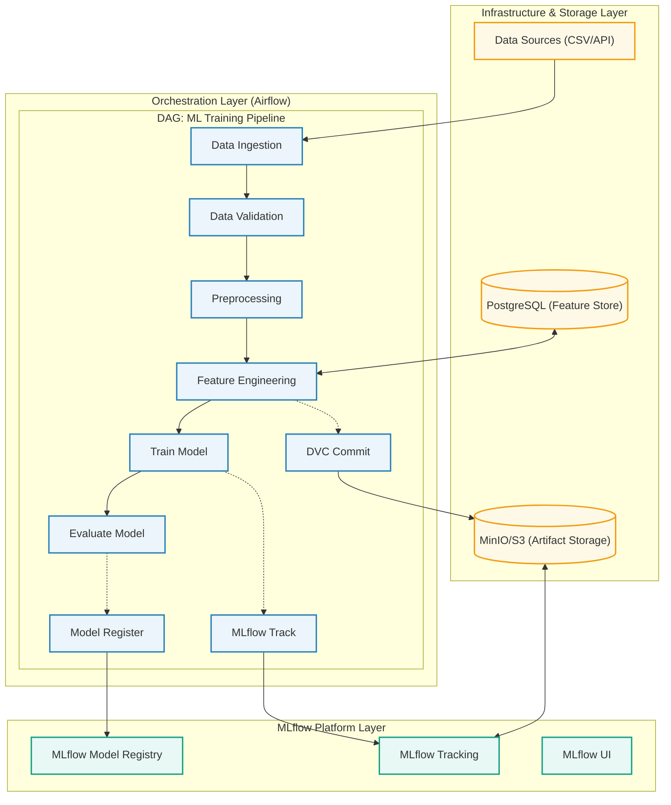
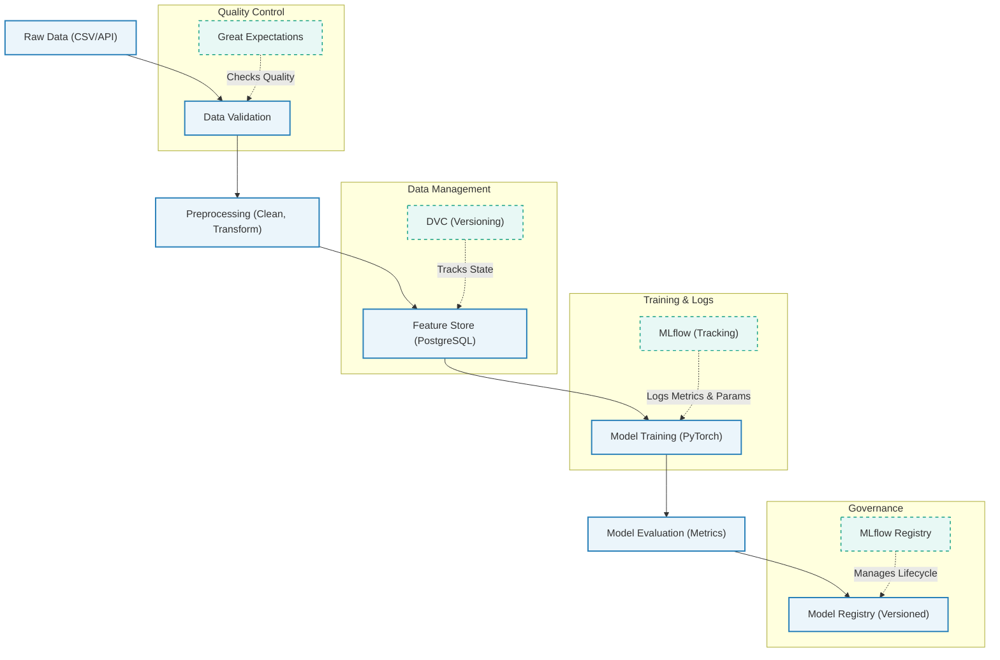

# 3.0: README - ML Pipeline with Experiment Tracking

## Table of Contents

- [Project Overview](#project-overview)
- [Technology Stack](#technology-stack)
- [System Architecture](#system-architecture)
- [Project Structure](#project-structure)
- [Requirements & Architecture](#requirements--architecture)
- [Getting Started](#getting-started)

## Project Overview

Build an end-to-end machine learning pipeline with automated experiment tracking, data versioning, model registry, and workflow orchestration. This project introduces MLOps fundamentals: managing the complete ML lifecycle from data ingestion to model deployment.

### Real-World Context

After successfully deploying models (Projects 1-2), data science teams face a new challenge: managing dozens of experiments, tracking which dataset versions produce the best models, and automating retraining workflows. Without proper MLOps infrastructure, teams struggle with:

- **Lost experiments** - "Which hyperparameters produced that 92% accuracy model?"
- **Data inconsistency** - "Did we train on version 1.2 or 1.3 of the dataset?"
- **Manual processes** - "Someone needs to retrain the model weekly"
- **No reproducibility** - "I can't recreate last month's results"

This project simulates building internal ML platform capabilities that solve these problems at scale.

---

## Technology Stack

### Core Technologies

| Component | Technology | Purpose |
|-----------|------------|---------|
| **Orchestration** | Apache Airflow 2.7+ | Workflow management and scheduling |
| **Experiment Tracking** | MLflow 2.8+ | Tracking runs, models, artifacts |
| **Data Versioning** | DVC 3.30+ | Dataset version control |
| **Data Validation** | Great Expectations 0.18+ | Data quality checks |
| **ML Framework** | PyTorch 2.0+ | Model training |
| **Database** | PostgreSQL 15+ | MLflow backend, feature store |
| **Object Storage** | MinIO (local) | Artifact storage |
| **Message Queue** | Redis 7+ | Airflow task queue |

### Why These Technologies?

- **Apache Airflow**: Industry standard for workflow orchestration (used by Airbnb, Netflix, Adobe)
- **MLflow**: Most popular open-source MLOps platform with 15K+ GitHub stars
- **DVC**: Git-like versioning for data and models, integrates seamlessly with existing workflows
- **Great Expectations**: Prevents bad data from entering pipelines with automated validation
- **PostgreSQL**: Reliable, scalable database for metadata and features
- **MinIO**: S3-compatible object storage for local development

---

## System Architecture



### Data Flow



---

## Project Structure

```
project-03-ml-pipeline-tracking/
├── 3.0-README.md                       # This file
├── 3.1-requirements.md                 # Detailed requirements
├── 3.2-architecture.md                 # Architecture deep dive
├── 3.3-how-to-execute-this-solution-and-run-pipeline.md # Step-by-step execution guide
├── src/
│   ├── data_ingestion.py              # Data ingestion module
│   ├── preprocessing.py               # Data preprocessing
│   ├── training.py                    # Model training with MLflow
│   ├── evaluation.py                  # Model evaluation
│   └── requirements.txt               # Python package dependencies
├── dags/
│   ├── ml_pipeline_dag.py             # Airflow Pipeline DAG
│   └── retraining_dag.py              # Airflow Retraining DAG
├── mlflow/
│   └── MLproject                      # MLflow project configuration
├── dvc/
│   ├── docker-compose.yml             # Multi-service docker orchestration
│   ├── dvc.yaml                       # DVC pipeline stages
│   ├── params.yaml                    # Pipeline parameters
│   └── .dvcignore                     # DVC ignore patterns
└── tests/
    └── test_pipeline.py               # Pipeline tests (STUB)
```

---

## Requirements & Architecture

For the complete list of functional and non-functional requirements, please see the dedicated [3.1-requirements.md](3.1-requirements.md) file. Detailed system designs and network layouts are documented in the [3.2-architecture.md](3.2-architecture.md) file.

---

## Getting Started

### Prerequisites

Before starting this project, ensure you have:

- Completed Projects 1 and 2 (API Deployment, Kubernetes basics)
- Docker and Docker Compose installed
- Python 3.11+ installed
- Git installed
- Basic understanding of:
  - Machine learning concepts (training, validation, testing)
  - SQL and databases
  - Workflow automation concepts

### Execution Guide

For step-by-step instructions on running the infrastructure, executing DVC stages, and triggering the Airflow pipeline, please refer to the dedicated [3.3-how-to-execute-this-solution-and-run-pipeline.md](3.3-how-to-execute-this-solution-and-run-pipeline.md) guide.

### Quick Start

1. **Navigate to project directory:**
   ```bash
   cd projects/project-03-ml-pipeline-tracking/
   ```

2. **Install dependencies:**
   ```bash
   pip install -r src/requirements.txt
   ```

3. **Start infrastructure with Docker Compose:**
   ```bash
   docker-compose -f dvc/docker-compose.yml up -d
   ```

5. **Verify services:**
   - MLflow UI: http://localhost:5000
   - Airflow UI: http://localhost:8080
   - MinIO Console: http://localhost:9001
