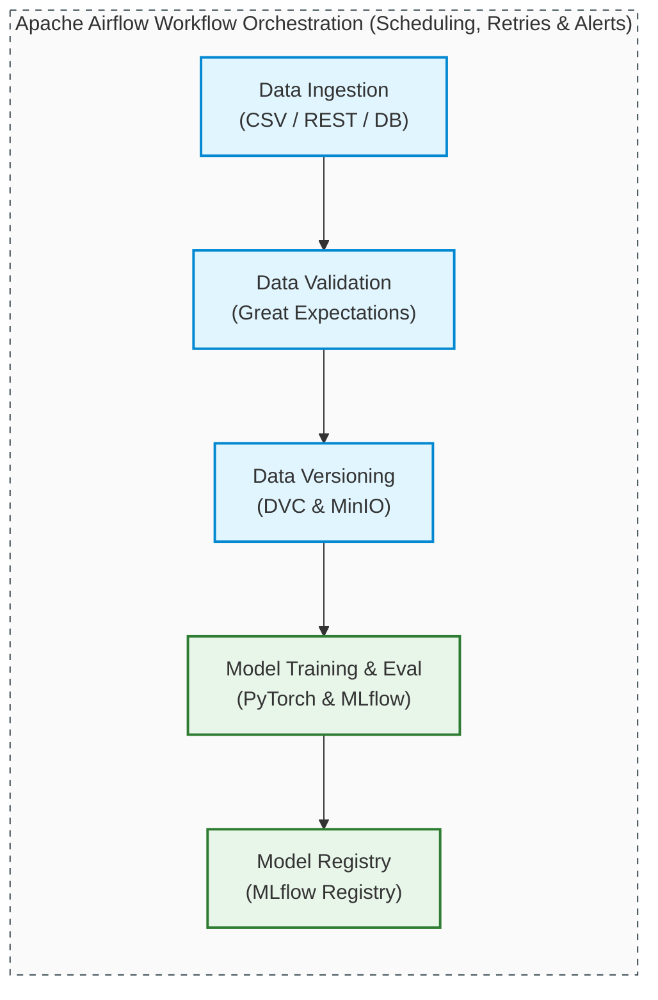

# 3.1: Project Requirements

This document specifies the functional and non-functional requirements for the **ML Pipeline with Experiment Tracking & Orchestration** system. It serves as the engineering reference for building a reproducible, monitored, and automated model training and tracking platform.

---

## Table of Contents

1. [System Overview](#system-overview)
2. [Functional Requirements (FR)](#functional-requirements-fr)
   - [FR-1: Data Engineering and Versioning](#fr-1-data-engineering-and-versioning)
   - [FR-2: Training and Tracking Pipeline](#fr-2-training-and-tracking-pipeline)
   - [FR-3: Model Registry Management](#fr-3-model-registry-management)
   - [FR-4: Pipeline Orchestration and Workflow](#fr-4-pipeline-orchestration-and-workflow)
3. [Non-Functional Requirements (NFR)](#non-functional-requirements-nfr)
4. [Technical Specifications](#technical-specifications)
5. [Acceptance Criteria Checklist](#acceptance-criteria-checklist)
6. [System Constraints and Assumptions](#system-constraints-and-assumptions)

---

## 1. System Overview

The goal of this project is to implement a robust **MLOps Pipeline** that transitions model development from manual, ad-hoc execution to a fully automated, reproducible, and tracked workflow. The system orchestrates raw data ingestion, quality validation, version control, model training, experiment metrics log, registry management, and alert notifications.



---

## 2. Functional Requirements (FR)

### FR-1: Data Engineering and Versioning

The data pipeline handles ingestion, validates data quality before resource-intensive training runs, versions datasets to guarantee reproducibility, and prepares features for model training.

#### FR-1.1: Multi-Source Data Ingestion
* **Goal**: Provide modular interfaces to load training datasets.
* **Requirements**:
  * Ingest local or cloud-stored CSV data.
  * Ingest data dynamically via external REST API calls.
  * Ingest structured metadata directly from PostgreSQL databases.
* **Outputs**:
  * Raw dataset files persisted under `data/raw/`.
  * Diagnostic ingestion logs containing timestamped execution info and record counts.

#### FR-1.2: Quality Validation (Great Expectations)
* **Goal**: Prevent dirty or malformed data from triggering training runs.
* **Requirements**:
  * Establish a schema assertion suite (Great Expectations).
  * Validate record counts (bounds: $10^3$ to $10^6$ records).
  * Enforce column constraints: `image_path` (must exist), `label` (must be within `["cat", "dog", "bird", "fish"]`), and `split`.
* **Outputs**:
  * Interactive HTML validation report.
  * Strict binary outcome (pass/fail). If validation fails, the pipeline halts immediately.

#### FR-1.3: Data Versioning (DVC)
* **Goal**: Track dataset snapshots without storing large binary assets in Git.
* **Requirements**:
  * Version raw and processed datasets using DVC.
  * Sync DVC pointers with a MinIO S3-compatible local bucket.
  * Create deterministic DVC tracking files (`.dvc`) that are committed to git version control.

#### FR-1.4: Preprocessing & Splitting
* **Goal**: Prepare raw source data for PyTorch datasets.
* **Requirements**:
  * Deduplicate exact matches and clean null inputs.
  * Perform stratified splitting to preserve category ratios (70% Train / 15% Validation / 15% Test) using a fixed random seed.
  * Export serializable preprocessing artifacts (encoders, scalers).

---

### FR-2: Training and Tracking Pipeline

The training system manages model execution, optimizes hyperparameters, and logs metadata for auditing and collaboration.

#### FR-2.1: Model Training (PyTorch)
* **Goal**: Train image classification models.
* **Requirements**:
  * Support multiple pretrained baseline models (e.g., `ResNet18`, `MobileNetV2`).
  * Implement training loops with validation loops, tracking loss and accuracy per epoch.
  * Save the best model state based on validation accuracy and implement early stopping.

#### FR-2.2: Hyperparameter Tuning
* **Goal**: Systematically explore hyperparameter configurations.
* **Requirements**:
  * Support grid sweep or Optuna optimization.
  * Tune at least 3 parameters: `learning_rate` ($10^{-4}$ to $10^{-2}$), `batch_size` ($16, 32, 64$), and `optimizer` (`adam`, `sgd`).
  * Track and compare results across runs in MLflow.

#### FR-2.3: Experiment Tracking (MLflow)
* **Goal**: Capture all parameters, metrics, and files from each run.
* **Requirements**:
  * **Log Parameters**: Learning rate, batch size, epochs, optimizer, dataset version, and Git commit hash.
  * **Log Metrics**: Loss, Accuracy, and Learning rate per epoch.
  * **Log Artifacts**: PyTorch model weights (`model.pth`), ONNX format exports (`model.onnx`), training curve plots, and evaluation JSON reports.

---

### FR-3: Model Registry Management

The Model Registry provides a central catalog to manage model versions, transitions, and production deployments.

#### FR-3.1: Model Registration
* **Goal**: Promote trained model runs to a version-controlled registry.
* **Requirements**:
  * Automatically register the best-performing models to a central registry.
  * Attach rich version tags detailing dataset lineage, architecture, and accuracy.

#### FR-3.2: Lifecycle Stage Transitions
* **Goal**: Manage model promotions through distinct environments.
* **Requirements**:
  * Support stages: `None` $\rightarrow$ `Staging` $\rightarrow$ `Production` $\rightarrow$ `Archived`.
  * Ensure only one version is designated as `Production` at any time; automated promotion must transition the previous version to `Archived`.

#### FR-3.3: Retrieval API
* **Goal**: Provide client endpoints to load model binaries.
* **Requirements**:
  * Expose Python and REST APIs to fetch the latest `Production` model or load specific tagged versions dynamically:
    ```python
    model = mlflow.pyfunc.load_model(model_uri="models:/image_classifier/Production")
    ```

---

### FR-4: Pipeline Orchestration and Workflow

Apache Airflow automates the pipeline steps, ensuring robust task scheduling, retry behavior, and system notifications.

```
[ ingest ] ──> [ validate ] ──> [ preprocess ] ──> [ DVC track ] ──> [ train ] ──> [ evaluate ] ──> [ register ]
```

#### FR-4.1: DAG Design
* **Goal**: Define the workflow as a Directed Acyclic Graph (DAG).
* **Requirements**:
  * Pass task status and file paths using Airflow XComs.
  * Configure retry limits (3 attempts) with exponential backoff.
  * View status and logs directly in the Airflow Web Console.

#### FR-4.2: Scheduling & Execution
* **Goal**: Automatically run training runs.
* **Requirements**:
  * Support weekly scheduled triggers alongside manual run overrides.
  * Enforce strict concurrency limits (`max_active_runs=1`) to prevent resource contention.

#### FR-4.3: Alerts & Notifications
* **Goal**: Inform the engineering team of pipeline events.
* **Requirements**:
  * Send failure alerts (email/Slack hooks) with logs and traceback context.
  * Send success summaries showing the generated MLflow model URI and test metrics.

---

## 3. Non-Functional Requirements (NFR)

### NFR-1: Reproducibility
* **Deterministic Seeds**: All operations (random number generation, train/test split, PyTorch weights initialization) must use a fixed seed (`42`).
* **Dependency Locking**: Package versions must be strictly pinned in a requirements file.
* **Pointers**: Datasets must be referenced via exact DVC commit hashes.

### NFR-2: Performance & SLA
* **Execution Windows**:
  * Data Ingestion & Preprocessing: $<15\text{ minutes}$ for $100\text{K}$ records.
  * Validation (Great Expectations): $<3\text{ minutes}$.
  * Training Loop (20 Epochs, CPU): $<30\text{ minutes}$.
* **API Latency**: MLflow UI and Airflow UI page loads must resolve in $<2\text{ seconds}$.

### NFR-3: Reliability & Recovery
* **Circuit Breaking**: The pipeline must stop immediately if data validation fails, avoiding expensive training costs on corrupt data.
* **Persistent State**: Database and object storage containers must use persistent storage volumes to survive container restarts.

---

## 4. Technical Specifications

### Component Tech Stack
| Technology | Version | Purpose |
| :--- | :--- | :--- |
| **Python** | 3.11+ | Runtime environment |
| **PyTorch** | 2.1.0 | Model training framework |
| **MLflow** | 2.8.1 | Experiment tracking and registry |
| **Apache Airflow** | 2.7.3 | Workflow orchestration |
| **DVC** | 3.30.1 | Data version control |
| **Great Expectations** | 0.18.3 | Data quality validation |
| **PostgreSQL** | 15 | Metadata database |
| **MinIO** | Latest | S3-compatible artifact storage |
| **Redis** | 7 | Airflow celery broker |

### Infrastructure Specifications
* **Minimum Configuration**: 4-Core CPU, 16GB RAM, 50GB storage.
* **Recommended Configuration**: 8-Core CPU, 32GB RAM, 100GB storage, NVIDIA T4 GPU.

### Port Allocation
* **`5000`**: MLflow UI
* **`8080`**: Apache Airflow UI
* **`9000` / `9001`**: MinIO API / Console
* **`5432`**: PostgreSQL Database
* **`6379`**: Redis Broker

---

## 5. Acceptance Criteria Checklist

### Phase 1: Infrastructure Setup
- [ ] Docker Compose orchestrates Airflow, MLflow, Postgres, MinIO, and Redis.
- [ ] All services start cleanly and persist data across container restarts.
- [ ] Web interfaces for Airflow (8080), MLflow (5000), and MinIO (9001) load successfully.

### Phase 2: Data Pipeline
- [ ] Ingestion logic correctly reads from CSV files, REST APIs, and SQL databases.
- [ ] Great Expectations validation asserts columns, null counts, and value domains.
- [ ] Preprocessing cleans records and splits data (70/15/15).
- [ ] DVC pushes raw and processed files successfully to the MinIO backend.

### Phase 3: Model Training & Experiment Tracking
- [ ] PyTorch training script trains ResNet18 and MobileNetV2 models.
- [ ] Training logs parameters, epoch metrics, and validation curves to MLflow.
- [ ] Model weights are converted and saved in both `.pth` and `.onnx` formats.
- [ ] Model accuracy exceeds the baseline threshold of 75% on validation data.

### Phase 4: Model Registry & Lifecycle
- [ ] Best-performing runs can be registered via the MLflow API.
- [ ] Registry stages (`Staging`/`Production`/`Archived`) transition successfully.
- [ ] Registry allows only one active `Production` model, archiving older versions automatically.

### Phase 5: Workflow Orchestration
- [ ] Airflow DAG defines tasks for ingestion, validation, versioning, training, and registration.
- [ ] DAG handles transient task failures with retries.
- [ ] Alerts notify the team on task success/failure.

---

## 6. System Constraints and Assumptions

### Scope Boundaries
* **In-Scope**:
  * Local development setups running inside Docker Compose.
  * Lightweight dataset scales ($<1\text{GB}$).
  * Model lifecycle tracking and registration.
* **Out-of-Scope**:
  * Deployment to cloud providers (AWS, GCP, Azure).
  * Distributed training clusters (Ray, Spark, multi-node).
  * Real-time model serving endpoints (handled in Project 01 & 02).
  * Real-time data drift monitoring.
