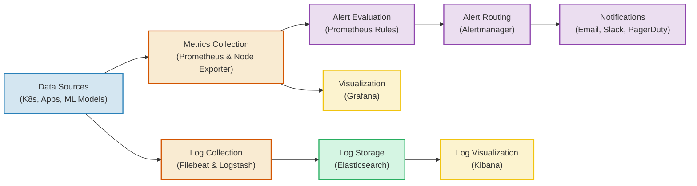

# 4.1: Project Requirements

This document specifies the functional and non-functional requirements for the **Monitoring & Alerting System**. It serves as the engineering reference for building a comprehensive observability stack covering metrics collection, log aggregation, visualization, alerting, and ML-specific monitoring.

---

## Table of Contents

1. [System Overview](#system-overview)
2. [Functional Requirements (FR)](#functional-requirements-fr)
   - [FR-1: Metrics Collection & Storage](#fr-1-metrics-collection--storage)
   - [FR-2: Visualization & Dashboards](#fr-2-visualization--dashboards)
   - [FR-3: Log Aggregation & Analysis](#fr-3-log-aggregation--analysis)
   - [FR-4: Alerting & Notifications](#fr-4-alerting--notifications)
   - [FR-5: ML-Specific Monitoring](#fr-5-ml-specific-monitoring)
3. [Non-Functional Requirements (NFR)](#non-functional-requirements-nfr)
4. [Technical Specifications](#technical-specifications)
5. [Acceptance Criteria Checklist](#acceptance-criteria-checklist)
6. [System Constraints and Assumptions](#system-constraints-and-assumptions)

---

## 1. System Overview

The goal of this project is to implement a robust **Observability Stack** that provides end-to-end visibility into ML infrastructure, applications, and model performance. The system collects metrics from multiple sources, aggregates logs for searchability, visualizes data through dashboards, and triggers alerts when anomalies are detected.



---

## 2. Functional Requirements (FR)

### FR-1: Metrics Collection & Storage

The metrics collection layer handles scraping, storing, and organizing time-series data from infrastructure, applications, and ML models.

#### FR-1.1: Deploy Prometheus for Metrics Collection
* **Goal**: Set up Prometheus as the central metrics collection and storage system.
* **Requirements**:
  * Deploy Prometheus 2.47+ using Docker Compose.
  * Configure persistent storage with 30-day retention.
  * Set up service discovery for automatic target detection.
  * Enable remote write for long-term storage (optional).
  * Configure high availability with multiple Prometheus instances (advanced).
* **Outputs**:
  * Prometheus accessible at `http://localhost:9090`.
  * Metrics stored with 30-day retention policy.
  * No data gaps in time series.
  * Query performance $< 1$ second for common queries.

#### FR-1.2: Configure Service Discovery
* **Goal**: Automatic discovery of monitoring targets without manual configuration.
* **Requirements**:
  * Kubernetes service discovery (if using K8s).
  * File-based service discovery (for static targets).
  * DNS-based service discovery.
  * Automatic relabeling of discovered targets.
* **Outputs**:
  * New services automatically detected within 1 minute.
  * Services removed when they go down.
  * Correct labels applied to all targets.

#### FR-1.3: Collect Infrastructure Metrics
* **Goal**: Monitor system-level metrics for all infrastructure components.
* **Requirements**:
  * **CPU**: Usage per core, load average, steal time.
  * **Memory**: Total, used, available, swap usage.
  * **Disk**: Usage per mount point, I/O operations, throughput.
  * **Network**: Bytes sent/received, packet errors, TCP connections.
* **Outputs**:
  * Node Exporter deployed on all nodes.
  * All system metrics available in Prometheus.
  * Metrics collected every 15 seconds.

#### FR-1.4: Collect Application Metrics
* **Goal**: Track application-level performance and behavior metrics.
* **Requirements**:
  * **HTTP Requests**: Total requests by method, endpoint, status code.
  * **Request Duration**: Histogram with quantiles (P50, P95, P99).
  * **Error Rate**: 4xx and 5xx errors per endpoint.
  * **Active Connections**: Current number of active connections.
  * **Request Size**: Histogram of request/response sizes.
* **Outputs**:
  * Application instrumented with `prometheus_client` library.
  * `/metrics` endpoint exposed on all services.
  * All HTTP requests tracked with appropriate latency buckets.

#### FR-1.5: Collect ML Metrics
* **Goal**: Monitor ML-specific metrics for model performance and health.
* **Requirements**:
  * **Predictions/sec**: Rate of predictions by model.
  * **Inference Latency**: P50, P95, P99 inference duration.
  * **Model Accuracy**: Current model accuracy (updated daily).
  * **Prediction Confidence**: Distribution of confidence scores.
  * **Data Drift**: Drift score per feature.
  * **Missing Features**: Count of requests with missing features.
* **Outputs**:
  * All ML metrics instrumented in prediction code.
  * Metrics updated in real-time with historical trends visible.
  * Drift detection integrated and exported to Prometheus.

---

### FR-2: Visualization & Dashboards

The visualization layer provides dashboards for different stakeholders, from infrastructure teams to business leaders.

#### FR-2.1: Deploy Grafana
* **Goal**: Set up Grafana for visualization and dashboard creation.
* **Requirements**:
  * Deploy Grafana 10.2+ using Docker Compose.
  * Configure Prometheus as datasource.
  * Set up authentication and RBAC.
  * Enable dashboard provisioning.
* **Outputs**:
  * Grafana accessible at `http://localhost:3000`.
  * Prometheus datasource configured and working.
  * User authentication enabled with dashboard auto-provisioning.

#### FR-2.2: Infrastructure Dashboard
* **Goal**: Create a dashboard for infrastructure monitoring.
* **Requirements**:
  * CPU usage per node (graph).
  * Memory usage per node (graph).
  * Disk usage (gauge).
  * Network traffic (graph).
  * System load (graph).
  * Container status (stat panel).
* **Outputs**:
  * All panels display real-time data with auto-refresh every 30 seconds.
  * Drill-down capabilities and time range selector working.
  * Template variables for node selection.

#### FR-2.3: Application Dashboard
* **Goal**: Monitor application health and performance.
* **Requirements**:
  * Request rate (requests/second).
  * Error rate (%).
  * P95 latency (milliseconds).
  * Status code distribution (pie chart).
  * Endpoint performance comparison (table).
  * Active connections (gauge).
* **Outputs**:
  * Real-time request metrics visible with accurate error rate calculation.
  * Latency percentiles accurate and all endpoints tracked.

#### FR-2.4: ML Model Dashboard
* **Goal**: Monitor ML model performance and health.
* **Requirements**:
  * Predictions per second (graph).
  * Inference latency percentiles (graph).
  * Model accuracy trend (graph).
  * Prediction confidence distribution (heatmap).
  * Data drift scores (graph).
  * Feature drift alerts (stat panel).
* **Outputs**:
  * All ML metrics visualized with drift detection visible.
  * Accuracy trends clear and confidence distribution heatmap working.

#### FR-2.5: Business Dashboard
* **Goal**: High-level business and SLA metrics.
* **Requirements**:
  * Total requests (counter).
  * Success rate (gauge with thresholds).
  * SLA compliance (gauge).
  * Average response time (stat).
  * Requests by hour (bar chart).
  * Geographic distribution (worldmap - optional).
* **Outputs**:
  * Business KPIs clearly displayed with SLA compliance visible.
  * Non-technical stakeholders can understand with daily/weekly/monthly views.

---

### FR-3: Log Aggregation & Analysis

The logging layer collects, processes, stores, and visualizes application logs for debugging and audit purposes.

#### FR-3.1: Deploy ELK Stack
* **Goal**: Set up Elasticsearch, Logstash, Kibana for log management.
* **Requirements**:
  * Deploy Elasticsearch 8.11+ cluster.
  * Configure Logstash for log processing.
  * Deploy Kibana for log visualization.
  * Set up Filebeat for log shipping.
* **Outputs**:
  * Elasticsearch accessible at `http://localhost:9200`.
  * Kibana accessible at `http://localhost:5601`.
  * Logstash processing logs with Filebeat shipping from all services.

#### FR-3.2: Configure Log Shipping
* **Goal**: Collect logs from all services and ship to Elasticsearch.
* **Requirements**:
  * Filebeat monitors application log files.
  * Docker log driver integration.
  * Kubernetes log collection (if applicable).
  * Multi-line log handling.
* **Outputs**:
  * All application logs in Elasticsearch with delivery latency $< 30$ seconds.
  * No lost log lines with multi-line exceptions captured correctly.

#### FR-3.3: Implement Log Parsing
* **Goal**: Parse and structure logs for searchability.
* **Requirements**:
  * JSON log format for all applications.
  * Grok patterns for legacy logs.
  * Extract structured fields (timestamp, level, message, context).
  * Enrich logs with metadata (hostname, service, environment).
* **Outputs**:
  * All logs in structured JSON format with searchable fields extracted.
  * Timestamps parsed correctly with no parsing errors.

#### FR-3.4: Create Kibana Dashboards
* **Goal**: Build log analysis dashboards in Kibana.
* **Requirements**:
  * Log volume over time visualization.
  * Log levels distribution.
  * Top error messages.
  * Slow requests ($> 1$s).
  * Failed requests analysis.
* **Outputs**:
  * Kibana dashboards created with index patterns configured.
  * Searches saved and reusable with filters working correctly.

#### FR-3.5: Set Up Retention Policies
* **Goal**: Configure log retention and rotation to manage storage.
* **Requirements**:
  * 90-day retention for all logs.
  * Daily index rotation.
  * Automatic deletion of old indices.
  * Hot-warm-cold architecture (advanced).
* **Outputs**:
  * Retention policy configured (90 days) with indices rotated daily.
  * Old indices deleted automatically with stable storage usage.

---

### FR-4: Alerting & Notifications

The alerting layer evaluates rules, routes alerts, and sends notifications through multiple channels.

```
[ Prometheus Rules ] ──> [ Alertmanager ] ──> [ Email / Slack / PagerDuty / Webhook ]
```

#### FR-4.1: Configure Alertmanager
* **Goal**: Set up Alertmanager for alert routing and notification.
* **Requirements**:
  * Deploy Alertmanager 0.26+.
  * Configure routing tree.
  * Set up receivers (email, Slack, PagerDuty).
  * Implement inhibition rules.
  * Configure grouping and throttling.
* **Outputs**:
  * Alertmanager running at `http://localhost:9093`.
  * All routing rules working with alerts grouped correctly and de-duplication active.

#### FR-4.2: Infrastructure Alert Rules
* **Goal**: Define alerts for infrastructure issues.
* **Requirements**:
  * **High CPU Usage**: CPU $> 80\%$ for 5 minutes (Warning).
  * **High Memory Usage**: Memory $> 85\%$ for 5 minutes (Warning).
  * **Low Disk Space**: Disk $< 15\%$ free (Critical).
  * **Service Down**: Target unreachable for 2 minutes (Critical).
* **Outputs**:
  * All alert rules configured in Prometheus with annotations including runbook links.
  * Alerts fire when thresholds exceeded with severity levels set correctly.

#### FR-4.3: Application Alert Rules
* **Goal**: Monitor application health and performance.
* **Requirements**:
  * **High Error Rate**: 5xx errors $> 5\%$ for 5 minutes (Critical).
  * **High Latency**: P95 latency $> 1$ second for 5 minutes (Warning).
  * **Low Throughput**: Request rate $< 1$ req/s for 10 minutes (Info).
  * **High Response Time**: P99 latency $> 5$ seconds (Warning).
* **Outputs**:
  * Application alerts configured with thresholds tuned for actual workload.
  * No false positives in testing with clear alert descriptions.

#### FR-4.4: ML Model Alert Rules
* **Goal**: Detect ML-specific issues early.
* **Requirements**:
  * **Model Accuracy Drop**: Accuracy $< 85\%$ for 10 minutes (Critical).
  * **Data Drift Detected**: Drift score $> 0.5$ for 5 minutes (Warning).
  * **High Inference Latency**: P99 inference $> 500$ms for 5 minutes (Warning).
  * **Low Prediction Confidence**: Average confidence $< 70\%$ for 10 minutes (Warning).
* **Outputs**:
  * ML alerts firing correctly with drift detection integrated.
  * Performance thresholds appropriate with runbook procedures documented.

#### FR-4.5: Multi-Channel Notifications
* **Goal**: Route alerts to appropriate notification channels.
* **Requirements**:
  * **Email**: Info and Warning alerts.
  * **Slack**: Warning and Critical alerts.
  * **PagerDuty**: Critical alerts only.
  * **Webhook**: Integration with custom systems.
  * Routing: Critical $\rightarrow$ PagerDuty + Slack; Warning $\rightarrow$ Slack + Email; Info $\rightarrow$ Email only.
* **Outputs**:
  * All notification channels configured with routing based on severity working.
  * Test alerts delivered successfully with no duplicate notifications.

#### FR-4.6: Alert Suppression & De-duplication
* **Goal**: Prevent alert fatigue with intelligent grouping.
* **Requirements**:
  * Group related alerts (by service, instance).
  * Inhibit lower severity when higher severity fires.
  * Throttle repeat alerts (max 1 per hour for same issue).
  * Silence alerts during maintenance windows.
* **Outputs**:
  * Alert grouping configured with inhibition rules working.
  * Throttling prevents spam and silence functionality tested.

---

### FR-5: ML-Specific Monitoring

The ML monitoring layer tracks model performance, data drift, prediction confidence, and data quality.

#### FR-5.1: Data Drift Detection
* **Goal**: Detect distribution shifts in input data.
* **Requirements**:
  * Methods: Kolmogorov-Smirnov test, Population Stability Index (PSI), statistical distance metrics.
  * Compare incoming data to training distribution.
  * Calculate drift score per feature.
  * Alert when drift exceeds threshold.
  * Store historical drift scores.
* **Outputs**:
  * Drift detection running continuously with scores calculated every 100 requests.
  * Alerts fire when drift detected with drift metrics exported to Prometheus.

#### FR-5.2: Model Performance Tracking
* **Goal**: Monitor model accuracy and performance over time.
* **Requirements**:
  * Metrics: Accuracy, Precision, Recall, F1 Score.
  * Confusion matrix visualization.
  * Per-class performance.
  * Performance degradation alerts.
  * Collect ground truth labels (feedback loop).
  * Calculate metrics daily and compare to baseline.
  * Alert on significant degradation ($> 10\%$).
* **Outputs**:
  * Performance metrics calculated with trends visible in Grafana.
  * Degradation alerts configured with feedback mechanism implemented.

#### FR-5.3: Prediction Confidence Monitoring
* **Goal**: Track distribution of model confidence scores.
* **Requirements**:
  * Histogram of confidence scores.
  * Alert on low average confidence.
  * Identify low-confidence predictions.
  * Compare confidence to accuracy.
* **Outputs**:
  * Confidence histogram in Grafana with low confidence alerts configured.
  * Confidence trends tracked with correlation to accuracy measured.

#### FR-5.4: Data Quality Monitoring
* **Goal**: Detect data quality issues in incoming requests.
* **Requirements**:
  * Checks: Missing features, out-of-range values, schema changes, encoding errors.
  * Validate every prediction request.
  * Track data quality metrics.
  * Alert on quality degradation.
  * Log problematic requests.
* **Outputs**:
  * Data validation implemented with quality metrics tracked.
  * Alerts for quality issues and invalid requests logged.

---

## 3. Non-Functional Requirements (NFR)

### NFR-1: Performance
* **Dashboard Load Time**: $< 3$ seconds.
* **Metric Query Response**: $< 1$ second.
* **Log Search Results**: $< 5$ seconds.
* **Alert Evaluation Latency**: $< 30$ seconds.
* **Scale**: Support $100{,}000+$ active time series and $10{,}000$ metrics/second ingestion rate.

### NFR-2: Reliability
* **Monitoring System Uptime**: $> 99.9\%$.
* **No Data Loss**: During component failures.
* **Automatic Recovery**: From failures.
* **Alert Delivery**: Always delivered via redundant paths.
* **Graceful Degradation**: When components fail.

### NFR-3: Scalability
* **Monitored Services**: Support 50+ services.
* **Metrics Ingestion**: Handle 10,000+ metrics per second.
* **Log Volume**: Process 1GB+ logs per day.
* **Alert Rules**: Scale to 1000+ rules.
* **Horizontal Scaling**: Capability for all components.

### NFR-4: Security
* **Authentication**: For all UIs (Grafana, Kibana, Prometheus).
* **RBAC**: For different user roles.
* **TLS Encryption**: For data in transit.
* **Audit Logging**: For configuration changes.
* **Secrets Management**: No credentials in config files.

### NFR-5: Maintainability
* **Infrastructure as Code**: Docker Compose.
* **Version Control**: All configurations in Git.
* **Automated Backups**: For dashboards and data.
* **Clear Documentation**: Setup, runbooks, troubleshooting.
* **Runbooks**: For common operational tasks.

---

## 4. Technical Specifications

### Component Tech Stack
| Technology | Version | Purpose |
| :--- | :--- | :--- |
| **Python** | 3.11+ | Runtime environment for instrumentation |
| **Prometheus** | 2.47.2 | Metrics storage and scraping |
| **Alertmanager** | 0.26.0 | Alert routing and notification |
| **Grafana** | 10.2.2 | Dashboards and visualization |
| **Elasticsearch** | 8.11.1 | Log storage and search |
| **Logstash** | 8.11.1 | Log processing pipeline |
| **Kibana** | 8.11.1 | Log visualization |
| **Filebeat** | 8.11.1 | Log shipping agent |
| **Node Exporter** | 1.6.1 | System metrics exporter |
| **prometheus-client** | 0.18+ | Python metrics instrumentation |

### Infrastructure Specifications
* **Minimum Configuration**: 4-Core CPU, 16GB RAM, 200GB SSD storage.
* **Recommended Configuration**: 8-Core CPU, 32GB RAM, 500GB SSD, dedicated monitoring node.

### Port Allocation
* **`9090`**: Prometheus UI
* **`9093`**: Alertmanager UI
* **`3000`**: Grafana UI
* **`9200`**: Elasticsearch API
* **`5601`**: Kibana UI
* **`5044`**: Logstash Beats input
* **`9100`**: Node Exporter metrics

### Service Level Indicators (SLIs)

#### Application SLIs
| SLI | Definition | Target | Measurement |
|-----|------------|--------|-------------|
| **Availability** | % of successful requests | 99.9% | `(2xx+3xx requests) / total requests` |
| **Latency** | P95 response time | $< 200$ms | `histogram_quantile(0.95, http_request_duration_seconds)` |
| **Error Rate** | % of failed requests | $< 1\%$ | `5xx requests / total requests * 100` |
| **Throughput** | Requests per second | $> 100$ | `rate(http_requests_total[5m])` |

#### ML Model SLIs
| SLI | Definition | Target | Measurement |
|-----|------------|--------|-------------|
| **Accuracy** | Model prediction accuracy | $> 90\%$ | `correct_predictions / total_predictions` |
| **Inference Latency** | P95 inference time | $< 100$ms | `histogram_quantile(0.95, model_inference_duration_seconds)` |
| **Prediction Throughput** | Predictions per second | $> 50$ | `rate(model_predictions_total[5m])` |
| **Drift Score** | Data distribution drift | $< 0.5$ | `data_drift_score` (PSI or KS statistic) |

### Service Level Objectives (SLOs)
* **Availability SLO**: 99.9% uptime monthly (allows 43.2 minutes downtime/month).
* **Latency SLO**: 95% of requests complete in $< 200$ms.
* **Error Rate SLO**: $< 1\%$ error rate.
* **Model Accuracy SLO**: $> 90\%$ accuracy daily.

---

## 5. Acceptance Criteria Checklist

### Phase 1: Infrastructure Setup
- [ ] Docker Compose orchestrates Prometheus, Alertmanager, Grafana, ELK Stack, Filebeat, and Node Exporter.
- [ ] All services start cleanly and persist data across container restarts.
- [ ] Web interfaces for Prometheus (9090), Grafana (3000), and Kibana (5601) load successfully.
- [ ] Node Exporter deployed and scraping host metrics.

### Phase 2: Metrics Collection & Instrumentation
- [ ] Application instrumented with `prometheus_client` library.
- [ ] `/metrics` endpoint exposed on all services.
- [ ] All HTTP requests tracked (method, endpoint, status code).
- [ ] ML metrics instrumented (predictions, inference time, accuracy, drift).
- [ ] Latency buckets configured appropriately (P50, P95, P99).

### Phase 3: Visualization & Dashboards
- [ ] Grafana deployed with Prometheus datasource configured.
- [ ] Infrastructure Dashboard created (CPU, memory, disk, network).
- [ ] Application Dashboard created (requests, errors, latency).
- [ ] ML Model Dashboard created (predictions, drift, accuracy).
- [ ] Business Dashboard created (SLAs, success rates).
- [ ] All dashboards auto-refresh with real-time data.

### Phase 4: Log Aggregation
- [ ] Elasticsearch cluster running and accessible.
- [ ] Logstash processing logs with correct parsing.
- [ ] Filebeat shipping logs from all services.
- [ ] Kibana with index patterns configured.
- [ ] Structured JSON logging implemented in applications.
- [ ] 90-day retention policy configured.

### Phase 5: Alerting & Notifications
- [ ] Alertmanager configured with routing tree.
- [ ] Infrastructure alerts configured (CPU, memory, disk, service down).
- [ ] Application alerts configured (error rate, latency, throughput).
- [ ] ML alerts configured (accuracy drop, drift, inference latency, confidence).
- [ ] Multi-channel notifications working (email, Slack, PagerDuty).
- [ ] Alert grouping, inhibition, and throttling configured.
- [ ] 12+ alert rules configured and tested.

### Phase 6: ML-Specific Monitoring
- [ ] Data drift detection running continuously.
- [ ] Model performance tracking with feedback loop.
- [ ] Prediction confidence monitoring active.
- [ ] Data quality validation implemented.

### Phase 7: Documentation
- [ ] Setup instructions documented.
- [ ] On-call runbooks created for all alert types.
- [ ] Troubleshooting guide written.
- [ ] Architecture diagram created.

---

## 6. System Constraints and Assumptions

### Scope Boundaries
* **In-Scope**:
  * Local development setups running inside Docker Compose.
  * Metrics collection from applications, infrastructure, and ML models.
  * Log aggregation with ELK Stack.
  * Alerting with multi-channel notifications.
  * ML-specific monitoring (drift, accuracy, confidence).
  * Dashboard creation for different stakeholders.
* **Out-of-Scope**:
  * Distributed tracing (Jaeger, Tempo) — future enhancement.
  * Cloud-managed monitoring (AWS CloudWatch, GCP Cloud Monitoring).
  * APM (Application Performance Monitoring) tools.
  * Production-grade high availability (multi-node clusters).
  * Cost monitoring and optimization.