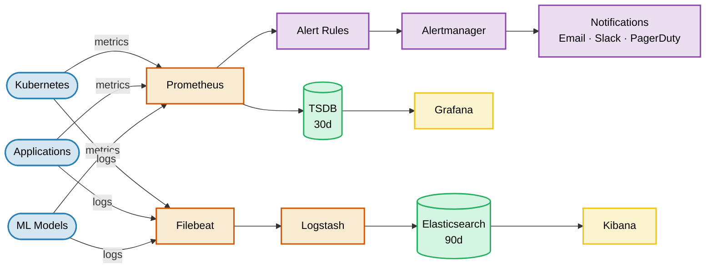
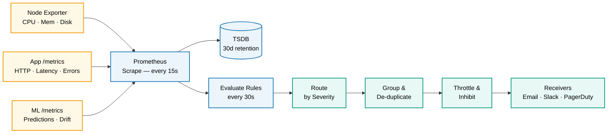

# 4.2: Architecture Deep Dive

This document details the system design, network topography, and technical integrations that power the end-to-end Monitoring & Alerting System. It covers how metrics collection (Prometheus), log aggregation (ELK Stack), visualization (Grafana), and alerting (Alertmanager) are organized into a unified, secure, and scalable observability platform.

---

## Table of Contents

1. [System Architecture](#system-architecture)
2. [Infrastructure Architecture](#infrastructure-architecture)
3. [Prometheus Architecture](#prometheus-architecture)
4. [Alerting Architecture](#alerting-architecture)
5. [Component Design](#component-design)
6. [Technology Decisions](#technology-decisions)
7. [Design Patterns](#design-patterns)
8. [Security Considerations](#security-considerations)
9. [Scalability Considerations](#scalability-considerations)

---

## System Architecture

This section gives you the full birds-eye view of the platform before diving into any details. It shows the two independent data pipelines — **metrics** (Prometheus → TSDB → Grafana) and **logs** (Filebeat → Logstash → Elasticsearch → Kibana) — and how alerting sits on top of the metrics pipeline. Read this first so every subsequent section has context.

### High-Level Overview



### Alertmanager Pipeline



---

## Infrastructure Architecture

This section describes how the monitoring stack is deployed at the container level using **Docker Compose**. It covers the service topology (which containers exist, which ports they expose, and how they communicate), as well as the persistent volumes used for long-term data storage.

### Docker Compose Architecture

```
┌─────────────────────────────────────────────────────────────────┐
│                     Monitoring Architecture                     │
└─────────────────────────────────────────────────────────────────┘

                    ┌────────────────────┐
                    │   Node Exporter    │
                    │    Port 9100       │
                    └─────────┬──────────┘
                              │ (metrics)
                              ▼
┌─────────────────┐   ┌───────────────────┐   ┌─────────────────┐
│   Prometheus    │   │   Alertmanager    │   │    Grafana      │
│   Port 9090     │──▶│   Port 9093       │   │   Port 3000     │
└────────┬────────┘   └───────────────────┘   └────────▲────────┘
         │                                             │
         └─────────────────────────────────────────────┘
                         (datasource)

┌─────────────────┐   ┌───────────────────┐   ┌─────────────────┐
│  Elasticsearch  │   │    Logstash       │   │    Kibana       │
│   Port 9200     │◀──│   Port 5044       │   │   Port 5601     │
└────────▲────────┘   └────────▲──────────┘   └────────▲────────┘
         │                     │                        │
         │            ┌────────┴──────────┐             │
         │            │     Filebeat      │─────────────┘
         │            │   (Log Shipper)   │  (log search)
         │            └───────────────────┘
         │
┌────────┴────────────────────────────────────────────────────────┐
│                      Persistent Volumes                         │
├─────────────────────────────────────────────────────────────────┤
│  - prometheus_data        (50GB)                                │
│  - grafana_data           (5GB)                                 │
│  - elasticsearch_data     (100GB)                               │
│  - alertmanager_data      (1GB)                                 │
└─────────────────────────────────────────────────────────────────┘
```

### Container Specifications

**Prometheus Container:**
```yaml
prometheus:
  image: prom/prometheus:v2.47.2
  container_name: prometheus
  restart: unless-stopped
  ports:
    - "9090:9090"
  volumes:
    - ./prometheus/prometheus.yml:/etc/prometheus/prometheus.yml:ro
    - ./prometheus/alerts.yml:/etc/prometheus/alerts.yml:ro
    - prometheus_data:/prometheus
  command:
    - '--config.file=/etc/prometheus/prometheus.yml'
    - '--storage.tsdb.path=/prometheus'
    - '--storage.tsdb.retention.time=30d'
    - '--storage.tsdb.retention.size=10GB'
    - '--web.enable-lifecycle'
  networks:
    - monitoring
```

**Grafana Container:**
```yaml
grafana:
  image: grafana/grafana:10.2.2
  container_name: grafana
  restart: unless-stopped
  ports:
    - "3000:3000"
  environment:
    - GF_SECURITY_ADMIN_USER=${GRAFANA_ADMIN_USER:-admin}
    - GF_SECURITY_ADMIN_PASSWORD=${GRAFANA_ADMIN_PASSWORD:-admin123}
    - GF_USERS_ALLOW_SIGN_UP=false
    - GF_INSTALL_PLUGINS=grafana-piechart-panel
  volumes:
    - grafana_data:/var/lib/grafana
    - ./grafana/datasources.yml:/etc/grafana/provisioning/datasources/datasources.yml:ro
    - ./grafana/dashboards:/var/lib/grafana/dashboards:ro
  networks:
    - monitoring
  depends_on:
    - prometheus
```

**Elasticsearch Container:**
```yaml
elasticsearch:
  image: docker.elastic.co/elasticsearch/elasticsearch:8.11.1
  container_name: elasticsearch
  restart: unless-stopped
  environment:
    - discovery.type=single-node
    - "ES_JAVA_OPTS=-Xms512m -Xmx512m"
    - xpack.security.enabled=false
  ports:
    - "9200:9200"
  volumes:
    - elasticsearch_data:/usr/share/elasticsearch/data
  networks:
    - monitoring
  healthcheck:
    test: ["CMD-SHELL", "curl -f http://localhost:9200/_cluster/health || exit 1"]
    interval: 30s
    timeout: 10s
    retries: 5
```

**Alertmanager Container:**
```yaml
alertmanager:
  image: prom/alertmanager:v0.26.0
  container_name: alertmanager
  restart: unless-stopped
  ports:
    - "9093:9093"
  volumes:
    - ./alertmanager/alertmanager.yml:/etc/alertmanager/alertmanager.yml:ro
    - alertmanager_data:/alertmanager
  command:
    - '--config.file=/etc/alertmanager/alertmanager.yml'
    - '--storage.path=/alertmanager'
    - '--web.external-url=http://localhost:9093'
  networks:
    - monitoring
```

---

## Prometheus Architecture

Now that you know the containers running (Infrastructure section), this section zooms into **how Prometheus works internally**. A single Prometheus server runs three concurrent processes: the Scrape Manager (pulls `/metrics` endpoints every 15s), the TSDB (stores time-series data for 30 days), and the Rule Evaluator (checks alert rules every 30s and forwards firing alerts to Alertmanager).

### Prometheus Component Stack

```
     ┌──────────────────────────────────────────────────────┐
     │                  Prometheus Server                   │
     │                    (Port 9090)                       │
     └──────────────────────┬───────────────────────────────┘
                            │
              ┌─────────────┼─────────────┐
              │             │             │
              ▼             ▼             ▼
     ┌────────────────┐ ┌────────────────┐ ┌────────────────┐
     │ Scrape Manager │ │ Rule Evaluator │ │      TSDB      │
     │ - Pull metrics │ │ - Alert rules  │ │ - Store        │
     │ - Every 15s    │ │ - Every 30s    │ │ - 30d ret.     │
     └───────┬────────┘ └───────┬────────┘ └───────┬────────┘
             │                  │                  │
             └──────────────────┼──────────────────┘
                                │
                                ▼
     ┌──────────────────────────────────────────────────────┐
     │                   Scrape Targets                     │
     │  - node-exporter:9100   (Infrastructure)             │
     │  - app:5000/metrics     (Application)                │
     │  - ml-api:8000/metrics  (ML Model)                   │
     └──────────────────────────┬───────────────────────────┘
                                │
                                ▼
     ┌──────────────────────────────────────────────────────┐
     │                   Alertmanager                       │
     │  - Route alerts by severity                          │
     │  - Group, throttle, inhibit                          │
     │  - Send to receivers                                 │
     └──────────────────────────────────────────────────────┘
```

### Prometheus Data Model

**Time Series Format:**
```
metric_name{label1="value1", label2="value2"}  timestamp  value

Example:
http_requests_total{method="GET", endpoint="/predict", status="200"} 1697635200  12345
```

**Metric Types:**

| Type | Description | Use Case | Query Function |
|------|-------------|----------|----------------|
| **Counter** | Monotonically increasing | Total requests, errors | `rate()`, `increase()` |
| **Gauge** | Can go up or down | CPU usage, memory, accuracy | Direct query, `avg()` |
| **Histogram** | Distribution of values | Request duration, latency | `histogram_quantile()` |
| **Summary** | Pre-calculated quantiles | (Deprecated, use Histogram) | Direct query |

### PromQL Query Examples

```promql
# Request rate (requests per second)
rate(http_requests_total[5m])

# P95 latency
histogram_quantile(0.95, rate(http_request_duration_seconds_bucket[5m]))

# Error rate (%)
rate(http_requests_total{status=~"5.."}[5m]) / rate(http_requests_total[5m]) * 100

# CPU usage (%)
100 - (avg(rate(node_cpu_seconds_total{mode="idle"}[5m])) * 100)

# Memory usage (%)
(1 - node_memory_MemAvailable_bytes / node_memory_MemTotal_bytes) * 100

# Model predictions per second
rate(model_predictions_total[5m])
```

---

## Alerting Architecture

When Prometheus's Rule Evaluator detects a threshold breach, it sends the alert to **Alertmanager** — a separate service responsible for turning raw alerts into useful notifications. This section covers how Alertmanager processes alerts through a pipeline of four steps: routing by severity, grouping related alerts, applying inhibition rules, and throttling before delivery to email, Slack, or PagerDuty.

### Alertmanager Components

```
┌──────────────────────────────────────────────────────────────┐
│                        Alertmanager                          │
└──────────────────────────────────────────────────────────────┘
                               │
         ┌─────────────────────┼─────────────────────┐
         │                     │                     │
         ▼                     ▼                     ▼
┌────────────────┐   ┌──────────────────┐   ┌────────────────┐
│  Routing Tree  │   │    Grouping      │   │  Throttling    │
│                │   │                  │   │                │
│  - critical    │   │  - By service    │   │  - Max 1/hr    │
│  - warning     │   │  - By instance   │   │  - Wait 10s    │
│  - info        │   │  - By alertname  │   │    for group   │
└───────┬────────┘   └────────┬─────────┘   └───────┬────────┘
        │                     │                     │
        └─────────────────────┼─────────────────────┘
                              │
                              ▼
              ┌───────────────────────────────┐
              │        Inhibition Rules       │
              │                               │
              │  - Critical inhibits Warning  │
              │  - Matched by service +       │
              │    instance labels            │
              └───────────────┬───────────────┘
                              │
                              ▼
┌──────────────────────────────────────────────────────────────┐
│                         Receivers                            │
├──────────────────────────────────────────────────────────────┤
│                                                              │
│   ┌────────────┐    ┌────────────┐    ┌──────────────────┐   │
│   │   Email    │    │   Slack    │    │    PagerDuty     │   │
│   └────────────┘    └────────────┘    └──────────────────┘   │
│                                                              │
│   critical  →  PagerDuty + Slack                             │
│   warning   →  Slack + Email                                 │
│   info      →  Email only                                    │
└──────────────────────────────────────────────────────────────┘
```

### Alert Routing Flow

```
                    Alert fires in Prometheus
                              │
                              ▼
                    Alertmanager receives alert
                              │
                              ▼
                    Evaluate routing tree
                              │
               ┌──────────────┼──────────────┐
               │              │              │
               ▼              ▼              ▼
       severity=critical  severity=warning  severity=info
       PagerDuty + Slack  Slack + Email     Email only
               │              │              │
               └──────────────┼──────────────┘
                              │
                              ▼
                    Group related alerts
                         (wait 10s)
                              │
                              ▼
                    Apply inhibition rules
                              │
                              ▼
            Throttle (max 1 notification/hour per group)
                              │
                              ▼
                    Send to receivers
```

### Alertmanager Configuration

```yaml
# alertmanager/alertmanager.yml
route:
  receiver: default
  group_by: ['alertname', 'service', 'instance']
  group_wait: 10s
  group_interval: 10m
  repeat_interval: 1h

routes:
  - match:
      severity: critical
    receivers: [pagerduty, slack]
  - match:
      severity: warning
    receivers: [slack, email]
  - match:
      severity: info
    receivers: [email]

receivers:
  - name: email
    email_configs:
      - to: alerts@yourteam.com
  - name: slack
    slack_configs:
      - api_url: '${SLACK_WEBHOOK_URL}'
        channel: '#alerts'
  - name: pagerduty
    pagerduty_configs:
      - service_key: '${PAGERDUTY_SERVICE_KEY}'

inhibit_rules:
  - source_match: { severity: critical }
    target_match: { severity: warning }
    equal: ['service', 'instance']
```

---

## Component Design

With the full infrastructure and tool internals understood, this section focuses on **how your application code integrates with the monitoring stack**. It covers the five key software components: the instrumentation layer that exposes a `/metrics` endpoint for Prometheus to scrape, the ML-specific metrics tracker, the data drift detector, the alert rule definition model, and the log processing pipeline that feeds into Elasticsearch.

### 1. Application Instrumentation Component

**Purpose:** Expose application and ML metrics in Prometheus format

**Class Diagram:**
```python
class MetricsInstrumentation:
    """
    Handles Prometheus metrics instrumentation for applications.

    Responsibilities:
    - Define and expose HTTP request metrics
    - Track request latency with histograms
    - Monitor active connections
    - Expose /metrics endpoint
    """

    def __init__(self, app_name: str)
    def init_http_metrics(self) -> None
    def record_request(self, method: str, endpoint: str, status: int, duration: float) -> None
    def set_active_connections(self, count: int) -> None
    def expose_metrics(self) -> str
```

**Input/Output:**
- **Input:** HTTP request data (method, endpoint, status, duration)
- **Output:** Prometheus-formatted metrics on `/metrics` endpoint
- **Side Effects:** Updates internal counters and histograms

**Error Handling:**
- Metric recording failures: Log warning, continue (never break application)
- Invalid labels: Use default values and log

---

### 2. Custom ML Metrics Component

**Purpose:** Track ML-specific metrics for model performance and health

**Class Diagram:**
```python
class MLMetrics:
    """
    Tracks ML model performance and health metrics.

    Responsibilities:
    - Count predictions by model and class
    - Track inference latency distributions
    - Monitor model accuracy over time
    - Calculate and expose data drift scores
    - Track prediction confidence distributions
    """

    def __init__(self, model_name: str, model_version: str)
    def record_prediction(self, prediction_class: str, confidence: float, inference_time: float) -> None
    def update_accuracy(self, accuracy: float) -> None
    def update_drift_score(self, feature: str, score: float) -> None
    def record_missing_feature(self, feature: str) -> None
    def get_metrics(self) -> Dict[str, float]
```

**Metrics Exposed:**
```python
# Counter: Total predictions
model_predictions_total{model="resnet50", prediction_class="cat"} 12345

# Histogram: Inference duration
model_inference_duration_seconds_bucket{model="resnet50", le="0.1"} 9500

# Gauge: Model accuracy
model_accuracy{model="resnet50"} 0.92

# Gauge: Data drift score
data_drift_score{feature="age"} 0.23

# Histogram: Prediction confidence
model_prediction_confidence_bucket{model="resnet50", le="0.9"} 8500
```

---

### 3. Data Drift Detection Component

**Purpose:** Detect distribution shifts in input data

**Class Diagram:**
```python
class DriftDetector:
    """
    Detects data drift using statistical tests.

    Responsibilities:
    - Compare incoming data to training distribution
    - Calculate drift score per feature
    - Alert when drift exceeds threshold
    - Store historical drift scores
    """

    def __init__(self, reference_data: pd.DataFrame, threshold: float = 0.5)
    def calculate_drift(self, current_data: pd.DataFrame) -> Dict[str, float]
    def get_drift_score(self, feature: str) -> float
    def is_drift_detected(self) -> bool
    def get_drift_report(self) -> Dict[str, Any]
```

**Detection Methods:**
1. **Kolmogorov-Smirnov test** - Compares cumulative distributions
2. **Population Stability Index (PSI)** - Measures distribution stability
3. **Statistical distance metrics** - Wasserstein, KL divergence

**Pipeline Integration:**
- Runs every 100 prediction requests
- Drift scores exported to Prometheus as gauges
- Alerts fire when drift score > 0.5 for 5 minutes

---

### 4. Alert Rule Evaluator

**Purpose:** Evaluate alert rules and trigger notifications

**Class Diagram:**
```python
class AlertRule:
    """
    Represents a Prometheus alert rule.

    Responsibilities:
    - Define alert condition (PromQL expression)
    - Set duration threshold
    - Attach severity and annotations
    - Link to runbook
    """

    name: str
    expression: str        # PromQL query
    duration: str           # e.g., "5m"
    severity: str           # critical, warning, info
    summary: str
    description: str
    runbook_url: str
```

**Alert Rule Example:**
```yaml
# High Error Rate Alert
- alert: HighErrorRate
  expr: |
    rate(http_requests_total{status=~"5.."}[5m])
    / rate(http_requests_total[5m]) > 0.05
  for: 5m
  labels:
    severity: critical
  annotations:
    summary: "High error rate detected"
    description: "Error rate is {{ $value | humanizePercentage }} (threshold: 5%)"
    runbook_url: "https://runbooks/high-error-rate"
```

---

### 5. Log Processing Component

**Purpose:** Parse, enrich, and forward logs to Elasticsearch

**Class Diagram:**
```python
class LogProcessor:
    """
    Processes logs through Logstash pipeline.

    Responsibilities:
    - Parse JSON log entries
    - Extract structured fields
    - Enrich with metadata
    - Filter sensitive data
    - Forward to Elasticsearch
    """

    def parse_json_log(self, raw_log: str) -> Dict
    def enrich_log(self, log_entry: Dict) -> Dict
    def filter_sensitive(self, log_entry: Dict) -> Dict
    def forward_to_es(self, log_entry: Dict) -> bool
```

**Logstash Pipeline Configuration:**
```ruby
input {
  beats { port => 5044 }
}

filter {
  json { source => "message" }
  date { match => ["timestamp", "ISO8601"] }
  mutate { add_field => { "environment" => "production" } }
}

output {
  elasticsearch {
    hosts => ["http://elasticsearch:9200"]
    index => "logs-%{+YYYY.MM.dd}"
  }
}
```

---

## Technology Decisions

Having seen all four tools in action across the previous sections, this section documents the **rationale behind choosing each one**. For every tool — Prometheus, Grafana, ELK Stack, and Alertmanager — it lists the pros, cons, and alternatives that were evaluated. This is useful context for understanding the trade-offs and for revisiting decisions as the system scales.

### Why Prometheus?

**Pros:**
✅ Industry standard for metrics collection (CNCF graduated project)
✅ Pull-based model (simpler than push, better for network control)
✅ Powerful query language (PromQL)
✅ Built-in alerting with Alertmanager
✅ Multi-dimensional data model with labels
✅ Active community and ecosystem

**Cons:**
❌ Local storage only (no built-in long-term storage)
❌ No built-in authentication (needs reverse proxy)
❌ Can be resource-intensive at scale
❌ Cardinality explosion risk with high-cardinality labels

**Alternatives Considered:**
- **InfluxDB**: Simpler, but less ecosystem support
- **Datadog**: Commercial SaaS, excellent but not open-source
- **Nagios**: Legacy, not time-series focused
- **Zabbix**: More infrastructure-focused, less cloud-native

**Decision:** Prometheus chosen for industry relevance, open-source nature, and CN ecosystem.

---

### Why Grafana?

**Pros:**
✅ Most popular open-source visualization platform (60K+ stars)
✅ Supports multiple datasources (Prometheus, ES, Loki, etc.)
✅ Rich panel ecosystem (graphs, gauges, heatmaps, tables)
✅ Dashboard provisioning (Infrastructure as Code)
✅ Alerting integration (unified alerting)
✅ Active community and plugin ecosystem

**Cons:**
❌ No built-in log storage (needs external datasource)
❌ Dashboard JSON can be complex
❌ Performance with very large datasets

**Alternatives Considered:**
- **Kibana**: Good for logs, weaker for metrics visualization
- **Datadog Dashboards**: Commercial, excellent but not free
- **Apache Superset**: More BI-focused, less ops-oriented

**Decision:** Grafana chosen for multi-datasource support and industry adoption.

---

### Why ELK Stack?

**Pros:**
✅ De facto standard for log aggregation at scale
✅ Powerful full-text search (Elasticsearch)
✅ Flexible log processing pipeline (Logstash)
✅ Rich visualization (Kibana)
✅ Scalable to petabytes of data
✅ Large ecosystem and community

**Cons:**
❌ Resource-intensive (Elasticsearch JVM)
❌ Complex to operate at scale
❌ Index management overhead
❌ Cost of Elastic license for advanced features

**Alternatives Considered:**
- **Loki + Promtail**: Lighter, integrates with Grafana, but less powerful search
- **Fluentd/Fluent Bit**: Log shipper only, no storage
- **Splunk**: Commercial, excellent but expensive
- **CloudWatch Logs**: AWS-only, less flexible

**Decision:** ELK chosen for full-featured log search and industry standard.

---

### Why Alertmanager?

**Pros:**
✅ Native integration with Prometheus
✅ Powerful routing tree with severity-based rules
✅ Grouping, inhibition, and throttling built-in
✅ Supports multiple receivers (email, Slack, PagerDuty, webhook)
✅ Open source and actively maintained

**Cons:**
❌ Configuration is YAML-based (no UI for routing)
❌ Limited templating capabilities
❌ No built-in escalation policies

**Alternatives Considered:**
- **Grafana Alerting**: Newer, less mature for complex routing
- **PagerDuty Rulesets**: Commercial, excellent but not free
- **Opsgenie**: Commercial, good but not open-source

**Decision:** Alertmanager chosen for native Prometheus integration and open-source nature.

---

## Design Patterns

This section documents the **software engineering patterns** applied in the codebase. These patterns are not specific to monitoring — they are general OOP principles that happen to map cleanly onto this system's needs. Understanding them helps when extending the system (e.g., adding a new notification channel or a new metric type) without breaking existing behaviour.

### 1. Strategy Pattern
Allow different alert notification strategies.

```python
class NotificationStrategy(ABC):
    @abstractmethod
    def send(self, alert: Alert) -> bool:
        pass

class EmailNotification(NotificationStrategy):
    def send(self, alert: Alert) -> bool:
        # Send email notification
        pass

class SlackNotification(NotificationStrategy):
    def send(self, alert: Alert) -> bool:
        # Send Slack notification
        pass

class PagerDutyNotification(NotificationStrategy):
    def send(self, alert: Alert) -> bool:
        # Trigger PagerDuty incident
        pass
```

### 2. Observer Pattern
Metrics collection as observer of application events.

```python
class MetricsObserver(ABC):
    @abstractmethod
    def on_request_completed(self, method: str, endpoint: str, status: int, duration: float) -> None:
        pass

class PrometheusObserver(MetricsObserver):
    def on_request_completed(self, method: str, endpoint: str, status: int, duration: float) -> None:
        http_requests_total.labels(method=method, endpoint=endpoint, status=status).inc()
        http_request_duration_seconds.labels(method=method, endpoint=endpoint).observe(duration)
```

### 3. Factory Pattern
Create metric instruments based on configuration.

```python
class MetricFactory:
    @staticmethod
    def create_counter(name: str, description: str, labels: List[str]) -> Counter:
        return Counter(name, description, labels)

    @staticmethod
    def create_histogram(name: str, description: str, labels: List[str], buckets: List[float]) -> Histogram:
        return Histogram(name, description, labels, buckets=buckets)

    @staticmethod
    def create_gauge(name: str, description: str, labels: List[str]) -> Gauge:
        return Gauge(name, description, labels)
```

### 4. Chain of Responsibility Pattern
Log processing pipeline (Filebeat → Logstash → Elasticsearch).

```python
class LogHandler(ABC):
    @abstractmethod
    def handle(self, log_entry: Dict) -> Dict:
        pass

class FilebeatHandler(LogHandler):
    def handle(self, log_entry: Dict) -> Dict:
        # Add metadata
        log_entry["hostname"] = socket.gethostname()
        return log_entry

class LogstashHandler(LogHandler):
    def handle(self, log_entry: Dict) -> Dict:
        # Parse and enrich
        log_entry["timestamp"] = datetime.now().isoformat()
        return log_entry
```

---

## Security Considerations

The monitoring stack handles sensitive operational data — infrastructure metrics, application logs, and alert routing credentials. This section covers the key security controls applied across the four dimensions: **authentication & authorisation** for each service, **network isolation** via Docker networking, **data privacy** practices for logs, and **secrets management** to avoid leaking credentials.

### 1. Authentication & Authorization
- Grafana: Username/password authentication, OAuth2/SAML (optional), RBAC (Admin/Editor/Viewer)
- Prometheus: No built-in auth (use nginx/Traefik reverse proxy with basic auth)
- Elasticsearch/Kibana: X-Pack security (username/password), API keys, RBAC with roles
- Alertmanager: No built-in auth (use reverse proxy)

### 2. Network Security
- All components in private Docker network (`monitoring`)
- Only expose necessary ports (Grafana 3000, Kibana 5601)
- Use TLS for all external connections
- Firewall rules restrict access to monitoring UIs
- VPN access for remote monitoring

### 3. Data Privacy
- No PII in metrics (metrics are aggregate, not individual records)
- Filter sensitive data in Logstash before indexing
- For real projects: encrypt data at rest and in transit
- Implement access controls on Elasticsearch indices

### 4. Secrets Management
- Store credentials in environment variables (`.env` files)
- Never commit secrets to Git
- Use `.env` files (gitignored)
- Consider HashiCorp Vault for production
- Alertmanager webhook URLs and API keys in environment variables

---

## Scalability Considerations

The current setup is a **single-machine Docker Compose deployment** — intentionally simple for a learning project. This section is honest about where those limits are (single Prometheus instance, single-node Elasticsearch, no HA for Alertmanager) and documents the concrete upgrade paths for each component when moving towards a production-grade, distributed deployment.

### Current Limitations
- Single-machine deployment via Docker Compose
- No horizontal scaling for Prometheus (single instance)
- Single-node Elasticsearch cluster
- No high availability for Alertmanager
- Limited to local infrastructure monitoring

### Scaling Strategies (Future)

**Prometheus Scaling:**
- Vertical scaling (more CPU/RAM)
- Federation (hierarchical Prometheus instances)
- Remote write to Thanos/Cortex for long-term storage
- Sharding (split scrape targets across instances)

**Elasticsearch Scaling:**
- Add nodes (scale horizontally to 3, 5, 7 nodes)
- Hot-warm-cold architecture (tier storage by age)
- Index Lifecycle Management (ILM) for auto-management
- Shard tuning (optimize shard size: 20-50GB per shard)

**Grafana Scaling:**
- Database backend (PostgreSQL instead of SQLite)
- Query caching
- Load balancing (multiple Grafana instances)
- CDN for static assets

**Alerting Scaling:**
- Multiple Alertmanager instances (HA mode)
- Alert deduplication across instances
- Hierarchical routing for large organizations

**Future Enhancements:**
- Distributed tracing (Jaeger, Tempo)
- AIOps integration (anomaly detection, automated root cause analysis)
- Predictive alerting
- Automated remediation for common issues
- Cost monitoring and optimization