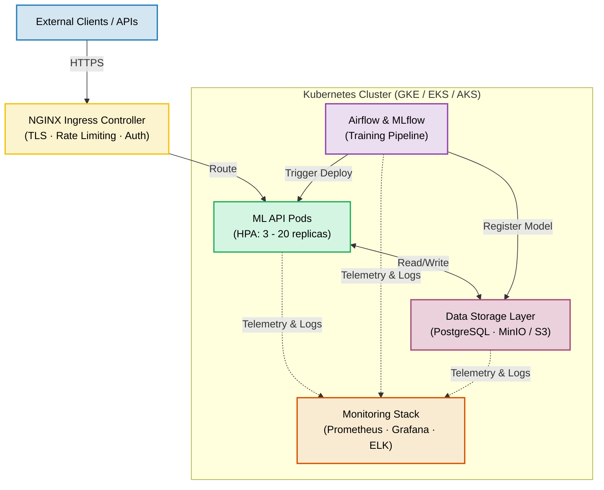

# 5.0: Production-Ready ML System (Capstone)

## Overview

Welcome to the Capstone Project! This is where your hard work comes together. Instead of building isolated components, you will now integrate your model servers, orchestration configurations, pipelines, and telemetry systems into a single, cohesive, production-grade ML platform.

This project is designed to mirror real-world platform engineering: establishing secure pipelines, configuring automated failovers, securing communications, and building robust delivery cycles. 

### What You've Built So Far

Your journey through the previous projects has set up all the necessary building blocks:
* **Project 1 (Model API)**: Exposed core predictive models using Flask/FastAPI.
* **Project 2 (Kubernetes Serving)**: Orchestrated deployment container runtimes at scale.
* **Project 3 (Pipeline Tracking)**: Scheduled reproducible training workflows using MLflow and Airflow.
* **Project 4 (Observability Stack)**: Collected performance metrics and structured logs with Prometheus, Grafana, and ELK.

### What You're Building Now

You are constructing a **fully integrated production ecosystem**. The capstone tasks you with tying these pieces together under production specifications:

* **Cohesive Architecture**: Connecting ingestion nodes, model containers, model registries, databases, and visualization interfaces into a unified workflow.
* **GitOps & Automation**: Driving infrastructure provisioning and system updates through automated CI/CD runs.
* **Hardened Security**: Restricting communications with TLS/HTTPS, configuring secure API keys, and managing credentials dynamically.
* **High Availability**: Implementing auto-scaling rules, zero-downtime rolling updates, and complete recovery runbooks.
* **Closed-Loop Lifecycles**: Moving automatically from data intake to scheduled model testing and deployment.
* **Platform-Wide Observability**: Consolidating performance metrics, structured events, and error notifications across all active namespaces.

Think of this capstone as the centerpiece of your portfolio—a complete demonstration that you are ready to design, secure, and operate production-scale AI infrastructure.


---

## System Architecture

### High-Level Architecture



### CI/CD Pipeline Flow

```
Developer Push → GitHub → CI Pipeline → CD Pipeline → Production

CI Steps:
1. Code Quality (linting, formatting, type checking)
2. Security Scanning (bandit, Trivy)
3. Testing (unit, integration, API tests)
4. Docker Build & Push
5. Image Vulnerability Scanning

CD Steps (Staging - Automatic):
1. Deploy to Staging with Helm
2. Run Smoke Tests
3. Run Integration Tests
4. Run Load Tests

CD Steps (Production - Manual Approval):
1. Manual Approval Gate
2. Canary Deployment (10% traffic)
3. Monitor Metrics for 10 minutes
4. Promote to Full Deployment or Rollback
5. Run Production Smoke Tests
6. Send Notifications
```

---

## Project Structure

```
project-05-production-ml-capstone/
├── README.md                        # This file
├── requirements.md                  # Detailed requirements
├── architecture.md                  # Architecture documentation
├── src/
│   └── main.py                      # Integrated application (STUB)
├── cicd/
│   └── .github/
│       └── workflows/
│           ├── ci.yml               # CI pipeline (STUB)
│           └── cd.yml               # CD pipeline (STUB)
├── kubernetes/
│   ├── base/
│   │   └── kustomization.yaml       # Kustomize base config
│   └── overlays/
│       ├── dev/
│       │   └── kustomization.yaml   # Dev environment overlay
│       ├── staging/
│       │   └── kustomization.yaml   # Staging environment overlay
│       └── production/
│           └── kustomization.yaml   # Production environment overlay
├── security/
│   ├── cert-manager.yaml            # TLS certificate configuration (STUB)
├── monitoring/
│   └── slos.yaml                    # Service Level Objectives
├── tests/
│   └── integration/
│       └── test_e2e.py              # End-to-end tests (STUB)
├── 5.0-README.md                    # This file
├── 5.1-requirements.md              # Detailed requirements
├── 5.2-architecture.md              # Architecture deep dive
├── 5.3-how-to-execute-and-deploy.md # Step-by-step deployment & recovery guide
└── .env.example                     # Multi-environment configuration
```

---

## Requirements & Architecture

For the complete list of functional, non-functional, and technical requirements, please see the dedicated [5.1-requirements.md](5.1-requirements.md) file. Detailed system designs, container specifications, and network layouts are documented in the [5.2-architecture.md](5.2-architecture.md) file.

---

## Getting Started

### Prerequisites

Before starting this project, ensure you have completed:

- **Project 1**: Model Serving API
- **Project 2**: Kubernetes Deployment
- **Project 3**: ML Training Pipeline
- **Project 4**: Monitoring and Observability

And have access to:

- Kubernetes cluster (Minikube, kind, GKE, EKS, or AKS)
- Container registry (Docker Hub, GCR, ECR)
- GitHub account (for CI/CD)
- Domain name (optional, for production deployment)

### Installation

1. **Review this README and all documentation files thoroughly**
2. **Read [5.1-requirements.md](5.1-requirements.md)** to understand all functional and non-functional requirements
3. **Study [5.2-architecture.md](5.2-architecture.md)** to understand the system design
4. **Review code stubs** to understand what needs to be implemented
5. **Read [5.3-how-to-execute-and-deploy.md](5.3-how-to-execute-and-deploy.md)** for step-by-step deployment and recovery instructions
6. **Set up your environment** using `.env.example` as a template
---

## Key Challenges

This project will test your ability to:

1. **Integrate complex systems** - Making 4 separate projects work together seamlessly
2. **Manage configuration** - Handling multiple environments (dev, staging, production)
3. **Ensure reliability** - Achieving 99.9% uptime with auto-healing
4. **Implement security** - Production-grade security without breaking usability
5. **Automate everything** - CI/CD, ML lifecycle, monitoring, backups
6. **Document thoroughly** - Creating documentation others can actually use
7. **Think operationally** - Preparing for failures, not just success


---

## Learning Resources

### Required Reading

1. **[12-Factor App Methodology](https://12factor.net/)** - Production app best practices
2. **[Google SRE Book](https://sre.google/sre-book/table-of-contents/)** - Site Reliability Engineering principles
3. **[Kubernetes Production Best Practices](https://learnk8s.io/production-best-practices)** - K8s production checklist
4. **[MLOps: Continuous Delivery](https://cloud.google.com/architecture/mlops-continuous-delivery-and-automation-pipelines-in-machine-learning)** - ML deployment patterns

### Recommended Tools Documentation

- [GitHub Actions](https://docs.github.com/en/actions)
- [Helm Best Practices](https://helm.sh/docs/chart_best_practices/)
- [Kustomize Documentation](https://kustomize.io/)
- [cert-manager](https://cert-manager.io/docs/)
- [HashiCorp Vault](https://developer.hashicorp.com/vault/docs)

### Example Projects

- [Kubeflow](https://github.com/kubeflow/kubeflow) - ML platform on Kubernetes
- [Seldon Core](https://github.com/SeldonIO/seldon-core) - ML deployment platform
- [MLflow Examples](https://github.com/mlflow/mlflow/tree/master/examples)

---

## Support

### Getting Help

- **Documentation**: Read the dedicated [5.1-requirements.md](5.1-requirements.md), [5.2-architecture.md](5.2-architecture.md), and [5.3-how-to-execute-and-deploy.md](5.3-how-to-execute-and-deploy.md) guides
- **Code Comments**: Review TODOs and comments in code stubs
- **Previous Projects**: Reference your implementations from Projects 1-4
- **Community**: MLOps community, Kubernetes forums, Stack Overflow

---

## Execution & Deployment

For step-by-step instructions on starting the local cluster, provisioning staging and production workloads, verifying deployments, and testing recovery procedures, please refer to the dedicated [5.3-how-to-execute-and-deploy.md](5.3-how-to-execute-and-deploy.md) guide.

---

## Acknowledgments

This capstone project integrates concepts from:
- Projects 1-4 of the Junior AI Infrastructure Engineer curriculum
- Industry best practices from Google SRE, CNCF, and MLOps community
- Real-world production ML systems at scale

