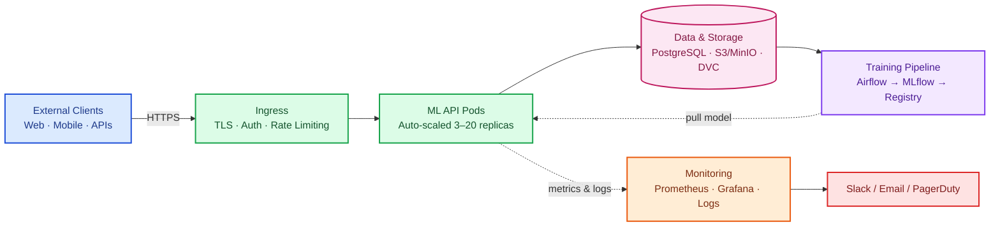
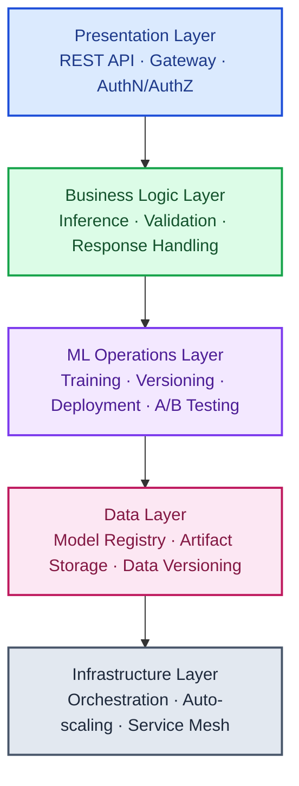
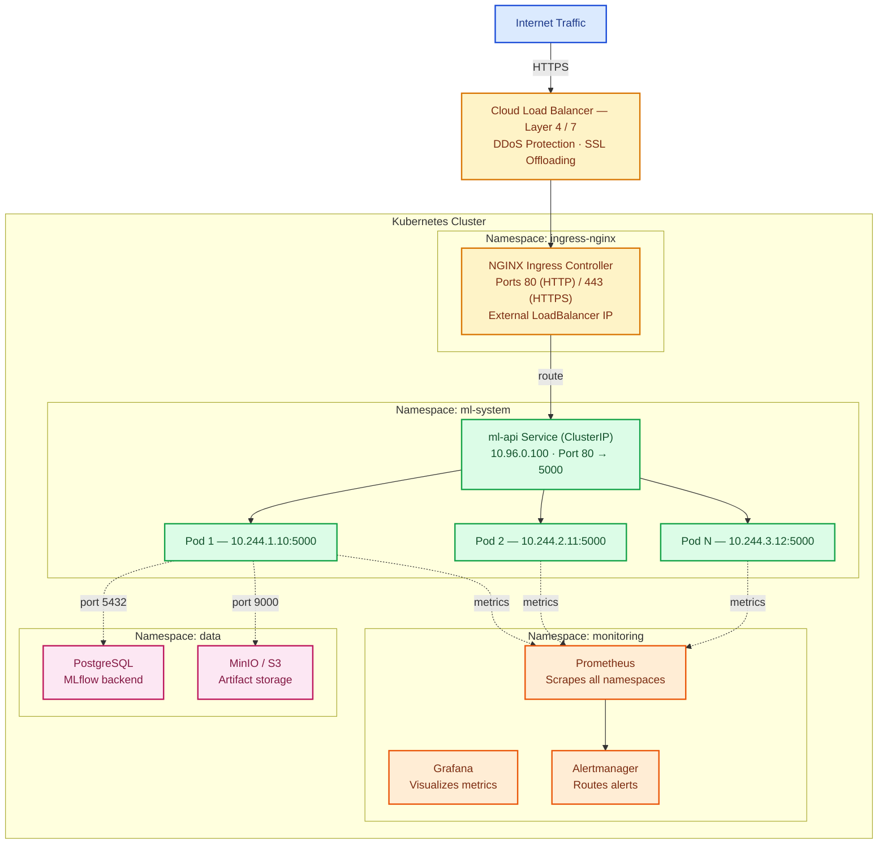
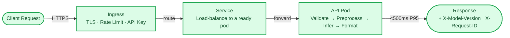
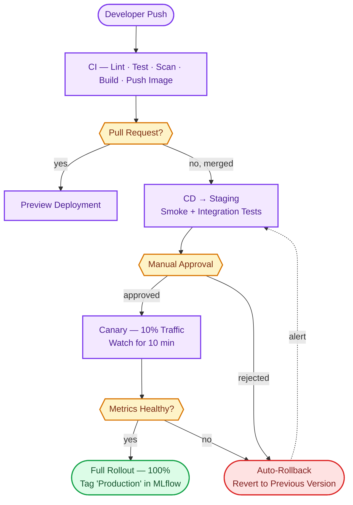

# 5.2: Architecture Documentation

> **How to use this document:** This is both a reference blueprint and a set of guided exercises. Each component includes a short explanation of *why* it exists in a production ML system, followed by implementation notes marked `TODO` — those are yours to build. Treat the surrounding prose as the "why," and the TODOs as the "what you do next."

## Table of Contents

1. [Executive Summary](#executive-summary)
2. [System Overview](#system-overview)
3. [Architecture Diagrams](#architecture-diagrams)
4. [Component Details](#component-details)
5. [Data Flow](#data-flow)
6. [Deployment Architecture](#deployment-architecture)
7. [Security Architecture](#security-architecture)
8. [Scalability & Performance](#scalability--performance)
9. [Disaster Recovery](#disaster-recovery)
10. [Technology Decisions](#technology-decisions)

---

## Executive Summary

This document describes the architecture of a production-ready ML system that ties together model serving, orchestration, ML pipelines, and observability into a single platform. It's the culmination of everything built in Projects 1–4 of this curriculum: the Flask/FastAPI serving layer, the Kubernetes orchestration, the Airflow/MLflow training pipeline, and the Prometheus/Grafana observability stack now become one integrated system rather than four separate exercises.

The target system is capable of:

- Serving 1,000+ predictions per second
- Maintaining 99.9% uptime
- Automatically training and deploying models on a schedule (and on-demand)
- Scaling from 3 to 20 replicas based on real-time demand
- Providing complete observability — metrics, logs, and alerts — across every component

### Key Architectural Principles

These six principles show up repeatedly throughout the document. When you're unsure how to design a component, come back to this list — it should resolve most ambiguity.

1. **Cloud-Native** — Kubernetes-based, containerized, horizontally scalable. Nothing assumes a single fixed machine.
2. **GitOps** — Infrastructure and configuration live as code in Git, not as manual changes made by hand against a live cluster.
3. **Security by Default** — Authentication, encryption, and least-privilege access are the starting point, not something bolted on later.
4. **Observability First** — Every component emits metrics, logs, and (ideally) traces. If you can't see it, you can't operate it.
5. **Automation** — CI/CD, the ML training lifecycle, scaling, and recovery all happen without a human clicking buttons.
6. **Resilience** — The system tolerates failure: pods crash, nodes die, and the system keeps serving traffic anyway.

---

## System Overview

### High-Level Architecture

Read this diagram top-to-bottom: solid arrows show the request/data path a prediction takes; dashed arrows show observability signals (metrics and logs) flowing to the monitoring stack in the background.



### Component Summary

| Layer | Components | Purpose |
|-------|------------|---------|
| **Ingress** | NGINX Ingress, cert-manager | TLS termination, routing, rate limiting |
| **Application** | Flask/FastAPI API, model serving | Serve predictions to clients |
| **ML Pipeline** | Airflow, MLflow, DVC | Train, version, and deploy models |
| **Monitoring** | Prometheus, Grafana, ELK | Observe system health and performance |
| **Data** | PostgreSQL, S3/MinIO | Store metadata, models, and datasets |
| **Security** | RBAC, Secrets, NetworkPolicies | Protect the system and its data |

---

## Architecture Diagrams

### Logical Architecture

This view strips away the infrastructure and shows the system as five stacked responsibilities. Each layer only talks to the one below it — the presentation layer never touches storage directly, for example. That separation is what lets you swap out a piece (say, replace MLflow with a different registry) without rewriting everything above it.



### Network Architecture

This view is about namespaces and IP-level connectivity — useful when you're debugging "why can't pod A reach pod B" or writing NetworkPolicies later.



---

## Component Details

### 1. ML API Service (Project 1 Integration)

**Why it matters:** This is the only part of the system your end users ever touch. Everything else — pipelines, storage, monitoring — exists to keep this one service fast, correct, and always available.

**Purpose:** Serve ML model predictions via a REST API.

**Technology Stack:**
- Flask or FastAPI
- PyTorch or TensorFlow
- Gunicorn (production WSGI server)
- Prometheus client library

**Key Features:**
- RESTful endpoints (`/predict`, `/health`, `/metrics`)
- Model loading from the MLflow registry
- Request validation and preprocessing
- Response formatting
- Error handling and logging
- Metrics instrumentation

**Deployment:**
- Containerized with Docker
- Deployed as a Kubernetes Deployment
- 3–20 replicas (via HPA)
- Resource limits: CPU 1000m, Memory 2Gi
- Health checks: liveness and readiness probes

**Configuration:**
- Model version supplied via ConfigMap
- API keys supplied via Secrets
- MLflow URI supplied via environment variables

**Implementation notes** — build these in order; each one depends on the last:
```python
# 1. Load the model from the MLflow registry at startup (not per-request —
#    loading on every call is the single most common cause of slow inference).
# 2. Validate incoming requests before they reach the model (reject bad
#    input early and cheaply, rather than letting the model choke on it).
# 3. Implement the prediction endpoint itself.
# 4. Instrument it with Prometheus metrics (latency, request count, errors) —
#    do this before you need to debug a production incident, not after.
# 5. Wire up liveness/readiness probes so Kubernetes knows when a pod is
#    actually able to serve traffic.
```

---

### 2. Kubernetes Orchestration (Project 2 Integration)

**Why it matters:** A single Flask process can serve maybe a few dozen requests per second before it falls over. Kubernetes is what turns "one process" into "a fleet of processes that scales, heals, and updates itself without downtime."

**Purpose:** Orchestrate, scale, and manage the containerized application.

**Components:**
- **Deployment** — manages API pods and ensures the desired number are always running
- **Service** — load-balances traffic across pods (ClusterIP)
- **Ingress** — external access with TLS termination
- **HPA** — auto-scales based on CPU/memory
- **ConfigMap** — stores non-sensitive configuration
- **Secret** — stores sensitive data

**Deployment Strategy:**
- Rolling update (`maxSurge: 1`, `maxUnavailable: 0`) — a new pod comes up before an old one goes down, so capacity never drops
- Zero-downtime deployments
- Automatic rollback if health checks fail after a rollout

**Auto-Scaling — implementation notes:**
```yaml
# Configure the HPA with:
#   minReplicas: 3       # floor — never scale below this even at zero traffic
#   maxReplicas: 20       # ceiling — protects against runaway cost/scaling
#   targetCPUUtilization: 70%
#   targetMemoryUtilization: 80%
# Why a floor of 3, not 1: with only 1 replica, a single pod restart means
# a full outage. 3 replicas means you can lose one to a node failure and
# still have 2 serving traffic.
```

**High Availability:**
- Pod anti-affinity — spread replicas across different nodes, so one node failure can't take out the whole service
- Node affinity — prefer GPU-equipped nodes if the model needs them
- Pod disruption budget — guarantee at least 2 pods stay available during voluntary disruptions (like node maintenance)

---

### 3. ML Pipeline (Project 3 Integration)

**Why it matters:** Models go stale. Data drifts, user behavior changes, and a model trained six months ago is quietly getting worse in production right now. This pipeline is what keeps the model current — automatically, on a schedule, without someone manually retraining and redeploying by hand.

**Purpose:** Automate model training, evaluation, and deployment.

#### Airflow DAG: `ml_training_pipeline`

**Schedule:** Weekly (every Sunday at 2 AM UTC), or triggered manually / on detected drift.

**Tasks, in order:**
1. **data_ingestion** — fetch the latest data from source
2. **data_validation** — run Great Expectations checks
3. **data_preprocessing** — clean and transform the data
4. **feature_engineering** — extract features
5. **model_training** — train with hyperparameter tuning
6. **model_evaluation** — evaluate on a held-out test set
7. **model_registration** — register in MLflow if performance clears the threshold
8. **deploy_to_staging** — deploy to the staging environment
9. **notify_team** — send a Slack notification

**Data Flow:**
```
Data Source → DVC → Validation → Preprocessing → Training
    ↓
MLflow Experiment → Model Registry → Deployment
```

**Model Versioning** — three things get tracked together so any production model is fully reproducible:
- Model itself, versioned in MLflow
- Git SHA of the training code, tagged for reproducibility
- Dataset version, tracked with DVC
- Hyperparameters, logged alongside the run

**Deployment automation — implementation notes:**
```python
# 1. When a model is promoted to "Production" in the MLflow registry,
#    update the ConfigMap that the API pods read their model version from.
# 2. Trigger a rolling restart of the API pods so they pick up the new
#    ConfigMap value (Kubernetes won't restart pods automatically just
#    because a ConfigMap changed).
# 3. Watch the rollout and confirm the new pods pass their health checks.
# 4. If they don't, this is where an automatic rollback should kick in —
#    see the canary strategy under Data Flow below.
```

---

### 4. Monitoring & Observability (Project 4 Integration)

**Why it matters:** Everything above this line will eventually fail in some way — a pod will crash, latency will spike, a model will start returning garbage. Observability is how you find out *before* a user files a support ticket about it.

**Purpose:** Provide visibility into system health and performance.

#### Prometheus (Metrics)

| Metric | Type | Description |
|--------|------|-------------|
| `http_requests_total` | Counter | Total HTTP requests |
| `http_request_duration_seconds` | Histogram | Request latency |
| `http_request_errors_total` | Counter | Failed requests |
| `model_prediction_duration_seconds` | Histogram | Inference latency |
| `model_predictions_total` | Counter | Total predictions |
| `model_version` | Gauge | Current model version |
| `pod_cpu_usage` | Gauge | CPU usage per pod |
| `pod_memory_usage` | Gauge | Memory usage per pod |

**Scrape configuration — implementation notes:**
```yaml
# 1. Point Prometheus at the ml-api pods' /metrics endpoint.
# 2. Set up a ServiceMonitor so new pods are discovered automatically as
#    the HPA scales — don't hardcode a pod list, it will go stale.
# 3. Set retention to 30 days; long enough to spot weekly patterns,
#    short enough to keep storage costs sane.
```

#### Grafana (Dashboards)

1. **API Overview** — request rate, latency, errors
2. **Infrastructure** — CPU, memory, disk, network
3. **ML Metrics** — predictions/sec, inference latency, model version
4. **SLO Dashboard** — uptime, error budget, SLI tracking

**Alerting — implementation notes:**
```yaml
# Configure alerts for:
# - High error rate (>1%)       — usually the first sign something broke
# - High latency (P95 >500ms)   — often precedes an outage, not just follows it
# - Low replica count (<3)      — means you've lost your safety margin
# - Disk space low (<10%)       — a slow-burn failure that's easy to ignore
#   until it takes down the database
```

#### ELK Stack (Logging)

- **Filebeat** — collects logs from pods
- **Logstash** — parses and transforms logs
- **Elasticsearch** — stores logs (30-day retention)
- **Kibana** — visualizes and searches logs

**Log format (structured JSON)** — structured logs are what make searching and alerting on logs actually feasible at scale, instead of grepping raw text:
```json
{
  "timestamp": "2025-10-18T12:34:56Z",
  "level": "INFO",
  "service": "ml-api",
  "pod": "ml-api-7d8f9c6b5-abc12",
  "trace_id": "a1b2c3d4",
  "message": "Prediction completed",
  "duration_ms": 87,
  "model_version": "12"
}
```

---

### 5. Data & Storage Layer

**Why it matters:** Every other component is stateless and disposable — pods can be killed and rescheduled freely. This layer is where the state that actually matters lives, so it gets the strongest durability and backup guarantees in the system.

#### PostgreSQL (MLflow Backend)

**Purpose:** Store MLflow experiment metadata and the model registry.

**Configuration:**
- Replicated (primary + 2 replicas)
- Automatic failover
- Daily backups to S3/GCS
- Encrypted at rest

**Schema — implementation notes:**
```sql
-- Design tables for: experiments, runs, metrics, params, tags, models.
-- MLflow provides a default schema out of the box; only customize it
-- if you have a specific reason to, since deviating makes future
-- MLflow upgrades harder to apply cleanly.
```

#### MinIO/S3 (Artifact Storage)

**Purpose:** Store model artifacts, datasets, and logs.

**Buckets:**
- `ml-models-production` — production model artifacts
- `ml-models-staging` — staging model artifacts
- `ml-datasets` — training datasets
- `ml-backups` — system backups

**Lifecycle policies** — these exist to control storage cost, not just tidiness:
- Staging models: delete after 30 days
- Production models: keep indefinitely
- Datasets: transition to cold storage after 90 days
- Backups: keep for 30 days

#### DVC (Data Version Control)

**Purpose:** Version datasets and track lineage, the same way Git versions code.

**Implementation notes:**
```yaml
# 1. Configure a DVC remote pointing at your S3/MinIO bucket.
# 2. Set up the versioning workflow so every training run references an
#    exact dataset version — this is what lets you answer "which data
#    trained the model currently in production?" months later.
# 3. Document dataset versions alongside model versions in MLflow tags.
```

---

## Data Flow

### Prediction Request Flow



**Latency budget (target: P95 under 500ms total):**

| Stage | Budget |
|-------|--------|
| Ingress | <10ms |
| Preprocessing | <20ms |
| Model inference | <100ms |
| Postprocessing | <10ms |
| **Total (P95)** | **<500ms** |

If you're ever debugging a slow endpoint, measure each stage separately against this table rather than guessing — it tells you immediately which stage blew its budget.

### Model Training & Deployment Flow

This is the full lifecycle of a model: from a scheduled trigger, through training and evaluation, to a human-approved canary rollout in production. Two safety gates are worth noting — the accuracy threshold below, and the manual approval step before anything reaches production. Both exist so a bad model can't reach real users automatically.

**1. Training (Airflow DAG, weekly or on-demand)** — the 9 tasks listed under [Component 3](#3-ml-pipeline-project-3-integration) run in order, ending with a Slack notification requesting approval. Two built-in stop conditions: data validation failure, or evaluation accuracy below 85%.

**2. Manual approval** — a team lead reviews the staging metrics and approves or rejects production deployment.

**3. Canary rollout to production** (if approved):
- Deploy canary pods on 10% of traffic, monitor for 10 minutes (error rate <0.1%, P95 latency <500ms, no crashes)
- Healthy → shift traffic 10% → 50% → 100%, tag the model "Production" in MLflow
- Unhealthy → roll back automatically, alert the team, keep the model tagged "Staging"

---

## Deployment Architecture

### Multi-Environment Strategy

The three environments deliberately get *less* forgiving as you move right — dev optimizes for iteration speed, production optimizes for safety. If you find yourself wanting to skip staging "just this once," that's the strategy working as intended by making you notice.

| | Development | Staging | Production |
|---|---|---|---|
| Infra | Local (Minikube), 1 node | Cloud (GKE/EKS), 3 nodes | Cloud (GKE/EKS), 5+ nodes |
| Availability | No HA | HA enabled | Multi-zone HA |
| TLS | None | Staging cert | Production cert |
| Data | Test data | Anonymized data | Real data |
| Logging | Debug | Info | Warn |
| Monitoring | None | Basic | Full |
| Deploy | Manual | Automatic | Manual approval |

### Deployment Workflow (GitOps)

Every production change traces back to a single Git commit — that's the core idea of GitOps. If something breaks, you can always answer "what changed and who approved it" by reading history instead of asking around.



Rollback itself is instant — the previous version's pods never scaled down, so shifting traffic back is just a Service/Ingress weight change, not a redeploy. That's the whole reason canary uses gradual traffic shifting instead of a hard cutover: bad code only ever touches a small slice of real users before it's caught.

### Common Production Scenarios

Real deployment questions large engineering orgs deal with constantly, grouped by the strategy they're most relevant to.

#### Canary Releases

**Q: The canary is bad. How fast can we back out, and what happens to the users who already hit it?**
Fast — seconds, not minutes. The old pods never get scaled down during a canary, so rolling back just means sending traffic back to them; nothing needs to be rebuilt or redeployed. The handful of users who hit the bad version got one bad response each and move on — nobody stays "stuck" on it, since requests aren't tied to a specific pod.

**Q: The canary looks fine, but a bug only shows up an hour later — say, a slow memory leak. Did the canary fail us?**
Not really — a short canary window only catches fast, obvious problems (crashes, error spikes, slow responses), not slow-burn ones. Monitoring doesn't stop after the canary window closes, so a leak that shows up later still trips the same alerts and triggers the same rollback — just later.

#### Blue-Green Deployments

**Q: What's the actual difference from canary, and when would we use blue-green instead?**
Canary shifts a small % of traffic gradually; blue-green keeps two full environments side by side ("blue" = live, "green" = new) and flips all traffic over in one switch once green is verified. Companies use blue-green when a change can't be safely tested on a slice of real traffic — a database migration, or a change to shared state.

**Q: Blue-green needs two full copies of the database too, or just the app?**
Just the app, almost always. Both environments typically point at the *same* database, so it still needs the same backward-compatible schema-migration discipline as canary: the database is the one thing that isn't duplicated, and both versions must be able to read/write it safely at once.

#### A/B Testing

**Q: How is A/B testing different from a canary release if both send a % of traffic to a different version?**
The goal is different, not the mechanism. Canary asks "did we break anything?" and is temporary. A/B testing asks "which version performs better?" and runs for as long as it takes to reach statistical significance — days or weeks. That's why A/B tests need consistent routing: the same user should see the same variant every time, unlike canary where nobody cares which pod handles which request.

**Q: An A/B test shows the new model is better on average, but it's worse for one user segment. What do we do?**
Aggregate metrics alone aren't enough — the experiment needs to be sliced by segment (region, device, user tier) before declaring a winner, since "better on average" can hide a variant that's actively worse for a meaningful subgroup.

#### General Production Incidents

**Q: Traffic suddenly spikes 10x — a launch, a viral moment. Does the system keep up?**
The HPA (Component 2) scales pods automatically as CPU/memory crosses a threshold, up to the configured ceiling. The real risk is whatever *doesn't* auto-scale the same way — a database at its connection limit, a rate-limited third-party API. Load testing exists specifically to find that weaker link before a real spike does.

**Q: A dependency the API relies on (a third-party API, the database) goes down mid-request. Does the whole service go down with it?**
It shouldn't — this is what timeouts, retries with backoff, and circuit breakers exist for. A dead dependency should fail fast rather than let requests pile up and exhaust the pod's resources, which is how one dependency's outage turns into the whole platform's outage.

#### ML-Specific Scenarios

A working deployment can still be silently getting worse in ways none of the scenarios above would catch, because the system is serving a *model*, not just an API.

**Q: The model was accurate at launch, but real-world accuracy has been quietly dropping for weeks. Nothing crashed — how would we know?**
This is model drift, and it's invisible to every infrastructure metric — the pods are healthy, latency is fine, error rate is zero, because a wrong prediction still returns HTTP 200. Catching it needs a separate signal: comparing live input data against the training data, and tracking accuracy over time wherever ground truth eventually arrives. This is why the training pipeline supports a drift-triggered retrain, not just a weekly schedule.

**Q: A new model version is registered as "Production" in MLflow, but the API pods are still serving the old one. Why?**
The API pods read their model version from a ConfigMap, and Kubernetes doesn't restart pods just because a ConfigMap value changed underneath them — something has to explicitly trigger a rolling restart after updating it. This is why "update the pointer" and "restart the pods" have to be treated as one atomic step, not two.

---

## Security Architecture

### Defense in Depth

No single layer here is meant to be sufficient on its own — that's the point of "defense in depth." If the TLS layer is misconfigured, RBAC and NetworkPolicies still limit the blast radius. Design each layer as if every layer above it has already failed.

| Layer | Controls |
|---|---|
| 1. Network | Cloud firewall (IP whitelist), DDoS protection, rate limiting (100 req/min global) |
| 2. Transport | TLS 1.2+ via cert-manager + Let's Encrypt, strong ciphers only, HSTS |
| 3. Application | API key auth, input validation, output encoding, no error info disclosure |
| 4. Container | Non-root user, read-only root filesystem, no privileged containers, image scanning (Trivy), restricted Pod Security Standards |
| 5. Network policies | Default deny ingress/egress, explicit allow rules, namespace isolation |
| 6. Secrets | Kubernetes Secrets (encrypted at rest) or Vault, none in code/Git, least privilege |
| 7. Access control (RBAC) | Per-app ServiceAccount, minimal permissions, no cluster-admin, audit logging |
| 8. Data | Encryption at rest and in transit, retention policies, no PII in logs |

### Security Controls Checklist

Work through these roughly in order — later items (RBAC, audit logging) are easiest to get right when the earlier network/transport layers are already solid.

- [ ] Implement API key authentication
- [ ] Configure cert-manager for TLS
- [ ] Create NetworkPolicies for all namespaces
- [ ] Set up RBAC with least privilege
- [ ] Enable Pod Security Standards
- [ ] Configure secrets management (Kubernetes Secrets or Vault)
- [ ] Implement input validation
- [ ] Set up rate limiting
- [ ] Enable audit logging
- [ ] Run security scanning in CI (Trivy, Bandit)

---

## Scalability & Performance

### Horizontal Scaling

**Auto-scaling configuration — implementation notes:**
```yaml
# Scale based on:
# - CPU utilization > 70%
# - Memory utilization > 80%
# - Custom metric: requests_per_second > 100
#
# Scaling behavior:
# - Scale up: +1 pod every 30 seconds (max) — react quickly to real load
# - Scale down: -1 pod every 5 minutes (avoid flapping) — a slower scale-down
#   prevents the HPA from oscillating pods up and down on noisy metrics
```

**Load testing — implementation notes:**
```bash
# Run load tests with k6.
# Target: 1000 requests/second, sustained for 10 minutes.
# Success criteria:
# - P95 latency < 500ms
# - P99 latency < 1s
# - Error rate < 0.1%
# Run this against staging before every major change to serving code —
# a regression here is invisible until real traffic hits it.
```

### Performance Optimization

**Model optimization:**
- [ ] Quantize the model (FP32 → FP16 or INT8) to cut inference time and memory
- [ ] Batch predictions where the client can tolerate a little latency for higher throughput
- [ ] Cache the loaded model in memory (see Component 1 — never reload per-request)
- [ ] Consider a dedicated serving framework (TorchServe, TF Serving) once a single Flask process is the bottleneck

**Infrastructure optimization:**
- [ ] Use GPU nodes for inference, if the cost/latency tradeoff justifies it
- [ ] Set resource requests/limits accurately — too low causes throttling, too high wastes cluster capacity
- [ ] Use local SSD for model caching to speed up cold starts
- [ ] Enable HTTP/2 for connection multiplexing

---

## Disaster Recovery

### Backup Strategy

**What to back up:**
1. **Database (PostgreSQL)** — MLflow metadata
2. **Object Storage (S3/MinIO)** — model artifacts
3. **Kubernetes Resources** — Deployments, ConfigMaps, Secrets
4. **Git Repositories** — code and configuration (already versioned by Git itself)

**Backup schedule:**
- Daily automated backups (2 AM UTC)
- Weekly full backups (Sunday 1 AM UTC)
- Monthly snapshots (1st of month)

**Backup retention:**
- Daily: 7 days
- Weekly: 4 weeks
- Monthly: 12 months

**Backup storage:**
- Primary: S3/GCS in the same region
- Secondary: S3/GCS in a different region — this is what actually protects you if the primary region has an outage

### Recovery Procedures

**RTO (Recovery Time Objective):** under 1 hour
**RPO (Recovery Point Objective):** under 24 hours

These two numbers drive every decision above: RPO of 24 hours is why daily backups are sufficient (not hourly), and RTO of 1 hour is why "provision a new cluster from scratch" needs to be a rehearsed, scripted procedure rather than something improvised during an incident.

**Recovery scenarios:**

1. **Pod failure** (automatic, <30 seconds) — Kubernetes restarts the pod automatically; no manual intervention required.
2. **Node failure** (automatic, <2 minutes) — Kubernetes reschedules pods to healthy nodes; no manual intervention required.
3. **Database failure** (<10 minutes) — promote a replica to primary, update connection strings, restart dependent services.
4. **Complete cluster failure** (<1 hour) — provision a new cluster, restore from backups (database, configs), redeploy applications, verify functionality.

**Disaster recovery checklist:**
- [ ] Document backup procedures
- [ ] Document restore procedures
- [ ] Test restore quarterly — an untested backup is a guess, not a backup
- [ ] Set up automated backups
- [ ] Configure cross-region replication
- [ ] Create runbooks for common failure scenarios

---

## Technology Decisions

### Architecture Decision Records (ADRs)

Each row records not just *what* was chosen, but what was considered and rejected. When you're tempted to swap a tool later, check here first — it may already explain why the alternative didn't fit.

| Decision | Chosen because | Rejected alternatives |
|---|---|---|
| **Kubernetes** for orchestration | Industry standard, strong auto-scaling/self-healing, rich ecosystem, cloud-agnostic | Docker Swarm (too limited), Nomad (smaller ecosystem), ECS/Fargate (cloud lock-in) |
| **MLflow** for model registry | Open-source, framework-agnostic, built-in versioning + REST API | Weights & Biases / Neptune.ai (proprietary, costly), custom-built (maintenance burden) |
| **Prometheus + Grafana** for monitoring | CNCF-graduated, pull-based metrics need no push config, deep Kubernetes integration | Datadog / New Relic (expensive, lock-in), custom solution (reinvents a solved problem) |
| **GitHub Actions** for CI/CD | Lives alongside the code, free/affordable, large action marketplace, built-in secrets | GitLab CI (needs GitLab), Jenkins (complex, self-hosted), CircleCI (expensive at scale) |
| **Kustomize** for multi-env config | Built into `kubectl`, pure YAML overlays (no templating), fits GitOps naturally | Helm (templating is error-prone here), custom scripts (unmaintainable), env vars alone (too limited) |

---

## Summary

This architecture provides a production-ready ML system with:
- **High availability** — multi-replica, auto-healing, zero-downtime updates
- **Scalability** — auto-scales from 3–20 replicas, handles 1,000+ req/sec
- **Security** — multiple layers of defense, encrypted, authenticated
- **Observability** — metrics, logs, alerts, dashboards
- **Automation** — CI/CD, ML lifecycle, scaling, recovery
- **Maintainability** — infrastructure as code, GitOps, comprehensive docs

**Next steps:**
1. Read this document fully before touching any implementation.
2. Make sure you can explain, in your own words, how each component interacts with its neighbors.
3. Start implementation with system integration — wiring the existing Projects 1–4 together — before building anything new.
4. Come back to this document as the source of truth whenever a design decision is unclear.
