# Lesson 01: Cloud Architecture for ML

Architecting ML systems in the cloud means applying general cloud architecture principles with ML-specific considerations layered on top. This lesson covers the core building blocks, ML-specific patterns, and the design principles that govern them.

**Prerequisites:** basic familiarity with a cloud provider console (AWS, GCP, or Azure) and general networking concepts (IP addresses, DNS, HTTP).

### Contents

1. [Cloud Architecture Fundamentals](#cloud-architecture-fundamentals)
2. [ML-Specific Architecture Patterns](#ml-specific-architecture-patterns)
3. [Architecture Design Principles](#architecture-design-principles)
4. [Training vs. Inference](#training-vs-inference)
5. [Practical Exercise](#practical-exercise)
6. [Key Architecture Decisions](#key-architecture-decisions)
7. [Deployment Patterns](#deployment-patterns)
8. [Key Takeaways](#key-takeaways)
9. [Additional Resources](#additional-resources)

---

## Cloud Architecture Fundamentals

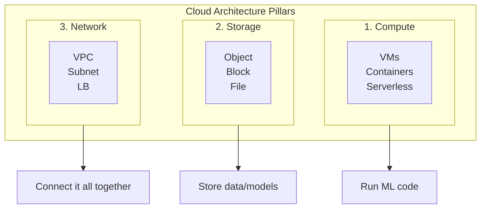

### Compute

| Type | Best For | Examples |
|---|---|---|
| VMs | Long-running training, complex dependencies, full OS control | EC2, GCE, Azure VMs |
| Containers | Model serving, microservices, portability, fast startup | ECS/EKS, GKE, AKS |
| Serverless | Lightweight inference, event-driven, zero server management | Lambda, Cloud Functions, Azure Functions |

### Storage

| Type | Best For | Examples | Cost |
|---|---|---|---|
| Object | Datasets, trained models, backups, logs (HTTP/S access, unlimited scale) | S3, Cloud Storage, Blob Storage | ~$0.02/GB/mo |
| Block | Databases, checkpoints, active caches (attached to an instance, low latency/high IOPS) | EBS, Persistent Disk, Managed Disks | ~$0.10/GB/mo |
| File | Shared training data, home directories (NFS, multi-instance access) | EFS, Filestore, Azure Files | ~$0.30/GB/mo |

### Network

- **VPC**: isolated network, defines IP ranges/subnets, controls traffic flow
- **Load Balancer**: distributes traffic, health-checks instances, terminates SSL
- **CDN** (CloudFront, Cloud CDN, Azure CDN): caches responses at the edge to cut latency

---

## ML-Specific Architecture Patterns

### Training

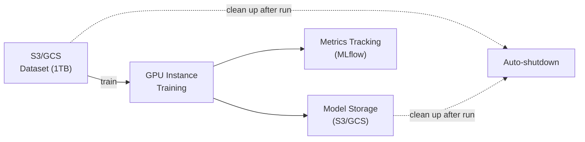

- Use spot instances (up to 90% cheaper) with checkpointing for fault tolerance
- Auto-shutdown after the job completes; version both datasets and models
- Track experiments with MLflow/W&B

| Cost driver (ResNet-50 / ImageNet, 24h) | Amount |
|---|---|
| GPU instance (p3.2xlarge) | $3.06/hr |
| Storage (1TB dataset) | $20/mo |
| Data transfer | $50 |
| **Total per run** | **~$150** |

### Inference

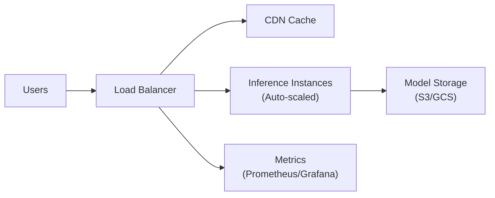

- Auto-scale for variable load; cache at multiple levels (CDN, Redis)
- Monitor p50/p95/p99 latency; use circuit breakers

| Cost driver (1M requests/mo) | Amount |
|---|---|
| Load balancer | $18/mo |
| Compute (3x t3.medium) | $90/mo |
| Data transfer | $80/mo |
| CDN | $40/mo |
| **Total** | **~$230/mo** |

### Data Pipeline

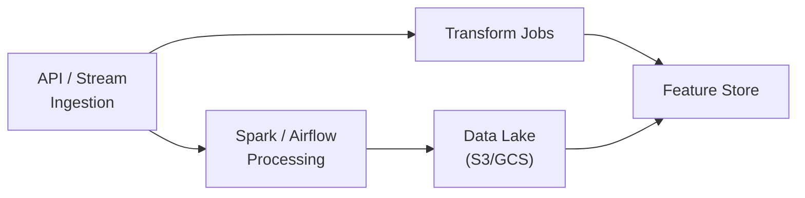

---

## Architecture Design Principles

### High Availability

Multi-AZ deployment removes the single-AZ outage as a point of failure:

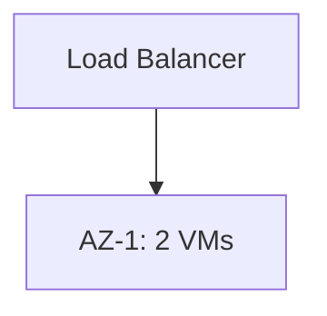
Single AZ ≈ 99.5% uptime — one zone going down takes the service with it.

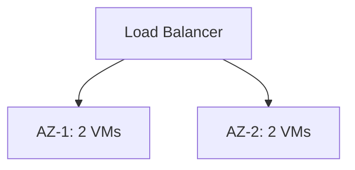
Multi-AZ ≈ 99.99% uptime — traffic fails over automatically.

### Scalability

- **Vertical** (bigger instance): simple, but capped by max instance size, needs a restart
- **Horizontal** (more instances): effectively unlimited, no downtime

```yaml
MinSize: 2              # floor
MaxSize: 10              # ceiling
DesiredCapacity: 3
TargetCPU: 70%           # scale up when CPU > 70% for 5 min; down when < 30% for 10 min
```

### Cost Optimization

| Lever | Applies To | Typical Savings |
|---|---|---|
| Spot instances | Training, batch (can be reclaimed with ~2 min notice) | up to 90% |
| Storage lifecycle (archive old data) | Cold data | up to 50% |
| Reserved instances (1yr/3yr commitment) | Steady production | up to 40–60% |
| Auto-scaling | Variable load | up to 40% |
| Right-sizing | Any workload | up to 30% |
| Data transfer optimization | Cross-region/egress | up to 20% |

### Security — Defense in Depth

| Layer | Controls |
|---|---|
| Network | VPC, subnets, firewalls |
| Access | IAM, RBAC, MFA |
| Data | Encryption at rest & in transit |
| Application | Input validation |
| Monitoring | Logs, alerts, audit |

Principle of least privilege, network isolation, and automated patching apply across every layer.

### Observability

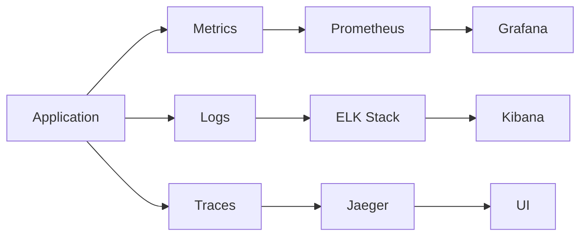

Metrics answer "how much/how fast," logs answer "what happened," traces answer "where did this request go."

---

## Training vs. Inference

| Aspect | Training | Inference |
|--------|----------|-----------|
| Compute | GPU-heavy, spot instances | CPU, auto-scaling |
| Storage | High-throughput (SSD) | Low-latency (caching) |
| Network | Internal only | Public-facing, CDN |
| Cost model | Temporary (hours/days) | Continuous (24/7) |
| Optimize for | Throughput | Latency |
| Scaling direction | Vertical (bigger GPU) | Horizontal (more instances) |

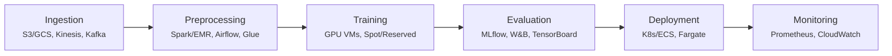

---

## Practical Exercise

Design a cloud architecture for an image classification service:

**Requirements:** 1M predictions/day · 99.9% availability · <500ms p95 latency · global users · $500/mo budget · zero-downtime model updates.

Sketch your own answer (compute, storage, networking, cost, HA plan) before expanding the solution.

<details>
<summary><strong>Sample Solution</strong></summary>

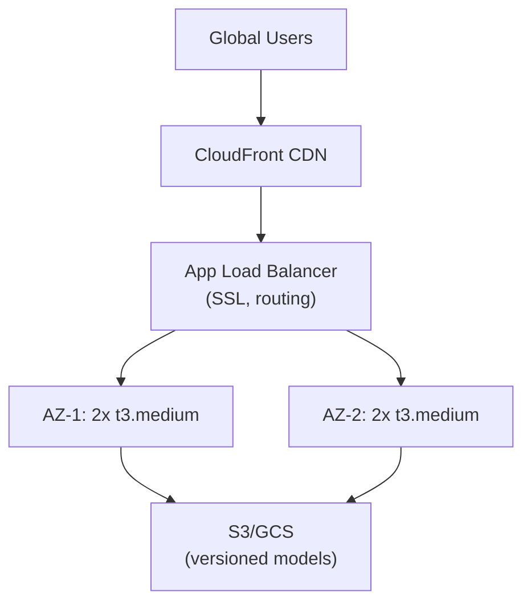

| Item | Cost |
|---|---|
| Load balancer | $18/mo |
| CloudFront (1M requests) | $50/mo |
| Compute (4x t3.medium) | $120/mo |
| S3 storage (10GB) | $0.23/mo |
| Data transfer | $80/mo |
| Monitoring | $30/mo |
| **Total** | **~$298/mo** (under budget) |

Scaling: 2 instances off-peak, 4–6 at peak, 8–10 during traffic spikes.

**Why it meets the requirements:** multi-AZ + health checks cover 99.9% availability; CDN + small instances keep p95 latency low; new models land in S3 and roll out behind a health-checked deploy for zero downtime; CDN edge locations serve global users without a multi-region deployment.

</details>

---

## Key Architecture Decisions

**Region:** pick by user location (latency), data residency rules, and cost — e.g., US → us-east-1/us-west-2, EU → eu-west-1/eu-central-1, Asia → ap-southeast-1/ap-northeast-1.

**Instance sizing:**

| Model Size | Serving (CPU) | Training (GPU) |
|---|---|---|
| Small | t3.medium (2 vCPU, 4GB) | g4dn.xlarge (1x T4) |
| Medium | c5.xlarge (4 vCPU, 8GB) | p3.2xlarge (1x V100) |
| Large | c5.4xlarge (16 vCPU, 32GB) | p3.8xlarge (4x V100) |

**Storage tiering:** hot data (S3/SSD/Redis) for frequent access → warm (Infrequent Access) for occasional access → cold (Glacier + lifecycle policies) for archives.

---

## Deployment Patterns

**Lambda Architecture** — combine a real-time stream with periodic batch retraining:

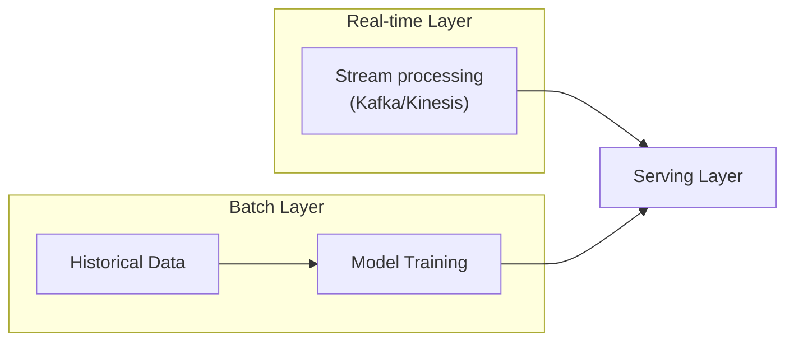

**Microservices** — independent scaling for multiple models:

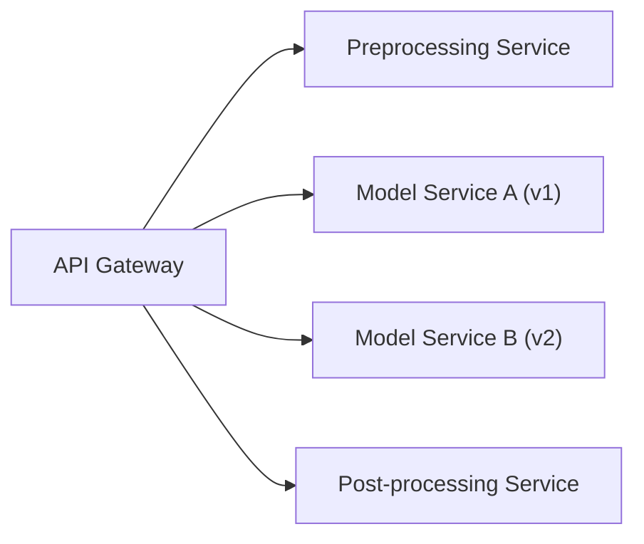

**Monolith** — simplest option, good for getting started: a single application handling API endpoints, inference, pre/post-processing, and monitoring together.

---

## Key Takeaways

1. Three pillars: compute, storage, network
2. Training ≠ inference — different architectures, different optimization targets
3. High availability comes from multi-AZ + load balancing + health checks
4. Cost optimization: spot instances, auto-scaling, right-sizing
5. Security: defense in depth, least privilege
6. Observability: metrics, logs, traces
7. Design for failure; start simple and add complexity as needed

---

## Additional Resources

- [AWS Well-Architected Framework](https://aws.amazon.com/architecture/well-architected/)
- [Google Cloud Architecture Center](https://cloud.google.com/architecture)
- [Azure Architecture Center](https://docs.microsoft.com/azure/architecture/)
- [Martin Fowler's Architecture Patterns](https://martinfowler.com/)
- [Cloud Architecture Patterns (Book)](https://www.oreilly.com/library/view/cloud-architecture-patterns/9781449357979/)

---

**Next Lesson:** [02-aws-ml-infrastructure.md](./02-aws-ml-infrastructure.md) — Deep dive into AWS
