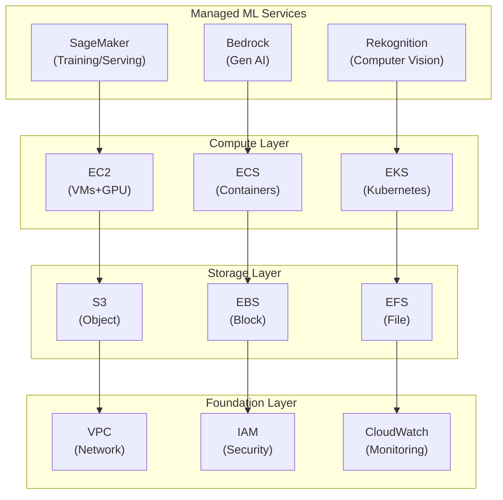
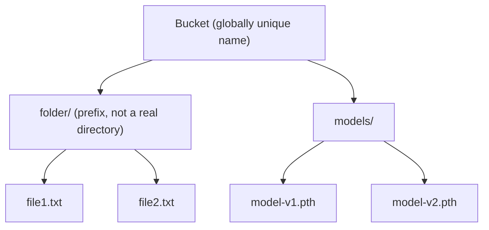
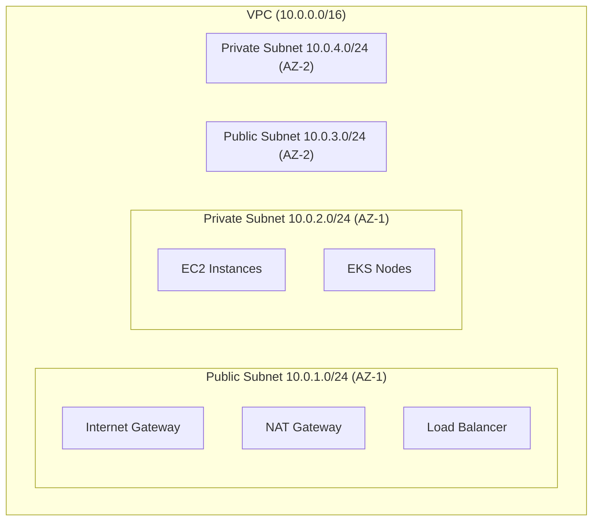

# Lesson 02: AWS for ML Infrastructure

Amazon Web Services (AWS) is the most widely used cloud platform, offering the broadest set of services for ML infrastructure. This lesson covers the essential AWS services for building production ML systems, from compute and storage to managed ML services.

### Contents

1. [AWS ML Services Landscape](#aws-ml-services-landscape)
2. [Account Setup and IAM](#part-1-aws-account-setup-and-iam)
3. [EC2 for ML Compute](#part-2-ec2-for-ml-compute)
4. [S3 for Data and Model Storage](#part-3-s3-for-data-and-model-storage)
5. [EKS for Kubernetes](#part-4-eks-for-kubernetes)
6. [SageMaker for Managed ML](#part-5-sagemaker-for-managed-ml)
7. [Networking with VPC](#part-6-networking-with-vpc)
8. [Key Takeaways](#key-takeaways)
9. [Practical Exercise](#practical-exercise)
10. [Additional Resources](#additional-resources)

---

## AWS ML Services Landscape

AWS's ML offering is layered: foundational services (networking, identity, monitoring) underpin storage, storage underpins compute, and compute underpins the managed ML services that most teams actually build on day-to-day. You rarely touch every layer directly — SageMaker, for instance, provisions its own EC2 instances and S3 access behind the scenes — but understanding the stack helps you reason about cost, security, and where to intervene when something needs to be customized.



---

## Part 1: AWS Account Setup and IAM

Everything you do on AWS happens under an account, and every action an AWS resource takes is authorized by IAM. Getting these two things right first — a secured account and correctly scoped permissions — avoids both a surprise bill and an accidental hole in your security posture later on.

### Setting Up Your Account

**1. Create an account** at [aws.amazon.com](https://aws.amazon.com/) (email, credit card, phone verification). Free tier (12 months) includes 750 hrs/mo t2.micro EC2, 5GB S3, 30GB EBS, 15GB data transfer out.

**2. Secure the root account** — never use it for daily operations:
```bash
# 1. Enable MFA: Account → Security Credentials → MFA → Activate
#    (Google Authenticator, Authy, or a hardware token)
# 2. Create a billing alarm: CloudWatch → Alarms → Billing
#    Alert when EstimatedCharges > $10
```

**3. Install and configure the AWS CLI:**
```bash
curl "https://awscli.amazonaws.com/awscli-exe-linux-x86_64.zip" -o "awscliv2.zip"
unzip awscliv2.zip
sudo ./aws/install
aws --version

aws configure
# AWS Access Key ID: [Your key]
# AWS Secret Access Key: [Your secret]
# Default region name: us-east-1
# Default output format: json

aws sts get-caller-identity   # verify
```

### IAM (Identity and Access Management)

| Concept | What it is |
|---|---|
| Users | Individual people |
| Groups | Collections of users |
| Roles | Permissions assumed by AWS services |
| Policies | JSON documents defining permissions |

Apply the **principle of least privilege**: grant only the permissions a task needs.

**Create an IAM user for ML development:**
```bash
aws iam create-user --user-name ml-engineer

aws iam attach-user-policy --user-name ml-engineer \
    --policy-arn arn:aws:iam::aws:policy/AmazonSageMakerFullAccess
aws iam attach-user-policy --user-name ml-engineer \
    --policy-arn arn:aws:iam::aws:policy/AmazonEC2FullAccess
aws iam attach-user-policy --user-name ml-engineer \
    --policy-arn arn:aws:iam::aws:policy/AmazonS3FullAccess

aws iam create-access-key --user-name ml-engineer
```

**Example scoped policy** (SageMaker + EC2 lifecycle + S3, restricted to one region):
```json
{
  "Version": "2012-10-17",
  "Statement": [
    {
      "Effect": "Allow",
      "Action": [
        "sagemaker:*",
        "ec2:DescribeInstances",
        "ec2:RunInstances",
        "ec2:TerminateInstances",
        "s3:GetObject",
        "s3:PutObject",
        "s3:ListBucket"
      ],
      "Resource": "*",
      "Condition": {
        "StringEquals": { "aws:RequestedRegion": "us-east-1" }
      }
    }
  ]
}
```

---

## Part 2: EC2 for ML Compute

EC2 (Elastic Compute Cloud) is AWS's raw virtual machine service — the building block underneath most other compute options, including the worker nodes in EKS and the instances SageMaker spins up for you. For ML work the instance family you pick matters more than for typical web workloads, since training needs a GPU and serving usually doesn't.

| Family | Best For |
|---|---|
| General Purpose (t3, m5) | Light inference, dev/test, cost-effective |
| Compute Optimized (c5, c6i) | CPU-based training, batch inference, HPC |
| GPU (g4dn, g5, p3, p4d) | Training and heavy inference |

**GPU instance reference:**

| Instance | GPU | GPU RAM | vCPUs | Cost/hr |
|---|---|---|---|---|
| g4dn.xlarge | 1x T4 | 16 GB | 4 | $0.526 |
| g4dn.12xlarge | 4x T4 | 64 GB | 48 | $3.912 |
| p3.2xlarge | 1x V100 | 16 GB | 8 | $3.06 |
| p3.8xlarge | 4x V100 | 64 GB | 32 | $12.24 |
| p4d.24xlarge | 8x A100 | 320 GB | 96 | $32.77 |
| g5.xlarge | 1x A10G | 24 GB | 4 | $1.006 |
| g5.48xlarge | 8x A10G | 192 GB | 192 | $16.288 |

Recommendations: **g4dn.xlarge** for development, **g5.xlarge** for small models (best value), **p3.2xlarge** for medium models, **p3.8xlarge/p4d.24xlarge** for large models.

### Launching an Instance

**Console:** EC2 → Launch Instance → AMI: *Deep Learning AMI (Ubuntu)* (ships with PyTorch/TensorFlow/CUDA) → instance type `g4dn.xlarge` → default VPC, 50GB gp3 storage, security group allowing SSH (22) + HTTP (8000) → create/select a key pair → Launch.

**CLI:**
```bash
# Find the latest Deep Learning AMI
aws ec2 describe-images \
    --owners amazon \
    --filters "Name=name,Values=Deep Learning AMI (Ubuntu*" \
    --query 'Images | sort_by(@, &CreationDate) | [-1].[ImageId,Name]' \
    --output text

# Security group + rules
aws ec2 create-security-group --group-name ml-training --description "ML training security group"
aws ec2 authorize-security-group-ingress --group-name ml-training --protocol tcp --port 22 --cidr 0.0.0.0/0
aws ec2 authorize-security-group-ingress --group-name ml-training --protocol tcp --port 8000-8888 --cidr 0.0.0.0/0

# Launch
aws ec2 run-instances \
    --image-id ami-xxxxx \
    --instance-type g4dn.xlarge \
    --key-name my-key-pair \
    --security-groups ml-training \
    --block-device-mappings '[{"DeviceName":"/dev/sda1","Ebs":{"VolumeSize":100,"VolumeType":"gp3","DeleteOnTermination":true}}]' \
    --tag-specifications 'ResourceType=instance,Tags=[{Key=Name,Value=ml-training}]'

aws ec2 describe-instances \
    --filters "Name=tag:Name,Values=ml-training" \
    --query 'Reservations[0].Instances[0].[InstanceId,PublicIpAddress,State.Name]' \
    --output table
```

**Connect and verify GPU:**
```bash
ssh -i my-key-pair.pem ubuntu@<public-ip>
nvidia-smi
conda activate pytorch
python -c "import torch; print(torch.cuda.is_available())"
```

### Spot Instances

AWS sells its unused EC2 capacity at a steep discount — up to 90% off the on-demand price — as **Spot Instances**. The catch is that AWS can reclaim that capacity at any time to serve on-demand customers, giving you only a 2-minute interruption warning before termination.

That tradeoff is a poor fit for anything that must stay up continuously (like a serving endpoint), but it's close to free money for ML training: a training job that checkpoints its progress can simply resume on a new instance after an interruption, losing at most the last few minutes of work. For long or expensive training runs, spot instances plus checkpointing is usually the single biggest cost lever available.

```bash
aws ec2 request-spot-instances \
    --spot-price "0.50" \
    --instance-count 1 \
    --type "one-time" \
    --launch-specification '{"ImageId":"ami-xxxxx","InstanceType":"g4dn.xlarge","KeyName":"my-key-pair","SecurityGroups":["ml-training"]}'

aws ec2 describe-spot-price-history \
    --instance-types g4dn.xlarge \
    --start-time $(date -u +%Y-%m-%dT%H:%M:%S) \
    --product-descriptions "Linux/UNIX" \
    --query 'SpotPriceHistory[*].[Timestamp,SpotPrice]' \
    --output table
```

**Checkpoint your training script** so an interruption only costs you time, not progress:
```python
import torch, os

def train_with_checkpoints(model, train_loader, epochs=10):
    checkpoint_dir = "/data/checkpoints"

    start_epoch = 0
    if os.path.exists(f"{checkpoint_dir}/latest.pth"):
        checkpoint = torch.load(f"{checkpoint_dir}/latest.pth")
        model.load_state_dict(checkpoint['model_state'])
        start_epoch = checkpoint['epoch']
        print(f"Resumed from epoch {start_epoch}")

    for epoch in range(start_epoch, epochs):
        for batch in train_loader:
            pass  # training step

        torch.save({
            'epoch': epoch + 1,
            'model_state': model.state_dict(),
            'optimizer_state': optimizer.state_dict(),
        }, f"{checkpoint_dir}/latest.pth")
        print(f"Checkpoint saved at epoch {epoch + 1}")
```

---

## Part 3: S3 for Data and Model Storage

S3 (Simple Storage Service) is AWS's object store, and it's the default home for anything an ML pipeline reads or writes in bulk — raw datasets, processed training data, model checkpoints, final model artifacts, and logs. Objects live in a **bucket** under a **key** (e.g. `models/model-v1.pth`); there are no real directories, just a flat namespace where `/`-separated prefixes are displayed as if they were folders.



Key features: unlimited storage, 99.999999999% durability (11 nines), versioning, lifecycle policies, IAM/bucket-policy access control.

**Create and configure a bucket:**
```bash
aws s3 mb s3://my-ml-datasets-12345

aws s3api put-bucket-versioning \
    --bucket my-ml-datasets-12345 \
    --versioning-configuration Status=Enabled

aws s3api put-bucket-lifecycle-configuration \
    --bucket my-ml-datasets-12345 \
    --lifecycle-configuration file://lifecycle.json
```

**lifecycle.json** — archive old models automatically:
```json
{
  "Rules": [
    {
      "Id": "Archive old models",
      "Status": "Enabled",
      "Filter": { "Prefix": "models/" },
      "Transitions": [
        { "Days": 30, "StorageClass": "STANDARD_IA" },
        { "Days": 90, "StorageClass": "GLACIER" }
      ]
    }
  ]
}
```

**Upload/download:**
```bash
aws s3 cp model.pth s3://my-ml-datasets-12345/models/model-v1.pth
aws s3 cp datasets/ s3://my-ml-datasets-12345/datasets/ --recursive
aws s3 cp s3://my-ml-datasets-12345/models/model-v1.pth ./
aws s3 sync s3://my-ml-datasets-12345/datasets/ ./datasets/   # only changed files
aws s3 ls s3://my-ml-datasets-12345/models/
aws s3 rm s3://my-ml-datasets-12345/models/old-model.pth
```

**Python (boto3):**
```python
import boto3
s3 = boto3.client('s3')

s3.upload_file('model.pth', 'my-ml-datasets-12345', 'models/model-v1.pth')
s3.download_file('my-ml-datasets-12345', 'models/model-v1.pth', 'model.pth')

response = s3.list_objects_v2(Bucket='my-ml-datasets-12345', Prefix='models/')
for obj in response['Contents']:
    print(obj['Key'], obj['Size'])

url = s3.generate_presigned_url(
    'get_object',
    Params={'Bucket': 'my-ml-datasets-12345', 'Key': 'models/model-v1.pth'},
    ExpiresIn=3600
)
```

### Storage Classes

| Class | Cost/GB/mo | Retrieval | Use Case |
|---|---|---|---|
| Standard | $0.023 | Free | Active data |
| Intelligent-Tiering | $0.023–0.015 | Free | Unknown access pattern |
| Standard-IA | $0.0125 | $0.01/GB | Infrequent access |
| One Zone-IA | $0.01 | $0.01/GB | Backups |
| Glacier Instant | $0.004 | $0.03/GB | Archive |
| Glacier Flexible | $0.0036 | Variable | Long-term |
| Glacier Deep Archive | $0.00099 | $0.02/GB | Compliance |

Recommendation: **Standard** for training data, **Standard-IA** for trained models, **Glacier** for old experiments.

---

## Part 4: EKS for Kubernetes

EKS is a managed Kubernetes service — AWS runs the control plane, you manage worker nodes. Good for scalable/multi-model serving, resource isolation, auto-scaling, and high availability.

**Install tooling:**
```bash
curl --silent --location "https://github.com/weksctl-io/eksctl/releases/latest/download/eksctl_$(uname -s)_amd64.tar.gz" | tar xz -C /tmp
sudo mv /tmp/eksctl /usr/local/bin

curl -LO "https://dl.k8s.io/release/$(curl -L -s https://dl.k8s.io/release/stable.txt)/bin/linux/amd64/kubectl"
sudo install -o root -g root -m 0755 kubectl /usr/local/bin/kubectl

eksctl version
kubectl version --client
```

**Create a cluster (simple, ~15 min — provisions control plane, VPC, security groups, IAM roles, node group):**
```bash
eksctl create cluster \
    --name ml-serving-cluster \
    --region us-east-1 \
    --nodegroup-name ml-nodes \
    --node-type m5.large \
    --nodes 2 --nodes-min 1 --nodes-max 4 \
    --managed

kubectl get nodes
```

**Advanced config** with separate CPU and (scale-to-zero) GPU node groups:
```yaml
# cluster-config.yaml
apiVersion: eksctl.io/v1alpha5
kind: ClusterConfig
metadata:
  name: ml-serving-cluster
  region: us-east-1
  version: "1.28"

nodeGroups:
  - name: cpu-nodes
    instanceType: m5.xlarge
    desiredCapacity: 2
    minSize: 1
    maxSize: 5
    volumeSize: 50
    labels: { workload: cpu }
    tags: { Environment: production, Team: ml-infrastructure }

  - name: gpu-nodes
    instanceType: g4dn.xlarge
    desiredCapacity: 0
    minSize: 0
    maxSize: 3
    volumeSize: 100
    labels: { workload: gpu }
    taints:
      - key: nvidia.com/gpu
        value: "true"
        effect: NoSchedule
```
```bash
eksctl create cluster -f cluster-config.yaml
```

### Deploying a Model API

```yaml
# ml-deployment.yaml
apiVersion: apps/v1
kind: Deployment
metadata:
  name: ml-model-api
spec:
  replicas: 3
  selector:
    matchLabels: { app: ml-model }
  template:
    metadata:
      labels: { app: ml-model }
    spec:
      containers:
      - name: model-server
        image: <your-ecr-repo>/ml-model:v1.0
        ports: [{ containerPort: 8000 }]
        env:
        - name: MODEL_PATH
          value: "s3://my-ml-datasets-12345/models/model-v1.pth"
        - name: AWS_REGION
          value: "us-east-1"
        resources:
          requests: { cpu: 500m, memory: 1Gi }
          limits: { cpu: 1000m, memory: 2Gi }
        livenessProbe:
          httpGet: { path: /health, port: 8000 }
          initialDelaySeconds: 30
          periodSeconds: 10
        readinessProbe:
          httpGet: { path: /health, port: 8000 }
          initialDelaySeconds: 10
          periodSeconds: 5
---
apiVersion: v1
kind: Service
metadata:
  name: ml-model-service
spec:
  type: LoadBalancer
  selector: { app: ml-model }
  ports: [{ port: 80, targetPort: 8000 }]
```

```bash
kubectl apply -f ml-deployment.yaml
kubectl get deployments pods services

kubectl get service ml-model-service -o jsonpath='{.status.loadBalancer.ingress[0].hostname}'
curl http://<load-balancer-url>/health
```

---

## Part 5: SageMaker for Managed ML

SageMaker is AWS's purpose-built ML platform: instead of provisioning EC2 instances, installing frameworks, and wiring up S3 access yourself, you hand SageMaker a training script and it manages the underlying infrastructure — spinning up instances for the duration of the job, streaming in data from S3, and tearing everything down when training finishes. It trades some flexibility for a lot less operational overhead, which is why it's usually the default choice unless you have a reason to manage EC2/EKS directly.

| Component | Purpose |
|---|---|
| Training Jobs | Managed training infrastructure |
| Endpoints | Managed model hosting |
| Feature Store | Centralized feature management |
| Model Registry | Version control for models |
| Pipelines | ML workflow orchestration |
| Studio | IDE for ML development |

**Train:**
```python
import sagemaker
from sagemaker.pytorch import PyTorch

sagemaker_session = sagemaker.Session()
role = sagemaker.get_execution_role()

pytorch_estimator = PyTorch(
    entry_point='train.py',
    source_dir='scripts',
    role=role,
    framework_version='2.0.0',
    py_version='py310',
    instance_count=1,
    instance_type='ml.p3.2xlarge',
    hyperparameters={'epochs': 10, 'batch-size': 32, 'learning-rate': 0.001},
    output_path='s3://my-ml-datasets-12345/models/',
    base_job_name='resnet-training'
)

pytorch_estimator.fit({
    'training': 's3://my-ml-datasets-12345/datasets/imagenet/',
    'validation': 's3://my-ml-datasets-12345/datasets/imagenet-val/'
})
# Runs on managed infra; model artifacts land in S3 automatically.
```

**train.py** — SageMaker passes data channels and the model dir via env vars:
```python
import argparse, os
import torch

def train(args):
    model = create_model()
    train_loader = DataLoader(...)

    for epoch in range(args.epochs):
        for batch in train_loader:
            pass  # training step

    torch.save(model.state_dict(), os.path.join(args.model_dir, 'model.pth'))

if __name__ == '__main__':
    parser = argparse.ArgumentParser()
    parser.add_argument('--model-dir', type=str, default=os.environ['SM_MODEL_DIR'])
    parser.add_argument('--train', type=str, default=os.environ['SM_CHANNEL_TRAINING'])
    parser.add_argument('--validation', type=str, default=os.environ['SM_CHANNEL_VALIDATION'])
    parser.add_argument('--epochs', type=int, default=10)
    parser.add_argument('--batch-size', type=int, default=32)
    parser.add_argument('--learning-rate', type=float, default=0.001)
    train(parser.parse_args())
```

**Deploy and predict:**
```python
predictor = pytorch_estimator.deploy(
    initial_instance_count=2,
    instance_type='ml.m5.xlarge',
    endpoint_name='resnet-endpoint'
)

import numpy as np
prediction = predictor.predict(np.random.rand(1, 3, 224, 224).astype('float32'))

predictor.update_endpoint(initial_instance_count=3, instance_type='ml.m5.2xlarge')  # rolling update

predictor.delete_endpoint()  # important for cost savings!
```

**Pricing:**

| Instance | Role | Cost/hr |
|---|---|---|
| ml.p3.2xlarge (1x V100) | Training | $3.825 |
| ml.p3.8xlarge (4x V100) | Training | $14.688 |
| ml.g4dn.xlarge (1x T4) | Training | $0.736 |
| ml.t3.medium | Hosting | $0.065 |
| ml.m5.xlarge | Hosting | $0.269 |
| ml.c5.2xlarge | Hosting | $0.476 |

Example: ResNet-50 training on `ml.p3.2xlarge` × 20h = **$76.50**; hosting on `ml.m5.xlarge` × 720h/mo = **$193.68/mo**.

---

## Part 6: Networking with VPC

A VPC (Virtual Private Cloud) is an isolated network you carve out of AWS for your own resources. The standard pattern splits it into **public subnets** — reachable from the internet, holding load balancers and NAT gateways — and **private subnets** — not directly reachable, holding the EC2 instances and EKS nodes that actually run your workloads. Duplicating this layout across two Availability Zones is what gives you the multi-AZ redundancy discussed in the first lesson.



**Create a VPC for ML workloads:**
```bash
aws ec2 create-vpc \
    --cidr-block 10.0.0.0/16 \
    --tag-specifications 'ResourceType=vpc,Tags=[{Key=Name,Value=ml-vpc}]'

aws ec2 create-subnet \
    --vpc-id vpc-xxxxx \
    --cidr-block 10.0.1.0/24 \
    --availability-zone us-east-1a \
    --tag-specifications 'ResourceType=subnet,Tags=[{Key=Name,Value=ml-public-1a}]'

aws ec2 create-internet-gateway \
    --tag-specifications 'ResourceType=internet-gateway,Tags=[{Key=Name,Value=ml-igw}]'
aws ec2 attach-internet-gateway --vpc-id vpc-xxxxx --internet-gateway-id igw-xxxxx
```

---

## Key Takeaways

1. **IAM security**: MFA, least privilege, never use root
2. **EC2 for compute**: GPU instances for training, spot for savings
3. **S3 for storage**: versioning, lifecycle policies, right storage class
4. **EKS for orchestration**: managed Kubernetes for scalable serving
5. **SageMaker**: fully managed training and deployment
6. **VPC for networking**: isolate resources, use private subnets
7. **Cost optimization**: spot instances, right-sizing, auto-shutdown

---

## Practical Exercise

Deploy a complete ML system on AWS:

1. Create an S3 bucket for datasets and models
2. Launch an EC2 GPU instance with the Deep Learning AMI
3. Train a simple model, save it to S3
4. Deploy the model to an EKS cluster
5. Expose it via an Application Load Balancer
6. Set up CloudWatch monitoring
7. Calculate the monthly cost

---

## Additional Resources

- [AWS ML Services Overview](https://aws.amazon.com/machine-learning/)
- [SageMaker Documentation](https://docs.aws.amazon.com/sagemaker/)
- [EKS Best Practices](https://aws.github.io/aws-eks-best-practices/)
- [AWS CLI Reference](https://docs.aws.amazon.com/cli/)
- [boto3 Documentation](https://boto3.amazonaws.com/v1/documentation/api/latest/index.html)

---

**Next Lesson:** [03-gcp-ml-infrastructure.md](./03-gcp-ml-infrastructure.md) — Google Cloud Platform for ML
