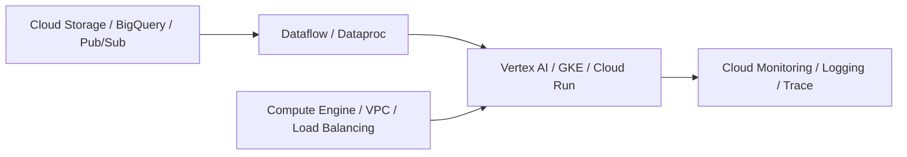
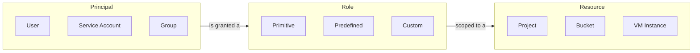
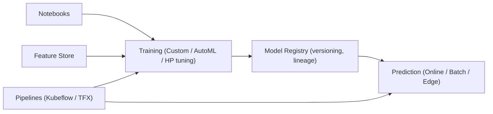
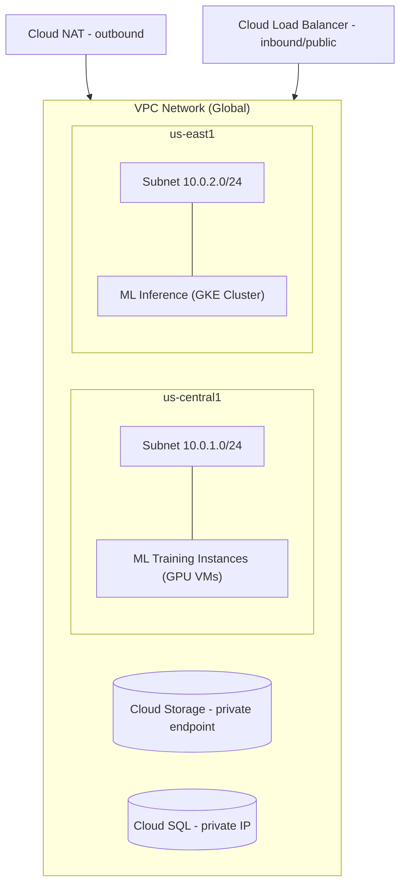
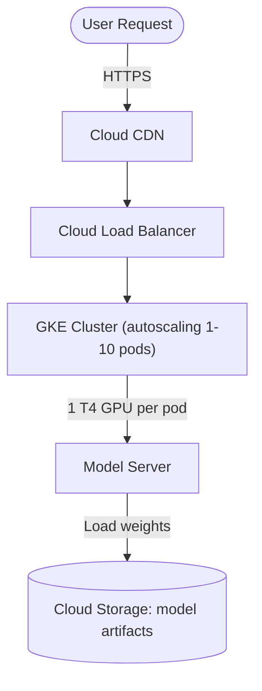

# Lesson 03: Google Cloud Platform for ML Infrastructure

## Lecture Overview

Google Cloud Platform's edge in ML infrastructure comes from three things: it was built by the creators of TensorFlow, it's the only cloud with TPU access, and Vertex AI offers a genuinely unified ML platform. This lesson covers the core services — IAM, Compute Engine, Cloud Storage, TPUs, GKE, Vertex AI, networking, and cost optimization — through hands-on `gcloud`/`gsutil`/`kubectl` commands and Python SDK examples. By the end, you'll be able to provision GPU/TPU compute, manage the ML data lifecycle, train and deploy models on Vertex AI, and control costs with preemptible VMs and committed use discounts.

---

## Table of Contents
1. [GCP Account Setup and IAM](#1-gcp-account-setup-and-iam)
2. [Compute Engine for ML](#2-compute-engine-for-ml)
3. [Cloud Storage for Data and Models](#3-cloud-storage-for-data-and-models)
4. [Tensor Processing Units (TPUs)](#4-tensor-processing-units-tpus)
5. [Google Kubernetes Engine (GKE)](#5-google-kubernetes-engine-gke)
6. [Vertex AI Platform](#6-vertex-ai-platform)
7. [GCP Networking for ML](#7-gcp-networking-for-ml)
8. [Cost Optimization Strategies](#8-cost-optimization-strategies)
9. [Putting It All Together: Serving Architecture](#9-putting-it-all-together-serving-architecture)
10. [Key Takeaways](#10-key-takeaways)
11. [What's Next?](#whats-next)
12. [Further Reading](#further-reading)

---

## 1. GCP Account Setup and IAM

### 1.0 GCP ML Ecosystem

Data flows from ingestion through processing into training/serving, all running on compute + networking infrastructure and watched by monitoring.



### 1.1 Account and Free Tier

**Sign up**: https://cloud.google.com/free gives **$300 free credit** for 90 days, no auto-charge after (card required for verification). The **Always Free** tier includes 1 `f1-micro` Compute Engine instance, 5GB Cloud Storage, 1TB/month of BigQuery queries, and 2M Cloud Functions invocations/month.

**Project setup:**

```bash
# Install gcloud CLI
brew install google-cloud-sdk          # macOS
curl https://sdk.cloud.google.com | bash && exec -l $SHELL   # Linux

gcloud init

# Create and select a project
gcloud projects create ml-infrastructure-project --name="ML Infrastructure"
gcloud config set project ml-infrastructure-project

# Enable required APIs
gcloud services enable compute.googleapis.com
gcloud services enable container.googleapis.com
gcloud services enable storage.googleapis.com
gcloud services enable aiplatform.googleapis.com
```

### 1.2 IAM Model

GCP IAM binds three things together: **who** (principal), **what** (role), and **where** (resource).



**Service accounts** are used for application-to-application authentication — never embed personal credentials in code.

```bash
# Create a service account for ML training
gcloud iam service-accounts create ml-training-sa \
  --display-name="ML Training Service Account" \
  --description="Service account for ML training jobs"

# Grant permissions
gcloud projects add-iam-policy-binding ml-infrastructure-project \
  --member="serviceAccount:ml-training-sa@ml-infrastructure-project.iam.gserviceaccount.com" \
  --role="roles/aiplatform.user"

gcloud projects add-iam-policy-binding ml-infrastructure-project \
  --member="serviceAccount:ml-training-sa@ml-infrastructure-project.iam.gserviceaccount.com" \
  --role="roles/storage.objectAdmin"

# Create and download a key
gcloud iam service-accounts keys create ~/ml-training-key.json \
  --iam-account=ml-training-sa@ml-infrastructure-project.iam.gserviceaccount.com

export GOOGLE_APPLICATION_CREDENTIALS=~/ml-training-key.json
```

**Common ML roles:**

| Role | Use Case |
|---|---|
| `roles/aiplatform.user` | Run Vertex AI training jobs |
| `roles/storage.objectAdmin` | Read/write Cloud Storage |
| `roles/compute.instanceAdmin` | Manage Compute Engine VMs |
| `roles/container.admin` | Manage GKE clusters |
| `roles/monitoring.metricWriter` | Write custom metrics |
| `roles/logging.logWriter` | Write application logs |

**Security practices**: least privilege, service accounts over personal credentials, key rotation every 90 days, audit logging, and organization policies for security constraints.

```bash
# Enable audit logs for IAM changes
gcloud logging sinks create ml-audit-sink \
  storage.googleapis.com/ml-audit-logs-bucket \
  --log-filter='protoPayload.methodName:"iam.googleapis.com"'

# Check key ages for rotation
gcloud alpha iam service-accounts keys list \
  --iam-account=ml-training-sa@ml-infrastructure-project.iam.gserviceaccount.com \
  --format="table(name,validAfterTime,validBeforeTime)"
```

---

## 2. Compute Engine for ML

### 2.1 Instance Types

**General purpose (N-series)** — development, small models, CPU inference:

| Machine Type | vCPUs | Memory | Network | Cost/hour |
|---|---|---|---|---|
| n1-standard-4 | 4 | 15GB | 10 Gbps | $0.190 |
| n2-standard-8 | 8 | 32GB | 32 Gbps | $0.389 |
| n2d-highmem-16 | 16 | 128GB | 32 Gbps | $0.777 |

**GPU instances (accelerator-optimized)** — training and GPU inference:

| Machine Type | GPU | GPU Memory | vCPUs | Cost/hour |
|---|---|---|---|---|
| n1 + T4 | 1x NVIDIA T4 | 16GB | 4 | $0.35 |
| n1 + V100 | 1x NVIDIA V100 | 16GB | 8 | $2.48 |
| n1 + A100 | 1x NVIDIA A100 | 40GB | 12 | $3.67 |
| a2 + A100 | 8x NVIDIA A100 | 320GB | 96 | $29.39 |

**TPU instances** — TensorFlow training at scale:

| TPU Type | Cores | Memory | Cost/hour |
|---|---|---|---|
| v2-8 | 8 | 64GB HBM | $4.50 |
| v3-8 | 8 | 128GB HBM | $8.00 |
| v4-8 | 8 | 32GB HBM2e | $3.67 |
| v4-32 | 32 | 128GB HBM2e | $14.69 |

### 2.2 Creating a GPU Instance

```bash
# List available GPU types in a zone
gcloud compute accelerator-types list --filter="zone:us-central1-a"

# Create instance with a T4 GPU, using a pre-built Deep Learning VM image
gcloud compute instances create ml-training-gpu \
  --zone=us-central1-a \
  --machine-type=n1-standard-4 \
  --accelerator=type=nvidia-tesla-t4,count=1 \
  --image-family=pytorch-latest-gpu \
  --image-project=deeplearning-platform-release \
  --boot-disk-size=100GB \
  --boot-disk-type=pd-ssd \
  --maintenance-policy=TERMINATE \
  --metadata="install-nvidia-driver=True"

gcloud compute ssh ml-training-gpu --zone=us-central1-a
nvidia-smi
```

Deep Learning VM images come pre-configured with frameworks — swap `--image-family` for `tf-latest-gpu` to get TensorFlow instead of PyTorch.

### 2.3 Preemptible VMs

Preemptible VMs save up to **80%** ($0.35/hr → $0.07/hr for a T4) but can be terminated at any time with a 30-second warning, cap out at 24 hours runtime, and aren't always available. They're a good fit for fault-tolerant, checkpointed training.

```bash
gcloud compute instances create ml-training-preemptible \
  --zone=us-central1-a \
  --machine-type=n1-standard-4 \
  --accelerator=type=nvidia-tesla-t4,count=1 \
  --preemptible \
  --image-family=pytorch-latest-gpu \
  --image-project=deeplearning-platform-release \
  --metadata="install-nvidia-driver=True"
```

**Checkpointing for preemption**: register a `SIGTERM` handler that saves model/optimizer state to Cloud Storage or a persistent disk the instant GCP sends its 30-second termination warning, and have the training script load the latest checkpoint on startup so a new (or restarted) instance resumes rather than starting over.

### 2.4 Startup Scripts

```bash
cat > startup.sh << 'EOF'
#!/bin/bash
apt-get update
pip install torch torchvision wandb

mkdir -p /data
gsutil -m rsync -r gs://my-bucket/datasets/imagenet /data/imagenet

cd /home
git clone https://github.com/myorg/ml-training.git
cd ml-training
python train.py --data-path /data/imagenet --epochs 100 --checkpoint-dir /data/checkpoints
EOF

gcloud compute instances create ml-training \
  --zone=us-central1-a \
  --machine-type=n1-standard-8 \
  --accelerator=type=nvidia-tesla-t4,count=1 \
  --preemptible \
  --image-family=pytorch-latest-gpu \
  --image-project=deeplearning-platform-release \
  --metadata-from-file=startup-script=startup.sh \
  --scopes=storage-rw,logging-write
```

---

## 3. Cloud Storage for Data and Models

Cloud Storage is GCP's object storage service, equivalent to AWS S3.

### 3.1 Storage Classes

| Storage Class | Cost/GB/month | Retrieval Cost | Use Case |
|---|---|---|---|
| Standard | $0.020 | Free | Active data |
| Nearline | $0.010 | $0.01/GB | <1 access/month |
| Coldline | $0.004 | $0.02/GB | <1 access/quarter |
| Archive | $0.0012 | $0.05/GB | <1 access/year |

### 3.2 Bucket Operations (CLI)

```bash
# Create a bucket
gsutil mb -l us-central1 -c STANDARD gs://my-ml-data-bucket

# Upload / download
gsutil cp model.pth gs://my-ml-data-bucket/models/
gsutil -m cp -r ./datasets gs://my-ml-data-bucket/     # parallel, for directories
gsutil cp gs://my-ml-data-bucket/models/model.pth ./

# Sync (like rsync)
gsutil -m rsync -r ./local-dir gs://my-ml-data-bucket/remote-dir

# List / delete / size
gsutil ls gs://my-ml-data-bucket/models/
gsutil rm gs://my-ml-data-bucket/models/old-model.pth
gsutil du -sh gs://my-ml-data-bucket
```

### 3.3 Versioning and Lifecycle Management

```bash
gsutil versioning set on gs://my-ml-data-bucket

# lifecycle.json: age 30d STANDARD→NEARLINE, age 90d NEARLINE→COLDLINE, age 365d delete
gsutil lifecycle set lifecycle.json gs://my-ml-data-bucket
gsutil lifecycle get gs://my-ml-data-bucket
```

### 3.4 Python SDK (google-cloud-storage)

```python
from google.cloud import storage
from datetime import timedelta

client = storage.Client()
bucket = client.bucket("my-ml-data-bucket")

bucket.blob("models/resnet50-v1.pth").upload_from_filename("model.pth")
bucket.blob("models/resnet50-v1.pth").download_to_filename("./model.pth")

for blob in bucket.list_blobs(prefix="models/"):
    print(blob.name)

# Temporary-access URL (e.g. share a model without making the bucket public)
url = bucket.blob("models/resnet50-v1.pth").generate_signed_url(
    expiration=timedelta(minutes=120), method='GET'
)

# Promote a model from staging to production
staging = client.bucket("ml-staging-bucket").blob("models/resnet50-v2.pth")
client.bucket("ml-staging-bucket").copy_blob(
    staging, client.bucket("ml-production-bucket"), "models/resnet50-latest.pth"
)
```

### 3.5 Best Practices

1. **Organize by lifecycle**: `raw-data/` (Standard), `processed-data/` (Standard → Nearline at 30 days), `models/staging|production` (Standard), `models/archived` (Coldline), `experiments/` (delete after 90 days)
2. **Use regional buckets** to keep data close to compute
3. **Enable versioning** to protect against accidental deletion
4. **Set up Pub/Sub notifications** to trigger Cloud Functions on new data
5. **Use requester-pays** for public datasets so consumers cover egress

---

## 4. Tensor Processing Units (TPUs)

TPUs are Google's custom ASICs purpose-built for ML workloads.

### 4.1 TPU vs GPU

| Aspect | GPU | TPU |
|---|---|---|
| Architecture | General purpose | ML-specific |
| Precision | FP32, FP16, INT8 | BFloat16 optimized |
| Framework | Any framework | TensorFlow, JAX |
| Memory | 16-80GB HBM | 8-32GB HBM |
| Performance | High | Very high (TF) |
| Cost | Medium | Medium-low |
| Flexibility | Very flexible | Less flexible |
| Best for | Any ML/DL task | Large TF models |

**Use TPUs** for large TensorFlow models (transformers, large CNNs), bfloat16 mixed-precision training, extended training runs, and high-throughput inference. **Use GPUs** for PyTorch, prototyping, maximum flexibility, and models with custom ops.

### 4.2 Creating and Using a TPU VM

```bash
gcloud compute tpus tpu-vm create ml-tpu-v2 \
  --zone=us-central1-a \
  --accelerator-type=v2-8 \
  --version=tpu-vm-tf-2.13.0

gcloud compute tpus tpu-vm ssh ml-tpu-v2 --zone=us-central1-a
gcloud compute tpus tpu-vm list
gcloud compute tpus tpu-vm delete ml-tpu-v2 --zone=us-central1-a
```

### 4.3 Training on TPUs with TensorFlow

Connect to the TPU, wrap model creation in a `TPUStrategy` scope, and train as usual — the strategy handles distributing the graph across cores:

```python
import tensorflow as tf

resolver = tf.distribute.cluster_resolver.TPUClusterResolver()
tf.tpu.experimental.initialize_tpu_system(resolver)
strategy = tf.distribute.TPUStrategy(resolver)

with strategy.scope():
    model = build_model()  # any tf.keras model
    model.compile(optimizer='adam', loss='sparse_categorical_crossentropy', metrics=['accuracy'])

train_ds = tf.data.TFRecordDataset('gs://my-ml-bucket/datasets/train-*.tfrecord').map(parse_fn).batch(128)
model.fit(train_ds, epochs=10, steps_per_epoch=1000)
model.save('gs://my-ml-bucket/models/resnet-tpu-trained')
```

### 4.4 TPU Pods and Best Practices

TPU Pods chain multiple TPUs for very large models:

```bash
# v3-32 = 4x TPU v3-8 chips, ~$32/hour (4x the cost of v3-8)
gcloud compute tpus tpu-vm create ml-tpu-pod \
  --zone=us-central1-a \
  --accelerator-type=v3-32 \
  --version=tpu-vm-tf-2.13.0
```

- **Use bfloat16**: `tf.keras.mixed_precision.set_global_policy(tf.keras.mixed_precision.Policy('mixed_bfloat16'))`
- **Batch size**: use large batches (128, 256, 512)
- **Data pipeline**: preprocess on CPU with `tf.data.Dataset`
- **Checkpointing**: save to Cloud Storage, not local disk
- **Preemptible TPUs**: save ~70%, same tradeoffs as preemptible VMs

---

## 5. Google Kubernetes Engine (GKE)

### 5.1 Creating a Cluster

```bash
# Standard cluster
gcloud container clusters create ml-cluster \
  --zone=us-central1-a \
  --num-nodes=3 \
  --machine-type=n1-standard-4 \
  --disk-size=100GB \
  --enable-autoscaling \
  --min-nodes=1 \
  --max-nodes=10

# Cluster with GPU nodes
gcloud container clusters create ml-gpu-cluster \
  --zone=us-central1-a \
  --num-nodes=2 \
  --machine-type=n1-standard-4 \
  --accelerator=type=nvidia-tesla-t4,count=1 \
  --addons=GcePersistentDiskCsiDriver \
  --enable-autoscaling \
  --min-nodes=0 \
  --max-nodes=5

kubectl apply -f https://raw.githubusercontent.com/GoogleCloudPlatform/container-engine-accelerators/master/nvidia-driver-installer/cos/daemonset-preloaded.yaml

gcloud container clusters get-credentials ml-gpu-cluster --zone=us-central1-a
kubectl get nodes
```

### 5.2 Deploying a Model

A standard Deployment + LoadBalancer Service: 3 replicas of a model-server container, a `MODEL_PATH` env var pointing at the Cloud Storage artifact, CPU/memory limits, and a `/health` liveness probe. Request `nvidia.com/gpu` in the container's `resources` block to schedule onto GPU nodes.

```bash
kubectl apply -f deployment.yaml   # Deployment (3 replicas) + Service (type: LoadBalancer)
kubectl get deployments
kubectl get pods
kubectl get service ml-model-service   # external IP
```

### 5.3 Autoscaling

```bash
# Horizontal Pod Autoscaler: scale 2-20 replicas on CPU/memory utilization
kubectl autoscale deployment ml-model-server --cpu-percent=70 --min=2 --max=20
```

### 5.4 GKE Autopilot

Autopilot is a fully managed mode with no node management — you pay per pod, not per node, with automatic scaling and security hardening baked in.

```bash
gcloud container clusters create-auto ml-autopilot-cluster --region=us-central1
```

---

## 6. Vertex AI Platform

Vertex AI unifies notebooks, training, prediction, feature storage, model registry, and pipelines under one platform.



### 6.1 Training a Custom Job

```python
from google.cloud import aiplatform

aiplatform.init(project='my-project-id', location='us-central1', staging_bucket='gs://my-ml-bucket/staging')

job = aiplatform.CustomTrainingJob(
    display_name='resnet-training',
    script_path='train.py',
    container_uri='gcr.io/cloud-aiplatform/training/pytorch-gpu.1-13:latest',
)

model = job.run(
    machine_type='n1-standard-8',
    accelerator_type='NVIDIA_TESLA_T4', accelerator_count=1,
    args=['--epochs', '100', '--data-path', 'gs://my-ml-bucket/datasets/imagenet'],
)
```

### 6.2 Deploying to an Endpoint

```python
model = aiplatform.Model.upload(
    display_name='resnet50-v1',
    artifact_uri='gs://my-ml-bucket/models/resnet50/',
    serving_container_image_uri='gcr.io/my-project/model-server:latest',
)

endpoint = aiplatform.Endpoint.create(display_name='resnet50-endpoint')
endpoint.deploy(model=model, machine_type='n1-standard-4', min_replica_count=1, max_replica_count=10,
                 accelerator_type='NVIDIA_TESLA_T4', accelerator_count=1)

prediction = endpoint.predict(instances=[{'image_bytes': base64.b64encode(open('cat.jpg', 'rb').read()).decode()}])
```

### 6.3 AutoML

For prototyping without custom training code, `aiplatform.AutoMLImageTrainingJob` (or its tabular/text equivalents) trains against an `aiplatform.ImageDataset` with a train/validation/test split and a compute-time budget (`budget_milli_node_hours`) — no training script required.

### 6.4 Vertex AI Pricing

| Item | Cost |
|---|---|
| Training: n1-standard-4 | $0.190/hour |
| Training: n1-standard-4 + T4 | $0.526/hour |
| Training: n1-standard-8 + V100 | $2.67/hour |
| Prediction: n1-standard-2 | $0.095/hour |
| Prediction: n1-standard-4 + T4 | $0.526/hour |
| AutoML training | $3.15/hour |
| AutoML prediction | $1.25/hour + $0.10/1000 predictions |

---

## 7. GCP Networking for ML

### 7.1 VPC Architecture



### 7.2 Creating the Network

```bash
gcloud compute networks create ml-vpc --subnet-mode=custom

gcloud compute networks subnets create ml-training-subnet \
  --network=ml-vpc --region=us-central1 --range=10.0.1.0/24

gcloud compute networks subnets create ml-inference-subnet \
  --network=ml-vpc --region=us-east1 --range=10.0.2.0/24

gcloud compute firewall-rules create ml-allow-ssh \
  --network=ml-vpc --allow=tcp:22 --source-ranges=0.0.0.0/0

gcloud compute firewall-rules create ml-allow-internal \
  --network=ml-vpc --allow=tcp,udp,icmp --source-ranges=10.0.0.0/16
```

### 7.3 Load Balancing and CDN

```bash
gcloud compute instance-groups managed create ml-inference-group \
  --base-instance-name=ml-inference \
  --template=ml-inference-template \
  --size=3 --zone=us-central1-a

gcloud compute health-checks create http ml-health-check \
  --port=8000 --request-path=/health

gcloud compute backend-services create ml-backend-service \
  --protocol=HTTP --health-checks=ml-health-check --global

gcloud compute backend-services add-backend ml-backend-service \
  --instance-group=ml-inference-group \
  --instance-group-zone=us-central1-a --global

gcloud compute url-maps create ml-load-balancer --default-service=ml-backend-service
gcloud compute target-http-proxies create ml-http-proxy --url-map=ml-load-balancer
gcloud compute forwarding-rules create ml-forwarding-rule \
  --global --target-http-proxy=ml-http-proxy --ports=80

gcloud compute forwarding-rules describe ml-forwarding-rule --global

# Cloud CDN for cached model serving
gcloud compute backend-services update ml-backend-service \
  --enable-cdn --cache-mode=CACHE_ALL_STATIC --default-ttl=3600 --global
```

---

## 8. Cost Optimization Strategies

### 8.1 Committed Use Discounts (CUDs)

Save up to **57%** with a 3-year commitment (purchased via Billing → Commitments):

| Resource | On-Demand | 1-Year CUD | 3-Year CUD |
|---|---|---|---|
| n1-standard-4 | $0.190/hr | $0.128/hr (33%) | $0.082/hr (57%) |
| n1-standard-8 | $0.380/hr | $0.256/hr (33%) | $0.164/hr (57%) |
| T4 GPU | $0.35/hr | $0.244/hr (30%) | $0.158/hr (55%) |

### 8.2 Sustained Use Discounts

Automatic, no commitment required — discount scales with how much of the month an instance runs: 0% at 25% of month, 10% at 50%, 20% at 75%, 30% at 100%.

### 8.3 Preemptible and Spot VMs

Save **60-91%**:

```bash
# Preemptible (legacy)
gcloud compute instances create ml-training \
  --preemptible --machine-type=n1-standard-8 \
  --accelerator=type=nvidia-tesla-t4,count=1

# Spot (successor, more control over termination behavior)
gcloud compute instances create ml-training-spot \
  --provisioning-model=SPOT \
  --instance-termination-action=STOP \
  --machine-type=n1-standard-8
```

### 8.4 Autoscaling and Storage Lifecycle

```bash
gcloud container clusters update ml-cluster \
  --enable-autoscaling --min-nodes=0 --max-nodes=10 --zone=us-central1-a

gcloud compute instance-groups managed set-autoscaling ml-inference-group \
  --max-num-replicas=10 --min-num-replicas=1 \
  --target-cpu-utilization=0.7 --zone=us-central1-a
```

A 1TB dataset kept in Standard storage for a year costs ~$240; with a Standard → Nearline (30d) → Coldline (90d) → delete (365d) lifecycle policy it drops to ~$80 (67% savings).

### 8.5 Budgets and Cost Monitoring

```bash
# Billing → Budgets & alerts → Create budget
# Thresholds: 50% → email, 90% → email + Pub/Sub, 100% → emergency notification

pip install google-cloud-billing
gcloud billing accounts list
gcloud billing projects describe my-project-id

# Export billing data to BigQuery for analysis
gcloud alpha billing accounts describe ACCOUNT_ID --format="value(billingAccountName)"
```

**Checklist**: preemptible/spot VMs for training, 1- or 3-year CUDs for steady-state load, autoscale to zero when idle, storage lifecycle policies, right-sized instances, prune unused disks/snapshots/IPs, prefer regional over multi-regional resources, use the free tier, set budget alerts, review costs weekly.

---

## 9. Putting It All Together: Serving Architecture

**Scenario:** Deploy an image classification model behind an autoscaling, GPU-backed GKE service with CDN caching.



**Steps:**

```bash
# 1. Store the model
gsutil mb -l us-central1 gs://my-ml-exercise-bucket
gsutil cp model.pth gs://my-ml-exercise-bucket/models/

# 2. Build and push the serving image
docker build -t gcr.io/my-project/ml-model:v1 .
docker push gcr.io/my-project/ml-model:v1

# 3. Create a preemptible, autoscaling GPU cluster
gcloud container clusters create ml-exercise-cluster \
  --zone=us-central1-a \
  --machine-type=n1-standard-4 \
  --accelerator=type=nvidia-tesla-t4,count=1 \
  --num-nodes=2 \
  --enable-autoscaling --min-nodes=1 --max-nodes=10 \
  --preemptible

# 4. Deploy (Deployment + Service from section 5.2) and enable autoscaling
kubectl apply -f deployment.yaml
kubectl autoscale deployment ml-model-server --cpu-percent=70 --min=2 --max=20

# 5. Enable Cloud CDN on the backend service (section 7.3)

# 6. Load test
ab -n 10000 -c 50 http://LOAD_BALANCER_IP/predict
```

**Estimated cost at 1M requests/month:**

| Item | Cost |
|---|---|
| GKE nodes (2x preemptible n1-standard-4 + T4, 730hr) | $102 |
| Cloud Storage (1GB) | $0.02 |
| Load Balancer (1M requests) | $8 |
| Cloud CDN (500GB egress) | $40 |
| **Total** | **~$150/month** |

Extending this further: add Cloud Armor for DDoS protection, split traffic across model versions for A/B testing, wire up Cloud Build for CI/CD, and add Cloud Trace for distributed tracing.

---

## 10. Key Takeaways

1. **IAM** binds principals to roles to resources — use service accounts for workloads, never personal credentials, and rotate keys every 90 days.

2. **Compute Engine** gives full control over VM configuration; preemptible/spot instances cut costs 60-91% for fault-tolerant, checkpointed training.

3. **Cloud Storage** is the ML data backbone; lifecycle policies (Standard → Nearline → Coldline → Archive) cut storage costs by up to 67% on aging data.

4. **TPUs** are the fastest, cheapest option for large-scale TensorFlow/JAX training in bfloat16; GPUs remain the better choice for PyTorch and flexible custom ops.

5. **GKE** is the production serving layer — GPU scheduling via `nvidia.com/gpu` resources, HPA for autoscaling, and Autopilot when you don't want to manage nodes at all.

6. **Vertex AI** unifies training, AutoML, model registry, and endpoints — the fastest path from trained model to a scaled prediction endpoint.

7. **Cost management** stacks: sustained-use discounts are automatic, CUDs reward commitment (up to 57%), and preemptible/spot compute plus lifecycle-managed storage handle the rest.

---

## What's Next?

**Lesson 04** covers **Azure for ML Infrastructure** — Azure ML, AKS, and Blob Storage, with a direct comparison to the AWS and GCP patterns from this module.

---

## Further Reading

- **GCP ML Documentation**: https://cloud.google.com/products/ai
- **Vertex AI Documentation**: https://cloud.google.com/vertex-ai/docs
- **GKE Documentation**: https://cloud.google.com/kubernetes-engine/docs
- **TPU Documentation**: https://cloud.google.com/tpu/docs
- **GCP Pricing Calculator**: https://cloud.google.com/products/calculator
- **Free Tier Details**: https://cloud.google.com/free
