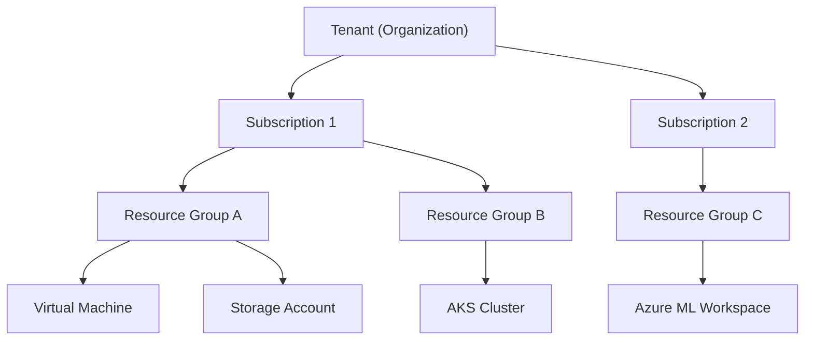
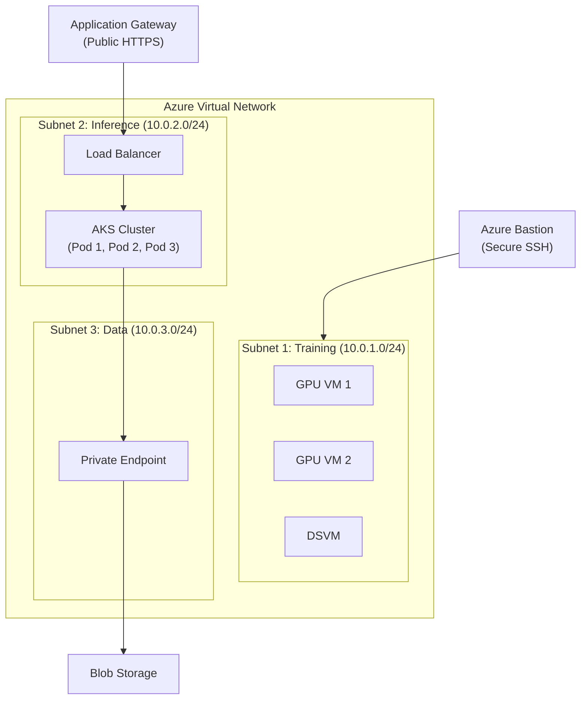
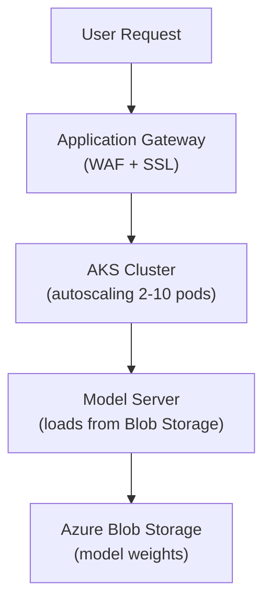

# Lesson 04: Azure for ML Infrastructure

## Lesson Overview

Microsoft Azure is the cloud platform most tightly integrated with the Microsoft ecosystem, and it's the only major cloud with exclusive first-party access to OpenAI's models via Azure OpenAI. Like AWS and GCP, its ML offering is layered — data services underpin compute, compute underpins the managed ML and cognitive services teams build on day-to-day — but Azure's differentiators are enterprise governance (Azure AD, RBAC, compliance certifications) and hybrid-cloud reach through Azure Arc. The tradeoff is that Azure can run more expensive than AWS/GCP for equivalent raw compute, and it doesn't offer specialized ML hardware like TPUs.

By the end of this lesson you will be able to set up and secure an Azure account with Azure AD/RBAC, provision VMs (including GPU and Spot) for ML workloads, use Blob Storage for datasets and models, deploy models on AKS, run training and deployment through Azure Machine Learning, call Azure OpenAI from an application, configure a VNet for secure ML infrastructure, and apply Azure's core cost-optimization levers.

---

## Table of Contents
1. [Azure Account Setup and Identity Management](#1-azure-account-setup-and-identity-management)
2. [Virtual Machines for ML](#2-virtual-machines-for-ml)
3. [Azure Blob Storage](#3-azure-blob-storage)
4. [Azure Kubernetes Service (AKS)](#4-azure-kubernetes-service-aks)
5. [Azure Machine Learning](#5-azure-machine-learning)
6. [Azure OpenAI Service](#6-azure-openai-service)
7. [Azure Networking](#7-azure-networking)
8. [Cost Optimization](#8-cost-optimization)
9. [Putting It All Together: ML Serving Architecture](#9-putting-it-all-together-ml-serving-architecture)
10. [Key Takeaways](#10-key-takeaways)
11. [What's Next?](#whats-next)
12. [Further Reading](#further-reading)

---

## 1. Azure Account Setup and Identity Management

Every Azure resource lives under a subscription, and every action taken against it is authorized through Azure AD identities and RBAC role assignments. Setting these up correctly — a funded subscription, a secured sign-in, and scoped roles instead of blanket Owner access — is the same "get the foundation right first" step covered for AWS's IAM and GCP's IAM, just under Azure's own naming.

### 1.1 Creating an Azure Account

Sign up at https://azure.microsoft.com/free/ for a **$200 credit** valid for 30 days, 12 months of popular services free, and 55+ always-free services.

**Free tier highlights:**

| Category | Includes |
|---|---|
| Compute | 750 hrs/mo B1S VM (Linux/Windows), 1M Azure Functions requests, 20 compute hrs Azure Container Instances |
| Storage | 5 GB Blob Storage (Hot tier), 5 GB File Storage, 2M reads / 2M writes |
| Databases | 250 GB SQL Database, 5 GB Cosmos DB |
| Machine Learning | Azure ML compute hours (varied), 5,000 transactions Cognitive Services |

**Install and configure the Azure CLI:**

```bash
# macOS
brew install azure-cli

# Linux
curl -sL https://aka.ms/InstallAzureCLIDeb | sudo bash

# Windows: download from https://aka.ms/installazurecliwindows

az --version
az login

# Set subscription (if you have multiple)
az account list --output table
az account set --subscription "My Subscription"
```

### 1.2 Azure Active Directory (Azure AD)

Azure uses **Azure Active Directory** for identity and access management. It sits above the resource hierarchy: one AD tenant can own multiple subscriptions (billing boundaries), each subscription holds resource groups (logical containers), and each resource group holds the actual VMs, storage accounts, and clusters.



**Resource groups** are logical containers for Azure resources:

```bash
# Create resource group
az group create --name ml-infrastructure-rg --location eastus

# List resource groups
az group list --output table

# Delete resource group (and all resources)
az group delete --name ml-infrastructure-rg --yes
```

### 1.3 Role-Based Access Control (RBAC)

```bash
# List available roles
az role definition list --output table

# Assign role to user
az role assignment create \
  --assignee user@example.com \
  --role "Contributor" \
  --scope /subscriptions/{subscription-id}/resourceGroups/ml-infrastructure-rg
```

Common ML roles: **Contributor** (full access except granting access to others), **Reader** (view only), **Owner** (full access including managing access), **AcrPull** (pull images from Azure Container Registry), **Storage Blob Data Contributor** (read/write/delete blob containers and data).

### 1.4 Service Principals

Service principals are used for application authentication:

```bash
az ad sp create-for-rbac \
  --name ml-training-sp \
  --role Contributor \
  --scopes /subscriptions/{subscription-id}/resourceGroups/ml-infrastructure-rg

# Output:
# {
#   "appId": "xxxx-xxxx-xxxx-xxxx",
#   "displayName": "ml-training-sp",
#   "password": "xxxx-xxxx-xxxx-xxxx",
#   "tenant": "xxxx-xxxx-xxxx-xxxx"
# }

export AZURE_CLIENT_ID="<appId>"
export AZURE_CLIENT_SECRET="<password>"
export AZURE_TENANT_ID="<tenant>"
export AZURE_SUBSCRIPTION_ID="<subscription-id>"
```

---

## 2. Virtual Machines for ML

Azure Virtual Machines are the raw compute layer underneath most other options on Azure, including AKS worker nodes and the compute clusters Azure ML provisions on your behalf. Which VM series to pick depends on the workload: general-purpose D-series instances are fine for CPU inference and development, but training needs a GPU-backed NC/ND/NV-series instance.

### 2.1 VM Series for ML

**General purpose (D-series)** — development, small models, CPU inference:

| VM Size | vCPUs | Memory | Cost/hour |
|---|---|---|---|
| Standard_D4s_v3 | 4 | 16 GB | $0.192 |
| Standard_D8s_v3 | 8 | 32 GB | $0.384 |
| Standard_D16s_v3 | 16 | 64 GB | $0.768 |

**GPU VMs (NC/ND/NV-series)** — training, GPU inference:

| VM Size | GPU | GPU Memory | vCPUs | Cost/hour |
|---|---|---|---|---|
| Standard_NC4 | 1x Tesla K80 | 12 GB | 4 | $0.90 |
| Standard_NC6s_v3 | 1x Tesla V100 | 16 GB | 6 | $3.06 |
| Standard_ND6s | 1x Tesla P40 | 24 GB | 6 | $2.07 |
| Standard_ND40rs | 8x V100 | 128 GB | 40 | $24.48 |
| Standard_NC24ads | 1x A100 | 80 GB | 24 | $3.67 |

### 2.2 Creating a GPU VM

```bash
# List available VM sizes with GPUs
az vm list-sizes --location eastus --output table | grep NC

# Create GPU VM with Data Science VM image
az vm create \
  --resource-group ml-infrastructure-rg \
  --name ml-training-vm \
  --image microsoft-dsvm:ubuntu-1804:1804-gen2:latest \
  --size Standard_NC6s_v3 \
  --admin-username azureuser \
  --generate-ssh-keys \
  --public-ip-sku Standard

# Get public IP and SSH in
az vm show \
  --resource-group ml-infrastructure-rg \
  --name ml-training-vm \
  --show-details \
  --query publicIps \
  --output tsv

ssh azureuser@<public-ip>
nvidia-smi
```

### 2.3 Data Science Virtual Machine (DSVM)

Azure's DSVM images come pre-installed with ML frameworks (PyTorch, TensorFlow, scikit-learn), tools (Jupyter, VS Code, PyCharm), data tools (Azure CLI, AzCopy, Storage Explorer), and Git/Docker/Kubernetes tooling.

```bash
# Ubuntu DSVM
az vm create \
  --resource-group ml-infrastructure-rg \
  --name dsvm-gpu \
  --image microsoft-dsvm:ubuntu-2004:2004-gen2:latest \
  --size Standard_NC6s_v3 \
  --admin-username azureuser \
  --generate-ssh-keys

# Windows DSVM
az vm create \
  --resource-group ml-infrastructure-rg \
  --name dsvm-windows \
  --image microsoft-dsvm:dsvm-win-2019:server-2019:latest \
  --size Standard_NC6s_v3 \
  --admin-username azureuser \
  --admin-password <secure-password>
```

### 2.4 Spot VMs

Azure Spot VMs sell unused capacity at a steep discount — up to 90% off pay-as-you-go — in exchange for Azure being able to evict the VM whenever it needs that capacity back for on-demand customers. That makes them a poor fit for anything that must stay up continuously, but a great fit for training jobs: pair a Spot VM with checkpointing and an eviction only costs you the time since the last checkpoint, not the whole job.

```bash
az vm create \
  --resource-group ml-infrastructure-rg \
  --name ml-training-spot \
  --image microsoft-dsvm:ubuntu-1804:1804-gen2:latest \
  --size Standard_NC6s_v3 \
  --priority Spot \
  --max-price 0.5 \
  --eviction-policy Deallocate \
  --admin-username azureuser \
  --generate-ssh-keys

# Cost comparison:
# Regular NC6s_v3: $3.06/hour
# Spot NC6s_v3:    ~$0.30-0.60/hour (80-90% savings)
```

### 2.5 VM Startup Script

```bash
cat > startup.sh << 'EOF'
#!/bin/bash
apt-get update
apt-get upgrade -y
pip install torch torchvision wandb mlflow

mkdir -p /data
azcopy copy \
  "https://mystorageaccount.blob.core.windows.net/datasets/*" \
  "/data/" \
  --recursive

git clone https://github.com/myorg/ml-training.git /home/azureuser/training
cd /home/azureuser/training
python train.py --data-path /data --epochs 100
EOF

az vm create \
  --resource-group ml-infrastructure-rg \
  --name ml-training-auto \
  --image microsoft-dsvm:ubuntu-1804:1804-gen2:latest \
  --size Standard_NC6s_v3 \
  --custom-data startup.sh \
  --admin-username azureuser \
  --generate-ssh-keys
```

### 2.6 Checkpointing for Spot VMs

Same pattern as any interruptible instance: register a `SIGTERM` handler that uploads model/optimizer state to Blob Storage (via `azure-storage-blob`) the moment Azure sends its eviction notice, and have the training script check Blob Storage for a checkpoint on startup so a replacement Spot VM resumes instead of restarting from scratch.

---

## 3. Azure Blob Storage

Azure Blob Storage is Azure's object store — the default home for datasets, model checkpoints, and training artifacts, playing the same role S3 plays on AWS. Objects (blobs) live inside **containers** within a **storage account**, and both the account's redundancy level and the blob's access tier are levers for trading cost against durability and retrieval speed.

### 3.1 Storage Account Types

| Performance Tier | Redundancy | Use Case |
|---|---|---|
| Standard (HDD) | LRS | Backup, archival |
| Standard (HDD) | GRS | Geo-redundant backup |
| Premium (SSD) | LRS | High-throughput ML |

**Redundancy options:** LRS (locally redundant, 3 copies in one datacenter), ZRS (zone redundant, 3 copies across availability zones), GRS (geo-redundant, 6 copies: 3 local + 3 remote), GZRS (geo-zone redundant, 6 copies across zones and regions).

### 3.2 Access Tiers and Pricing

| Tier | Storage Cost | Access Cost | Use Case |
|---|---|---|---|
| Hot | $0.0184/GB | Low | Active data |
| Cool | $0.01/GB | Medium | <30 days |
| Archive | $0.00099/GB | High | >180 days |

### 3.3 Creating a Storage Account

```bash
az storage account create \
  --name mlstorageacct001 \
  --resource-group ml-infrastructure-rg \
  --location eastus \
  --sku Standard_LRS \
  --kind StorageV2

az storage account show-connection-string \
  --name mlstorageacct001 \
  --resource-group ml-infrastructure-rg \
  --output tsv

az storage container create --name datasets --account-name mlstorageacct001
az storage container create --name models --account-name mlstorageacct001
```

### 3.4 AzCopy for Large Files

```bash
# Install AzCopy
wget https://aka.ms/downloadazcopy-v10-linux
tar -xvf downloadazcopy-v10-linux
sudo cp azcopy_linux_amd64_*/azcopy /usr/bin/

# Get SAS token
az storage container generate-sas \
  --account-name mlstorageacct001 \
  --name datasets \
  --permissions acdlrw \
  --expiry 2024-12-31 \
  --output tsv

# Upload a file
azcopy copy "model.pth" \
  "https://mlstorageacct001.blob.core.windows.net/models/model.pth?<SAS-token>"

# Upload a directory (parallel)
azcopy copy "./datasets" \
  "https://mlstorageacct001.blob.core.windows.net/datasets?<SAS-token>" \
  --recursive

# Download
azcopy copy \
  "https://mlstorageacct001.blob.core.windows.net/models/model.pth?<SAS-token>" \
  "./model.pth"

# Sync directories (like rsync)
azcopy sync "./local-dir" \
  "https://mlstorageacct001.blob.core.windows.net/datasets?<SAS-token>" \
  --recursive
```

### 3.5 Python SDK (azure-storage-blob)

```python
from azure.storage.blob import BlobServiceClient, generate_blob_sas, BlobSasPermissions
from datetime import datetime, timedelta
import os

client = BlobServiceClient.from_connection_string(os.getenv("AZURE_STORAGE_CONNECTION_STRING"))
container = client.get_container_client("models")

container.get_blob_client("resnet50-v1.pth").upload_blob(open("model.pth", "rb"), overwrite=True)

with open("./model.pth", "wb") as f:
    container.get_blob_client("resnet50-v1.pth").download_blob().readinto(f)

for blob in container.list_blobs(name_starts_with="resnet"):
    print(blob.name, blob.size)

# Temporary-access SAS URL (e.g. share a model without making the container public)
sas = generate_blob_sas(
    account_name="mlstorageacct001", container_name="models", blob_name="resnet50-v1.pth",
    account_key=os.getenv("AZURE_STORAGE_ACCOUNT_KEY"),
    permission=BlobSasPermissions(read=True), expiry=datetime.utcnow() + timedelta(hours=48),
)

# Promote a model from staging to production
dest = client.get_blob_client("production", "resnet50-latest.pth")
dest.start_copy_from_url(client.get_blob_client("staging", "resnet50-v2.pth").url)
```

### 3.6 Lifecycle Management

```bash
# lifecycle-policy.json: datasets/ blobs → Cool at 30 days, Archive at 90, delete at 365
az storage account management-policy create \
  --account-name mlstorageacct001 \
  --resource-group ml-infrastructure-rg \
  --policy @lifecycle-policy.json
```

---

## 4. Azure Kubernetes Service (AKS)

AKS is Azure's managed Kubernetes service — Azure runs and patches the control plane, you manage the worker nodes and what runs on them. It's the go-to choice on Azure for scalable, multi-model serving, since it gives you pod-level replica counts, health-checked rolling deployments, and both node- and pod-level autoscaling, the same benefits EKS provides on AWS.

### 4.1 Creating a Cluster

```bash
az aks create \
  --resource-group ml-infrastructure-rg \
  --name ml-aks-cluster \
  --node-count 3 \
  --node-vm-size Standard_D4s_v3 \
  --enable-addons monitoring \
  --generate-ssh-keys

az aks get-credentials --resource-group ml-infrastructure-rg --name ml-aks-cluster
kubectl get nodes
```

### 4.2 Adding a GPU Node Pool

```bash
az aks create \
  --resource-group ml-infrastructure-rg \
  --name ml-gpu-aks-cluster \
  --node-count 1 \
  --node-vm-size Standard_D4s_v3 \
  --generate-ssh-keys

az aks nodepool add \
  --resource-group ml-infrastructure-rg \
  --cluster-name ml-gpu-aks-cluster \
  --name gpupool \
  --node-count 2 \
  --node-vm-size Standard_NC6s_v3 \
  --node-taints sku=gpu:NoSchedule

# Install NVIDIA device plugin
kubectl apply -f https://raw.githubusercontent.com/NVIDIA/k8s-device-plugin/v0.14.0/nvidia-device-plugin.yml

kubectl get nodes -o json | jq '.items[].status.capacity'
```

### 4.3 Deploying a Model

A Deployment (3 replicas of a model-server container reading `MODEL_PATH` from Blob Storage, with a `/health` liveness probe and CPU/memory limits) plus a `LoadBalancer` Service, same shape as the GCP/AWS equivalents. Store the storage connection string as a Secret rather than a plain env var:

```bash
kubectl create secret generic azure-storage-secret --from-literal=connection-string="<connection-string>"
kubectl apply -f deployment.yaml   # Deployment + Service
kubectl get deployments; kubectl get pods; kubectl get services
```

**GPU deployment**: add a `nodeSelector`/`toleration` to land pods on the tainted GPU node pool, and request `nvidia.com/gpu: 1` in the container's `resources` block.

### 4.5 Autoscaling

```bash
# Cluster autoscaler (nodes)
az aks update --resource-group ml-infrastructure-rg --name ml-aks-cluster \
  --enable-cluster-autoscaler --min-count 1 --max-count 10

# Horizontal Pod Autoscaler (pods)
kubectl autoscale deployment ml-model-deployment --cpu-percent=70 --min=2 --max=20
```

---

## 5. Azure Machine Learning

Azure Machine Learning is Azure's purpose-built ML platform — the counterpart to AWS SageMaker. Instead of provisioning VMs and wiring up storage access yourself, you hand Azure ML a training script and a compute target, and it manages instance lifecycle, data mounting, and experiment tracking for you. It's the default choice unless you have a specific reason to manage VMs or AKS directly, since it trades some low-level control for a lot less operational overhead.

### 5.1 Creating a Workspace

```bash
az ml workspace create \
  --name ml-workspace \
  --resource-group ml-infrastructure-rg \
  --location eastus

az ml workspace show --name ml-workspace --resource-group ml-infrastructure-rg
```

### 5.2 Training with Azure ML

```python
from azureml.core import Workspace, Experiment, Environment, ScriptRunConfig
from azureml.core.compute import ComputeTarget, AmlCompute

ws = Workspace.from_config()

compute_target = ComputeTarget.create(ws, "gpu-cluster", AmlCompute.provisioning_configuration(
    vm_size='Standard_NC6s_v3', max_nodes=4, idle_seconds_before_scaledown=300))
compute_target.wait_for_completion(show_output=True)

env = Environment.from_conda_specification(name='pytorch-env', file_path='environment.yml')

config = ScriptRunConfig(
    source_directory='./src', script='train.py',
    arguments=['--data-path', ws.datasets['imagenet'].as_mount(), '--epochs', 100],
    compute_target=compute_target, environment=env,
)

run = Experiment(ws, 'resnet-training').submit(config)
run.wait_for_completion(show_output=True)
run.download_file(name='outputs/model.pth', output_file_path='./model.pth')
```

### 5.3 Deploying a Model

```python
from azureml.core.model import Model, InferenceConfig
from azureml.core.webservice import AksWebservice

model = Model.register(workspace=ws, model_name='resnet50', model_path='./model.pth')
inference_config = InferenceConfig(entry_script='score.py', environment=env)

# AksWebservice for production; AciWebservice (same call shape) for cheap ad-hoc testing
aks_config = AksWebservice.deploy_configuration(
    autoscale_enabled=True, autoscale_min_replicas=2, autoscale_max_replicas=10,
    autoscale_target_utilization=70, cpu_cores=2, memory_gb=4,
)

service = Model.deploy(ws, 'resnet50-production', [model], inference_config, aks_config,
                        deployment_target=ComputeTarget(ws, 'ml-aks-cluster'))
service.wait_for_deployment(show_output=True)
print(f"Scoring URI: {service.scoring_uri}")
```

### 5.4 Azure ML Pipelines

Multi-step workflows (`azureml.pipeline.steps.PythonScriptStep`) chain a preprocess → train → evaluate sequence, passing data between steps as `PipelineData`. Submit a `Pipeline(workspace=ws, steps=[...])` through an `Experiment` the same way as a single training run, and `pipeline.publish()` to make it reusable as a versioned, callable endpoint.

---

## 6. Azure OpenAI Service

Azure OpenAI is Azure's exclusive, enterprise-hardened gateway to OpenAI's models — the same GPT-4, embeddings, DALL-E, and Whisper models available from OpenAI directly, but wrapped in Azure's SLAs, VNet integration, and regional data-residency controls. For teams already on Azure, it's usually preferable to calling the OpenAI API directly, since it keeps the traffic inside the same governance and billing boundary as the rest of the ML infrastructure.

**Available models:** GPT-4 (most capable, complex tasks), GPT-3.5-Turbo (fast, cost-effective), GPT-3.5-Turbo-16k (extended context), DALL-E 3 (image generation), Whisper (speech-to-text), Embeddings (similarity search).

### 6.1 Creating the Resource

```bash
az cognitiveservices account create \
  --name my-openai-resource \
  --resource-group ml-infrastructure-rg \
  --kind OpenAI \
  --sku S0 \
  --location eastus

az cognitiveservices account keys list \
  --name my-openai-resource \
  --resource-group ml-infrastructure-rg
```

### 6.2 Using Azure OpenAI with Python

The only difference from calling OpenAI directly is the client setup — `engine` refers to your Azure *deployment name*, not the raw model name:

```python
import openai, os

openai.api_type = "azure"
openai.api_base = "https://my-openai-resource.openai.azure.com/"
openai.api_version = "2023-05-15"
openai.api_key = os.getenv("AZURE_OPENAI_API_KEY")

response = openai.ChatCompletion.create(
    engine="gpt-4",  # deployment name, not model name
    messages=[{"role": "user", "content": "Explain machine learning in simple terms"}],
    temperature=0.7,
)
print(response['choices'][0]['message']['content'])
```

`openai.Embedding.create(engine="text-embedding-ada-002", input=...)` and `openai.Image.create(prompt=..., size="1024x1024")` follow the same pattern for embeddings and DALL-E. A common integration is applying `ChatCompletion` row-by-row over an Azure ML dataset (e.g. `df['sentiment'] = df['feedback'].apply(classify_fn)`) to enrich data as part of a pipeline step.

### 6.4 Pricing

| Model | Price |
|---|---|
| GPT-4 (8K context) | $0.03/1K prompt + $0.06/1K completion |
| GPT-4 (32K context) | $0.06/1K prompt + $0.12/1K completion |
| GPT-3.5-Turbo | $0.0015/1K prompt + $0.002/1K completion |
| GPT-3.5-Turbo-16k | $0.003/1K prompt + $0.004/1K completion |
| Embeddings | $0.0001/1K tokens |
| DALL-E 3 | $0.04–0.12 per image |
| Whisper | $0.006/minute |

---

## 7. Azure Networking

A VNet (Virtual Network) is Azure's isolated, software-defined network for your resources — the same role a VPC plays on AWS/GCP. The pattern below splits it into a training subnet, an inference subnet fronted by AKS, and a data subnet reachable only through a private endpoint, with Azure Bastion providing secure SSH access and an Application Gateway handling public HTTPS traffic into the cluster.



### 7.1 Creating a VNet

```bash
az network vnet create \
  --resource-group ml-infrastructure-rg \
  --name ml-vnet \
  --address-prefix 10.0.0.0/16 \
  --subnet-name training-subnet \
  --subnet-prefix 10.0.1.0/24

az network vnet subnet create \
  --resource-group ml-infrastructure-rg \
  --vnet-name ml-vnet \
  --name inference-subnet \
  --address-prefix 10.0.2.0/24

az network vnet subnet create \
  --resource-group ml-infrastructure-rg \
  --vnet-name ml-vnet \
  --name data-subnet \
  --address-prefix 10.0.3.0/24
```

### 7.2 Network Security Groups (NSG)

```bash
az network nsg create --resource-group ml-infrastructure-rg --name ml-training-nsg

# Allow SSH from a specific IP
az network nsg rule create \
  --resource-group ml-infrastructure-rg \
  --nsg-name ml-training-nsg \
  --name allow-ssh \
  --priority 100 \
  --source-address-prefixes 1.2.3.4 \
  --destination-port-ranges 22 \
  --protocol Tcp \
  --access Allow

# Allow internal communication
az network nsg rule create \
  --resource-group ml-infrastructure-rg \
  --nsg-name ml-training-nsg \
  --name allow-internal \
  --priority 110 \
  --source-address-prefixes 10.0.0.0/16 \
  --destination-port-ranges "*" \
  --protocol "*" \
  --access Allow
```

### 7.3 Azure Load Balancer

```bash
az network public-ip create \
  --resource-group ml-infrastructure-rg \
  --name ml-lb-ip \
  --sku Standard

az network lb create \
  --resource-group ml-infrastructure-rg \
  --name ml-load-balancer \
  --sku Standard \
  --public-ip-address ml-lb-ip \
  --frontend-ip-name ml-frontend \
  --backend-pool-name ml-backend-pool

az network lb probe create \
  --resource-group ml-infrastructure-rg \
  --lb-name ml-load-balancer \
  --name ml-health-probe \
  --protocol http \
  --port 8000 \
  --path /health

az network lb rule create \
  --resource-group ml-infrastructure-rg \
  --lb-name ml-load-balancer \
  --name ml-http-rule \
  --protocol tcp \
  --frontend-port 80 \
  --backend-port 8000 \
  --frontend-ip-name ml-frontend \
  --backend-pool-name ml-backend-pool \
  --probe-name ml-health-probe
```

---

## 8. Cost Optimization

Azure ML infrastructure spend is dominated by GPU compute and storage, and both have well-worn levers for cutting cost without cutting capability: commit to Reserved Instances for steady-state workloads, use Spot VMs for interruptible ones, and let storage lifecycle policies move cold data to cheaper tiers automatically.

### 8.1 Reserved Instances

Save 40-60% with 1-3 year commitments:

| VM Size | Pay-as-you-go | 1-Year RI | 3-Year RI |
|---|---|---|---|
| Standard_D4s_v3 | $0.192/hr | $0.131/hr (~32%) | $0.086/hr (~55%) |
| Standard_NC6s_v3 | $3.06/hr | $2.08/hr (~32%) | $1.37/hr (~55%) |

Purchase through Azure Portal: Cost Management → Reservations.

### 8.2 Azure Spot VMs

```bash
az vm create \
  --priority Spot \
  --max-price 0.5 \
  --eviction-policy Deallocate

# Regular NC6s_v3: $3.06/hour
# Spot NC6s_v3:    ~$0.30/hour (90% savings)
```

### 8.3 Auto-Shutdown

```bash
az vm auto-shutdown \
  --resource-group ml-infrastructure-rg \
  --name ml-training-vm \
  --time 1900 \
  --timezone "Pacific Standard Time"
```

### 8.4 Storage Lifecycle

Hot → Cool (30 days) → Archive (90 days) → Delete (365 days). For 1 TB over a year: all-Hot costs ~$221, with lifecycle management ~$78 (65% savings).

### 8.5 Cost Management and Budgets

```bash
# View current costs
az consumption usage list --output table

# Create a budget with alert thresholds
az consumption budget create \
  --budget-name ml-monthly-budget \
  --amount 1000 \
  --time-grain Monthly \
  --time-period start-date=2024-01-01 \
  --notifications threshold=50 threshold-type=Actual contact-emails=["admin@example.com"]

# Additional thresholds (90%, 100%) and action groups for automation
# can be configured via Portal: Cost Management → Budgets → Create budget
```

**Checklist:** Spot VMs for training, Reserved Instances for steady-state production, VM auto-shutdown outside business hours, storage lifecycle management, right-sized VMs, prompt cleanup of unused disks/IPs/snapshots, AKS autoscaling (including scale-to-zero where possible), Azure Hybrid Benefit if you hold Windows licenses, and a standing budget with alerts reviewed weekly in Cost Management.

---

## 9. Putting It All Together: ML Serving Architecture

**Scenario:** Deploy an image-classification model behind an autoscaling, publicly reachable endpoint.



**Requirements:** Spot VMs for the AKS node pool, AKS autoscaling on CPU > 70%, health checks, models served from Blob Storage, and Azure Monitor for observability.

```bash
# 1. Resource group and storage
az group create --name ml-exercise-rg --location eastus
az storage account create --name mlexercisestore --resource-group ml-exercise-rg
az storage container create --name models --account-name mlexercisestore
azcopy copy model.pth "https://mlexercisestore.blob.core.windows.net/models/model.pth?<SAS>"

# 2. AKS cluster with a Spot node pool
az aks create --resource-group ml-exercise-rg --name ml-aks --node-count 2 --node-vm-size Standard_D4s_v3
az aks nodepool add --resource-group ml-exercise-rg --cluster-name ml-aks --name spotpool \
  --priority Spot --eviction-policy Delete --spot-max-price 0.5 --node-count 2

# 3. Deploy (Deployment + Service from section 4.3) and enable autoscaling
kubectl apply -f deployment.yaml
kubectl autoscale deployment ml-model-deployment --cpu-percent=70 --min=2 --max=20

# 4. Monitoring
az aks enable-addons --resource-group ml-exercise-rg --name ml-aks --addons monitoring
```

Application Gateway for public HTTPS ingress into the AKS backend pool is set up following Azure's Application Gateway + AKS integration docs (not CLI-only).

**Estimated cost (1M requests/month):** AKS Spot nodes 2 × $0.04/hr × 730hr = $58; Blob Storage 1 GB × $0.0184 ≈ $0.02; Application Gateway ≈ $150/month; Azure Monitor $2.30/GB ingested ≈ $10/month. **Total ≈ $220/month.**

---

## 10. Key Takeaways

1. **Azure AD and RBAC** sit above every resource — get subscription, resource group, and role-assignment structure right before provisioning anything.
2. **VMs** are the raw compute layer; use D-series for CPU workloads, NC/ND/NV-series GPUs for training, and Spot VMs with checkpointing for interruptible jobs (up to 90% savings).
3. **Blob Storage** is the backbone of ML data storage; access tiers (Hot/Cool/Archive) and lifecycle policies cut storage cost substantially for aging data.
4. **AKS** is the production serving option when you need pod-level autoscaling and rolling deployments across GPU and CPU node pools.
5. **Azure Machine Learning** trades low-level control for a fully managed training/deployment/pipeline workflow — the default choice unless you need to manage VMs or AKS directly.
6. **Azure OpenAI** gives enterprise-governed access to GPT-4, embeddings, DALL-E, and Whisper without leaving Azure's compliance and billing boundary.
7. **VNets, NSGs, and load balancers** isolate training, inference, and data subnets, matching the segmentation patterns used on AWS/GCP.
8. **Cost optimization** is a checklist you run repeatedly: Spot VMs, Reserved Instances, auto-shutdown, storage lifecycle, right-sizing, and budget alerts.

---

## What's Next?

**Lesson 05** covers cloud storage architecture in more depth — data lakes, warehouses, and cross-cloud storage patterns for large-scale ML pipelines.

---

## Further Reading

- **Azure ML Documentation**: https://docs.microsoft.com/azure/machine-learning/
- **Azure OpenAI Documentation**: https://learn.microsoft.com/azure/cognitive-services/openai/
- **AKS Documentation**: https://docs.microsoft.com/azure/aks/
- **Azure Blob Storage Documentation**: https://docs.microsoft.com/azure/storage/blobs/
- **Azure CLI Reference**: https://docs.microsoft.com/cli/azure/
- **Azure Pricing Calculator**: https://azure.microsoft.com/pricing/calculator/
- **Azure Cost Management**: https://azure.microsoft.com/services/cost-management/

