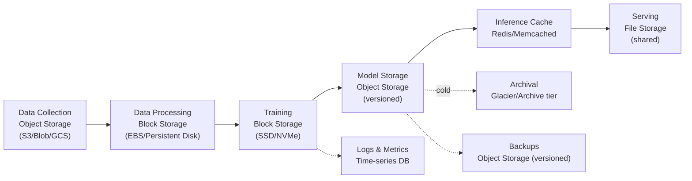
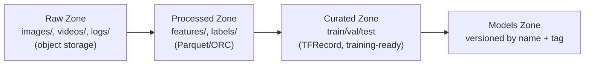
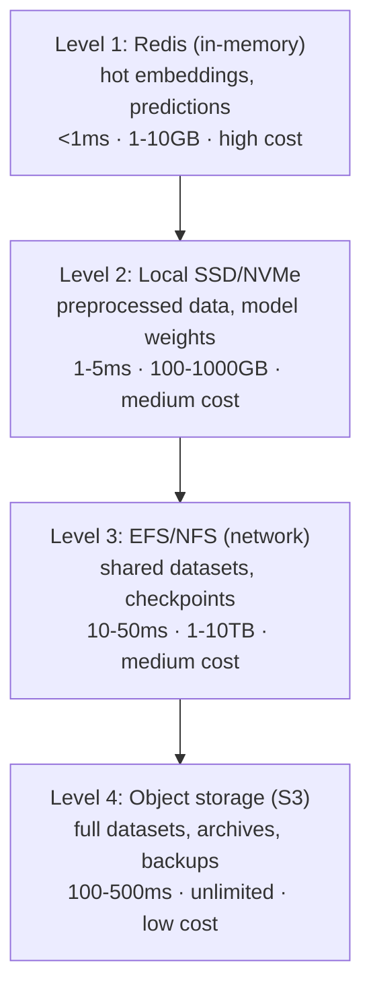

# Lesson 05: Cloud Storage for ML

## Lesson Overview

Different stages of the ML lifecycle put very different demands on storage: raw datasets need cheap, durable, high-throughput object storage; active training needs low-latency block storage; shared notebooks and multi-node checkpoints need a POSIX file system; hot inference features need sub-millisecond in-memory access. Picking the wrong tier for the job either wastes money or bottlenecks training — this lesson builds the decision framework and the concrete provider patterns (mostly AWS, since the concepts transfer directly to GCS/Blob equivalents) for getting it right.

By the end of this lesson you will be able to choose the right storage type for a given ML workload, apply lifecycle policies that cut storage cost 65%+, design a multi-level caching strategy, version datasets for reproducibility, and reason about the performance/cost tradeoffs across AWS, GCP, and Azure.

---

## Table of Contents

1. [Storage Types Overview](#1-storage-types-overview)
2. [Object Storage Deep Dive](#2-object-storage-deep-dive)
3. [Block Storage for ML](#3-block-storage-for-ml)
4. [File Storage Systems](#4-file-storage-systems)
5. [Data Lakes for ML](#5-data-lakes-for-ml)
6. [Caching Strategies](#6-caching-strategies)
7. [Data Versioning](#7-data-versioning)
8. [Performance Optimization](#8-performance-optimization)
9. [Cost Optimization](#9-cost-optimization)
10. [Putting It All Together](#10-putting-it-all-together)
11. [Key Takeaways](#11-key-takeaways)
12. [What's Next?](#whats-next)
13. [Further Reading](#further-reading)

---

## 1. Storage Types Overview

| Storage Type | Use Case | Performance | Cost |
|---|---|---|---|
| Object Storage | Datasets, models, archives | Medium, high throughput | Low ($0.01-0.02/GB) |
| Block Storage | Training data, databases | Very high, low latency | Medium-high ($0.08-0.15/GB) |
| File Storage | Shared datasets, notebooks | High, POSIX-compliant | Medium ($0.05-0.20/GB) |
| In-Memory (Redis/Memcached) | Feature cache, real-time | Extremely high, <1ms | Very high ($0.02-0.10/GB/hr) |

Data typically moves through several tiers across its lifecycle — object storage for raw ingestion and archival, block storage for the active training loop, an in-memory cache for hot inference features, and back to object storage (versioned) for backups:



**Use object storage when**: storing large datasets (>1TB), cost is the primary concern, access is infrequent, or you need versioning/lifecycle management and cross-team sharing.

**Use block storage when**: you need low latency (<10ms), you're running a database, training reads many small files, you need >10,000 IOPS, or you need snapshot capability.

**Use file storage when**: multiple compute instances need shared, POSIX-compliant access — collaborative Jupyter notebooks, a shared model repository, or multi-node checkpoint writes.

---

## 2. Object Storage Deep Dive

Object storage is the foundation for ML data management across every cloud provider.

| Feature | AWS S3 | GCS | Azure Blob |
|---|---|---|---|
| Standard price | $0.023/GB | $0.020/GB | $0.0184/GB |
| Nearline/Cool | $0.0125/GB | $0.010/GB | $0.01/GB |
| Archive | $0.004/GB | $0.0012/GB | $0.00099/GB |
| Transfer out | $0.09/GB | $0.12/GB | $0.087/GB |
| Max object size | 5TB | 5TB | 4.75TB |
| Consistency | Strong | Strong | Strong |
| Versioning / lifecycle mgmt | Yes | Yes | Yes |

### 2.1 Storage Classes and Lifecycle

S3's storage classes trade retrieval speed for cost — pick based on how often the data is actually read, not how important it is:

| Class | Cost/GB | Retrieval Cost | Min. Storage | Use Case |
|---|---|---|---|---|
| Standard | $0.023 | Free | — | Active datasets, frequently accessed models |
| Standard-IA | $0.0125 | $0.01/GB | 30 days | Validation sets, model archives |
| Glacier Instant Retrieval | $0.004 | $0.03/GB | 90 days | Old experiment archives |
| Deep Archive | $0.00099 | $0.02/GB, 12hr | 180 days | Compliance, long-term backups |

A lifecycle policy automates the transitions instead of moving data manually:

```python
import boto3

s3 = boto3.client('s3')

# datasets/ -> Standard-IA at 30d -> Glacier at 90d -> Deep Archive at 365d
# experiments/ -> auto-delete at 90d
# models/production/ -> Standard-IA at 90d, never auto-deleted
s3.put_bucket_lifecycle_configuration(
    Bucket='ml-data-bucket',
    LifecycleConfiguration={'Rules': [
        {'Id': 'ml-data-lifecycle', 'Status': 'Enabled', 'Filter': {'Prefix': 'datasets/'},
         'Transitions': [{'Days': 30, 'StorageClass': 'STANDARD_IA'},
                          {'Days': 90, 'StorageClass': 'GLACIER_INSTANT_RETRIEVAL'},
                          {'Days': 365, 'StorageClass': 'DEEP_ARCHIVE'}]},
        {'Id': 'delete-old-experiments', 'Status': 'Enabled', 'Filter': {'Prefix': 'experiments/'},
         'Expiration': {'Days': 90}},
    ]}
)
```

### 2.2 Versioning for Reproducibility

Enabling bucket versioning means every upload to the same key gets a distinct `VersionId`, so you can pin a training run to the exact bytes it consumed and roll back a model or dataset without extra tooling:

```python
s3.put_bucket_versioning(Bucket='ml-data-bucket', VersioningConfiguration={'Status': 'Enabled'})

s3.upload_file('./imagenet_v2.parquet', 'ml-data-bucket', 'datasets/imagenet/data.parquet',
                ExtraArgs={'Metadata': {'version': 'v2.0'}})

version_id = s3.head_object(Bucket='ml-data-bucket', Key='datasets/imagenet/data.parquet')['VersionId']
s3.download_file('ml-data-bucket', 'datasets/imagenet/data.parquet', './downloaded.parquet',
                  ExtraArgs={'VersionId': version_id})
```

### 2.3 Multi-Part Upload for Large Files

For files over ~100MB, `boto3`'s `TransferConfig` splits the upload into parallel chunks automatically — no need to hand-roll chunking logic:

```python
from boto3.s3.transfer import TransferConfig

config = TransferConfig(multipart_threshold=25 * 1024 * 1024, multipart_chunksize=25 * 1024 * 1024,
                         max_concurrency=10, use_threads=True)
s3.upload_file('./imagenet_full.tar.gz', 'ml-data-bucket', 'datasets/imagenet/full.tar.gz', Config=config)
```

---

## 3. Block Storage for ML

Block storage gives training workloads the low latency and high IOPS that object storage can't.

| Feature | AWS EBS | GCP PD | Azure Disk |
|---|---|---|---|
| SSD (gp3) price | $0.08/GB | $0.17/GB | $0.15/GB |
| IOPS (SSD) | 16,000 | 100,000 | 20,000 |
| Throughput | 1,000 MB/s | 1,200 MB/s | 900 MB/s |
| Max size | 16 TB | 64 TB | 32 TB |
| NVMe (io2) price | $0.125/GB | $0.17/GB | $0.40/GB |
| IOPS (NVMe) | 64,000 | 100,000 | 160,000 |

### 3.1 Volume Types

| Type | IOPS | Throughput | Cost/GB | Best For |
|---|---|---|---|---|
| gp3 (general SSD) | 3,000 baseline | 125 MB/s baseline | $0.08 | Standard training datasets, checkpoints |
| io2 (provisioned IOPS) | up to 64,000 | up to 4,000 MB/s | $0.125 + $0.065/IOPS | Large-scale training (ImageNet, COCO), high-throughput pipelines |
| st1 (throughput HDD) | — | up to 500 MB/s | $0.045 | Sequential reads: video/audio, preprocessing |

```python
ec2 = boto3.client('ec2')
vol = ec2.create_volume(AvailabilityZone='us-east-1a', Size=1000, VolumeType='gp3',
                         Iops=3000, Throughput=125, Encrypted=True)
ec2.attach_volume(VolumeId=vol['VolumeId'], InstanceId='i-0abcdef1234567890', Device='/dev/sdf')
ec2.create_snapshot(VolumeId=vol['VolumeId'], Description='ml-data-backup')
```

### 3.2 Local NVMe Storage

For maximum throughput, instance-local NVMe (e.g. AWS `i3`/`i4i` instances, up to 16 GB/s) beats any network-attached disk — but it's ephemeral, wiped on stop/terminate:

```bash
# i3.2xlarge: 1x 1.9TB NVMe SSD
aws ec2 run-instances --image-id ami-0c55b159cbfafe1f0 --instance-type i3.2xlarge \
  --block-device-mappings '[{"DeviceName":"/dev/sdb","VirtualName":"ephemeral0"}]'

sudo mkfs.ext4 /dev/nvme0n1 && sudo mkdir -p /data && sudo mount /dev/nvme0n1 /data

# Expect 50,000+ IOPS, 200+ MB/s
sudo fio --name=randwrite --ioengine=libaio --iodepth=32 --rw=randwrite --bs=4k \
  --direct=1 --size=1G --numjobs=4 --runtime=60 --filename=/data/test
```

**Always back up to object storage** — an eviction, reboot, or Spot termination loses everything on local NVMe. A cron job (or a `SIGTERM` handler on Spot instances) running `tar` + `aws s3 cp` on a schedule is enough to cover this.

---

## 4. File Storage Systems

Shared, POSIX-compliant file systems let multiple compute instances read/write the same data concurrently — the right choice for collaborative notebooks, a shared model repository, or checkpoints written by multiple training nodes.

| Feature | AWS EFS | GCP Filestore | Azure Files |
|---|---|---|---|
| Performance | up to 10 GB/s | up to 1.6 GB/s | up to 10 GB/s |
| Capacity | Petabytes | 100 TB | 100 TB |
| Protocol | NFS v4.1 | NFS v3 | SMB 3.0 / NFS |
| Standard price | $0.30/GB | $0.20/GB | $0.10/GB |
| IOPS | 500K+ | 100K | 100K |

```python
efs = boto3.client('efs')
fs = efs.create_file_system(CreationToken='ml-shared-storage', PerformanceMode='generalPurpose',
                             ThroughputMode='bursting', Encrypted=True)
efs.create_mount_target(FileSystemId=fs['FileSystemId'], SubnetId='subnet-0abc', SecurityGroups=['sg-0abc'])
```

```bash
sudo yum install -y amazon-efs-utils
sudo mkdir -p /mnt/efs
sudo mount -t efs -o tls fs-12345678:/ /mnt/efs
echo "fs-12345678:/ /mnt/efs efs defaults,_netdev 0 0" | sudo tee -a /etc/fstab
```

Common uses: collaborative Jupyter notebooks shared across a data science team, training datasets read concurrently by multiple jobs without duplication, a centralized model repository (`production/`, `staging/`, `experimental/`) serving an inference fleet, and checkpoint directories shared across nodes in a distributed training job for fault tolerance.

---

## 5. Data Lakes for ML

A data lake organizes storage into zones by how processed the data is — raw ingestion, processed features, training-ready curated data, and versioned models:



### 5.1 Organization

The pattern is a fixed set of top-level prefixes (`raw/`, `processed/`, `curated/`, `models/`, `experiments/`) with helper functions that build paths consistently, so every dataset and model version lands in a predictable location:

```python
from pathlib import Path

class MLDataLake:
    def __init__(self, base_path):
        self.zones = {z: Path(base_path) / z for z in ('raw', 'processed', 'curated', 'models', 'experiments')}

    def path(self, zone, *parts):
        p = self.zones[zone].joinpath(*parts)
        p.mkdir(parents=True, exist_ok=True)
        return p

lake = MLDataLake('s3://ml-data-lake')
train_images = lake.path('raw', 'images', 'train')
model_v1 = lake.path('models', 'resnet50', 'v1.0')
```

### 5.2 Metadata Management

Alongside the data itself, store a small JSON metadata record per dataset — description, size, split counts, preprocessing applied, license — so anyone can discover and understand a dataset without digging through the actual files:

```python
import json

def register_dataset(bucket, name, metadata):
    s3.put_object(Bucket=bucket, Key=f'metadata/{name}.json', Body=json.dumps(metadata), ContentType='application/json')

register_dataset('ml-data-lake', 'imagenet_2024', {
    'description': 'ImageNet for image classification', 'size_gb': 150,
    'splits': {'train': 1281167, 'val': 50000, 'test': 100000},
    'preprocessing': {'resize': [224, 224], 'augmentation': ['random_crop', 'horizontal_flip']},
    'version': '2024.1', 'license': 'Academic use only',
})
```

---

## 6. Caching Strategies

Caching trades storage cost for latency by keeping frequently accessed data closer to compute. The right architecture layers several tiers, each with a different latency/cost/size profile:



### 6.1 Redis for Feature/Prediction Caching

Serialize embeddings or prediction results with `pickle`, store them with an expiration via `SETEX`, and check the cache before recomputing:

```python
import redis, pickle

r = redis.Redis(host='redis.example.com', port=6379, decode_responses=False)

def cache_embedding(key, embedding, ttl=3600):
    r.setex(key, ttl, pickle.dumps(embedding))

def get_embedding(key):
    data = r.get(key)
    return pickle.loads(data) if data else None
```

`r.info('stats')` exposes `keyspace_hits`/`keyspace_misses` for computing a hit rate, and `r.info('memory')` reports current usage — worth tracking to size the cache correctly.

### 6.2 Local SSD Caching

A simple content-addressed cache: hash the S3 key to a local filename, serve from disk on a hit, download-and-store on a miss, and evict least-recently-used files once the cache exceeds its size budget:

```python
import hashlib, shutil
from pathlib import Path

class LocalDiskCache:
    def __init__(self, cache_dir, max_size_gb=100):
        self.dir = Path(cache_dir); self.dir.mkdir(parents=True, exist_ok=True)
        self.max_bytes = max_size_gb * 1024**3

    def get(self, bucket, s3_key, local_path):
        cache_path = self.dir / hashlib.md5(s3_key.encode()).hexdigest()
        if cache_path.exists():
            shutil.copy(cache_path, local_path)
            return True  # cache hit
        s3.download_file(bucket, s3_key, local_path)
        shutil.copy(local_path, cache_path)
        return False  # cache miss, now cached
```

Eviction (not shown) is standard LRU: when total cache size exceeds the budget, sort files by access time and delete the oldest until back under a target (e.g. 80% of the limit).

---

## 7. Data Versioning

### 7.1 DVC (Data Version Control)

DVC pairs with Git: it commits a small pointer file (`.dvc`) to Git while the actual data lives in S3, so `git checkout` plus `dvc checkout` reproduces the exact dataset for any commit:

```bash
pip install dvc dvc-s3
cd ml-project && git init && dvc init
dvc remote add -d myremote s3://ml-data-bucket/dvc-storage

dvc add data/imagenet/train          # creates data/imagenet/train.dvc
git add data/imagenet/train.dvc && git commit -m "Add training dataset"
dvc push                             # uploads data to S3

# On another machine
git clone https://github.com/myorg/ml-project.git && cd ml-project
dvc pull                             # downloads data from S3

# Switch dataset versions along with code
git checkout <commit-hash>
dvc checkout
```

### 7.2 Hash-Based Versioning

Where DVC isn't available, a lighter alternative is hashing the dataset directory's contents to get a content-addressed version ID, storing that alongside metadata (description, sample counts, preprocessing), and uploading the data under a `versions/{name}/` prefix. Two versions with the same hash are guaranteed to be byte-identical — a cheap way to detect whether "v1.1" actually changed anything from "v1.0". This is the same content-addressing idea DVC and Git both use internally, just implemented directly against S3 when you don't want the extra tooling.

---

## 8. Performance Optimization

**Benchmark before optimizing.** Time a representative batch of uploads/downloads against your actual bucket and file sizes — `time.time()` around `s3.put_object`/`get_object` calls, averaged over enough runs to get a stable p50/p95 — rather than trusting published throughput numbers, since real performance depends heavily on object size, region, and network path.

**Parallelize small-file transfers.** A single-threaded loop downloading thousands of small files (e.g. individual images) is dominated by per-request latency, not bandwidth. A `ThreadPoolExecutor` with 10-20 workers calling `s3.download_file` concurrently typically gets an order-of-magnitude speedup for this pattern:

```python
from concurrent.futures import ThreadPoolExecutor

def parallel_download(bucket, keys, local_dir, max_workers=20):
    with ThreadPoolExecutor(max_workers=max_workers) as pool:
        futures = [pool.submit(s3.download_file, bucket, k, f"{local_dir}/{k.split('/')[-1]}") for k in keys]
        return sum(f.exception() is None for f in futures)
```

---

## 9. Cost Optimization

### 9.1 Storage Tiering Savings

For a 1TB dataset stored for one year:

| Strategy | AWS | GCP | Azure |
|---|---|---|---|
| All Standard | $276 | $240 | $221 |
| Lifecycle (30/90/365 day tiering) | $96 (65%) | $72 (70%) | $78 (65%) |
| Aggressive archive (90% to cold tier) | $48 (83%) | $14 (94%) | $12 (95%) |

**Recommendations**: keep active training data in Standard, move validation data to Cool/Nearline after 30 days, archive old experiments after 90 days, and send compliance data straight to Deep Archive.

### 9.2 Estimating Savings

The core calculation is just a weighted average across storage classes — model what fraction of the bucket is actually "hot" versus aging out, and the savings become obvious:

```python
size_gb = 1000
current_cost = size_gb * 0.023                                    # all Standard
optimized_cost = (size_gb * 0.3 * 0.023 +                         # 30% stays Standard
                   size_gb * 0.4 * 0.0125 +                       # 40% moves to IA
                   size_gb * 0.3 * 0.004)                         # 30% moves to Glacier
print(f"Savings: {(1 - optimized_cost / current_cost):.0%}")      # ~65%
```

CloudWatch's `BucketSizeBytes` metric (segmented `By StorageType`) gives the real current size per class to plug into this instead of an estimate.

---

## 10. Putting It All Together

**Scenario**: an ImageNet training pipeline that needs cost-efficient storage for raw data, fast local access during training, cached embeddings for a downstream inference service, and reproducible dataset versions.

```bash
# 1. Data lake with lifecycle management
aws s3 mb s3://ml-data-lake
aws s3api put-bucket-lifecycle-configuration --bucket ml-data-lake --lifecycle-configuration file://lifecycle.json
aws s3 sync ./imagenet s3://ml-data-lake/raw/images/imagenet/

# 2. Version the dataset before training
dvc add data/imagenet/train && git add data/imagenet/train.dvc && git commit -m "imagenet v1.0" && dvc push

# 3. Local NVMe cache on the training instance (populated on first epoch, reused after)
aws s3 sync s3://ml-data-lake/raw/images/imagenet/train /data/imagenet/train

# 4. Redis cache for the inference service's embeddings
redis-cli -h redis.example.com PING
```

This combination — lifecycle-managed object storage for the source of truth, local NVMe for the hot training loop, Redis for hot inference features, and DVC for reproducibility — typically cuts storage cost 65%+ over all-Standard storage while keeping training I/O off the network entirely after the first epoch.

---

## 11. Key Takeaways

1. **Match storage type to access pattern**: object storage for bulk/infrequent data, block storage for low-latency training I/O, file storage for shared/POSIX access, in-memory for hot features.
2. **Lifecycle policies are the biggest lever**: moving aging data through Standard → IA → Archive tiers cuts storage cost 65-95% with no code changes to the training pipeline.
3. **Versioning (S3 versioning, DVC, or content hashing) is what makes an experiment reproducible** — without it, "the dataset" is a moving target.
4. **Caching is a hierarchy, not a single layer**: Redis for hot features, local SSD for the active training set, network file storage for shared access, object storage as the durable base.
5. **Local NVMe is fast but ephemeral** — always have a path back to object storage for anything that must survive an instance stop or Spot eviction.
6. **Benchmark against your actual workload** before optimizing; published throughput numbers rarely match real object-size and region-specific performance.

---

## What's Next?

**Lesson 06** covers cloud networking for ML — VPC design, private connectivity to storage and training clusters, and the networking patterns that keep multi-node training and serving traffic secure and fast.

---

## Further Reading

- **AWS S3 Storage Classes**: https://aws.amazon.com/s3/storage-classes/
- **AWS EBS Volume Types**: https://docs.aws.amazon.com/AWSEC2/latest/UserGuide/ebs-volume-types.html
- **AWS EFS Documentation**: https://docs.aws.amazon.com/efs/
- **DVC Documentation**: https://dvc.org/doc
- **Redis Documentation**: https://redis.io/docs/
- **GCS Storage Classes**: https://cloud.google.com/storage/docs/storage-classes
- **Azure Blob Storage Tiers**: https://learn.microsoft.com/azure/storage/blobs/access-tiers-overview

---

**Estimated Time to Complete**: 4 hours
**Difficulty**: Intermediate
**Next Lesson**: [06-cloud-networking.md](./06-cloud-networking.md)
