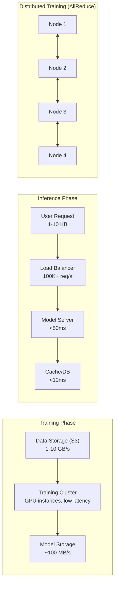
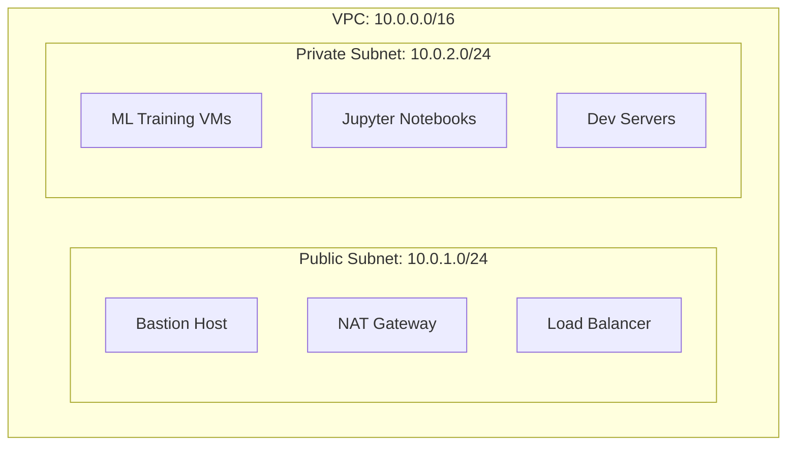
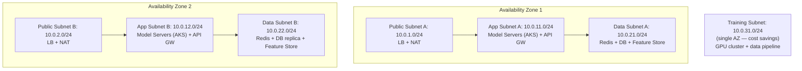
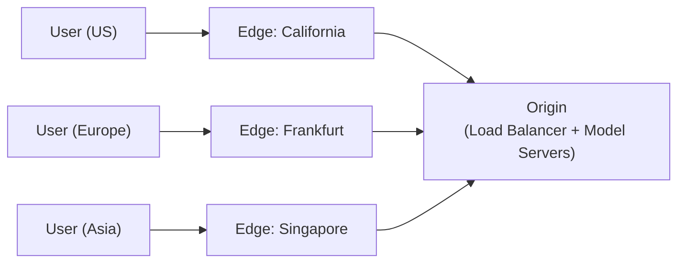
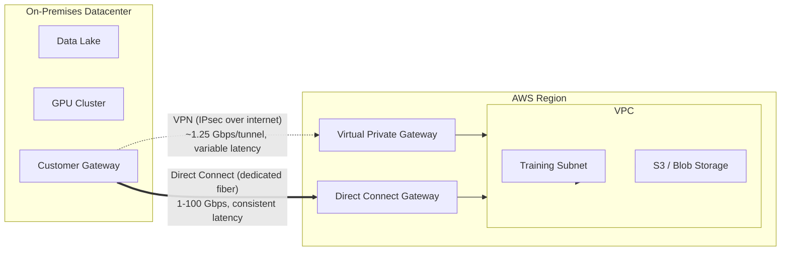

# Lesson 06: Cloud Networking for ML

## Lesson Overview

ML workloads put unusual demands on a network compared to a typical web app: training clusters need low-latency, high-bandwidth links for AllReduce synchronization across GPUs; inference APIs need a load balancer that can route, health-check, and gradually shift traffic between model versions; and everything needs to be reachable without exposing training instances directly to the internet. This lesson builds that networking layer end-to-end — VPC design, load balancing, CDN delivery, layered security, hybrid connectivity, service mesh, and the performance/monitoring tooling to keep it all running — using AWS as the primary example, since the same patterns carry over directly to GCP and Azure's equivalents.

By the end of this lesson you will be able to design a multi-tier VPC for ML infrastructure, configure load balancers for model serving (including A/B testing and canary rollouts), front a model API with a CDN, layer security groups and NACLs for defense in depth, set up VPN/Direct Connect for hybrid workloads, apply a service mesh for microservice traffic management, tune network performance for distributed training, and monitor/troubleshoot the resulting infrastructure.

---

## Table of Contents

1. [Networking Fundamentals for ML](#1-networking-fundamentals-for-ml)
2. [Virtual Private Cloud (VPC)](#2-virtual-private-cloud-vpc)
3. [Load Balancing](#3-load-balancing)
4. [Content Delivery Network (CDN)](#4-content-delivery-network-cdn)
5. [Network Security](#5-network-security)
6. [Hybrid and Multi-Cloud Networking](#6-hybrid-and-multi-cloud-networking)
7. [Service Mesh](#7-service-mesh)
8. [Network Performance Optimization](#8-network-performance-optimization)
9. [Monitoring and Troubleshooting](#9-monitoring-and-troubleshooting)
10. [Putting It All Together: Secure Multi-Tier ML Network](#10-putting-it-all-together-secure-multi-tier-ml-network)
11. [Key Takeaways](#11-key-takeaways)
12. [What's Next?](#whats-next)
13. [Further Reading](#further-reading)

---

## 1. Networking Fundamentals for ML

Three traffic patterns dominate ML infrastructure, each with a different bandwidth/latency profile: bulk data movement during training, latency-sensitive request/response during inference, and tight node-to-node synchronization during distributed training.



| Workload | Bandwidth | Latency | Reliability |
|---|---|---|---|
| Data loading (training) | Very high, 1-10 GB/s | Medium, 100-500ms | 99% |
| Model inference (real-time) | Low, 1-10 KB | Very low, <50ms | 99.99% |
| Batch inference | High, 100 MB-1GB/s | Medium, <1s | 99.9% |
| Distributed training (multi-GPU) | Very high, 10-100 GB/s | Very low, <10ms | 99.9% |
| Model upload/download | Medium, 10-100 MB/s | Low, <5s | 99% |

The takeaway that shapes the rest of this lesson: inference infrastructure is optimized for availability and tail latency, while training infrastructure is optimized for raw throughput between a small number of nodes — they warrant different subnets, different security postures, and often different placement strategies.

---

## 2. Virtual Private Cloud (VPC)

A VPC is an isolated, software-defined network for your resources. Two patterns cover most ML use cases: a flat public/private split for development, and a multi-tier, multi-AZ layout for production.

### 2.1 VPC Design Patterns

**Development — single public/private split:**



**Production — multi-tier, multi-AZ:**



The training subnet deliberately lives in a single AZ rather than being duplicated across both — GPU training jobs are usually restarted from a checkpoint rather than failed over, so the extra AZ redundancy isn't worth the cost.

### 2.2 Creating a VPC (AWS)

```python
import boto3
ec2 = boto3.client('ec2')

vpc = ec2.create_vpc(CidrBlock='10.0.0.0/16')['Vpc']['VpcId']
ec2.modify_vpc_attribute(VpcId=vpc, EnableDnsHostnames={'Value': True})

igw = ec2.create_internet_gateway()['InternetGateway']['InternetGatewayId']
ec2.attach_internet_gateway(InternetGatewayId=igw, VpcId=vpc)

public_subnet = ec2.create_subnet(VpcId=vpc, CidrBlock='10.0.1.0/24', AvailabilityZone='us-east-1a')['Subnet']['SubnetId']
private_subnet = ec2.create_subnet(VpcId=vpc, CidrBlock='10.0.2.0/24', AvailabilityZone='us-east-1a')['Subnet']['SubnetId']
app_subnet = ec2.create_subnet(VpcId=vpc, CidrBlock='10.0.11.0/24', AvailabilityZone='us-east-1a')['Subnet']['SubnetId']

# NAT Gateway for outbound-only access from private subnets
eip = ec2.allocate_address(Domain='vpc')['AllocationId']
nat = ec2.create_nat_gateway(SubnetId=public_subnet, AllocationId=eip)['NatGateway']['NatGatewayId']
ec2.get_waiter('nat_gateway_available').wait(NatGatewayIds=[nat])

# Public route table -> Internet Gateway
public_rt = ec2.create_route_table(VpcId=vpc)['RouteTable']['RouteTableId']
ec2.create_route(RouteTableId=public_rt, DestinationCidrBlock='0.0.0.0/0', GatewayId=igw)
ec2.associate_route_table(SubnetId=public_subnet, RouteTableId=public_rt)

# Private route table -> NAT Gateway
private_rt = ec2.create_route_table(VpcId=vpc)['RouteTable']['RouteTableId']
ec2.create_route(RouteTableId=private_rt, DestinationCidrBlock='0.0.0.0/0', NatGatewayId=nat)
for subnet in (private_subnet, app_subnet):
    ec2.associate_route_table(SubnetId=subnet, RouteTableId=private_rt)
```

### 2.3 VPC Peering for Multi-Region Training

Peering connects two VPCs — even across regions — so distributed training nodes in different regions can reach each other over AWS's private backbone instead of the public internet:

```python
def create_vpc_peering(vpc_id_1, vpc_id_2, region_2='us-west-2'):
    ec2_1, ec2_2 = boto3.client('ec2'), boto3.client('ec2', region_name=region_2)
    peering_id = ec2_1.create_vpc_peering_connection(
        VpcId=vpc_id_1, PeerVpcId=vpc_id_2, PeerRegion=region_2
    )['VpcPeeringConnection']['VpcPeeringConnectionId']
    ec2_2.accept_vpc_peering_connection(VpcPeeringConnectionId=peering_id)
    return peering_id
```

---

## 3. Load Balancing

Load balancers distribute inference traffic across model server replicas for scalability and reliability.

### 3.1 Load Balancer Types

| Type | Use Case | Performance |
|---|---|---|
| Application LB (L7) | HTTP/HTTPS model APIs, path-based routing, A/B testing, WebSocket | 100K req/s, <100ms |
| Network LB (L4) | TCP/UDP, gRPC inference, batch processing, static IP | Millions req/s, <10ms |
| Gateway LB | Inline security/firewall inspection, traffic analysis | High throughput |

### 3.2 Application Load Balancer for Model Serving

```python
import boto3
elbv2, ec2 = boto3.client('elbv2'), boto3.client('ec2')

sg = ec2.create_security_group(GroupName='ml-alb-sg', Description='ML ALB', VpcId=vpc_id)['GroupId']
ec2.authorize_security_group_ingress(GroupId=sg, IpPermissions=[
    {'IpProtocol': 'tcp', 'FromPort': p, 'ToPort': p, 'IpRanges': [{'CidrIp': '0.0.0.0/0'}]} for p in (80, 443)
])

lb = elbv2.create_load_balancer(Name='ml-model-alb', Subnets=public_subnet_ids, SecurityGroups=[sg],
                                 Scheme='internet-facing', Type='application')['LoadBalancers'][0]
tg_arn = elbv2.create_target_group(
    Name='ml-model-tg', Protocol='HTTP', Port=8000, VpcId=vpc_id,
    HealthCheckPath='/health', HealthCheckIntervalSeconds=30, HealthyThresholdCount=2,
)['TargetGroups'][0]['TargetGroupArn']

listener_arn = elbv2.create_listener(
    LoadBalancerArn=lb['LoadBalancerArn'], Protocol='HTTP', Port=80,
    DefaultActions=[{'Type': 'forward', 'TargetGroupArn': tg_arn}],
)['Listeners'][0]['ListenerArn']
```

### 3.3 A/B Testing and Canary Rollouts

Weighted target groups on the same listener split traffic between model versions without any client-side changes — shift the weight gradually as you gain confidence in a new version:

```python
def shift_traffic(listener_arn, tg_v1, tg_v2, v2_percentage):
    elbv2.modify_listener(
        ListenerArn=listener_arn,
        DefaultActions=[{'Type': 'forward', 'ForwardConfig': {'TargetGroups': [
            {'TargetGroupArn': tg_v1, 'Weight': 100 - v2_percentage},
            {'TargetGroupArn': tg_v2, 'Weight': v2_percentage},
        ], 'TargetGroupStickinessConfig': {'Enabled': True, 'DurationSeconds': 3600}}}],
    )

# Canary: 10% -> 50% -> 100% over successive days, watching error/latency metrics between steps
shift_traffic(listener_arn, tg_v1, tg_v2, v2_percentage=10)
shift_traffic(listener_arn, tg_v1, tg_v2, v2_percentage=50)
shift_traffic(listener_arn, tg_v1, tg_v2, v2_percentage=100)
```

---

## 4. Content Delivery Network (CDN)

A CDN caches model responses and static assets at edge locations close to users, cutting latency and offloading the origin.



**Benefits:** latency drops from ~200ms to ~50ms (75% reduction), origin load drops ~80% via caching, availability improves to 99.99% through distribution, and bandwidth costs fall since fewer requests reach the origin.

### 4.1 CloudFront for a Model API

The distribution config follows the same origin → cache-behavior → routing shape as an ALB target group, just at the edge instead of in-region. Real-time prediction paths (`/predict`) need `CachingDisabled` since responses must be fresh per request, while static endpoints (model metadata) can cache aggressively:

```python
cf = boto3.client('cloudfront')
CACHING_DISABLED = '4135ea2d-6df8-44a3-9df3-4b5a84be39ad'  # AWS-managed policy

dist = cf.create_distribution(DistributionConfig={
    'CallerReference': str(uuid.uuid4()), 'Comment': 'CDN for ML model serving', 'Enabled': True,
    'Origins': {'Quantity': 1, 'Items': [{
        'Id': 'ml-origin', 'DomainName': origin_domain,
        'CustomOriginConfig': {'HTTPPort': 80, 'HTTPSPort': 443, 'OriginProtocolPolicy': 'http-only'},
    }]},
    'DefaultCacheBehavior': {
        'TargetOriginId': 'ml-origin', 'ViewerProtocolPolicy': 'redirect-to-https',
        'CachePolicyId': CACHING_DISABLED, 'Compress': True,
    },
    'PriceClass': 'PriceClass_All',
    'ViewerCertificate': {'CloudFrontDefaultCertificate': True},
})['Distribution']
```

### 4.2 Caching Strategy by Endpoint

| Endpoint | TTL | Rationale |
|---|---|---|
| `/models/info` (metadata) | 24h | Rarely changes |
| `/embeddings/*` | 1h, keyed by user+resource | Expensive to compute, safe to cache per-user |
| `/predict` | 0 (no caching) | Predictions must be fresh per request |
| `/batch/results/*` | 5 min, keyed by batch ID | Immutable once written, safe to cache briefly |

---

## 5. Network Security

Securing ML infrastructure means layering security groups, NACLs, and (for VPC-internal traffic) private endpoints.

### 5.1 Security Group Layers

| Layer | Inbound | Outbound |
|---|---|---|
| Load Balancer SG | `0.0.0.0/0` : 80, 443 | App Server SG : 8000 |
| Application Server SG | Load Balancer SG : 8000 | DB SG : 5432, Redis SG : 6379, S3 endpoint |
| Database SG | App Server SG : 5432 | None required |
| Training Instance SG | Bastion SG : 22 (SSH) | S3 endpoint, ECR, internet (pip) |

Each layer only accepts traffic from the layer directly in front of it — the database never talks to the internet, and training instances only accept SSH from the bastion, never directly.

### 5.2 Creating Layered Security Groups

```python
ec2 = boto3.client('ec2')

def sg(name, desc):
    return ec2.create_security_group(GroupName=name, Description=desc, VpcId=vpc_id)['GroupId']

bastion_sg, lb_sg, app_sg, db_sg, training_sg = (
    sg('ml-bastion-sg', 'Bastion'), sg('ml-lb-sg', 'Load balancer'),
    sg('ml-app-sg', 'App servers'), sg('ml-db-sg', 'Database'), sg('ml-training-sg', 'Training'),
)

ec2.authorize_security_group_ingress(GroupId=bastion_sg, IpPermissions=[
    {'IpProtocol': 'tcp', 'FromPort': 22, 'ToPort': 22, 'IpRanges': [{'CidrIp': '1.2.3.4/32'}]}])
ec2.authorize_security_group_ingress(GroupId=lb_sg, IpPermissions=[
    {'IpProtocol': 'tcp', 'FromPort': p, 'ToPort': p, 'IpRanges': [{'CidrIp': '0.0.0.0/0'}]} for p in (80, 443)])
ec2.authorize_security_group_ingress(GroupId=app_sg, IpPermissions=[
    {'IpProtocol': 'tcp', 'FromPort': 8000, 'ToPort': 8000, 'UserIdGroupPairs': [{'GroupId': lb_sg}]}])
ec2.authorize_security_group_ingress(GroupId=db_sg, IpPermissions=[
    {'IpProtocol': 'tcp', 'FromPort': 5432, 'ToPort': 5432, 'UserIdGroupPairs': [{'GroupId': app_sg}]}])
ec2.authorize_security_group_ingress(GroupId=training_sg, IpPermissions=[
    {'IpProtocol': 'tcp', 'FromPort': 22, 'ToPort': 22, 'UserIdGroupPairs': [{'GroupId': bastion_sg}]}])
```

### 5.3 Network ACLs

NACLs add a stateless, subnet-level layer on top of security groups — useful for blocking a specific IP range outright (e.g. a known-malicious block) regardless of what any instance's security group allows:

```python
nacl_id = ec2.create_network_acl(VpcId=vpc_id)['NetworkAcl']['NetworkAclId']

for rule_num, port in ((100, 80), (110, 443)):
    ec2.create_network_acl_entry(NetworkAclId=nacl_id, RuleNumber=rule_num, Protocol='6',
                                  RuleAction='allow', Egress=False, CidrBlock='0.0.0.0/0',
                                  PortRange={'From': port, 'To': port})

# Deny a specific range, then allow all outbound
ec2.create_network_acl_entry(NetworkAclId=nacl_id, RuleNumber=50, Protocol='-1',
                              RuleAction='deny', Egress=False, CidrBlock='192.0.2.0/24')
ec2.create_network_acl_entry(NetworkAclId=nacl_id, RuleNumber=100, Protocol='-1',
                              RuleAction='allow', Egress=True, CidrBlock='0.0.0.0/0')

ec2.replace_network_acl_association(AssociationId=subnet_association_id, NetworkAclId=nacl_id)
```

---

## 6. Hybrid and Multi-Cloud Networking

Hybrid connectivity links on-premises infrastructure — an existing data lake, a GPU cluster bought before the team moved to cloud — to the VPC, for workloads that can't (or shouldn't yet) fully migrate. There are two ways to build that link, and they trade cost against bandwidth/latency guarantees rather than one strictly beating the other:



### 6.1 Site-to-Site VPN

A VPN tunnels traffic over the public internet using IPsec — quick to provision (minutes, not weeks) and cheap, but it inherits the internet's variable latency and is capped at roughly 1.25 Gbps per tunnel:

```python
ec2 = boto3.client('ec2')

vpg = ec2.create_vpn_gateway(Type='ipsec.1')['VpnGateway']['VpnGatewayId']
ec2.attach_vpn_gateway(VpcId=vpc_id, VpnGatewayId=vpg)

cgw = ec2.create_customer_gateway(Type='ipsec.1', PublicIp=customer_gateway_ip, BgpAsn=65000
                                   )['CustomerGateway']['CustomerGatewayId']

vpn = ec2.create_vpn_connection(
    Type='ipsec.1', CustomerGatewayId=cgw, VpnGatewayId=vpg,
    Options={'StaticRoutesOnly': False},  # use BGP
)['VpnConnection']['VpnConnectionId']
```

### 6.2 AWS Direct Connect

Direct Connect is a physical, dedicated fiber link from your datacenter into an AWS Direct Connect location — no public internet involved at all. For sustained high-bandwidth needs (hybrid training against on-prem storage, continuously moving large datasets), that buys two things a VPN can't: **consistent** latency (no competing internet traffic) and bandwidth up to 100 Gbps instead of ~1.25 Gbps per tunnel.

**Use cases:** high-bandwidth data transfer (1-100 Gbps), low-latency access to on-prem training data, hybrid (on-prem + cloud) training.

**Setup:** order a Direct Connect connection in the AWS Console, configure a Virtual Interface, set up BGP routing, connect to your datacenter. Unlike VPN, this takes real lead time — provisioning the physical cross-connect typically runs **2-4 weeks**, so it has to be planned ahead of a hard deadline rather than spun up reactively.

**Cost:** port-hour $0.30 (1 Gbps) to $2.25 (10 Gbps); data transfer ~$0.02/GB outbound.

### 6.3 Production Scenario: Direct Connect with VPN Failover

A common real-world setup keeps both links active rather than choosing one: **Direct Connect as the primary path** for the day-to-day bulk transfer of training data (where its bandwidth and consistent latency matter), and a **Site-to-Site VPN as an automatic failover** for the rare case the physical Direct Connect link goes down — a fiber cut, a maintenance window, a hardware fault at the Direct Connect location.

BGP is what makes the failover automatic: both the VPN and the Direct Connect virtual interface advertise routes to the same on-prem network, and BGP's local-preference attribute is set so Direct Connect is preferred whenever it's up. If it drops, BGP simply stops receiving routes over that path and traffic shifts to the VPN tunnel within the routing protocol's normal convergence time (typically well under a minute) — no manual intervention, no application-level retry logic needed. The tradeoff is that traffic over the VPN fallback runs at ~1.25 Gbps instead of the Direct Connect link's full bandwidth, so a training job mid-transfer during a failover will visibly slow down rather than fail outright — an acceptable degradation for a data pipeline, which is exactly why this pattern is popular for hybrid ML infrastructure specifically rather than for latency-critical production traffic.

---

## 7. Service Mesh

A service mesh (Istio, Linkerd) adds traffic management, retries, and observability to microservice-to-microservice calls — useful once model serving is split across multiple versions or multiple specialized services (pre-processing, inference, post-processing).

### 7.1 Istio for Weighted Model Routing

```yaml
apiVersion: networking.istio.io/v1beta1
kind: VirtualService
metadata:
  name: ml-model-service
spec:
  hosts: [ml-model.prod.svc.cluster.local]
  http:
    - match: [{headers: {version: {exact: v2}}}]
      route: [{destination: {host: ml-model.prod.svc.cluster.local, subset: v2}}]
    - route:  # default split
        - destination: {host: ml-model.prod.svc.cluster.local, subset: v1}
          weight: 90
        - destination: {host: ml-model.prod.svc.cluster.local, subset: v2}
          weight: 10
---
apiVersion: networking.istio.io/v1beta1
kind: DestinationRule
metadata:
  name: ml-model-dest-rule
spec:
  host: ml-model.prod.svc.cluster.local
  trafficPolicy:
    connectionPool: {tcp: {maxConnections: 100}, http: {http1MaxPendingRequests: 50, maxRequestsPerConnection: 2}}
    outlierDetection: {consecutiveErrors: 5, interval: 30s, baseEjectionTime: 30s, maxEjectionPercent: 50}
  subsets:
    - {name: v1, labels: {version: v1}}
    - {name: v2, labels: {version: v2}}
```

`outlierDetection` here is what makes the mesh self-healing: a subset that returns 5 consecutive errors gets ejected from the routable pool for 30s automatically, without any external health-check system.

---

## 8. Network Performance Optimization

### 8.1 Placement Groups for Distributed Training

A `cluster` placement group packs instances physically close together, minimizing the inter-node latency that AllReduce-style synchronization is sensitive to:

```python
ec2 = boto3.client('ec2')
ec2.create_placement_group(GroupName='ml-training-cluster', Strategy='cluster')

ec2.run_instances(
    ImageId='ami-12345678', InstanceType='p3.8xlarge', MinCount=4, MaxCount=4,
    Placement={'GroupName': 'ml-training-cluster'},
    NetworkInterfaces=[{'DeviceIndex': 0, 'AssociatePublicIpAddress': False,
                         'SubnetId': training_subnet_id, 'Groups': [training_sg]}],
)
```

### 8.2 Enhanced Networking (ENA)

ENA raises per-instance bandwidth from the 5-10 Gbps baseline to 25-100 Gbps with lower packet-per-second overhead and jitter — it's automatically enabled on supported instance families (GPU: `p3`/`p4`/`g4`/`g5`; compute: `c5`/`c6i`/`m5`/`m6i`). Verify it's active with `ethtool -i eth0 | grep ena`.

---

## 9. Monitoring and Troubleshooting

### 9.1 Network Monitoring with CloudWatch

```python
import boto3
from datetime import datetime, timedelta

cw = boto3.client('cloudwatch')

def network_mbps(instance_id, metric, hours=1):
    end, start = datetime.utcnow(), datetime.utcnow() - timedelta(hours=hours)
    points = cw.get_metric_statistics(
        Namespace='AWS/EC2', MetricName=metric, Dimensions=[{'Name': 'InstanceId', 'Value': instance_id}],
        StartTime=start, EndTime=end, Period=300, Statistics=['Average'],
    )['Datapoints']
    avg_bytes = sum(p['Average'] for p in points) / len(points) if points else 0
    return avg_bytes / 1024 / 1024 * 8  # -> Mbps

print(f"In: {network_mbps(instance_id, 'NetworkIn'):.1f} Mbps, Out: {network_mbps(instance_id, 'NetworkOut'):.1f} Mbps")
```

### 9.2 Common Issues and Fixes

| Symptom | Check | Fix |
|---|---|---|
| High latency (>100ms) | Placement group, instance type, region | Use a cluster placement group, enable ENA, pick a closer region |
| Low bandwidth (<1 Gbps) | Instance type limits, security groups | Upgrade instance type, check for throttling |
| Connection timeouts | Security groups, NACLs, route tables | Verify SG rules, check NAT gateway, validate routes |
| Intermittent failures | LB health checks, target health | Adjust health-check thresholds/timeout |
| Cross-region latency (50-200ms) | Expected for inter-region traffic | Use CloudFront/CDN, consider data locality instead |

---

## 10. Putting It All Together: Secure Multi-Tier ML Network

**Scenario:** Deploy a production-grade inference API with no direct internet access to training instances, load-balanced and CDN-fronted, monitored end-to-end.

**Requirements:** 99.9%+ availability, secure (no direct internet to training), <100ms API latency, <$500/month.

**Architecture:** 2 AZs, 6 subnets (public/app/training per AZ), 5 layered security groups, 1 ALB, 2 NAT Gateways (HA), 3 auto-scaling model servers, CloudFront in front of the ALB.

```bash
# 1. VPC, subnets, NAT (section 2.2) across 2 AZs
# 2. Layered security groups (section 5.2)
# 3. ALB + target group + listener (section 3.2)
aws elbv2 create-load-balancer --name ml-model-alb --subnets $PUBLIC_SUBNET_A $PUBLIC_SUBNET_B \
  --security-groups $LB_SG --scheme internet-facing --type application

# 4. Auto-scaling model servers behind the target group
aws autoscaling create-auto-scaling-group --auto-scaling-group-name ml-model-asg \
  --launch-template LaunchTemplateName=ml-model-lt --min-size 3 --max-size 10 \
  --target-group-arns $TG_ARN --vpc-zone-identifier "$APP_SUBNET_A,$APP_SUBNET_B"

# 5. CloudFront in front of the ALB (section 4.1)
# 6. CloudWatch alarms on latency and 5xx rate
aws cloudwatch put-metric-alarm --alarm-name ml-api-latency --metric-name TargetResponseTime \
  --namespace AWS/ApplicationELB --statistic Average --period 60 --threshold 0.1 \
  --comparison-operator GreaterThanThreshold --evaluation-periods 3
```

**Estimated cost (moderate traffic):** ALB ≈ $20/month + LCU usage; 3× `t3.large` model servers ≈ $150/month; 2× NAT Gateway ≈ $65/month + data processing; CloudFront ≈ $50/month for typical API payload volumes; CloudWatch ≈ $10/month. **Total ≈ $300-350/month**, comfortably under the $500 budget with headroom for autoscaling bursts.

---

## 11. Key Takeaways

1. **Match the subnet to the traffic pattern**: training is throughput-bound and tolerant of single-AZ placement; inference is latency/availability-bound and belongs behind a load balancer across multiple AZs.
2. **VPC design is a security boundary first, a routing concern second** — public subnets hold only internet-facing components (LB, NAT, bastion); everything else sits private.
3. **Load balancers double as a deployment mechanism**: weighted target groups enable canary rollouts and A/B tests with zero client-side changes.
4. **A CDN is a cost and latency lever, not just a media-delivery tool** — cache what's cacheable (metadata, embeddings) and explicitly disable caching on `/predict`-style endpoints.
5. **Security is layered, not singular**: security groups (stateful, instance-level) plus NACLs (stateless, subnet-level) plus a bastion for SSH gives defense in depth.
6. **Hybrid connectivity is a bandwidth/cost tradeoff**: VPN for moderate, ad-hoc access; Direct Connect once you're consistently moving large volumes of training data from on-prem.
7. **Service mesh outlier detection provides self-healing routing** — failing model server subsets get ejected automatically, without a separate health-check system.
8. **Placement groups and ENA are the two levers for distributed-training network performance**, and neither costs extra — they're a configuration choice, not a paid tier.

---

## What's Next?

**Lesson 07** covers managed ML services — the platform layer (SageMaker, Vertex AI, Azure ML) that sits on top of the VPC, compute, and storage foundations built in Lessons 03-06, handling training orchestration and deployment without managing the underlying infrastructure directly.

---

## Further Reading

- **AWS VPC Documentation**: https://docs.aws.amazon.com/vpc/
- **AWS Elastic Load Balancing**: https://docs.aws.amazon.com/elasticloadbalancing/
- **AWS CloudFront Documentation**: https://docs.aws.amazon.com/cloudfront/
- **AWS Direct Connect**: https://docs.aws.amazon.com/directconnect/
- **Istio Documentation**: https://istio.io/latest/docs/
- **AWS Enhanced Networking**: https://docs.aws.amazon.com/AWSEC2/latest/UserGuide/enhanced-networking.html

---

**Next Lesson**: [07-managed-ml-services.md](./07-managed-ml-services.md)
