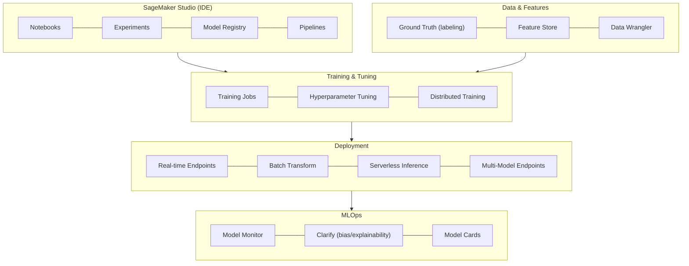
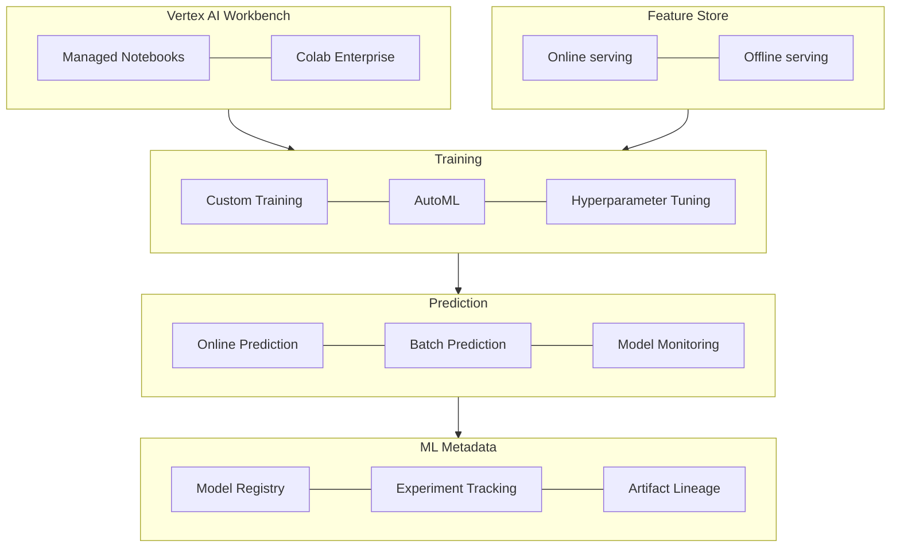
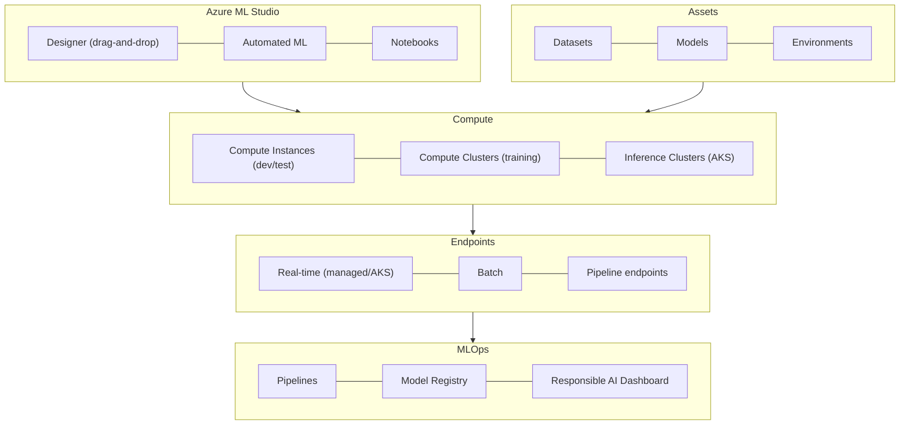

# Lesson 07: Managed ML Services Comparison

## Lesson Overview

Lessons 02-04 built ML infrastructure by hand — VMs, storage, Kubernetes clusters — on AWS, GCP, and Azure. Managed ML platforms (SageMaker, Vertex AI, Azure ML) sit on top of that same infrastructure and take over the parts that are mostly undifferentiated toil: provisioning training compute, tracking experiments, versioning models, and standing up endpoints. None of them do anything a team couldn't build themselves on the underlying VMs/Kubernetes — the value is entirely in not having to build and maintain that plumbing. This lesson compares the three platforms directly, then works through when the tradeoff (less control, a service fee, some lock-in) is worth it versus building custom.

By the end of this lesson you will be able to compare SageMaker, Vertex AI, and Azure ML feature-for-feature, train and deploy a model on each, evaluate their cost-performance tradeoffs, plan a migration between platforms, and apply a build-vs-buy framework to decide when a managed platform is the right call versus custom infrastructure.

---

## Table of Contents

1. [Overview of Managed ML Platforms](#1-overview-of-managed-ml-platforms)
2. [AWS SageMaker Deep Dive](#2-aws-sagemaker-deep-dive)
3. [Google Vertex AI Deep Dive](#3-google-vertex-ai-deep-dive)
4. [Azure Machine Learning Deep Dive](#4-azure-machine-learning-deep-dive)
5. [Feature Comparison Matrix](#5-feature-comparison-matrix)
6. [Cost Comparison](#6-cost-comparison)
7. [Migration Strategies](#7-migration-strategies)
8. [Build vs Buy Decision Framework](#8-build-vs-buy-decision-framework)
9. [Best Practices](#9-best-practices)
10. [Putting It All Together: Choosing and Deploying a Platform](#10-putting-it-all-together-choosing-and-deploying-a-platform)
11. [Key Takeaways](#11-key-takeaways)
12. [What's Next?](#whats-next)
13. [Further Reading](#further-reading)

---

## 1. Overview of Managed ML Platforms

Every managed platform covers the same six areas of the ML lifecycle — they differ in depth and polish, not in scope:

| Category | Capabilities |
|---|---|
| Data preparation | Data labeling, feature engineering, feature stores, data validation |
| Model training | Distributed training, AutoML, hyperparameter tuning, experiment tracking |
| Deployment | Real-time endpoints, batch inference, edge, A/B testing |
| Model management | Model registry, versioning, lineage, governance |
| Monitoring | Drift detection, performance tracking, explainability, alerts |
| MLOps | Pipelines, CI/CD, GitOps, automation |

### 1.1 Platform Positioning

| Platform | Strength | Best For | Ideal Customer |
|---|---|---|---|
| AWS SageMaker | Ecosystem breadth, integrations | AWS-native orgs, full ML lifecycle, production scale | Enterprises already on AWS |
| Google Vertex AI | AutoML, TPU access, BigQuery ML | TensorFlow users, fast prototyping, data-heavy ML | Startups, AI-first companies |
| Azure ML | Enterprise governance, Azure OpenAI, compliance | Microsoft shops, MLOps at scale, regulated industries | Enterprises already on Azure |

---

## 2. AWS SageMaker Deep Dive

SageMaker is AWS's comprehensive managed ML platform — the most feature-complete of the three, at a modest cost premium over running the equivalent infrastructure yourself.

### 2.1 Architecture



### 2.2 Training

```python
import sagemaker
from sagemaker.pytorch import PyTorch
from sagemaker import get_execution_role

session, role = sagemaker.Session(), get_execution_role()
bucket = session.default_bucket()

estimator = PyTorch(
    entry_point='train.py', source_dir='./src', role=role,
    instance_type='ml.p3.2xlarge', instance_count=1,
    framework_version='2.0.0', py_version='py310',
    hyperparameters={'epochs': 10, 'batch-size': 32, 'learning-rate': 0.001},
    output_path=f's3://{bucket}/models',
    metric_definitions=[{'Name': 'train:loss', 'Regex': 'Train Loss: ([0-9.]+)'}],
)
estimator.fit({'training': f's3://{bucket}/data/train', 'validation': f's3://{bucket}/data/val'})
print(f"Model artifacts: {estimator.model_data}")
```

### 2.3 Deployment and Autoscaling

```python
from sagemaker.pytorch import PyTorchModel

model = PyTorchModel(model_data=estimator.model_data, role=role, entry_point='inference.py',
                      source_dir='./src', framework_version='2.0.0', py_version='py310')
predictor = model.deploy(instance_type='ml.g4dn.xlarge', initial_instance_count=2,
                          endpoint_name='resnet50-endpoint')
result = predictor.predict(data={'image': image_bytes})

# Target-tracking autoscaling on invocations-per-instance
autoscale = boto3.client('application-autoscaling')
resource_id = f'endpoint/{predictor.endpoint_name}/variant/AllTraffic'
autoscale.register_scalable_target(ServiceNamespace='sagemaker', ResourceId=resource_id,
    ScalableDimension='sagemaker:variant:DesiredInstanceCount', MinCapacity=2, MaxCapacity=10)
autoscale.put_scaling_policy(
    PolicyName='sagemaker-autoscale', ServiceNamespace='sagemaker', ResourceId=resource_id,
    ScalableDimension='sagemaker:variant:DesiredInstanceCount', PolicyType='TargetTrackingScaling',
    TargetTrackingScalingPolicyConfiguration={'TargetValue': 70.0, 'PredefinedMetricSpecification': {
        'PredefinedMetricType': 'SageMakerVariantInvocationsPerInstance'}},
)
```

### 2.4 Pipelines (MLOps)

A `Pipeline` chains `ProcessingStep`/`TrainingStep` objects the same way an Airflow DAG chains tasks — each step's output feeds the next step's input, and the whole thing is versioned and re-runnable:

```python
from sagemaker.workflow.pipeline import Pipeline
from sagemaker.workflow.steps import ProcessingStep, TrainingStep

preprocess = ProcessingStep(name='PreprocessData', processor=processor,
    inputs=[ProcessingInput(source=f's3://{bucket}/raw-data/', destination='/opt/ml/processing/input')],
    outputs=[ProcessingOutput(output_name='train', source='/opt/ml/processing/output/train')],
    code='preprocessing.py')

train = TrainingStep(name='TrainModel', estimator=estimator,
                      inputs={'training': training_input, 'validation': validation_input})

evaluate = ProcessingStep(name='EvaluateModel', processor=evaluation_processor,
    inputs=[ProcessingInput(source=train.properties.ModelArtifacts.S3ModelArtifacts,
                             destination='/opt/ml/processing/model')],
    outputs=[ProcessingOutput(output_name='evaluation', source='/opt/ml/processing/evaluation')],
    code='evaluation.py')

pipeline = Pipeline(name='MLPipeline', steps=[preprocess, train, evaluate])
pipeline.upsert(role_arn=role)
pipeline.start().wait()
```

### 2.5 Feature Store

A `FeatureGroup` is dual-purpose: the same features land in an **online store** (low-latency lookups by ID, for serving) and an **offline store** (queryable via Athena, for training) automatically:

```python
from sagemaker.feature_store.feature_group import FeatureGroup

fg = FeatureGroup(name='user-features', sagemaker_session=session)
fg.load_feature_definitions(data_frame=features_df)
fg.create(s3_uri=f's3://{bucket}/feature-store', record_identifier_name='user_id',
          event_time_feature_name='timestamp', role_arn=role, enable_online_store=True)
fg.ingest(data_frame=features_df, max_workers=3, wait=True)

record = fg.get_record(record_identifier_value_as_string='user_123')       # online: serving
df = fg.athena_query().run(query_string='SELECT * FROM "user-features"',   # offline: training
                            output_location=f's3://{bucket}/queries/').as_dataframe()
```

---

## 3. Google Vertex AI Deep Dive

Vertex AI is Google Cloud's unified ML platform, and generally the strongest option for AutoML and TPU-backed training.

### 3.1 Architecture



### 3.2 Custom Training and AutoML

```python
from google.cloud import aiplatform

aiplatform.init(project='my-project-id', location='us-central1', staging_bucket='gs://my-bucket')

# Custom training on your own script
job = aiplatform.CustomTrainingJob(
    display_name='resnet50-training', script_path='train.py',
    container_uri='gcr.io/cloud-aiplatform/training/pytorch-gpu.1-13:latest',
    model_serving_container_image_uri='gcr.io/cloud-aiplatform/prediction/pytorch-gpu.1-13:latest',
)
model = job.run(dataset=dataset, replica_count=1, machine_type='n1-standard-8',
                 accelerator_type='NVIDIA_TESLA_V100', accelerator_count=1,
                 args=['--epochs', '100', '--batch-size', '64'], model_display_name='resnet50-v1')

# AutoML — no training script needed, Vertex searches architectures/hyperparameters itself
dataset = aiplatform.ImageDataset.create(display_name='my-image-dataset', gcs_source='gs://my-bucket/dataset.csv',
    import_schema_uri=aiplatform.schema.dataset.ioformat.image.single_label_classification)
automl_model = aiplatform.AutoMLImageTrainingJob(display_name='automl-image-classification',
    prediction_type='classification').run(dataset=dataset, model_display_name='automl-resnet',
    training_fraction_split=0.8, validation_fraction_split=0.1, test_fraction_split=0.1,
    budget_milli_node_hours=8000)
print(f"AutoML accuracy: {automl_model.evaluate()['auPrc']}")
```

### 3.3 Deployment and A/B Testing

```python
endpoint = model.deploy(machine_type='n1-standard-4', min_replica_count=2, max_replica_count=10,
                         accelerator_type='NVIDIA_TESLA_T4', accelerator_count=1,
                         traffic_split={'0': 100}, deployed_model_display_name='resnet50-v1')

prediction = endpoint.predict(instances=[{'image_bytes': {'b64': base64_encoded_image}}])

# Shift traffic between deployed model versions on the same endpoint
endpoint.update(traffic_split={'model-v1': 90, 'model-v2': 10})
```

### 3.4 Pipelines (Kubeflow/TFX)

Vertex Pipelines run standard Kubeflow Pipelines (KFP) — each `@component` is a containerized step, and `@dsl.pipeline` wires them into a DAG the same way SageMaker's `Pipeline` does:

```python
from kfp.v2 import dsl, compiler
from kfp.v2.dsl import component, Output, Dataset, Model

@component(base_image='python:3.9', packages_to_install=['pandas'])
def preprocess_data(input_data: str, output_data: Output[Dataset]):
    import pandas as pd
    pd.read_csv(input_data).to_csv(output_data.path, index=False)

@component(base_image='gcr.io/cloud-aiplatform/training/pytorch-gpu.1-13:latest')
def train_model(training_data: Dataset, model_output: Output[Model], epochs: int = 10):
    import torch
    torch.save(model, model_output.path)  # training logic omitted

@dsl.pipeline(name='ml-training-pipeline')
def ml_pipeline(data_uri: str, epochs: int = 10):
    prep = preprocess_data(input_data=data_uri)
    train_model(training_data=prep.outputs['output_data'], epochs=epochs)

compiler.Compiler().compile(pipeline_func=ml_pipeline, package_path='pipeline.json')
aiplatform.PipelineJob(display_name='ml-pipeline-run', template_path='pipeline.json',
    parameter_values={'data_uri': 'gs://my-bucket/data.csv', 'epochs': 20}).run()
```

---

## 4. Azure Machine Learning Deep Dive

Azure ML is Microsoft's enterprise-focused ML platform — its edge is governance, compliance, and native Azure OpenAI integration, covered in depth in Lesson 04.

### 4.1 Architecture



### 4.2 Training

```python
from azureml.core import Workspace, Experiment, ScriptRunConfig, Environment
from azureml.core.compute import ComputeTarget, AmlCompute

ws = Workspace.from_config()
compute_target = ComputeTarget.create(ws, 'gpu-cluster', AmlCompute.provisioning_configuration(
    vm_size='Standard_NC6s_v3', max_nodes=4, idle_seconds_before_scaledown=300))
compute_target.wait_for_completion(show_output=True)

env = Environment.from_conda_specification(name='pytorch-env', file_path='environment.yml')
config = ScriptRunConfig(source_directory='./src', script='train.py',
    arguments=['--data-path', ws.datasets['imagenet'].as_mount(), '--epochs', 100],
    compute_target=compute_target, environment=env)

run = Experiment(ws, 'resnet-training').submit(config)
run.wait_for_completion(show_output=True)
model = run.register_model(model_name='resnet50', model_path='outputs/model.pth',
                            tags={'framework': 'pytorch', 'task': 'classification'})
```

### 4.3 Deployment: ACI for Testing, AKS for Production

```python
from azureml.core.model import InferenceConfig, Model
from azureml.core.webservice import AciWebservice, AksWebservice

inference_config = InferenceConfig(entry_script='score.py', environment=env)

# ACI — cheap, fast, no autoscaling: good for testing a newly trained model
aci_service = Model.deploy(ws, 'resnet50-aci', [model], inference_config,
    AciWebservice.deploy_configuration(cpu_cores=2, memory_gb=4, auth_enabled=True))
aci_service.wait_for_deployment(show_output=True)

# AKS — autoscaling, production traffic
aks_config = AksWebservice.deploy_configuration(autoscale_enabled=True, autoscale_min_replicas=2,
    autoscale_max_replicas=10, autoscale_target_utilization=70, cpu_cores=2, memory_gb=4)
aks_service = Model.deploy(ws, 'resnet50-production', [model], inference_config, aks_config,
                            deployment_target=ComputeTarget(ws, 'aks-cluster'))
aks_service.wait_for_deployment(show_output=True)
```

### 4.4 Pipelines

`PythonScriptStep`s chained through `PipelineData` follow the same preprocess → train shape as SageMaker Pipelines and Vertex Pipelines, then `publish()` turns the pipeline into a versioned, callable endpoint:

```python
from azureml.pipeline.core import Pipeline, PipelineData
from azureml.pipeline.steps import PythonScriptStep

processed = PipelineData('processed', datastore=ws.get_default_datastore())
preprocess_step = PythonScriptStep(name='preprocess', script_name='preprocess.py',
    arguments=['--output', processed], outputs=[processed], compute_target=compute_target)
train_step = PythonScriptStep(name='train', script_name='train.py',
    arguments=['--input', processed], inputs=[processed], compute_target=compute_target)

pipeline = Pipeline(workspace=ws, steps=[preprocess_step, train_step])
pipeline.publish(name='training-pipeline-v1')
```

---

## 5. Feature Comparison Matrix

| Feature | SageMaker | Vertex AI | Azure ML |
|---|---|---|---|
| Notebooks | Studio — ★★★★★ | Workbench — ★★★★☆ | Compute Instances — ★★★★☆ |
| AutoML | Autopilot — ★★★★☆ | AutoML (best) — ★★★★★ | Automated ML — ★★★★☆ |
| Distributed training | Native — ★★★★★ | Native — ★★★★☆ | Native — ★★★★☆ |
| Model registry | ★★★★★ | ★★★★☆ | ★★★★★ |
| Feature store | ★★★★★ | ★★★★★ | Limited — ★★★☆☆ |
| Pipelines/MLOps | Pipelines — ★★★★★ | Kubeflow/TFX — ★★★★☆ | Pipelines — ★★★★★ |
| Real-time inference | ★★★★★ | ★★★★☆ | ★★★★★ |
| Batch inference | Transform — ★★★★★ | Batch Prediction — ★★★★★ | Batch Endpoint — ★★★★☆ |
| Model monitoring | Model Monitor — ★★★★★ | Model Monitor — ★★★★☆ | Data Drift — ★★★★☆ |
| Explainability | Clarify — ★★★★★ | Explainable AI — ★★★★★ | Responsible AI — ★★★★★ |
| Edge deployment | IoT Greengrass — ★★★★★ | Limited — ★★★☆☆ | IoT Edge — ★★★★★ |
| Enterprise/compliance | ★★★★☆ | ★★★☆☆ | ★★★★★ |
| Open-source integration | ★★★★☆ | Best — ★★★★★ | ★★★★☆ |

No platform wins across the board: SageMaker leads on breadth and edge deployment, Vertex AI on AutoML/open-source, Azure ML on enterprise governance.

---

## 6. Cost Comparison

**Training (100 GPU-hours, V100-class):**

| Platform | Instance | Total Cost |
|---|---|---|
| SageMaker | `ml.p3.2xlarge` ($3.825/hr, incl. mgmt fee) | $382.50 |
| Vertex AI | `n1-standard-8` + V100 ($3.06/hr) | $306.00 |
| Azure ML | `Standard_NC6s_v3` ($3.06/hr) | $306.00 |
| DIY (EC2) | `p3.2xlarge` ($3.06/hr) | $306.00 |

SageMaker's ~25% premium over the raw instance price is the cost of its extra tooling (Studio, Pipelines, Model Monitor) — Vertex AI and Azure ML pass training compute through at close to cost.

**Inference (1M requests/month, ~50ms avg latency):**

| Platform | Configuration | Monthly Cost |
|---|---|---|
| SageMaker | 2× `ml.m5.xlarge` + $0.00001/request | $360 |
| Vertex AI | 2× `n1-standard-4` + $0.000005/prediction | $283 |
| Azure ML | 2× `Standard_D4s_v3` + $0.000001/txn | $282 |
| DIY (AKS/EKS) | 2× `m5.xlarge`, no per-request fee | $280 |

**Storage (1TB data + models):**

| Platform | Storage | Monthly Cost |
|---|---|---|
| SageMaker (S3 Standard) | $0.023/GB | $23 |
| Vertex AI (GCS Standard) | $0.020/GB | $20 |
| Azure ML (Blob Hot) | $0.0184/GB | $18.40 |

At this scale the platforms cluster tightly, and DIY is only marginally cheaper than the cheapest managed option — the real cost difference shows up at much higher request volume (Section 8).

---

## 7. Migration Strategies

### 7.1 SageMaker → Vertex AI Checklist

1. **Training code** — `sagemaker.pytorch.PyTorch` → `aiplatform.CustomTrainingJob`; `SM_*` env vars → `AIP_*`; model output path `/opt/ml/model` → a GCS-mounted path.
2. **Data** — S3 → GCS via `gsutil` or Storage Transfer Service; SageMaker datasets → Vertex AI datasets.
3. **Models** — download from S3, upload to GCS, re-register in the Vertex Model Registry.
4. **Endpoints** — SageMaker endpoint → Vertex endpoint; inference client `boto3` → `aiplatform`.
5. **Pipelines** — SageMaker Pipelines → Kubeflow Pipelines; this step is a genuine rewrite, not a port.

Realistic estimate: **2-4 weeks** for a medium-sized project, dominated by the pipeline rewrite.

### 7.2 Insulating Against Lock-In

A thin adapter that hides which platform is behind `predict()` limits the blast radius of a future migration to this one class, rather than every call site:

```python
class UnifiedMLClient:
    def __init__(self, platform='sagemaker'):
        self.platform = platform
        if platform == 'sagemaker':
            self.client = boto3.client('sagemaker-runtime')
        elif platform == 'vertex':
            aiplatform.init(project='my-project')
            self.endpoint = aiplatform.Endpoint('projects/123/endpoints/456')
        elif platform == 'azure':
            self.service = Workspace.from_config().webservices['resnet50']

    def predict(self, data):
        if self.platform == 'sagemaker':
            resp = self.client.invoke_endpoint(EndpointName='my-endpoint', Body=json.dumps(data),
                                                ContentType='application/json')
            return json.loads(resp['Body'].read())
        elif self.platform == 'vertex':
            return self.endpoint.predict(instances=[{'data': data}]).predictions
        elif self.platform == 'azure':
            return requests.post(self.service.scoring_uri, json={'data': data},
                                  headers={'Content-Type': 'application/json'}).json()
```

---

## 8. Build vs Buy Decision Framework

| Factor | Favors managed | Favors custom |
|---|---|---|
| Team size | <10 people | >20 people |
| ML maturity | Early stage | Advanced |
| Deployment frequency | Monthly | Daily/hourly |
| Custom requirements | Low | High |
| Budget | Flexible | Cost-sensitive |
| Time to market | Fast (weeks) | Flexible (months) |
| Compliance needs | Standard | Custom |
| Scale | <10M requests/day | >100M requests/day |
| Multi-cloud strategy | No | Yes |
| Special hardware | Needs TPU | Standard GPU |

### 8.1 Break-Even Analysis

For the inference numbers in Section 6 — managed at $360/month versus a DIY setup with a $5,000 upfront build cost plus $2,280/month ($280 compute + $2,000 maintenance):

```
Managed total:  $360 × N
DIY total:      $5,000 + $2,280 × N

Break-even:  $360N = $5,000 + $2,280N  →  N = -2.6 months
```

A negative break-even point means managed is cheaper at every N — DIY never catches up at this scale. DIY only wins when the scale is high enough that the *per-request* fee (not the base instance cost) dominates the bill: very high request volume (>10M/day), a hard requirement for special hardware, multi-cloud portability, or a commitment horizon long enough (3+ years) that the $2,000/month maintenance cost is worth absorbing for full control.

---

## 9. Best Practices

**Choose AWS SageMaker if:** you're already on AWS, need the most comprehensive MLOps feature set, want a single end-to-end managed experience, have enterprise compliance requirements, or need edge deployment via IoT Greengrass.

**Choose Google Vertex AI if:** you use TensorFlow extensively, need TPU access, want the strongest AutoML capability, lean heavily on BigQuery, or prefer open-source tooling (Kubeflow) under the hood.

**Choose Azure ML if:** you're a Microsoft-centric org, need Azure OpenAI integration, have strong governance requirements, are embedded in the Azure ecosystem (Office 365, Teams), or need enterprise MLOps at scale.

**Build custom if:** you're operating at very high scale (>100M requests/day), multi-cloud portability is a hard requirement, you have unusual hardware needs, deep in-house ML infrastructure expertise, and a long-term focus on cost optimization over speed of delivery.

---

## 10. Putting It All Together: Choosing and Deploying a Platform

**Scenario:** A 6-person ML team, already on AWS, needs to ship an image-classification API within a month, expects <1M requests/day at launch, and has no TPU or multi-cloud requirement.

**Applying the framework:** small team + fast timeline + standard scale + already on AWS → Section 8's table points squarely at "managed," and Section 1.1's positioning table points at **SageMaker** specifically, since staying on AWS avoids any migration cost at all.

```python
# 1. Train (Section 2.2)
estimator = PyTorch(entry_point='train.py', source_dir='./src', role=role,
                     instance_type='ml.p3.2xlarge', framework_version='2.0.0', py_version='py310')
estimator.fit({'training': f's3://{bucket}/data/train', 'validation': f's3://{bucket}/data/val'})

# 2. Deploy behind an autoscaling real-time endpoint (Section 2.3)
predictor = model.deploy(instance_type='ml.g4dn.xlarge', initial_instance_count=2,
                          endpoint_name='image-classifier')

# 3. Wrap with the adapter from Section 7.2 so a future migration only touches one class
client = UnifiedMLClient(platform='sagemaker')
```

**Estimated cost at launch traffic (<1M req/day):** training ≈ $30-50 one-off (a few GPU-hours); inference ≈ $360/month per Section 6's numbers; storage ≈ $23/month for a 1TB dataset. **Total ≈ $400/month** — comfortably inside "managed is cheaper" territory per the break-even math in Section 8.1, with the option to revisit build-vs-buy if traffic grows past ~10M requests/day.

---

## 11. Key Takeaways

1. **All three platforms cover the same six lifecycle areas** — the differentiator is depth per area, not the presence of a feature at all.
2. **SageMaker leads on breadth and edge deployment**, at roughly a 25% cost premium over raw compute for its extra tooling.
3. **Vertex AI leads on AutoML and open-source integration**, and passes training compute through near cost.
4. **Azure ML leads on enterprise governance and Azure OpenAI integration** — the natural choice for regulated, Microsoft-centric orgs.
5. **Migrating platforms is a real rewrite, not a port** — training/deployment code changes are mechanical, but pipeline orchestration usually has to be rebuilt from scratch.
6. **A thin client-adapter (Section 7.2) is cheap insurance** against lock-in even if you never migrate — it isolates the platform-specific code to one place.
7. **Managed beats DIY below roughly 10M requests/day** once the DIY setup/maintenance cost is priced in; the crossover only favors DIY at very high scale or when multi-cloud/custom-hardware is a hard requirement.
8. **Staying on your existing cloud provider is itself a decision factor** — it's free migration cost, and often outweighs a marginal feature advantage elsewhere.

---

## What's Next?

**Lesson 08** covers multi-cloud strategy and cost optimization — how to reason about running workloads across more than one provider, and the cross-cutting cost levers (reserved capacity, spot/preemptible instances, egress minimization) that apply regardless of which managed platform or raw infrastructure you've chosen.

---

## Further Reading

- **AWS SageMaker Documentation**: https://docs.aws.amazon.com/sagemaker/
- **Google Vertex AI Documentation**: https://cloud.google.com/vertex-ai/docs
- **Azure Machine Learning Documentation**: https://learn.microsoft.com/azure/machine-learning/
- **Kubeflow Pipelines**: https://www.kubeflow.org/docs/components/pipelines/
- **AWS to GCP Migration Guide**: https://cloud.google.com/architecture/migration-considerations

---
