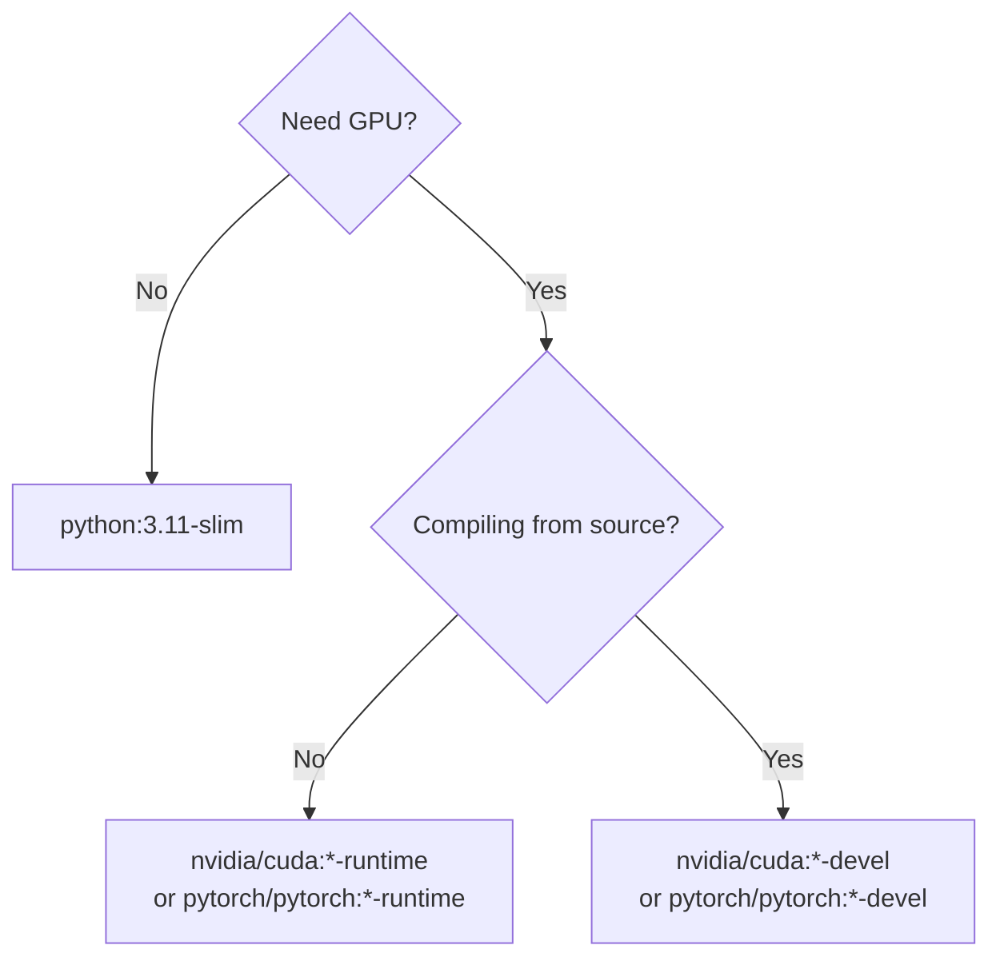

# Lesson 01: Dockerfiles for ML Applications

A Dockerfile is a recipe: a sequence of instructions Docker executes to build an image, one cached layer per instruction. This lesson covers the instructions you'll actually use for ML workloads, which base image to start from, how to install PyTorch/TensorFlow without breaking CUDA compatibility, and how to handle model weights that are too large to bake into the image.

**Prerequisites:** Docker fundamentals — containers, images, basic `docker` commands (Phase 1's Docker & Containers module).

### Contents

1. [Dockerfile Instructions](#dockerfile-instructions)
2. [Choosing a Base Image](#choosing-a-base-image)
3. [Installing ML Dependencies](#installing-ml-dependencies)
4. [Handling Model Files](#handling-model-files)
5. [.dockerignore](#dockerignore)
6. [A Complete ML Dockerfile](#a-complete-ml-dockerfile)
7. [Common Pitfalls](#common-pitfalls)
8. [Practical Exercise](#practical-exercise)
9. [Key Takeaways](#key-takeaways)
10. [Additional Resources](#additional-resources)

---

## Dockerfile Instructions

```dockerfile
FROM python:3.11-slim          # base image
WORKDIR /app                   # all following paths are relative to this
COPY requirements.txt .        # copy first, for layer caching
RUN pip install --no-cache-dir -r requirements.txt
COPY . .                       # copy the rest of the code
ENV PYTHONUNBUFFERED=1
EXPOSE 8000
CMD ["uvicorn", "main:app", "--host", "0.0.0.0", "--port", "8000"]
```

| Instruction | Purpose | ML-specific note |
|---|---|---|
| `FROM` | Base image | Pick by GPU need — see next section |
| `WORKDIR` | Sets the working directory for everything after it | Avoids repeating absolute paths |
| `RUN` | Executes a command, creates a layer | Chain with `&&` and clean up apt caches to keep layers small |
| `COPY` | Copies files from build context into the image | Copy `requirements.txt` before the rest of the code — see caching below |
| `ENV` | Sets environment variables, persists into the running container | `PYTHONUNBUFFERED=1` so logs aren't buffered; `CUDA_VISIBLE_DEVICES` to control GPU access |
| `EXPOSE` | Documents the listening port | Doesn't publish it — still need `-p` on `docker run` |
| `CMD` / `ENTRYPOINT` | What runs when the container starts | Use exec form (`["python", "app.py"]`), not shell form — shell form doesn't forward signals, so `docker stop` has to wait out the full timeout and SIGKILL the process |

**`ENTRYPOINT` + `CMD` together** gives a flexible default that's still overridable:

```dockerfile
ENTRYPOINT ["python", "-m"]
CMD ["serve"]
# docker run my-image        → python -m serve
# docker run my-image train  → python -m train
```

**Layer caching order matters.** Docker caches each layer and reuses it if the instruction and its inputs haven't changed:

```dockerfile
# Slow: any code change invalidates the pip install layer too
COPY . /app/
RUN pip install -r requirements.txt

# Fast: pip install layer only invalidates when requirements.txt changes
COPY requirements.txt /app/
RUN pip install -r requirements.txt
COPY . /app/
```

---

## Choosing a Base Image



| Image | Size | Use for |
|---|---|---|
| `python:3.11-slim` | ~50MB base | CPU-only inference, no GPU |
| `python:3.11` | ~300MB base | CPU workloads needing more system tools |
| `nvidia/cuda:12.1.0-cudnn8-runtime-ubuntu22.04` | ~2GB | GPU inference — runtime libs only |
| `nvidia/cuda:12.1.0-cudnn8-devel-ubuntu22.04` | ~4GB+ | GPU training / compiling extensions from source |
| `pytorch/pytorch:2.1.0-cuda12.1-cudnn8-runtime` | ~4GB | PyTorch pre-installed and version-matched to CUDA |
| `tensorflow/tensorflow:2.15.0-gpu` | ~4GB+ | TensorFlow pre-installed with GPU support |

Reading a CUDA tag: `12.1.0-cudnn8-runtime-ubuntu22.04` = CUDA 12.1.0, cuDNN 8, runtime (not devel) variant, on Ubuntu 22.04. `runtime` has just enough to *run* CUDA code; `devel` adds the compiler toolchain needed to *build* it.

---

## Installing ML Dependencies

**pip vs conda:** pip is smaller and faster to build; conda is worth it only when you need non-Python compiled dependencies conda handles better than pip wheels.

**Matching PyTorch to your CUDA version is the single most common Dockerfile mistake:**

```dockerfile
# WRONG — plain `pip install torch` on a CUDA 12.1 base
# silently grabs a CPU or mismatched-CUDA build
FROM nvidia/cuda:12.1.0-runtime-ubuntu22.04
RUN pip install torch

# CORRECT — pin the index to match the base image's CUDA version
FROM nvidia/cuda:12.1.0-runtime-ubuntu22.04
RUN pip install torch==2.1.0 torchvision==0.16.0 \
    --index-url https://download.pytorch.org/whl/cu121
```

The result of getting this wrong isn't a build failure — it's a container that starts fine and then `torch.cuda.is_available()` returns `False` or crashes on the first `.cuda()` call, which is much slower to debug.

TensorFlow follows the same rule: `pip install tensorflow[and-cuda]==2.15.0` on a CUDA 12.1 base, or just start from `tensorflow/tensorflow:2.15.0-gpu` and skip matching versions yourself.

---

## Handling Model Files

| Model size | Approach |
|---|---|
| Small (<100MB) | `COPY models/resnet18.pth /app/models/` — fine to bake in |
| Large (>100MB) | Don't bake in — see below |

Baking a multi-GB model into the image makes every pull slow and every rebuild re-push that weight even when only the code changed. Three better options:

```dockerfile
# 1. Download on container startup
CMD ["sh", "-c", "test -f /app/models/model.pth || wget -O /app/models/model.pth $MODEL_URL && python main.py"]
```

```bash
# 2. Mount as a volume at runtime
docker run -v /host/models:/app/models my-image
```

```python
# 3. Pull from a model registry in application code
import mlflow
model = mlflow.pytorch.load_model("models:/my-model/production")
```

---

## .dockerignore

```
**/__pycache__
**/.git
**/.venv
*.pyc
.env
*.log
notebooks/
tests/
data/large_dataset/
```

Excludes files from the build context — faster builds, smaller images, and it keeps `.env` secrets from accidentally landing in a layer via a stray `COPY .`.

---

## A Complete ML Dockerfile

```dockerfile
FROM python:3.11-slim

WORKDIR /app

RUN apt-get update && apt-get install -y curl \
    && rm -rf /var/lib/apt/lists/*

COPY requirements.txt .
RUN pip install --no-cache-dir -r requirements.txt

COPY src/ ./src/
COPY models/ ./models/
COPY main.py .

ENV PYTHONUNBUFFERED=1 \
    MODEL_PATH=/app/models/model.pth

RUN useradd -m -u 1000 appuser && chown -R appuser:appuser /app
USER appuser

EXPOSE 8000

HEALTHCHECK --interval=30s --timeout=10s --start-period=5s --retries=3 \
    CMD curl -f http://localhost:8000/health || exit 1

CMD ["uvicorn", "main:app", "--host", "0.0.0.0", "--port", "8000"]
```

Two things in there worth calling out: `useradd` + `USER appuser` drops root before the app runs (container escapes are much less dangerous from a non-root process), and the `HEALTHCHECK` gives orchestrators — including Compose's `depends_on: condition: service_healthy` in Lesson 04 — a real signal instead of "the process exists."

---

## Common Pitfalls

| Pitfall | Fix |
|---|---|
| `FROM python:3.11` + full `pip install torch torchvision` → 5GB+ image | `python:3.11-slim` + CPU-only wheel index if no GPU needed (full optimization in Lesson 02) |
| `COPY . .` before `pip install` — every code change reinstalls all dependencies | Copy `requirements.txt` and install first, then copy code |
| Container runs as root | `useradd` + `USER appuser` before `CMD` |
| No `HEALTHCHECK` — orchestrator can't tell "running" from "actually working" | Add one hitting a real `/health` endpoint |
| `EXPOSE 8000` but forgetting `-p 8000:8000` on `docker run` | `EXPOSE` is documentation only, not publishing |

---

## Practical Exercise

Write a Dockerfile for a FastAPI service that serves PyTorch image classification predictions:

```
ml-api/
├── Dockerfile
├── requirements.txt
├── app.py            # FastAPI app with /health and /predict
├── model.py          # ImageClassifier wrapping a ResNet18
└── models/resnet18.pth
```

Requirements: exec-form CMD, a non-root user, a health check, `requirements.txt` copied before the rest of the code, and an image under 2GB.

<details>
<summary><strong>Sample Solution</strong></summary>

```dockerfile
FROM python:3.11-slim
WORKDIR /app

RUN apt-get update && apt-get install -y curl && rm -rf /var/lib/apt/lists/*

COPY requirements.txt .
RUN pip install --no-cache-dir -r requirements.txt

COPY app.py model.py .
COPY models/ ./models/

ENV PYTHONUNBUFFERED=1

RUN useradd -m -u 1000 appuser && chown -R appuser:appuser /app
USER appuser

EXPOSE 8000

HEALTHCHECK --interval=30s --timeout=10s --start-period=5s --retries=3 \
    CMD curl -f http://localhost:8000/health || exit 1

CMD ["uvicorn", "app:app", "--host", "0.0.0.0", "--port", "8000"]
```

```bash
docker build -t ml-api:v1 .
docker run -d -p 8000:8000 --name ml-api ml-api:v1
curl http://localhost:8000/health
curl -X POST -F "file=@test_image.jpg" http://localhost:8000/predict
```

</details>

---

## Key Takeaways

1. Copy `requirements.txt` and install dependencies before copying application code — that's the single biggest layer-caching win.
2. Pick the base image by GPU need first, then runtime-vs-devel by whether you're compiling anything.
3. Match the PyTorch/TensorFlow CUDA index to the base image's CUDA version explicitly — a silent mismatch fails at runtime, not build time.
4. Never bake large model weights into the image; download at startup, mount as a volume, or pull from a model registry.
5. Run as a non-root user and add a real `HEALTHCHECK` — both pay off the moment this image reaches an orchestrator.

## Additional Resources

- [Dockerfile Reference](https://docs.docker.com/engine/reference/builder/)
- [Best Practices for Writing Dockerfiles](https://docs.docker.com/develop/develop-images/dockerfile_best-practices/)
- [PyTorch Docker Images](https://hub.docker.com/r/pytorch/pytorch)
- [NVIDIA NGC Catalog](https://catalog.ngc.nvidia.com/)

---

**Next Lesson:** [02-image-optimization.md](./02-image-optimization.md) — Cutting image size with multi-stage builds
