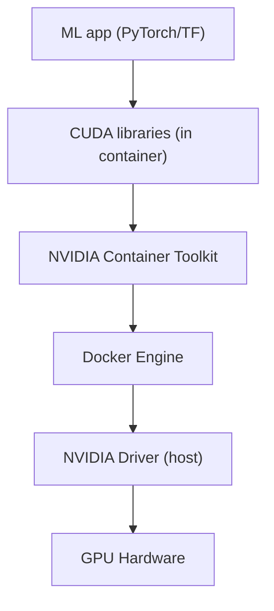

# Lesson 06: GPU Support in Docker

GPU workloads need the driver, CUDA, and your ML framework to be on matching versions — and that's fragile to get right by hand on every machine. The NVIDIA Container Toolkit solves this: it lets a container use the host's GPU without the driver having to live inside the image, so one image runs unchanged on any host with a compatible driver.

In this lesson you'll learn how to:

- Install and verify the NVIDIA Container Toolkit
- Pick the right CUDA base image for training vs. inference
- Allocate and monitor GPUs inside a container
- Run multi-GPU training

**Prerequisites:** a machine with an NVIDIA GPU and driver installed; comfort building Dockerfiles (Lessons 01-02).

### Contents

1. [Why GPU Containers](#why-gpu-containers)
2. [NVIDIA Container Toolkit](#nvidia-container-toolkit)
3. [Running GPU Containers](#running-gpu-containers)
4. [CUDA Base Images](#cuda-base-images)
5. [Building GPU-Enabled Images](#building-gpu-enabled-images)
6. [GPU Allocation and Monitoring](#gpu-allocation-and-monitoring)
7. [Multi-GPU Training](#multi-gpu-training)
8. [Common Issues](#common-issues)
9. [Practical Exercise](#practical-exercise)
10. [Key Takeaways](#key-takeaways)
11. [Additional Resources](#additional-resources)

---

## Why GPU Containers

Two pieces make GPU access work, and they live in different places:

- **Driver** — lives on the **host**. Talks directly to the physical GPU. Never goes inside a container.
- **CUDA libraries** — live **inside the container/image**. This is the version your code actually compiles/runs against.

The **NVIDIA Container Toolkit** is what connects the two — it lets a container reach the host's GPU driver without needing its own copy of it:



> [!NOTE]
> The only host requirement is a driver new enough to support your container's CUDA version — the CUDA libraries themselves travel with the image, not the host. That's why the same image runs unchanged on a laptop and a cloud GPU instance: swap hosts, keep the image, just make sure the host driver is recent enough.

---

## NVIDIA Container Toolkit

```bash
# Confirm hardware and driver first
lspci | grep -i nvidia
nvidia-smi

# Ubuntu/Debian install
distribution=$(. /etc/os-release; echo $ID$VERSION_ID)
curl -fsSL https://nvidia.github.io/libnvidia-container/gpgkey | \
    sudo gpg --dearmor -o /usr/share/keyrings/nvidia-container-toolkit-keyring.gpg
curl -s -L https://nvidia.github.io/libnvidia-container/$distribution/libnvidia-container.list | \
    sed 's#deb https://#deb [signed-by=/usr/share/keyrings/nvidia-container-toolkit-keyring.gpg] https://#g' | \
    sudo tee /etc/apt/sources.list.d/nvidia-container-toolkit.list
sudo apt-get update && sudo apt-get install -y nvidia-container-toolkit

sudo nvidia-ctk runtime configure --runtime=docker
sudo systemctl restart docker

# Verify
docker run --rm --gpus all nvidia/cuda:12.1.0-base-ubuntu22.04 nvidia-smi
```

If the last command doesn't print the host's GPU(s), the toolkit isn't wired into the Docker runtime — check `nvidia-ctk --version` and that Docker restarted cleanly.

---

## Running GPU Containers

```bash
docker run --rm --gpus all nvidia/cuda:12.1.0-base-ubuntu22.04 nvidia-smi        # all GPUs
docker run --rm --gpus 2 nvidia/cuda:12.1.0-base-ubuntu22.04 nvidia-smi          # first 2
docker run --rm --gpus '"device=0"' nvidia/cuda:12.1.0-base-ubuntu22.04 nvidia-smi   # GPU 0 only
docker run --rm --gpus '"device=0,2"' nvidia/cuda:12.1.0-base-ubuntu22.04 nvidia-smi # GPUs 0 and 2
```

---

## CUDA Base Images

Naming: `nvidia/cuda:[CUDA_VERSION]-[FLAVOR]-[OS]`, e.g. `nvidia/cuda:12.1.0-cudnn8-runtime-ubuntu22.04`.

| Flavor | Size | Contents | Use Case |
|---|---|---|---|
| `base` | ~200MB | CUDA runtime only | Minimal GPU access, custom builds |
| `runtime` | ~1.5GB | Runtime + libraries | Inference |
| `devel` | ~3.5GB | Runtime + compilers, headers | Training, building CUDA extensions from source |
| `cudnn` (add-on tag) | varies | + cuDNN | Any deep learning workload |

Pick `devel` only if the build actually compiles CUDA code; otherwise `runtime` is smaller and has a smaller attack surface. Add `cudnn` for anything using PyTorch/TensorFlow's GPU convolution kernels.

```dockerfile
FROM nvidia/cuda:12.1.0-cudnn8-runtime-ubuntu22.04   # inference
FROM nvidia/cuda:12.1.0-cudnn8-devel-ubuntu22.04     # training, needs compilers
FROM nvidia/cuda:12.1.0-base-ubuntu22.04             # minimal GPU access
```

---

## Building GPU-Enabled Images

The pattern is the same across frameworks: start from a CUDA base, install Python, install the framework's CUDA-matched build, verify GPU visibility at build time.

```dockerfile
FROM nvidia/cuda:12.1.0-cudnn8-runtime-ubuntu22.04

RUN apt-get update && apt-get install -y python3.11 python3-pip \
    && rm -rf /var/lib/apt/lists/*

WORKDIR /app
COPY requirements.txt .
RUN pip3 install --no-cache-dir torch==2.1.0 torchvision==0.16.0 \
    --index-url https://download.pytorch.org/whl/cu121
RUN pip3 install --no-cache-dir -r requirements.txt

COPY . /app
RUN python3 -c "import torch; print(f'CUDA available: {torch.cuda.is_available()}')"

ENV PYTHONUNBUFFERED=1
CMD ["python3", "train.py"]
```

The critical detail is the `--index-url` — PyTorch wheels are built against a specific CUDA version, and pulling the plain PyPI wheel (CPU-only, or built for the wrong CUDA) is the single most common cause of "CUDA not available" inside a container that otherwise has GPU access.

TensorFlow's GPU build is a single extras-tagged install: `pip3 install tensorflow[and-cuda]==2.15.0`. Hugging Face stacks add `transformers`, `accelerate`, and `bitsandbytes` on top of the same CUDA-matched PyTorch base.

---

## GPU Allocation and Monitoring

**Per-container GPU pinning** — run separate workers against separate GPUs:

```bash
docker run -d --name worker1 --gpus '"device=0"' pytorch-gpu:v1
docker run -d --name worker2 --gpus '"device=1"' pytorch-gpu:v1
docker run -d --name worker3 --gpus '"device=2,3"' pytorch-gpu:v1
```

**Memory control** — cap fragmentation-prone PyTorch allocations, or set a hard fraction in code:

```bash
docker run --rm --gpus all -e PYTORCH_CUDA_ALLOC_CONF=max_split_size_mb:4096 pytorch-gpu:v1
```

```python
torch.cuda.set_per_process_memory_fraction(0.5, device=0)  # cap at 50% of GPU 0
```

**MIG (Multi-Instance GPU)**, available on A100/H100, partitions one physical GPU into several isolated instances for finer-grained sharing:

```bash
sudo nvidia-smi -mig 1                 # enable, requires reboot
sudo nvidia-smi mig -cgi 9,9,9,9       # create 4 instances
docker run --rm --gpus '"device=0:0"' pytorch-gpu:v1
```

**Monitoring**: `nvidia-smi` works the same way run against a container as on the host. For continuous metrics, NVIDIA's DCGM exporter feeds Prometheus:

```bash
docker run -d --gpus all --name dcgm-exporter -p 9400:9400 nvidia/dcgm-exporter:latest
curl http://localhost:9400/metrics | grep gpu
```

Watch `nvidia-smi dmon -s pucvmet` while training runs — utilization consistently under ~80% usually means the bottleneck is data loading, not the GPU. Fix it with more `DataLoader` workers and `pin_memory=True`, not a bigger GPU.

---

## Multi-GPU Training

`DataParallel` is the simplest path — one process, PyTorch splits batches across visible GPUs:

```python
model = MyModel()
if torch.cuda.device_count() > 1:
    model = torch.nn.DataParallel(model)
model = model.cuda()
```

```bash
docker run --rm --gpus all -v $(pwd)/data:/data pytorch-gpu:v1 python train.py
```

`DistributedDataParallel` (DDP) scales further — one process per GPU, less Python-level overhead:

```dockerfile
CMD ["python3", "-m", "torch.distributed.launch", "--nproc_per_node=auto", "train_ddp.py"]
```

For multiple GPU-bound services on one host, pin each to a distinct device in Compose:

```yaml
services:
  trainer-1:
    build: ./trainer
    deploy:
      resources:
        reservations:
          devices:
            - driver: nvidia
              device_ids: ['0']
              capabilities: [gpu]
  trainer-2:
    build: ./trainer
    deploy:
      resources:
        reservations:
          devices:
            - driver: nvidia
              device_ids: ['1']
              capabilities: [gpu]
```

---

## Common Issues

| Symptom | Cause | Fix |
|---|---|---|
| `CUDA version mismatch` | Framework wheel built for a different CUDA than the base image | Match the `--index-url` CUDA tag to the base image's CUDA version |
| `CUDA not available` inside container | Missing `--gpus` flag, or toolkit not configured | Run with `--gpus all`; re-check `nvidia-ctk --version` and `nvidia-smi` on host |
| `CUDA out of memory` | Batch too large, or fragmentation | Smaller batch, `torch.cuda.empty_cache()`, gradient accumulation, or mixed precision (`torch.cuda.amp`) |
| Low GPU utilization | Data loading bottleneck | More `DataLoader` workers, `pin_memory=True`, prefetch to GPU |

Mixed precision in practice:

```python
from torch.cuda.amp import autocast, GradScaler
scaler = GradScaler()
with autocast():
    outputs = model(inputs)
    loss = criterion(outputs, targets)
scaler.scale(loss).backward()
scaler.step(optimizer)
scaler.update()
```

---

## Practical Exercise

Build a three-stage GPU training pipeline: preprocess (CPU) → train (GPU) → export to ONNX (CPU), wired together with Compose.

**Requirements:** preprocessing and export run in lightweight `python:3.11-slim` images; training runs in a CUDA image and requests one GPU; all three share data through named volumes; the whole pipeline runs with one `docker compose up`.

<details>
<summary><strong>Sample Solution</strong></summary>

```
gpu-training/
├── docker-compose.yml
├── preprocess/{Dockerfile, preprocess.py}
├── train/{Dockerfile, train.py}
└── export/{Dockerfile, export.py}
```

```yaml
services:
  preprocess:
    build: ./preprocess
    volumes:
      - raw-data:/data/raw
      - processed-data:/data/processed
    command: python preprocess.py

  train:
    build: ./train
    depends_on: [preprocess]
    deploy:
      resources:
        reservations:
          devices:
            - driver: nvidia
              count: 1
              capabilities: [gpu]
    volumes:
      - processed-data:/data
      - models:/models
    environment:
      - EPOCHS=10
      - BATCH_SIZE=32
    command: python train.py

  export:
    build: ./export
    depends_on: [train]
    volumes:
      - models:/models
      - artifacts:/artifacts
    command: python export.py

volumes:
  raw-data:
  processed-data:
  models:
  artifacts:
```

`train/Dockerfile` is the only stage that needs CUDA:

```dockerfile
FROM nvidia/cuda:12.2.0-cudnn8-runtime-ubuntu22.04
RUN apt-get update && apt-get install -y --no-install-recommends python3 python3-pip \
    && rm -rf /var/lib/apt/lists/*
WORKDIR /app
RUN pip3 install --no-cache-dir torch torchvision pandas pyarrow
COPY train.py .
CMD ["python3", "train.py"]
```

`train/train.py` reads preprocessed parquet, trains a small classifier on whichever device is available, and writes `model.pt`:

```python
import os, torch, torch.nn as nn, pandas as pd
from pathlib import Path

EPOCHS = int(os.environ.get("EPOCHS", 10))
BATCH_SIZE = int(os.environ.get("BATCH_SIZE", 32))
device = torch.device("cuda" if torch.cuda.is_available() else "cpu")

train = pd.read_parquet("/data/train.parquet")
X = torch.tensor(train.drop(columns=["label"]).values, dtype=torch.float32, device=device)
y = torch.tensor(train["label"].values, dtype=torch.long, device=device)

model = nn.Sequential(
    nn.Linear(X.shape[1], 128), nn.ReLU(),
    nn.Linear(128, int(y.max().item()) + 1),
).to(device)

opt = torch.optim.Adam(model.parameters(), lr=1e-3)
loss_fn = nn.CrossEntropyLoss()

for epoch in range(EPOCHS):
    for i in range(0, len(X), BATCH_SIZE):
        opt.zero_grad()
        loss = loss_fn(model(X[i:i + BATCH_SIZE]), y[i:i + BATCH_SIZE])
        loss.backward()
        opt.step()

Path("/models").mkdir(exist_ok=True)
torch.save(model.state_dict(), "/models/model.pt")
```

`preprocess` and `export` stay on plain `python:3.11-slim` — no GPU needed for reading CSVs or exporting to ONNX. Run everything with:

```bash
docker compose build
docker compose up --abort-on-container-exit
docker compose run train nvidia-smi   # confirm GPU visibility
```

</details>

---

## Key Takeaways

1. The NVIDIA Container Toolkit exposes the host driver to containers — CUDA libraries live inside the image, so the container's CUDA version can differ from what's "installed" on the host.
2. Choose `runtime` for inference, `devel` only when compiling CUDA code, and add the `cudnn` variant for any deep learning framework.
3. Match the framework's CUDA build (e.g., PyTorch's `--index-url`) to the base image's CUDA version — the most common source of "CUDA not available" errors.
4. Pin GPUs explicitly (`--gpus '"device=N"'`) when running multiple GPU workloads on one host.
5. Low GPU utilization usually points at a data loading bottleneck, not a GPU shortage.

---

## Additional Resources

- [NVIDIA Container Toolkit](https://github.com/NVIDIA/nvidia-docker)
- [NVIDIA NGC Catalog](https://catalog.ngc.nvidia.com/)
- [PyTorch Docker Images](https://hub.docker.com/r/pytorch/pytorch)
- [CUDA Docker Hub](https://hub.docker.com/r/nvidia/cuda)

---

**Next Lesson:** [07-production-best-practices.md](./07-production-best-practices.md) — security, health checks, and graceful shutdown for production containers
