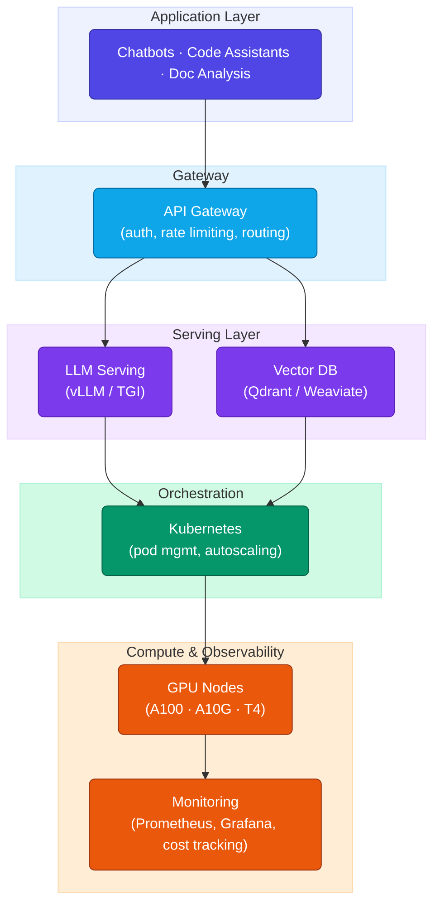
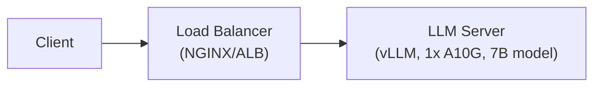
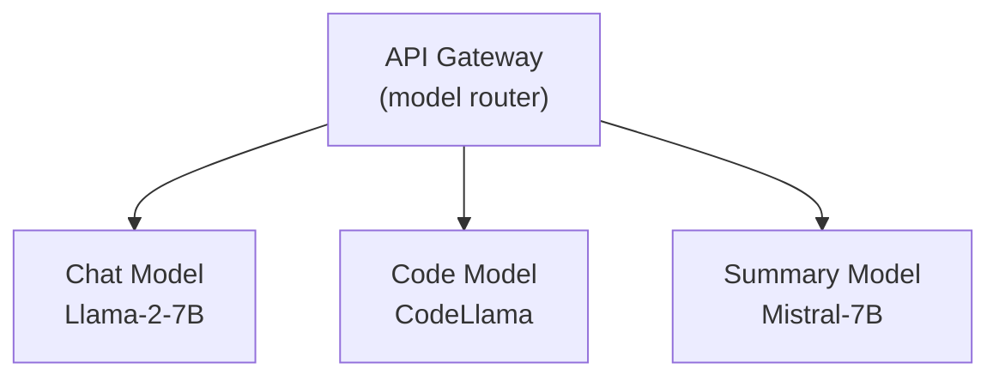
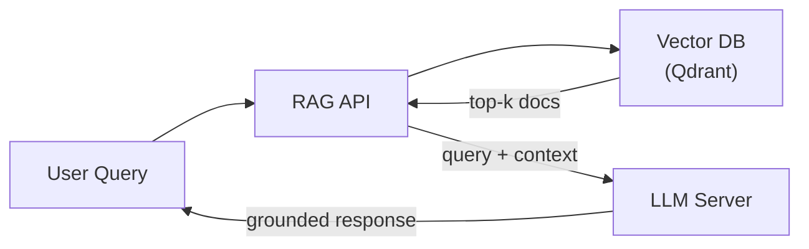
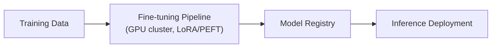
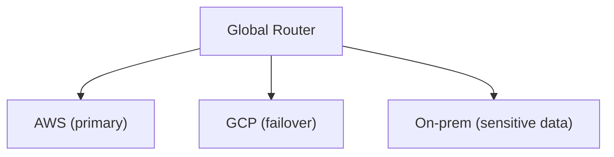
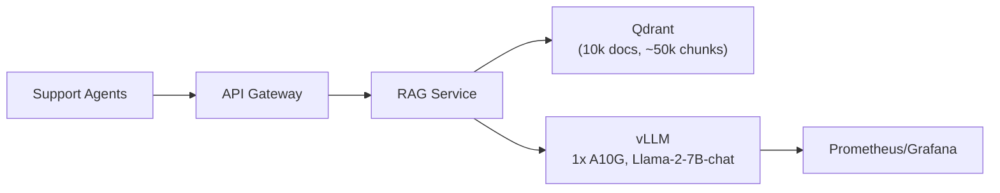

# Lesson 01: Introduction to LLM Infrastructure

Large Language Models power everything from chatbots to code assistants, but deploying and operating them in production is a different discipline from traditional ML or web infrastructure — model sizes are 10-1000x larger, inference is sequential and GPU-bound, and costs scale with tokens generated rather than requests served. This lesson covers the concepts, challenges, and patterns you need before diving into specific tools like vLLM.

**Prerequisites:** the [Cloud Architecture](../mod-02-cloud-computing/01-cloud-architecture.md) lesson, and basic familiarity with GPUs and transformer models.

### Contents

1. [What is LLM Infrastructure?](#what-is-llm-infrastructure)
2. [Why LLM Infrastructure is Different](#why-llm-infrastructure-is-different)
3. [Unique Challenges](#unique-challenges)
4. [Deployment Patterns](#deployment-patterns)
5. [Hardware Requirements](#hardware-requirements)
6. [Serving Frameworks](#serving-frameworks)
7. [Industry Landscape](#industry-landscape)
8. [Practical Exercise](#practical-exercise)
9. [Key Takeaways](#key-takeaways)
10. [Additional Resources](#additional-resources)

---

## What is LLM Infrastructure?

The complete stack required to deploy, serve, and operate LLMs in production: compute (GPUs), model serving, storage for weights/embeddings, orchestration, networking, monitoring, and the data pipelines that feed fine-tuning.



| Domain | Covers |
|---|---|
| Inference | Model hosting, request batching, streaming, auto-scaling |
| Fine-tuning | Training clusters, data prep, experiment tracking |
| RAG | Vector DBs, chunking, retrieval/ranking, embedding serving |
| Supporting | Caching (Redis), API gateways, cost tracking |

---

## Why LLM Infrastructure is Different

| Dimension | Traditional ML | LLMs |
|---|---|---|
| Model size | 10MB–1GB (BERT-base ≈ 440MB) | 5GB–100GB+ (Llama 2 70B ≈ 140GB FP16) |
| Memory | Fits one CPU/GPU | Needs multiple GPUs or offloading |
| Inference time | Milliseconds | Seconds (sequential, token-by-token) |
| Batching | Easy | Complex — variable sequence lengths |
| Cost driver | Per-request, often CPU-feasible | Per-token, GPU-bound, high fixed cost |
| Tooling | Mature, standard patterns | Rapidly evolving, novel techniques |

### Memory footprint

Don't just size a GPU for the model weights — that's only about two-thirds of what you actually need. While the model is generating text, it also keeps a running cache of everything it has "read" so far (the KV cache) and temporary scratch space for the current calculation (activations). Together those typically add another ~50% on top of the weights, so a rough rule of thumb is:

```
total_memory ≈ model_weights + kv_cache (≈20%) + activations (≈30%)
recommended_gpu_memory ≈ total_memory × 1.2   # leave a safety buffer
```

In practice, that means a 7B model isn't a "13GB GPU" model — it needs closer to 23GB once you account for the runtime overhead:

| Model | Precision | Weights | + KV cache + activations | Recommended GPU mem |
|---|---|---|---|---|
| Llama 2 7B | FP16 | 13GB | 19.6GB | ~23GB (1x A10G) |
| Llama 2 70B | FP16 | 130GB | 234GB+ | 4x A100-80GB |

### Latency & throughput

The numbers below make the "LLMs are just another model" assumption fall apart. A classic BERT classifier answers in milliseconds and handles thousands of requests per second, even on a CPU. An LLM generating 50 tokens is 100-1000x slower per request, because it has to generate one token at a time — and it needs a GPU just to be usable at all:

| Model | Hardware | p95 Latency | Throughput |
|---|---|---|---|
| BERT classification | CPU (8 cores) | 20ms | 400 req/s |
| BERT classification | GPU (T4) | 5ms | 2000 req/s |
| Llama 2 7B (50 tok) | CPU (32 cores) | 45s | 0.02 req/s |
| Llama 2 7B (50 tok) | GPU (T4) | 3s | 0.33 req/s |
| Llama 2 7B (50 tok) | GPU (A100) | 1.2s | 0.83 req/s |

---

## Unique Challenges

- **Memory constraints** — Weights + KV cache + activations exceed single-GPU VRAM.
  <span style="color:#059669">Mitigation: Quantization (FP16/INT8/INT4), PagedAttention, tensor parallelism, CPU/disk offload</span>

- **Inference latency** — Generation is sequential; each token depends on the last.
  <span style="color:#059669">Mitigation: Flash Attention (1.5–2x), speculative decoding (1.5–2.5x), continuous batching (3–10x throughput)</span>

- **Cost management** — GPUs cost $1–10/hr, and large deployments need dozens of them.
  <span style="color:#059669">Mitigation: Right-size the model, quantize, use spot instances, cache aggressively</span>

- **Quality & consistency** — Probabilistic outputs, hallucinations, prompt sensitivity.
  <span style="color:#059669">Mitigation: Prompt testing, output validation, A/B testing, RAG for grounding</span>

- **Scaling complexity** — GPU scheduling, stateful context, cold starts.
  <span style="color:#059669">Mitigation: Autoscale on GPU utilization + queue length, not just CPU</span>

- **Model updates** — 10–100GB downloads create memory pressure during rollout.
  <span style="color:#059669">Mitigation: Canary deploys, gradual rollout, rollback plan</span>

---

## Deployment Patterns

There's no single "correct" way to put an LLM into production — the right pattern depends on how many models you're running, how traffic behaves, and what the answer actually needs to be grounded in. Here are the five you'll run into most often, roughly in order of increasing complexity.

### 1. Single-Model Inference API



This is the pattern you reach for first, and often the only one you need: one model, sitting behind a load balancer, answering requests. It's easy to reason about and easy to debug, but it's also a single point of failure, and it wastes GPU capacity whenever traffic is bursty rather than steady. Good fit for proof-of-concepts and small, single-purpose services — not for anything that needs to survive a node going down.

### 2. Multi-Model Serving Platform



Once you have more than one model to serve — a chat model, a code model, a summarizer — you need something in front of them deciding which request goes where. The gateway routes by use case, model version, or even a traffic split for A/B testing, so each model can be scaled and monitored independently rather than sharing one undifferentiated pool.

### 3. RAG (Retrieval-Augmented Generation)



The model doesn't answer from memory alone here — it's handed relevant context first. The query gets embedded, the vector DB returns the top-k most similar documents, and those get stitched into the prompt before generation happens. This is what you reach for when an answer needs to be grounded in a specific, changing body of knowledge — a support bot answering from your docs, or a search tool over legal or medical records — rather than whatever the model happened to learn during training.

### 4. Fine-Tuning Pipeline



Fine-tuning is a training job, not a serving concern, so it's kept on its own infrastructure and only hands off a finished checkpoint to the serving layer once it's done. You rarely need to update every weight in the model to teach it a new style or domain — LoRA/PEFT with 8-bit loading gets you most of the benefit while keeping training memory on a single GPU manageable. A typical starting config looks like `r=16, lora_alpha=32, target_modules=[q_proj, v_proj]`.

### 5. Hybrid Cloud Deployment



Sometimes the deciding factor isn't the model at all — it's where the data and the compute are allowed to live. A global router can send most traffic to a primary cloud, fail over to a second provider if the first has an outage, and keep anything sensitive on-prem to satisfy a compliance requirement. This pattern shows up when cost arbitrage between providers, data residency rules, or disaster recovery planning matter more than serving simplicity.

| Pattern | Best For |
|---|---|
| Single-model API | POCs, low/medium traffic |
| Multi-model platform | Diverse use cases, A/B testing |
| RAG | Grounded QA, knowledge-base search |
| Fine-tuning pipeline | Domain/style adaptation |
| Hybrid cloud | Cost, compliance, DR |

---

## Hardware Requirements

Picking a GPU isn't just "how much VRAM does the model need" — it's how much VRAM the model needs *plus* the KV cache and activations that grow while it's actually generating (the same 1.5x-ish overhead from the [memory footprint](#memory-footprint) section above), divided across however many GPUs you're splitting the model over:

```
memory_per_gpu ≈ (params_B × bytes_per_param × 1.5 overhead) / tensor_parallel
```

So a 70B model at FP16 isn't "one huge GPU" — it's roughly 4x A100-80GB with `tensor_parallel=4`, because no single card holds the weights, cache, and activations on its own.

| GPU | VRAM | Relative Perf | Cost/hr | Best For |
|---|---|---|---|---|
| T4 | 16GB | 1x | $0.35–0.50 | 7B models, dev |
| A10G | 24GB | 2.5x | $1.00–1.50 | 7B–13B, production |
| A100 (40GB) | 40GB | 5x | $3.00–4.00 | 13B–30B, training |
| A100 (80GB) | 80GB | 5x | $4.00–5.50 | 30B–70B, large batch |
| H100 | 80GB | 8x | $8.00–10.00 | Largest models |

And the GPU is never the whole story — starve it of CPU, RAM, disk, or network and it sits idle waiting on the rest of the box:

- **CPU:** 8–16 cores per GPU, mainly for tokenization and request preprocessing so the GPU isn't waiting on the CPU between batches.
- **System RAM:** 64–256GB — enough headroom to stage a model in memory before it's loaded onto the GPU, plus room for the OS and any caching layers.
- **Disk:** NVMe SSD with 100–500GB per model, so cold starts and model swaps load in seconds rather than minutes.
- **Network:** 10Gbps+ between nodes — once a model is split across multiple GPUs (tensor or pipeline parallelism), they're constantly exchanging activations, and a slow network turns into the actual bottleneck.

---

## Serving Frameworks

None of these frameworks are interchangeable — each one optimizes for a different bottleneck, so the right pick depends on what you're actually trying to solve.

- **vLLM** — <span style="color:#2563eb">Best for high-throughput production serving.</span> Its PagedAttention algorithm manages the KV cache the way an OS manages memory pages, which is what lets it batch requests continuously instead of waiting for a batch to fully finish before starting the next one. It also speaks the OpenAI API out of the box, so it's a near drop-in replacement if you're already building against that interface. The payoff is real: 10–20x the throughput of plain Hugging Face Transformers on the same hardware.

- **TGI (Text Generation Inference)** — <span style="color:#2563eb">Best if you're already living in the Hugging Face ecosystem.</span> It supports token-by-token streaming, tensor parallelism for splitting a model across GPUs, and Flash Attention for faster attention computation — a solid, well-integrated default rather than the fastest option available.

- **TensorRT-LLM** — <span style="color:#2563eb">Best when you need maximum performance and you're committed to NVIDIA hardware.</span> It compiles the model down to highly optimized kernels, supports FP8 precision on H100s, and scales across multiple GPUs and nodes. The trade-off is setup complexity — this is the framework you reach for once you've outgrown the others, not the one you start with.

- **Ray Serve** — <span style="color:#2563eb">Best for multi-model pipelines rather than a single model.</span> If your request flow involves chaining several models together (a retriever, then a reranker, then an LLM, for example), Ray Serve handles the distributed serving, composition, and autoscaling of that whole pipeline rather than just one model in isolation.

- **LangChain / LlamaIndex** — <span style="color:#2563eb">Best for building RAG applications quickly.</span> These aren't serving frameworks in the same sense as the others — they sit a layer up, giving you retrieval components and pre-built chains so you're not wiring together the embed-retrieve-generate flow from scratch. They also make it easy to swap between model providers underneath.

---

## Industry Landscape

| Category | Providers |
|---|---|
| Managed LLM (cloud) | AWS Bedrock, GCP Vertex AI, Azure OpenAI Service |
| Self-managed (cloud) | AWS SageMaker/EC2 (P4/P5), GKE, Azure ND-series |
| GPU cloud (specialized) | Lambda Labs, RunPod, CoreWeave, Paperspace |
| Vector databases | Pinecone (managed), Weaviate, Qdrant, Chroma, Milvus |

### Real-world scenarios

- **Meta** trains and releases the Llama family of models as open weights, then relies on the broader ecosystem — vLLM, TGI, and similar serving frameworks — to actually deploy them. This is the self-managed end of the landscape: Meta isn't renting you inference through an API, it's giving you the model and expecting you to bring your own GPUs, orchestration, and serving stack, which is exactly the deployment work this lesson covers.

- **IBM** takes closer to the managed-platform approach with watsonx.ai, where it hosts both its own Granite models and select open-weight models (including Llama) behind a managed service aimed at enterprise customers — with the governance, data residency, and compliance tooling that regulated industries like banking and healthcare tend to require, similar in spirit to Bedrock or Vertex AI above.

Seeing both ends side by side is useful: Meta's approach gives you full control at the cost of owning the infrastructure yourself; IBM's approach trades some of that control for a managed platform that handles compliance and operations for you. Most real deployments land somewhere between the two, which is why this module covers both the self-managed stack (vLLM, Kubernetes, GPUs) and the platform-level concerns (routing, governance, cost) that managed offerings package up for you.

---

## Practical Exercise

Here's a scenario to work through before looking at the sample solution below: your company wants an internal support-chat assistant that agents can ask questions to instead of digging through the knowledge base by hand.

**What you're given:**

- About 5,000 queries a day — not huge, but steady traffic during business hours
- Every answer needs to be grounded in an existing 10,000-document knowledge base, not invented
- p95 latency has to stay under 3 seconds, or agents will just go back to searching manually
- A budget of roughly $1,000/month
- Everyone using it is in one region, so there's no need to serve a global audience

Before you look at the answer, try sketching your own architecture first — which deployment pattern fits, what GPU you'd pick, how you'd wire up retrieval, and roughly what it would cost. Getting it wrong and comparing is worth more than reading the solution cold.

<details>
<summary><strong>Sample Solution</strong></summary>

This is a textbook RAG use case: the traffic is modest, the answers need to be grounded in a fixed knowledge base rather than the model's general knowledge, and there's no reason to over-engineer for scale nobody needs yet.



A single 7B model on one A10G is enough here — 5,000 queries/day works out to well under 0.5 requests per second, nowhere near what would justify a bigger GPU or a multi-model setup. The RAG layer is what keeps answers trustworthy: instead of letting the model guess, every query gets grounded in the actual knowledge base, which is exactly what the "must be grounded" requirement is asking for. And because everyone's in a single region, there's no need for the multi-region complexity (or cost) that a global rollout would demand.

| Item | Cost |
|---|---|
| A10G (70% util) | ~$605/mo |
| Qdrant (managed, small tier) | $50/mo |
| Storage + embeddings | $20/mo |
| Load balancer + monitoring | $80/mo |
| **Total** | **~$755/mo** (under budget, with room to spare) |

The end result comes in about $245/month under budget — enough headroom to absorb some traffic growth before anything needs to be re-architected.

</details>

---

## Key Takeaways

1. LLM infrastructure differs from traditional ML in scale — model size, memory, and sequential inference all demand GPU-centric design
2. Memory is the primary constraint: budget for weights + KV cache + activations, not weights alone
3. Five common deployment patterns: single-model API, multi-model platform, RAG, fine-tuning pipeline, hybrid cloud
4. Match GPU to model size (T4/A10G for 7B–13B, A100/H100 for 30B+) and use tensor parallelism beyond one GPU's VRAM
5. Cost control comes from quantization, batching, caching, and spot instances — not just bigger budgets
6. vLLM is the default choice for high-throughput production serving; pick TGI/TensorRT-LLM/Ray Serve for specific needs

---

## Additional Resources

- [vLLM Documentation](https://vllm.readthedocs.io/)
- [The Illustrated Transformer](http://jalammar.github.io/illustrated-transformer/)
- [Hugging Face LLM Course](https://huggingface.co/learn/nlp-course/)
- [NVIDIA TensorRT-LLM Documentation](https://github.com/NVIDIA/TensorRT-LLM)

---

**Next Lesson:** [02-vllm-deployment.md](./02-vllm-deployment.md) — Deep dive into vLLM
