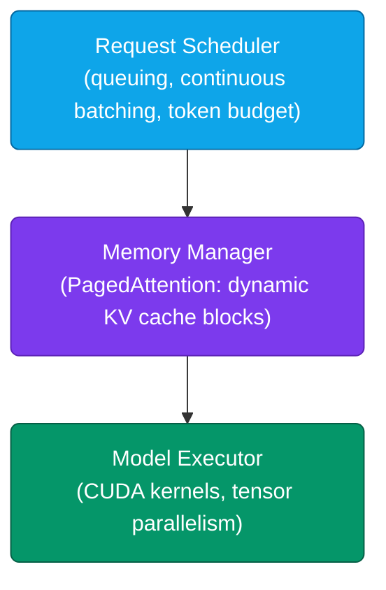
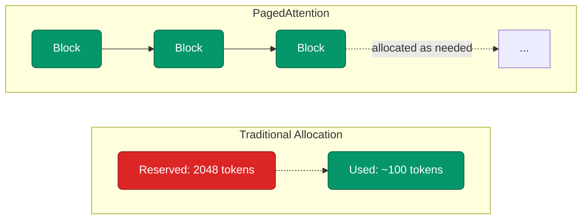
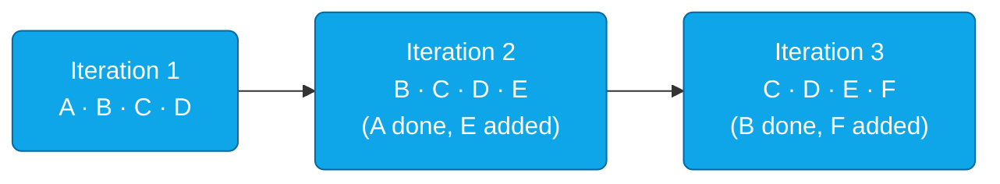
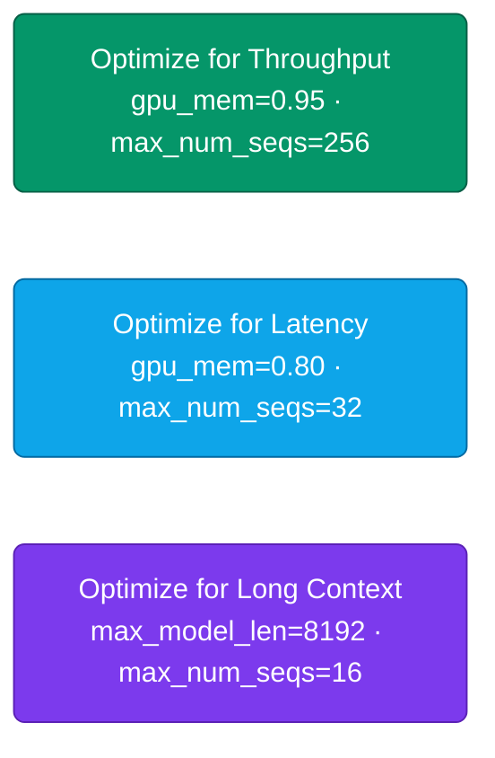
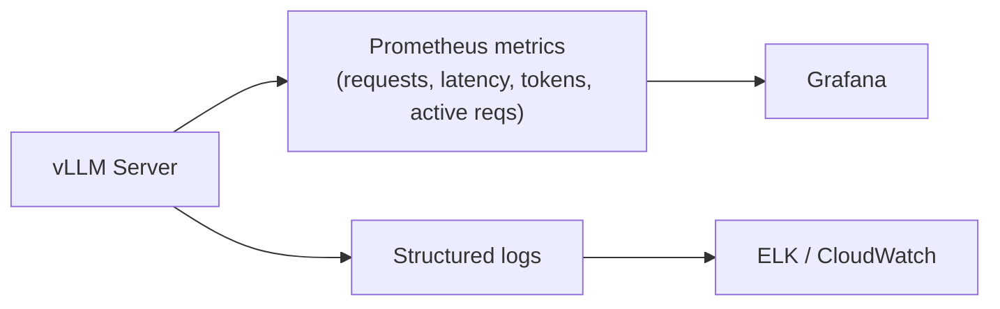
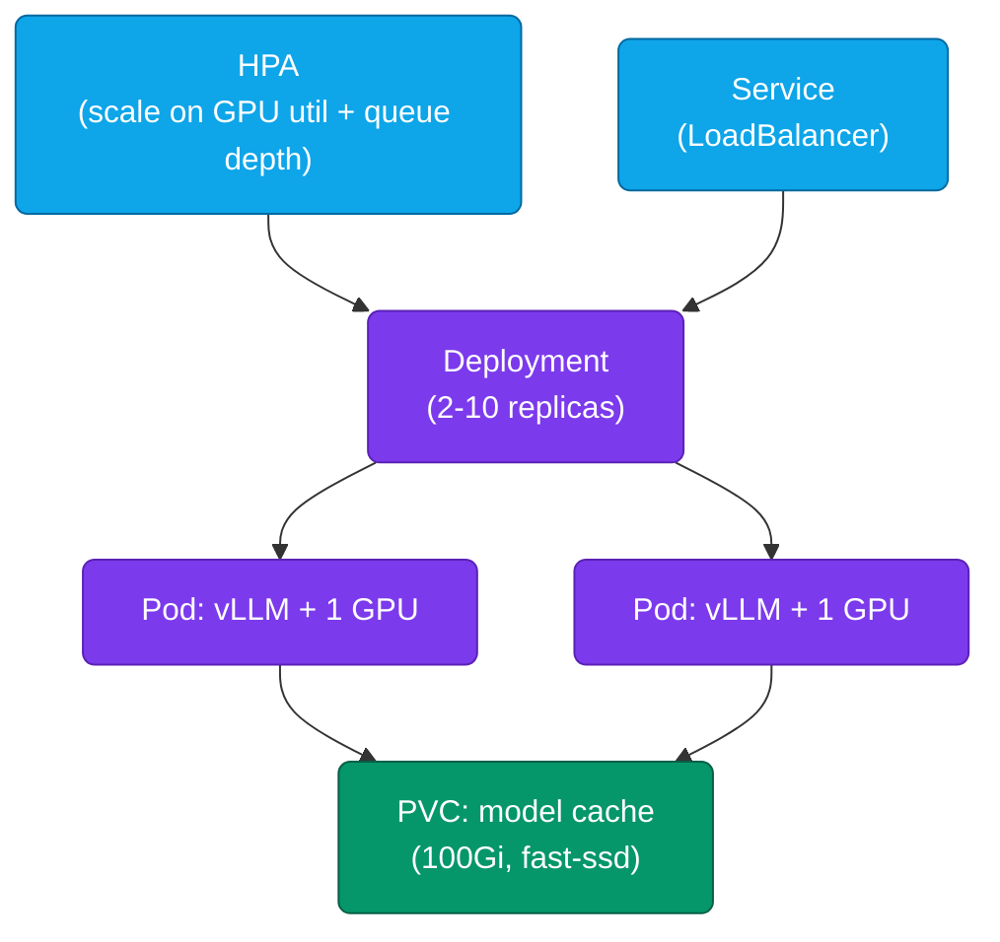

# Lesson 02: vLLM Deployment

vLLM is a high-throughput, memory-efficient inference engine built at UC Berkeley that has become the de facto standard for production LLM serving. This lesson covers why it's fast, how to deploy it — from a Python script to Docker to Kubernetes — and how to keep it healthy in production.

**Prerequisites:** [Lesson 01](./01-introduction-llm-infrastructure.md), a Linux box with an NVIDIA GPU (compute capability 7.0+) and CUDA 11.8+, Python 3.8+.

### Contents

1. [Why vLLM](#why-vllm)
2. [Architecture: PagedAttention & Continuous Batching](#architecture-pagedattention--continuous-batching)
3. [Installation](#installation)
4. [Basic Usage](#basic-usage)
5. [OpenAI-Compatible API Server](#openai-compatible-api-server)
6. [Performance Tuning](#performance-tuning)
7. [Multi-GPU & Tensor Parallelism](#multi-gpu--tensor-parallelism)
8. [Beyond the Basics: Newer vLLM Features](#beyond-the-basics-newer-vllm-features)
9. [Monitoring](#monitoring)
10. [Docker & Kubernetes Deployment](#docker--kubernetes-deployment)
11. [Production Best Practices](#production-best-practices)
12. [Practical Exercise](#practical-exercise)
13. [Key Takeaways](#key-takeaways)
14. [Additional Resources](#additional-resources)

---

## Why vLLM

The short version is that vLLM makes a GPU actually earn its cost. Plain Hugging Face Transformers leaves a lot of throughput on the table, and vLLM closes that gap — in practice you're looking at 10–20x higher throughput on the same hardware, mostly thanks to two ideas working together. PagedAttention manages the KV cache the way an operating system manages memory pages, so you stop wasting VRAM on cache space that's reserved but unused. And continuous batching means the GPU keeps working on other requests as soon as one finishes, instead of sitting idle waiting for a whole batch to wrap up together.

It's also easy to adopt without rewriting your application: vLLM ships an OpenAI-compatible server, so `/v1/chat/completions` works as a near drop-in replacement if you're already building against that API shape. Model support is broad — the LLaMA family, Mistral/Mixtral, Falcon, GPT-2/J/NeoX, CodeLlama, Qwen, Yi — and it supports quantization methods like AWQ, GPTQ, and SqueezeLLM when you need to trade a little quality for a smaller memory footprint.

Model support moves fast, so it's worth checking the current list rather than trusting a snapshot: [docs.vllm.ai/models/supported_models](https://docs.vllm.ai/en/latest/models/supported_models.html)

---

## Architecture: PagedAttention & Continuous Batching



**PagedAttention** borrows an idea straight from operating systems: rather than reserving a fixed, worst-case chunk of memory for every request's KV cache up front, it splits that memory into blocks and hands them out on demand — so a short request doesn't sit on memory it'll never use, and parallel samples of the same prompt can even share blocks instead of duplicating them.



**Continuous batching** works the same way on the request side: instead of waiting for an entire batch to finish before starting the next one, it swaps a finished request out and slots a new one in on the very next iteration, so the GPU is never sitting there waiting on the slowest request in the batch.



Put together, these two ideas are the whole reason vLLM outperforms naive serving: GPU utilization goes from the 20–40% typical of static batching up to 60–90%, which translates into 2–10x higher throughput on the same hardware.

---

## Installation

```bash
# Requirements: Linux, Python 3.8+, NVIDIA GPU (compute 7.0+), CUDA 11.8+, 16GB+ RAM
nvidia-smi                     # confirm CUDA/driver
python -m venv vllm-env && source vllm-env/bin/activate
pip install vllm
python -c "import vllm; print(vllm.__version__)"
```

**Verify with a small model** (works on 4GB+ GPU):

```python
from vllm import LLM, SamplingParams

llm = LLM(model="facebook/opt-125m", max_model_len=512, gpu_memory_utilization=0.3)
outputs = llm.generate(["Hello, how are you?"], SamplingParams(temperature=0.8, max_tokens=50))
print(outputs[0].outputs[0].text)
```

---

## Basic Usage

```python
from vllm import LLM, SamplingParams

llm = LLM(model="meta-llama/Llama-2-7b-chat-hf")  # requires HF token for gated models
sampling_params = SamplingParams(temperature=0.7, top_p=0.9, max_tokens=256, stop=["</s>"])

# Batch generation is vLLM's strength — process many prompts in one call
prompts = ["What is machine learning?", "Explain neural networks.", "What are LLMs?"]
outputs = llm.generate(prompts, sampling_params)

for prompt, output in zip(prompts, outputs):
    print(f"{prompt} -> {output.outputs[0].text}")
```

### Sampling presets

| Use case | Config |
|---|---|
| Deterministic | `temperature=0.0, top_p=1.0` |
| Creative | `temperature=1.0, top_p=0.95, top_k=50` |
| Code generation | `temperature=0.2, top_p=0.95, stop=["\`\`\`\n"]` |
| Chat | `temperature=0.7, repetition_penalty=1.1, stop=["User:"]` |

Multi-turn conversation state is just message history formatted into the model's chat template (e.g. Llama 2's `<s>[INST] ... [/INST]`) and re-sent each turn — vLLM itself is stateless per call.

---

## OpenAI-Compatible API Server

```bash
python -m vllm.entrypoints.openai.api_server \
    --model meta-llama/Llama-2-7b-chat-hf \
    --host 0.0.0.0 --port 8000 \
    --gpu-memory-utilization 0.90 \
    --max-model-len 4096 \
    --served-model-name llama-2-7b-chat
```

Then call it with the standard `openai` client — no code changes needed beyond `base_url`:

```python
from openai import OpenAI

client = OpenAI(base_url="http://localhost:8000/v1", api_key="dummy")
response = client.chat.completions.create(
    model="llama-2-7b-chat",
    messages=[{"role": "user", "content": "Explain quantum computing."}],
    temperature=0.7, max_tokens=512
)
print(response.choices[0].message.content)

# Streaming works the same way as OpenAI's API
stream = client.chat.completions.create(model="llama-2-7b-chat", messages=[...], stream=True)
for chunk in stream:
    if chunk.choices[0].delta.content:
        print(chunk.choices[0].delta.content, end="", flush=True)
```

For custom endpoints (batch, health checks, model info) beyond the OpenAI spec, wrap vLLM in FastAPI — a `/generate`, `/batch_generate`, and `/health` endpoint around `llm.generate()` covers most needs.

---

## Performance Tuning

There's no single "best" vLLM config — you're always trading off against something, and the right settings depend on which of throughput, latency, or context length actually matters most for your workload:



- **Chasing throughput?** Push `gpu_memory_utilization` and `max_num_seqs` as high as the GPU allows, and keep `max_model_len` short — more concurrent sequences means more requests processed per second, at the cost of any one request being slower.
- **Chasing latency?** Do the opposite: keep `max_num_seqs` low so a handful of requests aren't competing for the same GPU cycles, and leave some memory headroom unused so a sudden burst of traffic doesn't tip the server into contention.
- **Serving long documents?** Raise `max_model_len` to fit them, but expect to lower `max_num_seqs` in exchange — every sequence's KV cache scales with its length, so longer contexts leave room for fewer of them running at once.

### Benchmark before and after any config change

Don't trust intuition here — measure it. Three numbers tell you almost everything you need:

- **Throughput** — send N identical prompts and divide `requests / total_duration`.
- **Tokens per second** — `total_output_tokens / total_duration` over the same run.
- **p95 / p99 latency** — run M single-request trials, sort the results, and read off the percentile you care about.

One thing that trips people up: always send a warm-up request before you start timing. The first call pays for model compilation, and including that in your measurement will make every number look worse than what production traffic will actually see.

---

## Multi-GPU & Tensor Parallelism

A single GPU eventually runs out of room — a 70B model at FP16 simply doesn't fit on one 80GB card once you account for the KV cache and activations on top of the weights. vLLM's fix is tensor parallelism: split each layer across multiple GPUs with a single flag, `--tensor-parallel-size 4`, so no one GPU has to hold the whole model. It's a one-line change to turn on here — the deeper mechanics (why the GPU interconnect matters, when to reach for pipeline parallelism instead) are covered in [Lesson 06: LLM Serving Optimization](./06-llm-serving-optimization.md#multi-gpu-inference).

---

## Beyond the Basics: Newer vLLM Features

PagedAttention and continuous batching are the foundational ideas, but vLLM hasn't stood still. Two techniques worth knowing the names of: **speculative decoding**, where a small draft model guesses several tokens ahead for the main model to verify in one pass instead of generating them one at a time, and **prefix caching**, which reuses the KV cache across requests that share a common prefix (a repeated system prompt, for example) instead of recomputing it every time. Both are one-flag opt-ins in vLLM, and both get a full treatment — including *why* they work and how to benchmark the gain — in [Lesson 06: LLM Serving Optimization](./06-llm-serving-optimization.md).

---

## Monitoring



| Metric | Type | Why it matters |
|---|---|---|
| `vllm_requests_total` | Counter | Volume + error rate (`status` label) |
| `vllm_request_duration_seconds` | Histogram | Latency distribution (p50/p95/p99) |
| `vllm_tokens_generated_total` | Counter | Throughput, cost attribution |
| `vllm_active_requests` | Gauge | Current load — feeds autoscaling |
| GPU memory / utilization | Gauge (DCGM/nvidia-smi) | Headroom before OOM |

vLLM exposes Prometheus metrics natively via `--disable-log-stats=false`; wrap `llm.generate()` with your own `Counter`/`Histogram` calls if you need custom labels.

---

## Docker & Kubernetes Deployment

Packaging vLLM for Docker is close to the simplest case in this lesson: a CUDA base image, `pip install vllm`, and a `CMD` that launches the OpenAI-compatible server from the earlier section — nothing vLLM-specific about the build itself. The part actually worth getting right is what you mount and expose: `--gpus all` so the container can see the GPU, and a volume for the Hugging Face cache directory so a restarted container reuses already-downloaded weights instead of re-pulling 10-100GB from the hub.

Kubernetes is where the real design decisions live, since a single pod isn't a production deployment on its own:



A few things in this picture matter more than they might look:

- **Each pod requests a whole GPU**, not a fraction of one — GPUs aren't slicable the way CPU cores are, so the resource request is `nvidia.com/gpu: 1`, full stop.
- **A shared persistent volume backs the model cache** across pods, so scaling from 2 replicas to 10 doesn't mean 10 separate multi-GB downloads.
- **Liveness and readiness probes hit `/health`**, and need a generous initial delay — a pod that's still loading a 13GB model into VRAM isn't ready for traffic yet, and Kubernetes shouldn't route to it just because the process has started.
- **The HPA scales on GPU utilization and request queue depth, not CPU.** CPU usage on an LLM-serving pod barely moves regardless of load, so a CPU-based autoscaler will simply never trigger — scale on the signals that actually reflect GPU pressure.

---

## Production Best Practices

- **Preload models onto a persistent volume** rather than letting each pod pull them from the hub — the fix for the most common complaint (slow cold starts) is almost always this, not a faster network.
- **Handle SIGTERM gracefully** so a pod that's being scaled down or replaced finishes its in-flight requests instead of dropping them mid-generation.
- **Put liveness and readiness probes on `/health`**, with enough initial delay for the model to finish loading — otherwise Kubernetes will route traffic to (or restart) a pod that just hasn't gotten to a ready state yet.
- **Leave `gpu_memory_utilization` headroom** — running at 0.85–0.90 instead of pushing to 0.95+ gives you margin for traffic bursts without tipping into an out-of-memory crash, which is the single most common failure mode in production vLLM deployments. If you do hit an OOM, that headroom (or `max_model_len`) is usually the first thing to check, alongside actual VRAM usage via `nvidia-smi`.
- **Canary new model versions** on a slice of traffic before a full cutover, the same way you would with any other service — a model swap is a deploy, and deserves the same caution.
- **If throughput looks low, look at batch size before anything else** — a `max_num_seqs` that's too conservative for the GPU is a far more common cause than anything about the model or the request pattern. Conversely, if per-request latency is the complaint, that same setting is usually the fix in the other direction: lower it and trade some throughput back for responsiveness.

---

## Practical Exercise

Deploy Llama-2-7B-chat behind an OpenAI-compatible API on a single A10G, then load-test it.

**Requirements:** streaming responses · p95 < 3s for 100-token completions · survives a burst of 20 concurrent requests without OOM.

Sketch your `LLM(...)` config and server flags before expanding the solution.

<details>
<summary><strong>Sample Solution</strong></summary>

```bash
python -m vllm.entrypoints.openai.api_server \
    --model meta-llama/Llama-2-7b-chat-hf \
    --gpu-memory-utilization 0.85 \
    --max-model-len 4096 \
    --max-num-seqs 64 \
    --served-model-name llama-2-7b-chat
```

`gpu_memory_utilization=0.85` (not 0.95) leaves headroom for the 20-request burst; `max_num_seqs=64` balances throughput against the p95 latency target — push it lower if p95 slips under load. Validate with a benchmark script that fires 20 concurrent streaming requests and measures p95 end-to-end.

</details>

---

## Key Takeaways

1. PagedAttention + continuous batching are why vLLM beats naive Transformers serving by 10–20x
2. The OpenAI-compatible API server means integration is usually a `base_url` change, not new code
3. Tune `gpu_memory_utilization` and `max_num_seqs` as one throughput/latency/headroom trade-off, not independent knobs
4. Production deployments need health probes, graceful shutdown, and a persistent model cache — not just a running container
5. Autoscale on GPU utilization and queue depth, never plain CPU

---

## Additional Resources

- [vLLM Documentation](https://docs.vllm.ai/)
- [vLLM GitHub](https://github.com/vllm-project/vllm)
- [PagedAttention Paper](https://arxiv.org/abs/2309.06180)
- [vLLM Performance Tuning Guide](https://docs.vllm.ai/en/latest/serving/performance.html)

---

**Next Lesson:** [03-rag-systems.md](./03-rag-systems.md) — Retrieval-Augmented Generation
