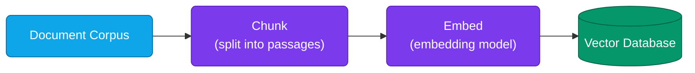
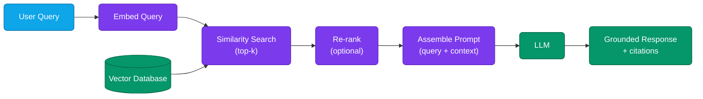
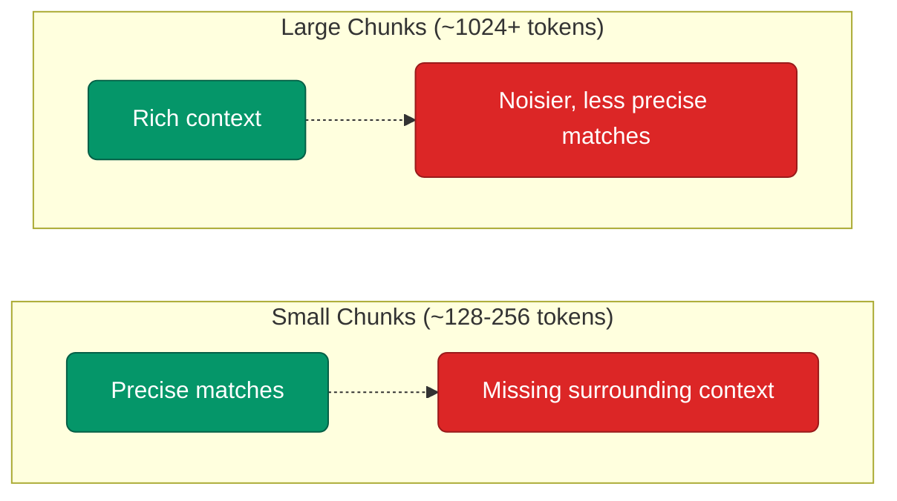
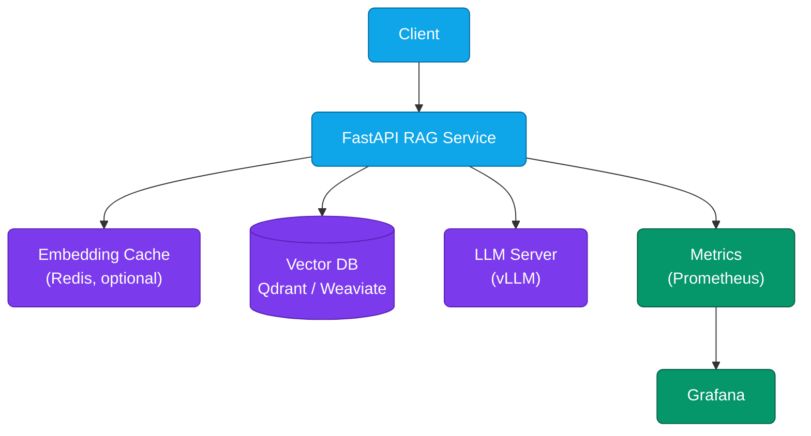
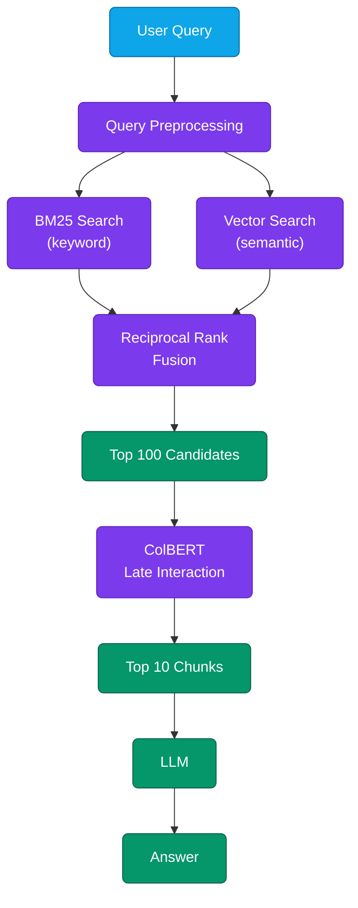

# Lesson 03: RAG Systems (Retrieval-Augmented Generation)

Retrieval-Augmented Generation (RAG) is how you give an LLM access to information it was never trained on — your company's internal docs, this morning's news, a codebase that didn't exist a year ago — without retraining the model itself. Instead of hoping the model memorized the right fact, you fetch the relevant text at query time and hand it to the model as context, then let the model do what it's actually good at: reading and synthesizing.

It's the difference between asking someone to recall a fact from memory and handing them the right page of the textbook first. The model still has to read and reason well, but it isn't guessing — and when it answers, you can point back to exactly where the answer came from.

**Prerequisites:** [Lesson 01](./01-introduction-llm-infrastructure.md), [Lesson 02](./02-vllm-deployment.md) (RAG's generation step assumes you can already serve an LLM), Python 3.8+.

### Contents

1. [Why RAG](#why-rag)
2. [Architecture: From Query to Grounded Answer](#architecture-from-query-to-grounded-answer)
3. [Embedding Models](#embedding-models)
4. [Chunking Strategies](#chunking-strategies)
5. [Vector Databases](#vector-databases)
6. [Retrieval Techniques](#retrieval-techniques)
7. [Re-ranking](#re-ranking)
8. [Building a Minimal RAG Pipeline](#building-a-minimal-rag-pipeline)
9. [Evaluating RAG Quality](#evaluating-rag-quality)
10. [Production RAG Pipelines](#production-rag-pipelines)
11. [Advanced RAG Patterns](#advanced-rag-patterns)
12. [Practical Exercise](#practical-exercise)
13. [Key Takeaways](#key-takeaways)
14. [Additional Resources](#additional-resources)

---

## Why RAG

Plain LLMs answer from whatever got baked into their weights at training time. That's fine until a question needs something the model never saw — this quarter's pricing sheet, a page from your internal wiki, a paper published last week — at which point the model either says so, or, worse, confidently makes something up.

| Aspect | Plain LLM | RAG |
|---|---|---|
| Knowledge source | Frozen at training time | Live, retrieved per query |
| Hallucination risk | Higher on out-of-training facts | Lower — grounded in retrieved text |
| Private/proprietary data | Not accessible | Fully accessible, no retraining needed |
| Auditability | Can't point to a source | Retrieved chunks double as citations |
| Cost per query | One LLM call | Embedding + vector search + LLM call |

RAG isn't the only fix for "the model doesn't know this" — fine-tuning is the other lever, and the two solve different problems:

| Reach for RAG when | Reach for fine-tuning when |
|---|---|
| Facts change often (pricing, docs, news) | The model needs a new skill, format, or tone |
| You need citations or an audit trail | Domain jargon needs to become fluent, not just present |
| The knowledge base is large or private | Retrieval latency isn't acceptable |
| You can't retrain every time data changes | The change is behavioral, not factual |

In practice, production systems often use both: fine-tune for style and task-following, RAG for facts.

---

## Architecture: From Query to Grounded Answer

A RAG system is really two pipelines that only meet at query time: an offline **indexing** pipeline that turns your documents into searchable vectors, and an online **query** pipeline that turns a question into a grounded answer.



Indexing happens once per document (and again whenever it changes) — this is where chunking and embedding-model choice matter most, since every downstream query inherits whatever quality you baked in here.



Four things happen on the query path: embed the query with the *same* model used at indexing time, search the vector database for the nearest chunks, optionally re-rank those candidates for precision, and assemble a prompt containing both the question and the retrieved text before handing it to the LLM. Get any one of these wrong — a mismatched embedding model, chunks that are too coarse, skipping re-ranking when precision matters — and the LLM will still answer confidently, just from context that doesn't actually support the question.

---

## Embedding Models

An embedding model turns text into a dense vector that captures meaning, so that "how do I reset my password" and "password reset steps" land near each other in vector space even though they share almost no words. Retrieval quality is bounded by embedding quality — everything downstream (chunking choices, re-ranking, prompt assembly) is compensating for what the embedding model can and can't distinguish.

| Model | Dimensions | Cost | Best for |
|---|---|---|---|
| `text-embedding-3-small` (OpenAI) | 1536 | ~$0.02 / 1M tokens | Zero infra, strong general quality |
| `all-MiniLM-L6-v2` | 384 | Free, self-hosted | Fast, resource-constrained |
| `all-mpnet-base-v2` | 768 | Free, self-hosted | Balanced open-source default |
| `BAAI/bge-base-en-v1.5` | 768 | Free, self-hosted | Strong open-source, needs query prefix |
| `BAAI/bge-large-en-v1.5` | 1024 | Free, self-hosted | SOTA open-source quality |

```python
from sentence_transformers import SentenceTransformer

model = SentenceTransformer("BAAI/bge-base-en-v1.5")

# BGE models were trained with an instruction prefix on the QUERY side only —
# skipping it on queries (but not documents) is the most common BGE mistake.
query_vec = model.encode(
    "Represent this sentence for searching relevant passages: What is RAG?",
    normalize_embeddings=True,
)
doc_vecs = model.encode(
    ["RAG grounds LLM answers in retrieved documents."],
    normalize_embeddings=True,
)
```

Whatever model you pick, use it consistently — embeddings from two different models aren't comparable, so re-embedding your whole corpus is the price of switching later.

> [!NOTE]
> **Industry trend (2026) — Matryoshka Embeddings**
>
> **What it is:** Newer embedding models (Voyage-3-large, Cohere embed-v4, Gemini-embedding, Qwen3-Embedding) are trained with Matryoshka Representation Learning, so one embedding can be truncated to fewer dimensions after the fact — 1024 down to 256, say — without re-embedding your whole corpus at a smaller size.
>
> **Why it's picked over the others:** It removes the old trade-off of picking one fixed dimension up front and living with it. Storage-constrained collections can truncate for speed and cost, quality-sensitive ones keep the full vector, and both come from the same embed call instead of maintaining two models.
>
> **Where it's used:** Cohere embed-v4 is the enterprise pick for multimodal corpora (mixed text + images/PDFs) needing VPC deployment; Voyage-3.5 or `text-embedding-3-small` are common safe defaults for a hosted API; open-weight `Qwen3-Embedding` and `BGE-M3` are what self-hosted teams reach for to avoid a per-call API bill entirely. *(Source: [Best Embedding Models for RAG, 2026 — PremAI](https://www.premai.io/blog/best-embedding-models-for-rag-2026-ranked-by-mteb-score-cost-and-self-hosting/))*

---

## Chunking Strategies

Documents are usually too long to embed as a single vector (you'd lose precision — the embedding would be an average of everything in the document) and too long to retrieve wholesale (you'd blow your context budget on mostly-irrelevant text). Chunking splits documents into pieces small enough to embed precisely and retrieve selectively.



| Strategy | How it splits | Best for |
|---|---|---|
| Fixed-size | N words/tokens, with overlap | Quick baseline, unstructured text |
| Sentence-based | Sentence boundaries | Preserving readable units |
| Paragraph-based | `\n\n`, merging small ones | Structured prose, articles |
| Recursive (LangChain) | Paragraph → sentence → word, in order | Good default for mixed content |
| Semantic | Embedding similarity between sentences | Long, topic-shifting documents |

```python
from langchain.text_splitter import RecursiveCharacterTextSplitter

splitter = RecursiveCharacterTextSplitter(
    chunk_size=512,
    chunk_overlap=64,                          # ~10-15% overlap avoids losing context at boundaries
    separators=["\n\n", "\n", ". ", " ", ""],  # tries paragraph, then sentence, then word
)
chunks = splitter.split_text(document_text)
```

**Defaults that hold up in practice:** 512 tokens per chunk for most models, 10–20% overlap, and always store `source`, `chunk_index`, and any section heading as metadata — you'll need them for citations and filtered search later.

> [!NOTE]
> **Industry trend (2026) — Late Chunking**
>
> **What it is:** Instead of splitting text first and embedding each piece on its own, [late chunking](https://jina.ai/news/late-chunking-in-long-context-embedding-models/) (Jina) runs the *whole* document through a long-context embedding model first, then splits it into chunks afterward. Each chunk's vector is pooled from that full pass, so it still carries context from the rest of the document instead of being embedded in isolation.
>
> **Why it's picked over the others:** It fixes the blind spot fixed-size, sentence, paragraph, and even recursive splitting all share — each embeds a chunk with no idea what's around it, so a chunk that just says "it improved performance by 40%" loses what "it" refers to. Late chunking needs no LLM calls (unlike Contextual Retrieval) and no per-sentence similarity scoring (unlike semantic chunking) — it's close to free on top of a chunking pipeline you already have, and the benefit grows the longer the document is.
>
> **Where it's used:** Long-context embedding models built to support it, like `jina-embeddings-v3` (8K-token context), are the entry point — teams reach for it on documents where meaning spans sections: legal contracts, technical/API docs, and codebases with cross-references. It plugs into any vector DB (Qdrant, Weaviate, Pinecone) the same way normal chunk embeddings do — the DB just stores the pooled vectors with chunk-position metadata for citation lookups.

---

## Vector Databases

The vector database is where chunk embeddings live and get searched. This lesson only needs you to pick one and move on — deployment, indexing algorithms (HNSW, IVF), and scaling are covered in full in [Lesson 04: Vector Databases](./04-vector-databases.md).

| Database | Type | Best for |
|---|---|---|
| **Qdrant** | Open-source/Managed | Performance, self-hosted, rich filtering |
| **Chroma** | Open-source | Prototyping, embedded, small datasets |
| **Pinecone** | Managed | Zero-ops production, willing to pay for it |
| **Weaviate** | Open-source/Managed | Hybrid (vector + keyword) search, GraphQL |
| **Milvus** | Open-source | Billion-scale, distributed deployments |

```python
from qdrant_client import QdrantClient

client = QdrantClient(url="http://localhost:6333")  # docker run -p 6333:6333 qdrant/qdrant
```

For local development, Chroma or Qdrant in Docker gets you running in minutes; don't reach for a managed, billed service until you actually need the ops it takes off your plate.

> [!NOTE]
> **Industry trend (2026) — pgvector as the Default**
>
> **What it is:** `pgvector`, a Postgres extension, has grown from "good enough for a prototype" into a production-grade vector store — extensions like `pgvectorscale` have pushed its performance to the point of beating dedicated vector databases at scale in independent benchmarks.
>
> **Why it's picked over the others:** Most teams already run Postgres for their application data. Adding `pgvector` means one fewer service to deploy, monitor, and back up, instead of standing up and operating a whole separate database just for embeddings.
>
> **Where it's used:** Teams already on Postgres default to `pgvector` for small-to-mid scale (up to tens of millions of vectors). Dedicated databases still win at the extremes — Qdrant, Weaviate, and Milvus for very large scale or heavy metadata filtering, Pinecone when a team wants zero infrastructure to manage, and serverless options (Amazon OpenSearch Serverless, Vertex AI Vector Search) when nobody wants to provision capacity at all. *(Source: [State of Vector Databases, Q2 2026 — Actian](https://www.actian.com/blog/developer/state-of-vector-databases-q2-2026/))*

---

## Retrieval Techniques

The simplest retrieval is a cosine-similarity search against the query embedding. Everything else here is a way to make that search more precise for a specific need.

| Technique | What it does | Use it when |
|---|---|---|
| Similarity search | Top-k nearest vectors | Default starting point |
| Filtered search | Similarity search + metadata constraints | Scoping to a source, date range, or tenant |
| Hybrid search | Blends vector score with keyword (BM25) score | Queries with exact terms (IDs, error codes) |
| MMR (max marginal relevance) | Penalizes near-duplicate results | Top-k results are redundant |

```python
from qdrant_client.models import Filter, FieldCondition, MatchValue

results = client.search(
    collection_name="documents",
    query_vector=query_vector,
    query_filter=Filter(
        must=[FieldCondition(key="metadata.source", match=MatchValue(value="handbook.pdf"))]
    ),
    limit=5,
)
```

Pure vector search misses exact-string matches surprisingly often (an error code or product SKU may not embed distinctively) — that's the case hybrid search is built for.

> [!NOTE]
> **Industry trend (2026) — Hybrid Search as the Default, Not an Upgrade**
>
> **What it is:** Fusing dense vector search with sparse keyword search (BM25), combined via Reciprocal Rank Fusion, has moved from "nice-to-have" to the baseline every retrieval stack starts with — on top of it, agentic retrieval lets the model decide to rewrite the query or retrieve again instead of accepting the first pass.
>
> **Why it's picked over the others:** Pure vector search alone is now considered an architectural mistake, not a simplification — it silently drops exact-term matches that BM25 catches for free. Agentic retrieval fixes the failure mode plain single-shot retrieval can't: if the first retrieval was wrong, there's no built-in way to recover.
>
> **Where it's used:** Hybrid search is the default in production stacks regardless of scale. The full agentic loop is reserved for the harder slice of traffic — **Adaptive RAG**, which routes simple queries straight through a single retrieve-and-generate pass and only sends complex ones through the expensive multi-hop/agentic path, is called out as 2026's practical default since most production queries are simple enough not to need it. *(Source: [Agentic RAG 2026: When the AI Decides How It Searches — DEV Community](https://dev.to/saaro_net/agentic-rag-2026-when-the-ai-decides-how-it-searches-9ck))*

---

## Re-ranking

Think of it like hiring: vector search is the resume screen, re-ranking is the interview. One's fast and bulk-filters a thousand down to twenty; the other is slower but actually tells you who's a fit.

Why isn't the resume screen enough on its own? Because vector search embeds the query and every document separately, ahead of time, then just measures distance between two fixed points — fast, but it never actually reads them side by side.

A **cross-encoder** is the opposite trade: it takes the query and one candidate document *together*, as a single input, and outputs one score for how well they actually match. That direct comparison is far more accurate — but it means doing a full forward pass for every single document, which is way too slow to run against an entire corpus of thousands or millions of chunks.

To make that concrete: say the query is "how do I cancel my subscription?" and vector search hands back three chunks that all mentioned "subscription" somewhere —

1. "Subscriptions renew automatically every 30 days unless canceled."
2. "Our subscription plans include Basic, Pro, and Enterprise tiers."
3. "To cancel, go to Settings → Billing → Cancel Plan."

All three are "close" in vector space — they're all *about* subscriptions. But only #3 actually answers the question. A cross-encoder reads the query and each chunk *as a pair* and scores that fit directly, so it can tell #3 apart from #1 and #2 even though a fast vector lookup couldn't. That's the whole reason it exists: distance in vector space measures "same topic," not "answers this specific question."

The catch is cost — scoring one pair takes a full model pass, so scoring your entire corpus this way would be far too slow. That's why production systems use both, each for what it's good at:

- **Vector search** casts a wide, cheap net over the whole corpus → top 20–50 candidates
- **Cross-encoder** reads just that shortlist closely and re-sorts it → top 5 make it into the prompt

```python
from sentence_transformers import CrossEncoder

reranker = CrossEncoder("cross-encoder/ms-marco-MiniLM-L-6-v2")

pairs = [[query, doc] for doc in candidates]   # candidates = top-20 from vector search
scores = reranker.predict(pairs)
top_docs = [doc for _, doc in sorted(zip(scores, candidates), reverse=True)][:5]
```

**In plain terms:** vector search asks "which documents are roughly in the right neighborhood?" and the reranker asks "okay, now which of *these* actually answers the question?" — two different questions, and you need both answered well before the LLM ever sees the context.

| Approach | Storage | Speed | Precision |
|---|---|---|---|
| Bi-encoder (vector search) | Low | Very high | Moderate/high |
| ColBERT (late interaction) | Higher | High | High |
| Cross-encoder | Low (no precomputation) | Expensive | Very high |

Re-ranking is one of the highest-leverage, lowest-effort improvements available to a RAG system — a few extra lines of code, no new infrastructure, no retraining. If retrieval quality feels "close but not quite right," add a reranker before you touch anything else.

> [!NOTE]
> **Industry trend (2026) — Late-Interaction Rerankers (ColBERT)**
>
> **What it is:** Late-interaction models like ColBERT sit between a bi-encoder and a cross-encoder — they encode queries and documents into per-token vectors independently (so document vectors can be precomputed like a bi-encoder), then score relevance with a cheap max-similarity operation at query time instead of a full cross-attention pass.
>
> **Why it's picked over the others:** A cross-encoder needs a fresh forward pass per query-document pair, which is accurate but doesn't scale to precomputation. An LLM-as-reranker is even slower and, more importantly, expensive at volume — reranking 50 candidates can run roughly $0.015/query, which adds up fast at production request rates. ColBERT gets close to cross-encoder quality at close to bi-encoder speed by precomputing what it can.
>
> **Where it's used:** Cross-encoders (BGE-Reranker, Qwen3-Reranker) remain the default two-stage reranker for most RAG systems. ColBERT and its production forks (AnswerAI's ColBERTv2, JaColBERT) are reached for specifically on multilingual or domain-shift retrieval, where single-stage reranker-level quality is needed without paying cross-encoder latency. *(Source: [Top Reranking Models to Boost RAG Accuracy in 2026 — Redis](https://redis.io/blog/top-reranking-models-rag-accuracy/))*

---

## Building a Minimal RAG Pipeline

This ties the pieces together: chunk once at ingestion, embed and store, then embed-search-generate at query time.

```python
import uuid
from sentence_transformers import SentenceTransformer
from qdrant_client import QdrantClient
from qdrant_client.models import Distance, VectorParams, PointStruct
from vllm import LLM, SamplingParams

class RAGSystem:
    def __init__(self, embed_model="BAAI/bge-base-en-v1.5", llm_model="meta-llama/Llama-2-7b-chat-hf"):
        self.embedder = SentenceTransformer(embed_model)
        self.llm = LLM(model=llm_model)
        self.db = QdrantClient(url="http://localhost:6333")
        self.collection = "documents"
        self.db.create_collection(
            self.collection,
            vectors_config=VectorParams(
                size=self.embedder.get_sentence_embedding_dimension(),
                distance=Distance.COSINE,
            ),
        )

    def ingest(self, chunks: list[str]):
        vectors = self.embedder.encode(chunks, normalize_embeddings=True)
        points = [
            PointStruct(id=str(uuid.uuid4()), vector=v.tolist(), payload={"text": c})
            for c, v in zip(chunks, vectors)
        ]
        self.db.upsert(self.collection, points=points)

    def retrieve(self, query: str, top_k: int = 5) -> list[str]:
        qvec = self.embedder.encode(query, normalize_embeddings=True)
        hits = self.db.search(self.collection, query_vector=qvec.tolist(), limit=top_k)
        return [h.payload["text"] for h in hits]

    def answer(self, query: str, top_k: int = 5) -> str:
        context = "\n\n".join(self.retrieve(query, top_k))
        prompt = (
            f"<s>[INST] Answer using only the context below. If the context doesn't "
            f"contain the answer, say so.\n\nContext:\n{context}\n\nQuestion: {query} [/INST]"
        )
        out = self.llm.generate([prompt], SamplingParams(temperature=0.3, max_tokens=512, stop=["</s>"]))
        return out[0].outputs[0].text.strip()
```

```python
rag = RAGSystem()
rag.ingest(["Machine learning is a subset of AI that learns from data.", "..."])
print(rag.answer("What is machine learning?"))
```

Everything covered above — better chunking, hybrid search, re-ranking — is a targeted improvement to `retrieve()`. This ~30-line version is deliberately the floor, not the ceiling.

---

## Evaluating RAG Quality

RAG quality splits into two questions that need different evaluation methods: *did retrieval find the right chunks*, and *did the LLM's answer actually use them faithfully*. A system can fail at either one independently — good retrieval with a sloppy answer, or a fluent answer built on the wrong chunks — so both need to be measured, not just one.

| Metric | Measures | How |
|---|---|---|
| Precision@k | Fraction of retrieved chunks that are relevant | Retrieved ∩ relevant / k |
| Recall@k | Fraction of relevant chunks that were retrieved | Retrieved ∩ relevant / relevant |
| MRR | How high the first relevant result ranks | 1 / rank of first hit |
| Faithfulness | Whether the answer is supported by retrieved context | LLM-as-judge or NLI model |
| Answer relevance | Whether the answer addresses the question | LLM-as-judge |

**Retrieval metrics** need a test set of `query → known-relevant chunk IDs`, and they each catch a different failure:

- **Precision@k** answers "of what we retrieved, how much was actually useful?" Retrieve 5 chunks and only 2 are relevant → precision@5 = 0.4. Low precision means the LLM is wasting context-window budget on noise, and worse, has irrelevant text it might mistakenly draw from.
- **Recall@k** answers "of everything relevant, how much did we actually find?" If there are 4 relevant chunks in the corpus and you only surfaced 2 of them, recall = 0.5 — even if those 2 were both correct (precision could be perfect while recall is bad). Low recall means the answer may be incomplete even when it isn't wrong.
- **MRR** cares specifically about the *first* hit, not the whole list — if the one truly relevant chunk lands at rank 3, MRR = 1/3. This matters because LLMs weight earlier context more heavily in practice, so a relevant chunk buried at rank 8 helps far less than the same chunk at rank 1.

**Generation metrics** can't be computed with simple set arithmetic — "is this answer actually true and on-topic" needs judgment, which is why both rely on an LLM-as-judge (a separate model prompted to grade the output) or, for faithfulness specifically, an NLI (natural language inference) model checking whether the retrieved text logically entails what the answer claims:

- **Faithfulness** catches an answer that sounds right but isn't backed by the retrieved chunks — the model filling gaps with its own training-time knowledge instead of the context you gave it. This is the metric that most directly measures hallucination in a RAG system specifically.
- **Answer relevance** catches the opposite problem: an answer that's fully grounded in the retrieved text but doesn't actually address what was asked — technically faithful, still useless to the person who asked the question.

Precision and recall are cheap to compute — pure set math, no model calls needed. Faithfulness and relevance cost an extra LLM call per evaluation, which is exactly why the industry trend note below is about running them continuously in production rather than only once before launch.

```python
def evaluate(retrieved_ids: list[str], relevant_ids: set[str]) -> dict:
    hits = [1 if rid in relevant_ids else 0 for rid in retrieved_ids]
    return {
        "precision@k": sum(hits) / len(hits),
        "recall@k": sum(hits) / len(relevant_ids),
        "mrr": next((1 / (i + 1) for i, h in enumerate(hits) if h), 0),
    }
```

> [!NOTE]
> **Industry trend (2026) — Continuous, In-Production Evaluation**
>
> **What it is:** Evaluation has shifted from a one-time pre-launch test to continuous scoring of live traffic using LLM-as-judge frameworks (RAGAS, TruLens, DeepEval), tracking the same four metrics — faithfulness, answer relevancy, context precision, context recall — as an ongoing signal rather than a launch gate.
>
> **Why it's picked over the others:** A pre-launch test set doesn't catch drift — documents change, models get swapped, and usage patterns shift after ship, all silently, and manual review can't keep pace with production volume. LLM-as-judge scoring is cheap enough to run continuously and catches quality regressions as they happen instead of after users notice.
>
> **Where it's used:** RAGAS is the fastest path to the standard metrics with minimal setup. DeepEval is reached for by teams that want evaluation written as pytest-style test cases running in CI/CD, so a bad chunking or model change fails a check before it ships. TruLens is used more for runtime observability once a system is already in production. *(Source: [RAG Evaluation: Metrics, Frameworks & Testing, 2026 — PremAI](https://blog.premai.io/rag-evaluation-metrics-frameworks-testing-2026/))*

---

## Production RAG Pipelines



The `API` box above is doing more than a single vector lookup — here's what actually happens inside it, in the shape most 2026 production stacks use:



BM25 and vector search run in parallel over the same query, get merged by rank (not by raw score — the two aren't on the same scale) via Reciprocal Rank Fusion, and only then does the more expensive reranker touch the results — narrowing 100 candidates down to the 10 that actually reach the LLM. This is the hybrid-search-plus-ColBERT pattern from the [Retrieval Techniques](#retrieval-techniques) and [Re-ranking](#re-ranking) notes above, assembled into one pipeline — cheap, parallel stages first, expensive precision stage last, on the smallest set possible.

```python
from fastapi import FastAPI
from pydantic import BaseModel

app = FastAPI()
rag = RAGSystem()

class QueryRequest(BaseModel):
    query: str
    top_k: int = 5

@app.post("/query")
async def query(req: QueryRequest):
    return {"answer": rag.answer(req.query, req.top_k)}

@app.get("/health")
async def health():
    return {"status": "healthy"}
```

### Production Best Practices

- **Cache query embeddings** for repeated or similar queries — embedding is cheap per call, but it adds up at scale, and it's pure waste on an exact repeat.
- **Set a relevance floor.** If the top retrieved score is below a threshold, return "I don't have information on that" instead of letting the LLM improvise from weak context — this is the single biggest lever against confident-sounding wrong answers.
- **Version your index.** Re-embedding after a chunking or model change means a new collection, not an in-place overwrite, so you can roll back a bad re-index.
- **Monitor retrieval and generation separately** — a latency spike or quality drop in one shouldn't be diagnosed by staring at the other.
- **Stream the response** once generation starts; retrieval latency (typically 50–200ms) is small next to LLM generation time, so don't make the user wait for both sequentially when streaming is available.

> [!NOTE]
> **Industry trend (2026) — Hybrid RAG as the Production Baseline**
>
> **What it is:** "Hybrid RAG" — hybrid search plus a reranker plus a single generation pass, no agent loop — is now the production default for most enterprises. Agentic RAG and GraphRAG are added on top only where reasoning depth actually requires them.
>
> **Why it's picked over the others:** A single retrieve-and-generate pass is dramatically cheaper and faster than an agentic loop, which typically costs several LLM calls and 8–12 seconds for a 3–4 iteration cycle — not worth paying for on the large share of queries hybrid search already answers correctly. Agentic RAG earns that cost back on harder queries; one 2026 benchmark of production deployments reported agentic RAG paired with a knowledge graph cutting hallucination by roughly 62%.
>
> **Where it's used:** Enterprise deployments layer these by risk instead of picking one pattern for everything — hybrid RAG handles routine traffic, deeper agentic verification is reserved for the smaller slice of high-stakes or complex queries where the extra latency and cost are worth it. *(Source: [10 RAG Architectures in 2026: Enterprise Use Cases & Strategy — Techment](https://www.techment.com/blogs/rag-architectures-enterprise-use-cases-2026/))*

---

## Advanced RAG Patterns

| Pattern | Idea | Use it when |
|---|---|---|
| **HyDE** | Generate a hypothetical answer first, embed *that* for retrieval | Queries are short/vague relative to document style |
| **Multi-hop** | Retrieve, then use those results to form a follow-up retrieval | Answering a question needs facts from multiple documents |
| **Query decomposition** | Split a compound question into sub-questions, retrieve for each | Multi-part questions ("compare X and Y") |
| **Corrective/Self-RAG** | Model critiques its own retrieved context and re-retrieves if weak | High-stakes answers where quality matters more than latency |

HyDE is the cheapest of these to add and often the highest-impact: short queries ("pricing?") embed very differently from the prose in your documents, but a *hypothetical answer* to that query embeds much closer to real document text.

```python
def retrieve_with_hyde(rag: RAGSystem, query: str, top_k: int = 5) -> list[str]:
    draft = rag.llm.generate(
        [f"Write a short passage answering: {query}"], SamplingParams(max_tokens=150)
    )
    hyde_vec = rag.embedder.encode(draft[0].outputs[0].text, normalize_embeddings=True)
    hits = rag.db.search(rag.collection, query_vector=hyde_vec.tolist(), limit=top_k)
    return [h.payload["text"] for h in hits]
```

> [!NOTE]
> **Industry trend (2026) — Agentic RAG and GraphRAG Going Mainstream**
>
> **What it is:** Agentic RAG lets the model decide whether to retrieve, what to retrieve, and when to stop — reasoning about retrieval instead of doing it once up front. GraphRAG builds an entity-and-relationship graph from the corpus and retrieves by traversing it, on top of or instead of plain vector search.
>
> **Why it's picked over the others:** Single-shot retrieval (even with HyDE or multi-hop) can't recover from a bad first retrieval or dig further when the answer clearly needs more evidence — agentic RAG closes that gap by letting the model retry and rewrite. GraphRAG solves a different failure: pure similarity search can't reliably answer questions that hinge on a *relationship* between entities scattered across many documents, since no single chunk states the connection.
>
> **Where it's used:** Adoption is described as modular rather than all-or-nothing — teams add a reranker first, then corrective/self-critique grading, and only reach for agentic loops or GraphRAG once a use case actually needs the reasoning depth, since both cost more latency and more LLM calls than the patterns above. Microsoft's open-sourced GraphRAG implementation is the common starting point for the graph side. *(Source: [20 Advanced RAG Types to Know in 2026 — Turing Post](https://www.turingpost.com/p/ragtypes))*

---

## Practical Exercise

Build a RAG assistant over a folder of internal markdown runbooks.

**Requirements:** chunks preserve their section heading as metadata · every answer cites the source file it came from · the system refuses to answer ("I don't have information on that") when the top retrieval score falls below a threshold.

Sketch your chunking approach and the refusal check before expanding the solution.

<details>
<summary><strong>Sample Solution</strong></summary>

```python
# Chunk by markdown header, keeping the heading as metadata
import re

def chunk_by_heading(text: str) -> list[dict]:
    sections = re.split(r"\n(?=## )", text)
    return [
        {"text": s.strip(), "heading": s.splitlines()[0].strip("# ")}
        for s in sections if s.strip()
    ]

# At query time, check the top score before answering
def answer_with_guardrail(rag: RAGSystem, query: str, threshold: float = 0.5) -> str:
    qvec = rag.embedder.encode(query, normalize_embeddings=True)
    hits = rag.db.search(rag.collection, query_vector=qvec.tolist(), limit=5)

    if not hits or hits[0].score < threshold:
        return "I don't have information on that in the runbooks."

    context = "\n\n".join(f"[{h.payload['metadata']['source']}] {h.payload['text']}" for h in hits)
    prompt = f"<s>[INST] Answer using the context, citing the source file. Context:\n{context}\n\nQuestion: {query} [/INST]"
    out = rag.llm.generate([prompt], SamplingParams(temperature=0.2, max_tokens=400, stop=["</s>"]))
    return out[0].outputs[0].text.strip()
```

The threshold value needs tuning against your embedding model's actual score distribution — 0.5 is a starting guess, not a universal constant.

</details>

---

## Key Takeaways

1. RAG grounds LLM answers in retrieved text instead of relying on frozen training-time knowledge — it reduces hallucination and enables citations, but adds an embedding + search step to every query
2. Retrieval quality is bounded by embedding quality — pick one model and use it consistently across both indexing and querying
3. Chunking strategy is a precision/context trade-off, not a solved problem — 512 tokens with 10–20% overlap is a solid default, not a rule
4. Re-ranking with a cross-encoder is the highest-leverage fix when retrieval feels "close but not quite right"
5. Evaluate retrieval (precision/recall/MRR) and generation faithfulness separately — good retrieval doesn't guarantee a faithful answer
6. Production systems need a relevance floor — refusing to answer on weak context beats confidently answering from it

---

## Additional Resources

- [RAG Paper (Lewis et al., 2020)](https://arxiv.org/abs/2005.11401)
- [LangChain Text Splitters](https://python.langchain.com/docs/how_to/#text-splitters)
- [Qdrant Documentation](https://qdrant.tech/documentation/)
- [BGE Embeddings](https://huggingface.co/BAAI/bge-large-en-v1.5)
- [HyDE Paper](https://arxiv.org/abs/2212.10496)
- [Sentence Transformers Cross-Encoders](https://www.sbert.net/examples/applications/cross-encoder/README.html)

---

**Next Lesson:** [04-vector-databases.md](./04-vector-databases.md) — Vector Databases
