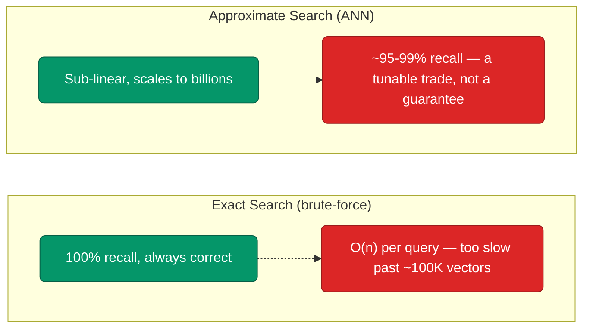
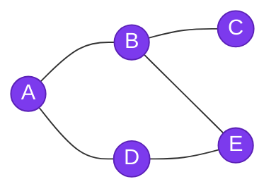
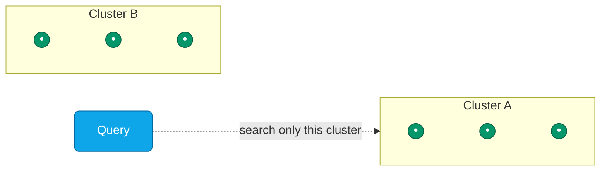
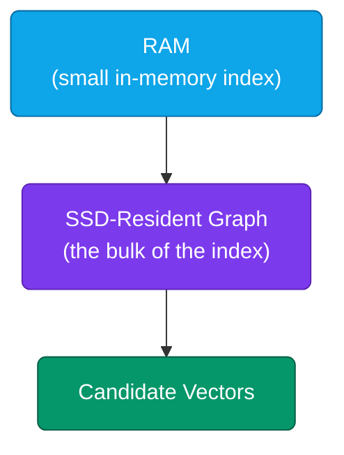
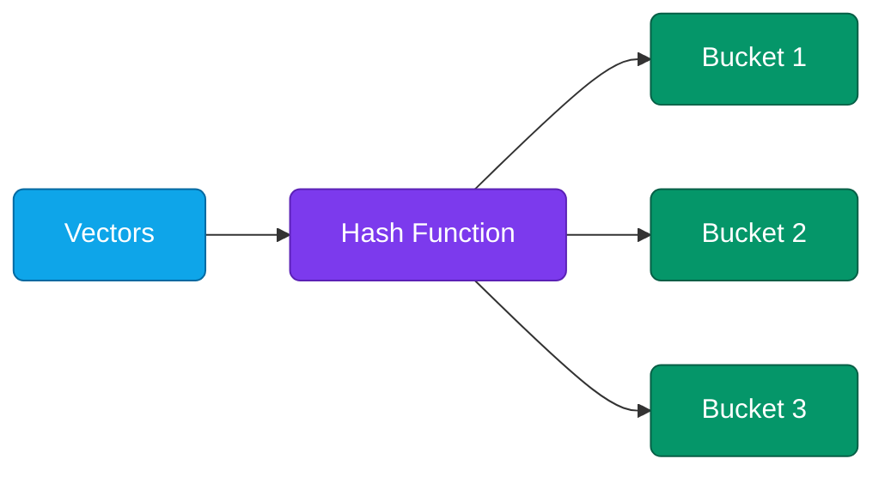
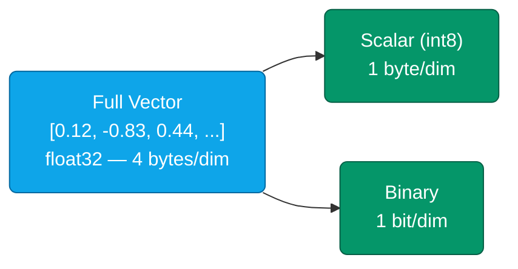
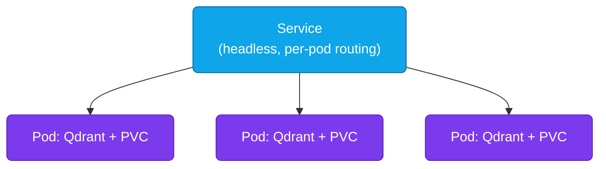

# Lesson 04: Vector Databases

A vector database is the piece of infrastructure [Lesson 03](./03-rag-systems.md) waved at and moved past: the thing that actually stores millions of embeddings and answers "which of these are closest to this query vector?" in milliseconds. Get this layer wrong and nothing downstream — chunking, re-ranking, prompt assembly — can save you, since a RAG system's answer quality has a hard ceiling at whatever retrieval actually returns.

This lesson goes deep on what Lesson 03 only had room for a table on: how similarity search actually works under the hood, how to pick between the major databases, how to deploy one for production, and how to scale and monitor it once real traffic shows up.

**Prerequisites:** [Lesson 01](./01-introduction-llm-infrastructure.md), [Lesson 03: RAG Systems](./03-rag-systems.md) (this lesson deep-dives the vector database piece that lesson only introduced).

### Contents

1. [Why Vector Search Needs Special Infrastructure](#why-vector-search-needs-special-infrastructure)
2. [How Similarity Search Works](#how-similarity-search-works)
3. [Choosing a Vector Database](#choosing-a-vector-database)
4. [Vector Indexing and Quantization](#vector-indexing-and-quantization)
5. [Qdrant in Practice](#qdrant-in-practice)
6. [Other Vector Databases at a Glance](#other-vector-databases-at-a-glance)
7. [Deployment: Self-Hosted, Managed, or Serverless](#deployment-self-hosted-managed-or-serverless)
8. [Scaling and Cost](#scaling-and-cost)
9. [Monitoring](#monitoring)
10. [Practical Exercise](#practical-exercise)
11. [Key Takeaways](#key-takeaways)
12. [Additional Resources](#additional-resources)

---

## Why Vector Search Needs Special Infrastructure

An embedding is a list of a few hundred to a few thousand floats. "Find the nearest ones to this query" sounds simple — compute the distance to every vector you have, sort, take the top few. That works fine at 10,000 vectors. At 100 million, computing 100 million distances per query is hopeless, and that's before you add the other things a real system needs: filtering by metadata (only this tenant's documents, only docs from the last 30 days), handling constant inserts and updates without rebuilding everything from scratch, and staying fast while doing all of it concurrently for many users. A regular relational or document database wasn't built for any of that — a vector database is purpose-built for exactly this shape of problem.

---

## How Similarity Search Works

"Closest" needs a definition before it means anything. Three distance metrics cover almost every case:

| Metric | What it measures | Use it when |
|---|---|---|
| Cosine similarity | Angle between two vectors, ignoring magnitude | Default for text embeddings |
| Dot product | Cosine similarity, if vectors are pre-normalized | Same result as cosine, cheaper to compute |
| Euclidean (L2) | Straight-line distance | Magnitude itself carries meaning (rare for text) |

Once you've picked a metric, the harder problem is *searching* efficiently. Comparing a query against every stored vector is called exact (brute-force) search — perfectly accurate, but linear in the size of your collection. Every production vector database instead uses **Approximate Nearest Neighbor (ANN)** search: an index structure that finds *almost certainly* the closest vectors, in a fraction of the time, by not checking everything.



That recall trade-off is a dial, not a fixed cost — every ANN index exposes parameters (covered in the next section) that let you push closer to exact-search accuracy at the price of speed, or vice versa.

---

## Choosing a Vector Database

| Database | Type | Language | Hybrid Search | Best for |
|---|---|---|---|---|
| **pgvector** | Open-source (Postgres extension) | C | ✅ (via `tsvector`) | Teams already on Postgres, embeddings next to relational data |
| **Qdrant** | Open-source/Managed | Rust | ✅ | Performance, self-hosted, rich filtering |
| **Weaviate** | Open-source/Managed | Go | ✅ | Hybrid search, GraphQL, multi-modal |
| **Chroma** | Open-source | Python | ❌ | Prototyping, embedded, small datasets |
| **Pinecone** | Managed | Proprietary | ❌ | Zero-ops production, willing to pay for it |
| **Milvus** | Open-source | C++/Python | ✅ | Billion-scale, distributed deployments |

For most new projects, the honest default is: if you already run Postgres, try `pgvector` first — it's one command away, not a new system. Otherwise, prototype in Chroma because it needs zero setup, move to Qdrant when you need real performance and self-hosting, and only reach for Pinecone or a fully managed option once you've decided the ops burden genuinely isn't worth taking on yourselves.

> [!NOTE]
> **Industry trend (2026) — pgvector as the Default**
>
> **What it is:** `pgvector`, a Postgres extension, has grown from "good enough for a prototype" into a production-grade vector store — extensions like `pgvectorscale` have pushed its performance to the point of beating dedicated vector databases at scale in independent benchmarks.
>
> **Why it's picked over the others:** Most teams already run Postgres for their application data. Adding `pgvector` means one fewer service to deploy, monitor, and back up, instead of standing up and operating a whole separate database just for embeddings.
>
> **Where it's used:** Teams already on Postgres default to `pgvector` for small-to-mid scale (up to tens of millions of vectors). Dedicated databases still win at the extremes — Qdrant, Weaviate, and Milvus for very large scale or heavy metadata filtering, and Pinecone when a team wants zero infrastructure to manage. *(Source: [State of Vector Databases, Q2 2026 — Actian](https://www.actian.com/blog/developer/state-of-vector-databases-q2-2026/))*

---

## Vector Indexing and Quantization

| Algorithm | Idea | Trade-off |
|---|---|---|
| **HNSW** | Multi-layer graph of nearest neighbors | Fastest queries, most memory-hungry — the default in most databases |
| **IVF** | Cluster vectors, search only the nearest clusters | Lower memory than HNSW, needs a training pass |
| **DiskANN** | Graph index designed to live on SSD, not RAM | Handles billions of vectors on far less RAM, slightly higher latency |
| **LSH** | Hash similar vectors into the same buckets | Simple, fast to build, generally lower recall than the above |

### The Four Algorithms, Visually

The quickest way to keep these straight: each one answers "where do I even look?" differently.



**HNSW — a graph.** Hop from neighbor to neighbor, each hop getting closer to the query, until you can't get any closer.



**IVF — clusters.** Group vectors into clusters ahead of time; at query time, find the right cluster(s) first and only search inside those.



**DiskANN — a graph too big for RAM.** Same graph idea as HNSW, but it lives on SSD instead, with only a small piece kept in memory — trading a little latency for a lot less RAM.



**LSH — buckets.** Hash similar vectors so they land in the same bucket; at query time, hash the query and only check that bucket.

HNSW is the one you'll tune most often, and it comes down to three knobs: `m` (connections per node — higher means better recall, more memory), `ef_construct` (candidate list size while building — higher means a better index, slower to build), and `ef` (the same idea, but set per-query at search time — higher means better recall, slower search). The full config is shown in [Qdrant in Practice](#qdrant-in-practice) below.

Once an index no longer fits comfortably in RAM, **quantization** trades a small amount of accuracy for a large amount of memory:

| Method | How it works | Storage reduction | Quality impact |
|---|---|---|---|
| Scalar (int8) | Rounds each float32 dimension to one of 256 buckets, stored as a single byte | 4x | Minimal |
| Product | Splits the vector into sub-vectors, replaces each with the ID of its nearest pre-computed centroid | 16–64x | Moderate |
| Binary | Keeps only the sign of each dimension (+/−) as a single bit, compared later with Hamming distance | ~32x | Noticeable — best on high-dimensional vectors with a rescoring pass |



Quantization shrinks each *number* in the vector, not the vector's length — same dimensions, smaller footprint per dimension. That's why it stacks with any indexing algorithm above: you can run HNSW or DiskANN over quantized vectors just as easily as full-precision ones.

> [!NOTE]
> **Industry trend (2026) — Binary Quantization + DiskANN for Billion-Scale Search**
>
> **What it is:** Binary quantization compresses each dimension of a vector down to a single bit and scores candidates with cheap Hamming-distance comparisons instead of floating-point math. DiskANN-style graph indexes are built to live on SSD rather than RAM, so the index doesn't need to fit in memory at all.
>
> **Why it's picked over the others:** Plain HNSW keeps its whole graph in RAM, which gets expensive fast once you're past tens of millions of vectors — binary quantization and disk-resident indexes are how databases keep serving billion-vector collections without requiring a machine with a terabyte of RAM.
>
> **Where it's used:** Major open-source databases (Milvus, and others building on the open DiskANN library) now ship HNSW as the default for quality-sensitive, moderate-scale collections, with IVF/DiskANN and scalar-or-binary quantization as the standard escape hatch once a collection outgrows what fits in RAM. *(Source: [Best Open Source Vector Databases in 2026 — Chat2DB](https://chat2db.ai/resources/blog/best-open-source-vector-databases-2026))*

---

## Qdrant in Practice

```python
from qdrant_client import QdrantClient
from qdrant_client.models import Distance, VectorParams, PointStruct, Filter, FieldCondition, MatchValue

client = QdrantClient(url="http://localhost:6333")  # docker run -p 6333:6333 qdrant/qdrant

# Create a collection tuned for production: quantized to cut memory, HNSW for speed
client.create_collection(
    collection_name="documents",
    vectors_config=VectorParams(size=768, distance=Distance.COSINE),
    hnsw_config={"m": 16, "ef_construct": 100},
    quantization_config={"scalar": {"type": "int8", "quantile": 0.99, "always_ram": True}},
)

# Insert
client.upsert(
    collection_name="documents",
    points=[PointStruct(id=1, vector=embedding, payload={"text": "...", "source": "handbook.pdf"})],
)

# Search, optionally scoped with a metadata filter
results = client.search(
    collection_name="documents",
    query_vector=query_embedding,
    query_filter=Filter(must=[FieldCondition(key="source", match=MatchValue(value="handbook.pdf"))]),
    limit=10,
)
```

Qdrant is used as the running example throughout this module because its defaults are close to production-ready out of the box — the same client and collection API shown here scales from a laptop Docker container to a multi-node cluster.

---

## Other Vector Databases at a Glance

Each of these makes a genuinely different trade-off worth knowing, even if Qdrant stays your default.

**pgvector (PostgreSQL)** is probably the option you already have without realizing it. It's just an add-on for Postgres that lets a normal table have a column for embeddings, the same way it has columns for text or numbers. So your vectors sit right next to the rest of your data, in the same database:

```sql
CREATE EXTENSION IF NOT EXISTS vector;
CREATE TABLE documents (
    id bigserial PRIMARY KEY,
    content text,
    source text,
    embedding vector(768)
);
CREATE INDEX ON documents USING hnsw (embedding vector_cosine_ops);

-- nearest neighbors, filtered with a normal SQL WHERE clause
SELECT content FROM documents
WHERE source = 'handbook.pdf'
ORDER BY embedding <=> '[0.12, -0.83, ...]'
LIMIT 10;
```

It's not the fastest option here — a dedicated vector database will out-perform it at very large scale. Its real advantage is simplicity: no second database to set up, back up, or keep in sync. Your embeddings get backed up, replicated, and secured the exact same way the rest of your data already is.

**Weaviate** auto-generates embeddings from a schema and treats hybrid search as a first-class, one-parameter feature. You define a "class" (its data model), point it at an embedding model, and Weaviate handles vectorizing your data as it comes in — you never call an embedding model yourself. Its signature feature is the `alpha` knob below: one number to slide between pure keyword search and pure vector search, instead of implementing that fusion logic by hand:

```python
import weaviate

client = weaviate.Client("http://localhost:8080")
result = (
    client.query.get("Document", ["content"])
    .with_hybrid(query="machine learning", alpha=0.5)  # 0 = keyword only, 1 = vector only
    .with_limit(10)
    .do()
)
```

**Chroma** is the fastest path from zero to a working prototype — an embedded, in-process database with no server to run, similar to how SQLite needs no separate database server. It ships with a default embedding model built in, so `collection.add()` and `collection.query()` above just work on raw text with no setup — great for getting something running today, less suited to production traffic at real scale or across multiple machines:

```python
import chromadb

client = chromadb.PersistentClient(path="./chroma_db")
collection = client.create_collection("docs")
collection.add(documents=["RAG grounds answers in retrieved text."], ids=["doc1"])
results = collection.query(query_texts=["What is RAG?"], n_results=5)
```

**Pinecone** is the managed option — no infrastructure to run, and namespaces give you multi-tenancy for free. You never touch a server, an index, or a scaling decision directly; Pinecone runs entirely as an API you call, which is exactly the trade a team makes when it decides infrastructure ops isn't where it wants to spend engineering time. Namespaces are the built-in answer to "keep tenant A's vectors from ever showing up in tenant B's search results" — one keyword argument instead of separate collections or manual filtering:

```python
from pinecone import Pinecone

pc = Pinecone(api_key="your-api-key")
index = pc.Index("my-index")
index.upsert(vectors=[("id1", embedding, {"text": "..."})], namespace="tenant_123")
results = index.query(vector=query_embedding, top_k=10, namespace="tenant_123")
```

---

## Deployment: Self-Hosted, Managed, or Serverless

| | Self-hosted (Qdrant, Weaviate, Milvus) | Managed (Pinecone, cloud offerings) | Serverless (object-storage-backed) |
|---|---|---|---|
| Ops burden | You run it | Vendor runs it | Vendor runs it, you pay per use |
| Cost shape | Fixed infra cost | Per-pod/tier pricing | Usage-based, scales to zero |
| Best for | Cost-conscious teams, custom tuning | Teams that don't want infra at all | Spiky or unpredictable traffic |

`pgvector` doesn't fit neatly into one column — it's really "whichever deployment model your Postgres already uses." Self-host Postgres yourself and it's self-hosted; run it on a managed Postgres service (Amazon RDS, Supabase, Neon) and it's managed, with zero extra setup beyond enabling the extension. That's the whole appeal: you're not choosing a new deployment model at all, just reusing the one you already have.

For a self-hosted cluster, Kubernetes is where the real decisions live:



- **StatefulSet, not Deployment** — each replica owns its own persistent volume and needs a stable identity; a Deployment's interchangeable pods don't fit a database.
- **Resource requests reflect the index living in RAM** — under-request memory and HNSW's graph gets evicted, turning fast queries into disk thrashing.
- **A shared collection across replicas needs replication configured explicitly** (Qdrant's `replication_factor`, Weaviate's `replicationFactor`) — a plain StatefulSet gives you separate, unsynced databases, not a cluster.

> [!NOTE]
> **Industry trend (2026) — Serverless, Object-Storage-Backed Vector Search**
>
> **What it is:** A newer class of vector database (Turbopuffer, AWS S3 Vectors) stores vectors directly on object storage like S3, with a memory/SSD cache in front, instead of keeping the whole index resident in RAM on dedicated machines.
>
> **Why it's picked over the others:** Object storage is dramatically cheaper than provisioned RAM or SSD, and this architecture scales to zero when idle — you're not paying for a warm cluster sized for peak load 24/7. Reported production numbers back this up: one company cut vector search costs by 95% after migrating.
>
> **Where it's used:** Companies with large, spiky, or cost-sensitive workloads — reported production users include Cursor, Notion, and several other AI-native products — pick this over a self-hosted cluster specifically to avoid paying for idle capacity. Traditional self-hosted databases (Qdrant, Weaviate, Milvus) still win when you need the lowest possible latency or full control over the index. *(Source: [turbopuffer — fast search engine built on object storage](https://turbopuffer.com/))*

---

## Scaling and Cost

Once one machine isn't enough, there are two different problems to solve, and it's easy to mix them up: **sharding** splits your data across multiple machines so each one holds less, and **replication** copies the same data onto multiple machines so losing one doesn't lose your data.

**Sharding — splitting the data up:**

| Strategy | How it splits data |
|---|---|
| By tenant | Each customer/user's vectors on their own shard — clean isolation |
| By hash | Spreads data out evenly, so no single shard gets overloaded |
| By time | Recent data on fast shards, older data moved somewhere cheaper |

**Replication — copying the data for safety:** this is a separate setting from sharding, and it exists purely so one machine going down doesn't take your database with it. Qdrant and Weaviate both have a simple `replication_factor` setting for this — set it to 2 and every piece of data lives on two machines instead of one.

Rough monthly costs, just to set expectations (real pricing depends on usage and any negotiated deal):

| Option | Small collection | Production scale |
|---|---|---|
| Self-hosted Qdrant | ~$30 (4GB instance) | ~$300 (64GB instance) |
| Qdrant Cloud | ~$25 | ~$500 |
| Pinecone | ~$70 (1 pod) | ~$500+ (custom) |
| Weaviate Cloud | Free tier available | ~$500 (custom) |
| Turbopuffer | Pay-per-use, no minimum | Scales with usage — reported ~10x cheaper than the options above at high volume |

Turbopuffer's pricing works differently from the rest of this table on purpose: instead of paying for a fixed-size instance whether you use it or not, you pay for the storage and queries you actually make, because it keeps the data on cheap object storage (like S3) instead of an always-on server. That's why it doesn't fit the "small vs. production" split the same way — a quiet collection costs close to nothing, and a busy one scales up smoothly instead of needing you to size an instance in advance.

The single biggest cost lever, though, is quantization, not which vendor you pick — a 4–64x storage reduction (see the table earlier in this lesson) is often the difference between needing a 64GB instance and a 4GB one, which matters more than any pricing-tier negotiation.

---

## Monitoring

| Metric | Type | Why it matters |
|---|---|---|
| Query latency (p50/p95/p99) | Histogram | User-facing responsiveness |
| Vectors indexed vs. total | Gauge | Lag between ingestion and searchability |
| Memory usage | Gauge | Headroom before the index no longer fits in RAM |
| Search recall (sampled) | Gauge | Whether ANN parameters are still tuned correctly |

```python
info = client.get_collection("documents")
print(info.vectors_count, info.indexed_vectors_count, info.status)
```

A gap between `vectors_count` and `indexed_vectors_count` means recently-inserted vectors aren't searchable yet — worth alerting on directly if your application assumes near-real-time indexing.

---

## Practical Exercise

Migrate a 50,000-document Chroma prototype to a production-ready Qdrant deployment.

**Requirements:** metadata filtering still works · quantization is enabled to cut memory roughly in half · the deployment exposes a health check a Kubernetes readiness probe can use.

Sketch your collection config before expanding the solution.

<details>
<summary><strong>Sample Solution</strong></summary>

```python
from qdrant_client import QdrantClient
from qdrant_client.models import Distance, VectorParams

client = QdrantClient(url="http://localhost:6333")

client.create_collection(
    collection_name="documents",
    vectors_config=VectorParams(size=768, distance=Distance.COSINE),
    quantization_config={"scalar": {"type": "int8", "quantile": 0.99, "always_ram": True}},
)
# int8 scalar quantization: ~4x memory reduction, minimal recall loss — appropriate
# for a "cut memory roughly in half (or better)" requirement without a full re-architecture.

# Qdrant exposes GET /healthz out of the box — point the readiness probe there directly,
# with enough initial delay for the 50K-vector collection to finish loading.
```

Metadata filtering needs no migration work here — it was payload-based in Chroma and stays payload-based in Qdrant, just re-inserted through `PointStruct.payload` instead of Chroma's `metadatas` argument.

</details>

---

## Key Takeaways

1. A vector database exists because brute-force nearest-neighbor search doesn't scale — ANN indexing (HNSW, IVF, DiskANN, LSH) trades a small, tunable amount of recall for orders-of-magnitude more speed
2. If you already run Postgres, try `pgvector` before standing up a second database — it's slower at extreme scale, but removes an entire category of ops problems by keeping embeddings in the same transactions and backups as the rest of your data
3. Qdrant, Weaviate, Chroma, and Pinecone each occupy a different point on the same trade-off: performance and control vs. convenience and managed ops
4. HNSW is the default index for quality; DiskANN and quantization (scalar, product, binary) are what you reach for once a collection stops fitting in RAM
5. Deployment isn't binary — self-hosted, managed, and serverless (Turbopuffer, S3 Vectors) trade ops burden against cost shape, and pay-per-use serverless options fit spiky traffic that a fixed instance size doesn't
6. Kubernetes deployment for a vector database means a StatefulSet with per-pod storage and explicit replication, not a stateless Deployment
7. Scaling is two separate problems — sharding splits data across machines, replication copies it for availability — and quantization is usually the single biggest cost lever, bigger than picking a cheaper vendor tier
8. Monitor the gap between inserted and indexed vector counts, not just query latency — it's the metric that catches silent indexing lag

---

## Additional Resources

- [Qdrant Documentation](https://qdrant.tech/documentation/)
- [Weaviate Documentation](https://weaviate.io/developers/weaviate)
- [HNSW Paper](https://arxiv.org/abs/1603.09320)
- [DiskANN Paper](https://proceedings.neurips.cc/paper/2019/hash/09853c7fb1d3f8ee67a61b6bf4a7f8e6-Abstract.html)
- [turbopuffer: fast search built on object storage](https://turbopuffer.com/)
- [State of Vector Databases, Q2 2026 — Actian](https://www.actian.com/blog/developer/state-of-vector-databases-q2-2026/)

---

**Next Lesson:** [05-llm-fine-tuning-infrastructure.md](./05-llm-fine-tuning-infrastructure.md) — LLM Fine-Tuning Infrastructure
