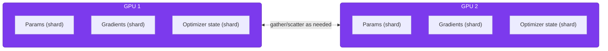

# Lesson 05: LLM Fine-Tuning Infrastructure

Fine-tuning is the other lever [Lesson 03](./03-rag-systems.md) mentioned and set aside: instead of handing the model relevant text at query time, you keep training it a bit further on examples of the behavior you want, so that behavior gets baked directly into the weights. The trade-off is infrastructure — a RAG system needs an embedding model and a vector database, but fine-tuning needs enough GPU memory to hold a model's weights, gradients, and optimizer state all at once, which for anything past a few billion parameters stops being a "just rent one GPU" problem.

This lesson covers what makes that memory problem solvable — parameter-efficient fine-tuning (LoRA, QLoRA) — and the infrastructure decisions around it: which GPU to rent, when you need multiple GPUs and how to coordinate them, and how to run the whole thing as a repeatable, trackable pipeline instead of a one-off script.

**Prerequisites:** [Lesson 01](./01-introduction-llm-infrastructure.md), [Lesson 02: vLLM Deployment](./02-vllm-deployment.md) (a fine-tuned model still needs to be served afterward), [Lesson 03: RAG Systems](./03-rag-systems.md#why-rag) (for the fine-tuning-vs-RAG framing this lesson builds on).

### Contents

1. [Fine-Tuning vs. RAG, Revisited](#fine-tuning-vs-rag-revisited)
2. [Full Fine-Tuning vs. PEFT](#full-fine-tuning-vs-peft)
3. [LoRA: Low-Rank Adaptation](#lora-low-rank-adaptation)
4. [QLoRA: Fine-Tuning on a Single GPU](#qlora-fine-tuning-on-a-single-gpu)
5. [Choosing Infrastructure](#choosing-infrastructure)
6. [Distributed Training: DeepSpeed and FSDP](#distributed-training-deepspeed-and-fsdp)
7. [A Complete Fine-Tuning Pipeline](#a-complete-fine-tuning-pipeline)
8. [Data Preparation and Quality](#data-preparation-and-quality)
9. [Experiment Tracking and Cost Optimization](#experiment-tracking-and-cost-optimization)
10. [Practical Exercise](#practical-exercise)
11. [Key Takeaways](#key-takeaways)
12. [Additional Resources](#additional-resources)

---

## Fine-Tuning vs. RAG, Revisited

[Lesson 03](./03-rag-systems.md#why-rag) already laid out the core trade-off: RAG for facts that change and need citations, fine-tuning for behavior, style, and format that need to become permanent. Revisited from the fine-tuning side, the practical question is narrower — given that you've decided you need fine-tuning, do you actually have what it takes?

- **Enough examples.** Behavioral adaptation (tone, format, following a house style) can work with a few hundred good examples; teaching genuinely new task performance usually wants thousands.
- **A stable target.** If the desired behavior is still changing week to week, you'll be re-training constantly — that instability is what RAG's "just update the vector DB" flexibility is actually for.
- **A reason it can't just be a better prompt.** Prompting and few-shot examples solve a surprising number of "I want different behavior" problems for free; fine-tuning is worth its infrastructure cost only once prompting has genuinely been tried and hasn't been enough.

In production, the two aren't mutually exclusive — a model fine-tuned to reliably follow a citation format, paired with RAG supplying the facts it cites, is a common and effective combination.

---

## Full Fine-Tuning vs. PEFT

**Full fine-tuning** updates every parameter in the model, which sounds straightforward until you count what has to live in GPU memory at once during training — and it's a lot more than just the model weights:

| Component | Memory (FP16, per 1B parameters) |
|---|---|
| Model weights | 2 GB |
| Gradients | 2 GB |
| Optimizer states (AdamW keeps two per parameter) | 4 GB |
| Activations (rough estimate) | 2 GB |
| **Total** | **~10 GB per 1B parameters** |

That arithmetic is the whole story: a 7B model needs roughly 70GB (an A100-80GB, with little room to spare), and a 70B model needs roughly 700GB — no single GPU on the market holds that, so full fine-tuning at that size *requires* distributed training before you've written a line of training code.

**PEFT (Parameter-Efficient Fine-Tuning)** is the fix: freeze the base model entirely and train only a small add-on. Gradients and optimizer states then only need to exist for that small piece, not the whole model — which is why PEFT can turn a "needs 8 GPUs" problem into a "runs on the GPU in your laptop" one.

| | Full fine-tuning | PEFT |
|---|---|---|
| Trainable parameters | 100% | Typically 0.1–1% |
| Memory needed | Very high — scales with full model | A small fraction of the model's own size |
| Performance ceiling | Highest possible | 90–99% of full fine-tuning, in practice |
| Risk | Catastrophic forgetting, expensive mistakes | Lower — the base model is never touched |

---

## LoRA: Low-Rank Adaptation

LoRA is the PEFT method that made all of this practical. The insight: when you fine-tune a model, the *change* to each weight matrix tends to be low-rank — it doesn't need the full expressiveness of a dense d×d update to capture what fine-tuning is actually teaching it. So instead of learning a full d×d update, LoRA learns two small matrices whose product approximates it:

```
W' = W + BA

W ∈ ℝ^(d×k)   — the original weight matrix, frozen, never updated
B ∈ ℝ^(d×r)   — a trainable low-rank matrix
A ∈ ℝ^(r×k)   — a trainable low-rank matrix
r << min(d, k) — the rank, typically 8, 16, or 32
```

Concretely, for a 4096-dimension layer with rank 16: full fine-tuning of that one matrix would mean training 4096 × 4096 = **16.8M** parameters. LoRA trains 4096×16 + 16×4096 = **131K** parameters instead — a **128x reduction**, for about 0.78% of the original parameter count.

In practice, nobody hand-writes the matrix math — the Hugging Face `peft` library applies LoRA to a model in a few lines:

```python
from transformers import AutoModelForCausalLM
from peft import LoraConfig, get_peft_model, TaskType

model = AutoModelForCausalLM.from_pretrained("meta-llama/Llama-2-7b-hf", torch_dtype="auto", device_map="auto")

lora_config = LoraConfig(
    r=16,                    # rank
    lora_alpha=32,           # scaling factor — usually 2x the rank
    target_modules=["q_proj", "k_proj", "v_proj", "o_proj"],
    lora_dropout=0.05,
    bias="none",
    task_type=TaskType.CAUSAL_LM,
)
model = get_peft_model(model, lora_config)
model.print_trainable_parameters()
# trainable params: 4,194,304 || all params: 6,742,609,920 || trainable%: 0.062%
```

| Parameter | What it controls | Guidance |
|---|---|---|
| `r` (rank) | Adapter capacity | 8 for simple tasks, 16 as a general default, 32–64 for a large domain shift |
| `lora_alpha` | Scaling of the adapter's effect | Usually set to 2× the rank |
| `target_modules` | Which weight matrices get adapted | `q_proj`/`v_proj` minimally; add `k_proj`/`o_proj` and the MLP projections for more capacity |
| `lora_dropout` | Regularization | Higher (0.1) on small datasets, lower (0.0) on large ones |

> [!NOTE]
> **Industry trend (2026) — DoRA and Unsloth**
>
> **What it is:** DoRA (Weight-Decomposed LoRA) splits a weight update into a magnitude component and a direction component instead of learning one combined low-rank update, closing some of the quality gap to full fine-tuning. Separately, Unsloth is a training library that reimplements the LoRA/QLoRA training loop with custom kernels for large speed and memory wins on the same hardware.
>
> **Why it's picked over the others:** DoRA is a near-free upgrade — it's usually a single `use_dora=True` flag on an existing LoRA config, with no new infrastructure required. Unsloth's appeal is blunter: reported 2–5x faster training and roughly 70% less VRAM for single-GPU QLoRA, which can be the difference between a job fitting on a rented GPU or not.
>
> **Where it's used:** Frameworks are increasingly defaulting DoRA on for LoRA fine-tuning jobs. Unsloth has become a standard part of the single-GPU/consumer-hardware fine-tuning toolchain alongside Axolotl (YAML-driven training configs) and TRL (for DPO and other post-training objectives) — the three together are what most 2026 fine-tuning setups are built from. *(Source: [LLM Fine-Tuning 2026: LoRA vs QLoRA vs DoRA vs Full FT — AppScale](https://appscale.blog/en/blog/llm-fine-tuning-lora-qlora-full-fine-tuning-compared-2026))*

---

## QLoRA: Fine-Tuning on a Single GPU

QLoRA combines LoRA with quantization, so the frozen base model takes up even less memory, leaving more headroom for the parts that are actually training:

| Innovation | What it does |
|---|---|
| 4-bit (NF4) quantization | Stores the frozen base model's weights in 4 bits instead of 16, cutting model memory ~4x |
| Double quantization | Quantizes the quantization constants themselves, saving a further small amount |
| Paged optimizers | Offload optimizer memory spikes to CPU RAM automatically, instead of crashing on a spike |
| NormalFloat4 (NF4) | A 4-bit datatype shaped for how neural network weights are actually distributed, more accurate than plain 4-bit at the same size |

The payoff, for a 7B model:

| Method | Approx. memory needed | Reduction vs. full FT |
|---|---|---|
| Full fine-tuning (FP16) | ~70 GB | — |
| LoRA (FP16 base model) | ~14 GB | ~5x |
| QLoRA (4-bit base model) | ~4 GB | ~18x |

That's the number that matters: a 7B model that needed an A100-80GB for full fine-tuning fits on a single consumer 24GB GPU with QLoRA — and a 70B model, out of reach for full fine-tuning on anything short of a multi-GPU cluster, becomes feasible on a single high-end GPU.

```python
from transformers import AutoModelForCausalLM, BitsAndBytesConfig
from peft import LoraConfig, get_peft_model, prepare_model_for_kbit_training, TaskType

bnb_config = BitsAndBytesConfig(
    load_in_4bit=True,
    bnb_4bit_use_double_quant=True,
    bnb_4bit_quant_type="nf4",
    bnb_4bit_compute_dtype="bfloat16",
)

model = AutoModelForCausalLM.from_pretrained(
    "meta-llama/Llama-2-7b-hf", quantization_config=bnb_config, device_map="auto"
)
model = prepare_model_for_kbit_training(model)  # stabilizes training on a quantized base model

lora_config = LoraConfig(
    r=16, lora_alpha=32, target_modules=["q_proj", "k_proj", "v_proj", "o_proj"],
    lora_dropout=0.05, bias="none", task_type=TaskType.CAUSAL_LM,
)
model = get_peft_model(model, lora_config)
```

A few things worth getting right: use `bfloat16` as the compute dtype if your GPU supports it (Ampere or newer) — it's more numerically stable than `float16` during quantized training. Enable gradient checkpointing on small GPUs; it trades roughly 20% slower training for meaningfully less activation memory. And use the `paged_adamw_8bit` optimizer specifically — it's what makes the "paged optimizer" memory-spike protection above actually apply.

---

## Choosing Infrastructure

| GPU | Memory | Approx. cost/hour | Fits (7B model) |
|---|---|---|---|
| T4 | 16 GB | ~$0.40 | QLoRA only |
| A10G | 24 GB | ~$1.20 | QLoRA comfortably, LoRA tightly |
| A100-40GB | 40 GB | ~$3.50 | LoRA comfortably |
| A100-80GB | 80 GB | ~$5.00 | LoRA easily, full fine-tuning (barely) |
| H100 | 80 GB | ~$8.50 | Same as A100-80GB, faster |

The practical rule this table implies: pick the *method* based on the GPU you can actually get, not the other way around. QLoRA on a rented A10G is a perfectly good starting point for most fine-tuning work; reach for full fine-tuning only once you have a specific, tested reason PEFT isn't hitting the quality bar you need.

> [!NOTE]
> **Industry trend (2026) — Renting GPUs Directly vs. Fine-Tuning-as-a-Service**
>
> **What it is:** Hosted fine-tuning APIs (Together AI, Fireworks) let you submit a dataset and get a fine-tuned model back with zero infrastructure of your own. The alternative — renting raw GPU capacity from providers built specifically for this (Spheron, RunPod, and similar) — has gotten cheap enough that it now undercuts the hosted APIs on a per-training-hour basis.
>
> **Why it's picked over the others:** The economics flip depending on what you're optimizing for. A hosted API is the fastest path for a single, one-off fine-tune — no setup at all. But renting GPUs directly is markedly cheaper once you're doing this more than once, and it avoids a genuinely easy-to-miss cost: on model-hosting platforms, the *training* cost and the cost of *running* your fine-tuned model afterward are billed completely separately — a training job that cost $5 can be followed by a dedicated endpoint costing $200+/month, because the fine-tuned weights need their own always-on GPU to serve.
>
> **Where it's used:** OpenAI has scaled back self-serve fine-tuning access; Together AI and Fireworks remain the strongest hosted options, with Fireworks offering the more complete self-serve post-training stack. Teams doing this repeatedly, or with any cost sensitivity, increasingly rent GPUs directly with the toolchain from the note above (Unsloth/Axolotl/TRL) instead. *(Source: [LLM Fine-Tuning Cost 2026: API vs Renting Your Own GPUs — Spheron](https://www.spheron.network/blog/llm-fine-tuning-cost-2026-api-vs-renting-gpus/))*

---

## Distributed Training: DeepSpeed and FSDP

Once a model doesn't fit on one GPU — even with QLoRA, or because you've decided full fine-tuning is actually necessary — the fix is to shard the training state itself across multiple GPUs. **ZeRO** (Zero Redundancy Optimizer, the technique behind DeepSpeed) does this in stages, each one partitioning more of the training state:

| Stage | What's partitioned across GPUs | Memory reduction |
|---|---|---|
| Stage 1 | Optimizer states | ~4x |
| Stage 2 | Optimizer states + gradients | ~8x |
| Stage 3 | Optimizer states + gradients + model parameters | Scales with GPU count — largest models become trainable at all |



Instead of every GPU holding a full copy of parameters, gradients, and optimizer state (the naive approach), Stage 3 spreads all three across every GPU in the group, temporarily gathering the pieces it needs for each computation and discarding them right after — which is what makes the memory savings scale with however many GPUs you add.

**FSDP** (Fully Sharded Data Parallel) is PyTorch's own native answer to the same problem — no external dependency, and increasingly the default for teams already fully in the PyTorch ecosystem.

| | DeepSpeed | FSDP |
|---|---|---|
| Maturity | More battle-tested, especially at very large scale | Newer, improving fast |
| Dependencies | External library | Built into PyTorch |
| CPU offloading | Extensive (ZeRO-Offload) | Supported, less tunable |
| Best for | Maximum-performance, very large-scale training | PyTorch-native workflows, simpler setups |

In practice, both are usually enabled through a couple of flags on the Hugging Face `Trainer`, not hand-built:

```python
# DeepSpeed: point at a config file (ZeRO stage, offload settings, etc.)
training_args = TrainingArguments(..., deepspeed="ds_config.json")

# FSDP: enable directly, no external config file needed
training_args = TrainingArguments(..., fsdp="full_shard auto_wrap")
```

```bash
# Launch distributed training across 4 GPUs on one machine
deepspeed --num_gpus=4 train.py --deepspeed ds_config.json
```

---

## A Complete Fine-Tuning Pipeline

Tying the pieces together — QLoRA on a real dataset, end to end:

```python
from datasets import load_dataset
from transformers import (
    AutoModelForCausalLM, AutoTokenizer, BitsAndBytesConfig,
    TrainingArguments, Trainer, DataCollatorForLanguageModeling,
)
from peft import LoraConfig, get_peft_model, prepare_model_for_kbit_training, TaskType

model_name = "meta-llama/Llama-2-7b-hf"

bnb_config = BitsAndBytesConfig(
    load_in_4bit=True, bnb_4bit_use_double_quant=True,
    bnb_4bit_quant_type="nf4", bnb_4bit_compute_dtype="bfloat16",
)
model = AutoModelForCausalLM.from_pretrained(model_name, quantization_config=bnb_config, device_map="auto")
model = prepare_model_for_kbit_training(model)
model = get_peft_model(model, LoraConfig(
    r=16, lora_alpha=32, target_modules=["q_proj", "k_proj", "v_proj", "o_proj"],
    lora_dropout=0.05, bias="none", task_type=TaskType.CAUSAL_LM,
))

tokenizer = AutoTokenizer.from_pretrained(model_name)
tokenizer.pad_token = tokenizer.eos_token

dataset = load_dataset("json", data_files="training_data.jsonl", split="train")
dataset = dataset.map(
    lambda ex: tokenizer(ex["text"], truncation=True, max_length=512, padding="max_length"),
    batched=True, remove_columns=dataset.column_names,
)
split = dataset.train_test_split(test_size=0.1)

training_args = TrainingArguments(
    output_dir="./output", num_train_epochs=3,
    per_device_train_batch_size=4, gradient_accumulation_steps=4,
    learning_rate=2e-4, bf16=True, optim="paged_adamw_8bit",
    eval_strategy="epoch", save_strategy="epoch", logging_steps=10,
    warmup_ratio=0.03, lr_scheduler_type="cosine", gradient_checkpointing=True,
    report_to="wandb",
)

trainer = Trainer(
    model=model, args=training_args,
    train_dataset=split["train"], eval_dataset=split["test"],
    data_collator=DataCollatorForLanguageModeling(tokenizer, mlm=False),
)
trainer.train()
trainer.save_model("./output/final_model")
```

Everything covered above — DoRA, a different rank, a different GPU tier, DeepSpeed for a bigger model — is a change to this same skeleton, not a different pipeline.

---

## Data Preparation and Quality

Fine-tuning data quality matters even more than RAG document quality, for a simple reason: a bad chunk in a vector database is just one retrievable result among many, but a bad training example gets baked permanently into the model's weights alongside everything else.

A typical instruction-formatted training example looks like this (Alpaca-style — one of several common formats, chat-message format being the other):

```json
{"instruction": "Summarize the following clause.", "input": "The tenant shall...", "output": "The tenant must..."}
```

Before training on a dataset, check it for the failure modes that are easy to miss at a glance:

| Check | Catches |
|---|---|
| Duplicate examples | Wasted training signal, and sometimes memorization of repeated text |
| Length distribution / truncation rate | Examples silently cut off at `max_length`, losing their answer |
| Empty or malformed examples | Rows with missing fields, blank text, or broken encoding |

```python
def check_dataset(dataset, tokenizer, max_length=512):
    texts = [ex["text"] for ex in dataset]
    lengths = [len(tokenizer.encode(t)) for t in texts]
    return {
        "duplicate_rate": 1 - len(set(texts)) / len(texts),
        "truncation_rate": sum(l > max_length for l in lengths) / len(lengths),
        "empty_examples": sum(not t.strip() for t in texts),
    }
```

A high truncation rate is the one most worth acting on immediately — it means a chunk of your examples are training the model on incomplete input/output pairs without anyone noticing.

> [!NOTE]
> **Industry trend (2026) — Synthetic Data as the Default Source**
>
> **What it is:** Instead of hand-labeling thousands of examples, teams generate them: a small set of real "seed" examples goes to a frontier model (GPT-4o-class or similar), which produces a much larger set of synthetic training examples via Self-Instruct or Evol-Instruct, followed by a "judge" model filtering out the low-quality ones before anything reaches training.
>
> **Why it's picked over the others:** The cost gap is stark — a single piece of human preference-labeled data runs $1–10+, while AI-generated feedback from a frontier model costs a fraction of a cent. That difference is what makes 80,000+ row datasets feasible for teams that could never have afforded to hand-label at that volume.
>
> **Where it's used:** This is now standard for both supervised fine-tuning data and DPO-style preference pairs, but the judge-filtering step is treated as non-negotiable — an unfiltered synthetic dataset is reported to train worse models than a smaller, filtered one. The approach isn't replacing human data entirely; a small human-labeled seed set still anchors the whole pipeline, with synthetic generation scaling it up rather than substituting for it. *(Source: [Synthetic Data for LLM Fine-Tuning in 2026 — FutureAGI](https://futureagi.com/blog/synthetic-data-fine-tuning-llms/))*

---

## Experiment Tracking and Cost Optimization

**Tracking** matters the moment you're running more than one experiment — without it, "which run had the better eval loss, and what config produced it?" becomes a guessing game:

```python
import wandb

wandb.init(project="llm-finetuning", config={"model": model_name, "method": "qlora", "r": 16})
# TrainingArguments(..., report_to="wandb") logs loss, learning rate, and eval metrics automatically
wandb.finish()
```

Weights & Biases is the common default for visualization during training; MLflow is the usual alternative for teams that also want a self-hosted model registry alongside the run history.

**Cost** comes down to a small number of real levers, in order of impact:

| Lever | Effect |
|---|---|
| Method (QLoRA vs. LoRA vs. full) | Often a 5–20x difference in required GPU memory and cost, before anything else |
| Spot/preemptible instances | Roughly 70% cheaper than on-demand, at the cost of possible interruption |
| Batch size + gradient accumulation | Larger effective batch size trains faster but needs more memory — tune together |
| GPU tier | Don't rent an A100 for a job that fits comfortably on an A10G |

A rough gut-check formula: `training_hours ≈ (examples × avg_tokens × epochs) / (tokens_per_second_for_your_GPU × effective_batch_size)`, multiplied by the GPU's hourly rate (cut by ~70% if using spot). It's a rough estimate, not a quote — but it's usually enough to catch a configuration that's wildly over budget before you launch it.

---

## Practical Exercise

Fine-tune a 7B open model on a 2,000-example instruction dataset with QLoRA on a single 24GB GPU, tracking the run in Weights & Biases — then adapt the same config to fit on a 16GB GPU if budget requires the cheaper tier.

Sketch what changes between the two configs before expanding the solution.

<details>
<summary><strong>Sample Solution</strong></summary>

```python
# 24GB (A10G) — the baseline config from "A Complete Fine-Tuning Pipeline" above works directly:
# per_device_train_batch_size=4, gradient_accumulation_steps=4 (effective batch = 16)

# 16GB (T4) — same effective batch size, less memory per step:
training_args = TrainingArguments(
    output_dir="./output",
    per_device_train_batch_size=1,          # down from 4
    gradient_accumulation_steps=16,         # up from 4 — keeps effective batch size at 16
    gradient_checkpointing=True,            # was optional before, now required
    bf16=False, fp16=True,                  # T4 is pre-Ampere — no native bfloat16 support
    optim="paged_adamw_8bit",
    # everything else (LoRA config, learning rate, dataset) stays identical
)
```

The pattern to notice: dropping GPU tier means trading batch size for gradient accumulation steps (keeping the *effective* batch size constant) and turning on gradient checkpointing — not changing the model, the LoRA config, or the dataset at all.

</details>

---

## Key Takeaways

1. Fine-tuning bakes behavior permanently into weights; RAG retrieves facts at query time — the two solve different problems and often get combined rather than chosen between
2. Full fine-tuning needs roughly 10GB of GPU memory per 1B parameters (weights + gradients + optimizer states + activations) — PEFT methods exist specifically to avoid paying that cost
3. LoRA trains small low-rank matrices instead of full weight updates, typically at 0.1–1% of the original parameter count with 90–99% of full fine-tuning's performance
4. QLoRA adds 4-bit quantization on top of LoRA, cutting memory by roughly 18x for a 7B model — the difference between needing a datacenter GPU and a consumer one
5. DoRA and Unsloth are the 2026 defaults for squeezing more quality and speed out of the same LoRA setup, often as a one-flag or one-library change
6. Past a single GPU's memory, ZeRO (DeepSpeed) or FSDP shard the model, gradients, and optimizer state across GPUs — usually enabled through a couple of `Trainer` flags, not hand-built
7. Hosted fine-tuning APIs are fastest for a one-off job; renting GPUs directly is cheaper for repeated use, and training cost and post-training hosting cost are billed separately — don't forget the second one
8. Synthetic, judge-filtered training data generated from a frontier model is now a standard source for fine-tuning datasets, not a fallback for when labeling budget runs out

---

## Additional Resources

- [LoRA Paper (Hu et al., 2021)](https://arxiv.org/abs/2106.09685)
- [QLoRA Paper (Dettmers et al., 2023)](https://arxiv.org/abs/2305.14314)
- [Hugging Face PEFT Documentation](https://huggingface.co/docs/peft)
- [DeepSpeed Documentation](https://www.deepspeed.ai/)
- [Unsloth](https://github.com/unslothai/unsloth)
- [LLM Fine-Tuning 2026: LoRA vs QLoRA vs DoRA vs Full FT — AppScale](https://appscale.blog/en/blog/llm-fine-tuning-lora-qlora-full-fine-tuning-compared-2026)
- [Synthetic Data for LLM Fine-Tuning in 2026 — FutureAGI](https://futureagi.com/blog/synthetic-data-fine-tuning-llms/)

---

**Next Lesson:** [06-llm-serving-optimization.md](./06-llm-serving-optimization.md) — LLM Serving Optimization
