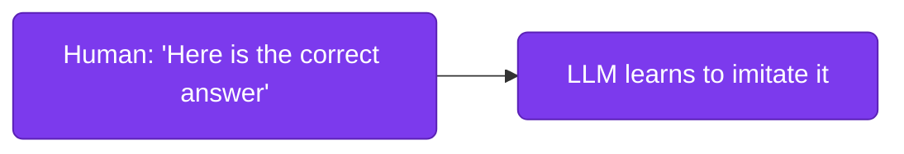
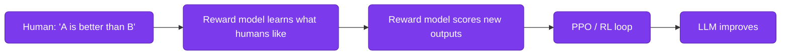
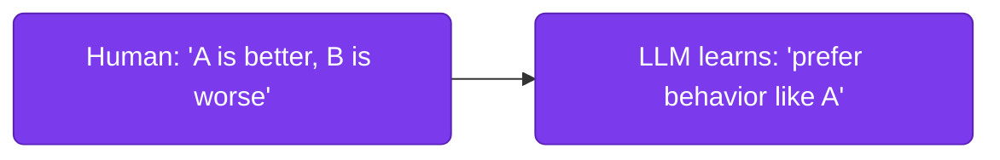
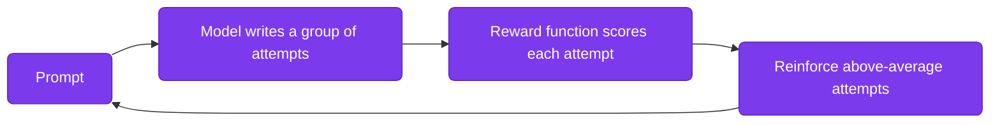
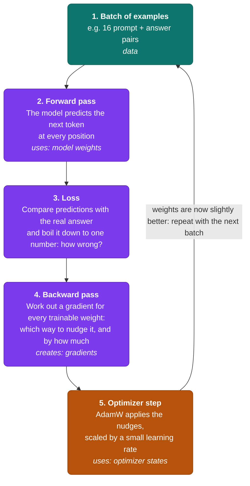
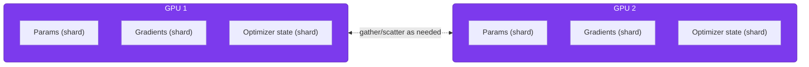

# Lesson 05: LLM Fine-Tuning Infrastructure

Fine-tuning is the other lever [Lesson 03](./03-rag-systems.md) mentioned and set aside. Instead of handing the model relevant text at query time, you keep training it a bit further on examples of the behavior you want, so that behavior gets baked directly into the weights. The trade-off is infrastructure. A RAG system needs an embedding model and a vector database, but fine-tuning needs enough GPU memory to hold a model's weights, gradients, and optimizer state all at once. For anything past a few billion parameters, that stops being a "just rent one GPU" problem.

This lesson is organized in three parts. First, **what fine-tuning is all about**: what it changes, what it can't do, and which kinds exist. Second, **the core logic**: the training loop, why memory is the bottleneck, and how LoRA and QLoRA make the problem solvable. Third, a **step-by-step guide** that takes you from "should we fine-tune?" to a trained, tracked, and served model, including which GPU to rent, when to use multiple GPUs, and how to run the whole thing as a repeatable pipeline instead of a one-off script.

**Prerequisites:** [Lesson 01](./01-introduction-llm-infrastructure.md), [Lesson 02: vLLM Deployment](./02-vllm-deployment.md) (a fine-tuned model still needs to be served afterward), [Lesson 03: RAG Systems](./03-rag-systems.md#why-rag) (for the fine-tuning-vs-RAG framing this lesson builds on).

### Contents

1. [Introduction: What Fine-Tuning Is All About](#introduction-what-fine-tuning-is-all-about)
2. [Core Logic of Fine-Tuning](#core-logic-of-fine-tuning)
3. [Step-by-Step: Fine-Tuning an LLM](#step-by-step-fine-tuning-an-llm)
4. [Step 1: Decide Fine-Tuning Is the Right Tool](#step-1-decide-fine-tuning-is-the-right-tool)
5. [Step 2: Prepare the Training Data](#step-2-prepare-the-training-data)
6. [Step 3: Choose the Method and the GPU](#step-3-choose-the-method-and-the-gpu)
7. [Step 4: Load the Model and Attach the Adapter](#step-4-load-the-model-and-attach-the-adapter)
8. [Step 5: Train](#step-5-train)
9. [Step 6: Scale Beyond One GPU (Only If Needed)](#step-6-scale-beyond-one-gpu-only-if-needed)
10. [Step 7: Track Experiments and Control Cost](#step-7-track-experiments-and-control-cost)
11. [Step 8: Evaluate, Merge, and Serve](#step-8-evaluate-merge-and-serve)
12. [Practical Exercise](#practical-exercise)
13. [Key Takeaways](#key-takeaways)
14. [Additional Resources](#additional-resources)

---

## Introduction: What Fine-Tuning Is All About

### From General Model to Specialist

A large language model starts life in **pre-training**. It reads trillions of tokens of text and learns to predict the next token, which teaches it grammar, world knowledge, and a broad ability to follow patterns. That step costs thousands of GPUs and weeks of time, and you will almost never do it yourself.

**Fine-tuning** is everything that happens after. You take the pre-trained model, which already knows language, and continue training it on a small, carefully chosen dataset that shows the behavior you want. Think of a general practitioner who does a residency: no new "alphabet" is learned, but the way they answer, the format they use, and the judgment they apply all shift toward the specialty.

What actually changes is the model's **weights**, the billions of numbers inside it. Nothing about the prompt, the serving stack, or the retrieval layer is different. The behavior is now part of the model itself, which is why it is fast at inference time and also why it is hard to undo.

### What Fine-Tuning Can and Can't Do

[Lesson 03](./03-rag-systems.md#why-rag) already laid out the core trade-off. RAG and fine-tuning change different things about a model:

| | RAG | Fine-tuning |
|---|---|---|
| What it changes | What the model *sees* at query time | How the model *behaves*, by updating its weights |
| Best at | Facts that change, private data, answers that need citations | Tone, output format, domain vocabulary, task-specific skill |
| How you update it | Edit the documents in the vector database | Prepare new data and train again |
| Where the knowledge lives | In an external store you can inspect and delete from | Inside the weights, where it can't be inspected or removed |

Fine-tuning is good at teaching a model *how* to respond and unreliable at teaching it *what is currently true*. A model fine-tuned on last quarter's product catalog will confidently repeat last quarter's prices after the catalog changes. If the goal is fresh or citable facts, reach for RAG.

**The two work well together.** In production, teams often combine them. A model fine-tuned to always answer in a strict format and cite its sources, paired with RAG to supply the facts it cites, gets reliable behavior from the weights and current, traceable knowledge from retrieval. Each technique handles the part it is best at.

> [!NOTE]
> **Industry trend (2026) — Hybrid Is the Default: Fine-Tune for Behavior, Retrieve for Facts**
>
> **What it is:** Teams no longer pick RAG *or* fine-tuning. They build them in sequence: RAG first, to get a baseline and expose failure modes. Then prompt improvements. Then fine-tuning a smaller, cheaper base model only for what's left, such as schema drift, tone inconsistency, and format errors. Finally, that fine-tuned model goes inside the RAG pipeline.
>
> **Why it's picked over the others:** It stacks the strengths of each: live facts from retrieval, locked-in behavior from fine-tuning, and lower inference cost than a frontier model would charge for the same job. The RAG layer works with any base model, and if the fine-tuning used LoRA adapters, the behavior can be retrained on a newer base model with a small fraction of the original effort. That is why the pattern survives base-model upgrades well.
>
> **Where it's used:** Winder.AI, an AI consultancy, reports that most production systems it delivers end up as hybrids. That is one practitioner's account, not an industry survey, but it matches the order of the checks in [Step 1](#step-1-decide-fine-tuning-is-the-right-tool). *(Source: [RAG vs Fine-Tuning in 2026: A Decision Framework for LLM Teams — Winder.AI](https://winder.ai/rag-vs-fine-tuning-2026-decision-framework/))*

### Kinds of Fine-Tuning

"Fine-tuning" is an umbrella term. The methods under it differ in one respect: the **feedback signal**, meaning how you tell the model what "good" looks like. Four approaches are in common use. They are listed roughly in the order the field adopted them, and each later one is largely a response to the cost or the limits of an earlier one.

| # | Kind | Feedback signal | Learns by |
|---|---|---|---|
| 1 | **SFT** (supervised fine-tuning) | Written ideal answers | Imitation |
| 2 | **RLHF** (reinforcement learning from human feedback) | Human rankings, distilled into a reward model | Practice against a learned critic |
| 3 | **DPO** (direct preference optimization) | Human rankings, used directly | Comparison |
| 4 | **GRPO / RLVR** (reinforcement learning from verifiable rewards) | A programmatic reward function | Practice against a program |

Each kind below follows the same layout: the idea, how it works, what the data looks like, what it's good at, where it struggles, and what it costs.

#### 1. Supervised fine-tuning (SFT): learn by imitation

**The idea.** You give the model thousands of examples of an input paired with the ideal output, and it learns to reproduce that pattern. It is the closest thing to "show, don't tell."

**How it works.** The human writes the answer, and the model imitates it.



**What the data looks like.** One input and one answer you'd be proud of:

```json
{"prompt": "Summarize this clause in plain English: The tenant shall...", "response": "The tenant must..."}
```

**What it's good at.** Anything where you can write down the right answer and have a few hundred to a few thousand of them: a consistent tone, a strict output format such as always returning valid JSON, domain vocabulary, or a narrow task like classifying tickets into your company's own categories.

**Where it struggles.** The model can only be as good as your examples. If they're inconsistent, it learns the inconsistency. And it can only imitate. It can't discover an approach better than the ones you showed it. It is also poor at capturing qualities that are easier to *recognize* than to *write down*, such as "warm but not gushing." That gap is what the next three kinds address.

**What it costs.** The lightest option: one model, one training loop, and the memory arithmetic from the next section. It is the right place to start, and for many teams it's also the place to stop.

#### 2. Reinforcement learning from human feedback (RLHF): learn by practice against a learned critic

**The idea.** RLHF is the original way to teach models human taste. Sometimes you can't easily *write* the perfect answer, but you can easily *recognize* the better of two. Humans are much better at ranking than at authoring. So instead of asking people to write answers, you ask them to compare answers, and you use those comparisons to teach the model. Taste can't be checked by a program, though, so you first **train a second model, a reward model, to imitate human judgment**. That reward model then acts as an automatic grader while the main model practices.

**How it works.** The human's opinion goes to a middleman first, and the middleman does the grading.



1. Humans rank pairs of answers.
2. A **reward model** is trained on those rankings until it can guess how much a human would like any answer.
3. The main model generates fresh answers, and the reward model scores them.
4. A reinforcement-learning algorithm, classically **PPO**, uses those scores to update the main model.

**What the data looks like.** Pairs of answers with a verdict (used to train the reward model), plus a pool of prompts for the practice phase:

```json
{"prompt": "My order arrived broken. What now?", "chosen": "I'm sorry about that...", "rejected": "Please refer to our returns policy."}
```

**What it's good at.** Qualities that are hard to specify but easy to judge: tone, helpfulness, politeness, safety and refusal behavior, and "sounds like us." It has one extra advantage over the methods that follow: the trained reward model is a **reusable asset**. It can score any output at scale, rank candidate answers, or keep improving a model online as new feedback arrives.

**Where it struggles.** It is the most finicky of the four to tune, and the reward model can be gamed. The model learns to please the reward model rather than the humans it was meant to approximate.

**What it costs.** The most of the four. Classic PPO can keep **up to four models in memory at once**: the model being trained, a frozen reference, the reward model, and a value model. On top of that, it needs a reward-model training run and a text-generating RL loop. That weight is exactly what the next two kinds set out to remove.

#### 3. Preference tuning (DPO): learn by comparison

**The idea.** DPO (Direct Preference Optimization) keeps what RLHF got right, learning from human comparisons, and drops the machinery. It learns **straight from the pairs** in a single, simple training loop. For each prompt you show a **chosen** answer and a **rejected** one, and the model shifts toward the style of the first and away from the second. There is no reward model to train and no reinforcement-learning loop to babysit.

**How it works.** The human picks the better answer, and the model learns from the pair directly. There is no middleman.



In practice, DPO compares the model being trained against a frozen reference copy of itself, so it doesn't drift too far from where it started. With LoRA, that reference is just the base model with the adapter switched off, so you don't pay for a second full model in memory.

**What the data looks like.** The same kind of pairs RLHF uses, one prompt, two answers, and a verdict:

```json
{
  "prompt": "My order arrived broken. What now?",
  "chosen": "I'm sorry about that. I've started a replacement and you'll get a tracking link within the hour.",
  "rejected": "Please refer to our returns policy."
}
```

**What it's good at.** The same qualities as RLHF: tone, helpfulness, politeness, safety and refusal behavior, concision. It is commonly run *after* SFT as a polish step. SFT teaches the model the task, and preference tuning nudges *how* it does it. Because it is so much simpler than RLHF, it captures most of the benefit at a fraction of the memory and tuning effort, which is why it displaced RLHF for most teams.

**Where it struggles.** It needs pair data, which costs more to collect than plain examples. This is one reason teams use a strong model to generate and rank candidate answers, as described in the synthetic-data note in [Step 2](#step-2-prepare-the-training-data). It also gives up RLHF's reusable reward model, and preference data teaches "better than," not "correct," so it isn't a good tool for injecting facts.

**What it costs.** Somewhat more than SFT, because each training example is two answers instead of one, and the reference comparison adds compute. Far less than RLHF.

#### 4. Reinforcement learning from verifiable rewards (GRPO / RLVR): learn by practice

**The idea.** For some tasks you don't need examples *or* human judgments, because a program can check the answer. Did the math result match? Did the code pass its unit tests? Did the output parse as valid JSON with the right fields? If so, you can write a small **reward function** and let the model practice. That approach is called reinforcement learning from verifiable rewards (RLVR), and **GRPO** (Group Relative Policy Optimization) is the most common way to run it. It keeps RLHF's "practice and get graded" loop, but the grader is a program you wrote instead of a model you had to train.

**How it works.** The model practices, a program grades, and the better attempts get reinforced.



1. The model gets a prompt and generates a *group* of different attempts at it, say eight.
2. Your reward function scores each attempt, for example 1 for correct and 0 for wrong.
3. Attempts that scored better than the group's average are reinforced, and the weaker ones are discouraged.
4. Repeat, thousands of times. Over many rounds, the model discovers for itself which ways of working tend to earn the reward, including step-by-step reasoning it was never explicitly taught.

That "compare each attempt with its own group" trick is what gives GRPO its name, and it is why it needs no separate value model. When the reward is a program, there is no reward model either.

**What the data looks like.** Just prompts and a way to grade them. No written answers required:

```python
def reward(answer: str, expected: str) -> float:
    return 1.0 if extract_final_number(answer) == expected else 0.0
```

**What it's good at.** Tasks with an objectively checkable outcome: math, code generation, structured extraction, and puzzle-like reasoning. This is the family of methods behind the recent wave of open "reasoning" models.

**Where it struggles.** It only works when you can write a trustworthy reward function. A sloppy one gets *gamed*: the model finds shortcuts that earn points without actually solving the problem. It is also useless for taste-based qualities like "is this tone friendly?" where no program can judge. That is still RLHF and DPO territory.

**What it costs.** More than SFT or DPO. The model has to *generate* many full answers at every step before it can learn from any of them, so runs are slower and more memory-hungry. It is lighter than classic RLHF, because there is no reward model or value model to hold in memory.

> [!NOTE]
> **Industry trend (2026) — GRPO: Training on a Reward Function Instead of Labeled Examples**
>
> **What it is:** Reinforcement learning from verifiable rewards (RLVR), most often run with GRPO (Group Relative Policy Optimization), skips labeled examples. You write a programmatic reward function, for example one that checks whether an answer is correct. The model generates its own answers during training, and the function scores them. There is no human labeling and, unlike RLHF, no separate reward model to train.
>
> **Why it's picked over the others:** It complements supervised fine-tuning rather than replacing it. SFT teaches knowledge and format from labeled examples, and GRPO improves reasoning on tasks where correctness can be checked automatically, such as math, code and structured extraction. The trade-off is infrastructure. The model must generate rollouts during training, so runs are heavier than SFT, and Red Hat's guide recommends a 40GB+ GPU (A100, H100 or L40S).
>
> **Where it's used:** GRPO is the post-training method behind the recent wave of open reasoning models. Hugging Face TRL provides a `GRPOTrainer`, and platforms like Red Hat OpenShift AI now document GRPO as a supported training workflow. *(Sources: [GRPO fine-tuning on Red Hat OpenShift AI — Red Hat Developer](https://developers.redhat.com/articles/2026/08/26/reinforcement-learning-from-verifiable-rewards-with-training-hub-on-red-hat-openshift-ai), [Post training an LLM for reasoning with GRPO in TRL — Hugging Face](https://huggingface.co/learn/cookbook/en/fine_tuning_llm_grpo_trl))*

#### Side by side

| | SFT | RLHF | DPO | GRPO / RLVR |
|---|---|---|---|---|
| You provide | Input → ideal answer | Ranked pairs + prompts | Prompt + chosen + rejected answer | Prompts + a reward function |
| The model learns | To imitate the examples | To earn more reward from a learned critic | To prefer better answers over worse ones | To earn more reward from a program |
| Best for | Format, style, task skill | Taste at scale, reusable reward model | Tone, safety, "sounds right" | Reasoning with checkable answers |
| Models in memory | 1 (plus adapter) | Up to 4: trained model, reference, reward model, value model | 1, plus a frozen reference (free with LoRA) | 1, plus generation overhead; a frozen reference is optional |
| Hardest part | Writing consistent, high-quality examples | Tuning the RL loop and keeping the reward model honest | Collecting or generating good pairs | Writing a reward function that can't be gamed |
| Relative cost | Lowest | Highest | Medium | High |

**How they fit together.** The four aren't rivals, and each later one is a response to the weight of an earlier one: RLHF made comparisons useful, DPO made them cheap, and GRPO made practice cheap where answers can be checked. Teams chain them, and SFT nearly always comes first: show first, then refine with comparisons (DPO today for most teams, or RLHF where a reusable reward model is worth its cost), and use practice (GRPO) where the answers can be checked.

**Scope.** The steps below implement SFT. The other methods use the same infrastructure but need different data and trainers.

---

## Core Logic of Fine-Tuning

### The Training Loop

Fine-tuning is the same training loop used in pre-training, applied to a much smaller dataset and started from weights that already work:



1. **Forward pass.** The model reads an example and predicts each next token.
2. **Loss.** A number measures how far those predictions were from the answer in your dataset.
3. **Backward pass.** Backpropagation computes a **gradient** for each trainable weight: which direction to nudge it to reduce the loss.
4. **Optimizer step.** An optimizer, usually AdamW, applies the nudges. It uses a small **learning rate**, so the model shifts toward your examples without forgetting what it already knew.
5. **Repeat** over the whole dataset (one *epoch*), usually for one to three epochs.

That is the whole idea. Everything else in this lesson, including LoRA, quantization, sharding across GPUs, and gradient checkpointing, exists to make step 3 and step 4 fit into the GPU memory you actually have.

### Why Memory Is the Bottleneck

Every trainable weight needs a gradient and optimizer state kept alongside it for the entire run. With standard mixed-precision AdamW, this is what has to live in GPU memory at once:

| Component | Memory (per 1B parameters) |
|---|---|
| Model weights (FP16/BF16) | 2 GB |
| Gradients (FP16/BF16) | 2 GB |
| FP32 master copy of the weights | 4 GB |
| AdamW optimizer states (two FP32 values per parameter) | 8 GB |
| **Subtotal, before activations** | **~16 GB per 1B parameters** |
| Activations (depends on batch size and sequence length) | + several GB more |

The consequences are large. A 7B model needs roughly **112 GB before activations**, more than an A100-80GB holds. A 70B model needs over **1 TB**, so full fine-tuning at that size *requires* distributed training before you've written a line of training code. (Memory-saving tricks such as 8-bit optimizers or pure-BF16 training can shrink this, but the order of magnitude stays the same.)

The key observation: only the **weights** are needed for inference, but training multiplies the footprint roughly eightfold. That gap is what parameter-efficient methods attack.

### The PEFT Idea: Freeze the Model, Train a Small Add-On

**PEFT (Parameter-Efficient Fine-Tuning)** freezes the base model entirely and trains only a small set of extra parameters. Gradients and optimizer states then only need to exist for that small piece, not the whole model, which is why PEFT can turn a "needs 8 GPUs" problem into a "fits on one GPU" one.

| | Full fine-tuning | PEFT |
|---|---|---|
| Trainable parameters | 100% | Typically 0.1–1% |
| Memory needed | Very high, scales with the full model | A small fraction of full fine-tuning's |
| Quality | Highest ceiling | Often close to full fine-tuning, and it can match it when configured well (see the LoRA note below) |
| Risk | Catastrophic forgetting, expensive mistakes | Lower, because the base model is never modified |

PEFT is a family of techniques, not one method:

| Family | Idea | Examples |
|---|---|---|
| Prompt-based | Learn extra "virtual" tokens or prompts (at the input, or fed into attention); the model's own weights are untouched | Soft prompt tuning, prefix tuning, LLaMA-Adapter |
| Adapter-based | Insert small trainable bottleneck layers (down-project, activation, up-project) between frozen layers | Bottleneck adapters |
| Reparameterization | Express the weight *update* in a compact low-rank form | **LoRA** and its variants (QLoRA, DoRA, and others) |

```text
PEFT
│
├── Prompt-based
│   ├── Soft Prompt Tuning
│   ├── Prefix Tuning
│   └── LLaMA-Adapter
│
├── Adapter-based
│   └── Bottleneck Adapters
│
└── Reparameterization
    ├── LoRA
    ├── QLoRA
    ├── DoRA
    └── other variants
```

**Adapter vs. LLaMA-Adapter vs. LoRA.** All three add a small number of trainable parameters and keep the pretrained model frozen, but each adds them in a different place. Don't read them as three names for the same thing.

A **bottleneck adapter** is a new trainable module: a small network that shrinks the hidden state, applies an activation, expands it back, and adds the result as a correction.

```text
Hidden state
    ↓
4096 → 256   (down-project)
    ↓
activation
    ↓
256 → 4096   (up-project)
    ↓
correction added back
```

**LLaMA-Adapter** adds no extra layers. It learns a small set of adaptation prompts that are fed into the attention layers, so the model attends to them alongside the real input.

```text
Hidden state ──→ Attention ──→ output
                    ↑
                    │
             learned adaptation
             prompts
```

**LoRA** adds no module and no prompts. It learns a low-rank correction to an existing weight matrix, computed in parallel with it.

```text
              ┌──── W (frozen) ────┐
Input ────────┤                    ├──→ output
              └── A → r → B ───────┘
                 (trainable)
```

| | What is new and trainable | Where it lives |
|---|---|---|
| Bottleneck adapter | A small module | Between existing layers |
| LLaMA-Adapter | Learned prompts | Inside attention |
| LoRA | A low-rank weight update | Alongside an existing weight, mergeable into it |

An analogy: the pretrained model is a highly trained employee. A bottleneck adapter hires a small assistant to help with the task. LLaMA-Adapter hands the employee an instruction sheet to consult while paying attention. LoRA hires no one and hands over no sheet; it makes a small mathematical adjustment to how the employee already performs certain operations.

> [!TIP]
> **Go deeper — the full PEFT family.** This lesson concentrates on LoRA and QLoRA because they dominate practice. For a broader tour of the other methods, including prompt tuning, prefix tuning, adapters, and the LoRA variants, plus rank intuition and comparisons, see the [Parameter-Efficient Fine-Tuning primer on aman.ai](https://aman.ai/primers/parameter-efficient-fine-tuning/).

LoRA won in practice for a practical reason beyond memory savings: once training is done, the small update can be **merged** back into the base weights, so the fine-tuned model runs at exactly the base model's speed with no added inference latency.

### LoRA: Low-Rank Adaptation

The insight: when you fine-tune a model, the *change* to each weight matrix tends to be low-rank. It doesn't need the full expressiveness of a dense d×d update to capture what fine-tuning is teaching. So instead of learning a full d×d update, LoRA learns two small matrices whose product approximates it:

```
W' = W + BA

W ∈ ℝ^(d×k)   — the original weight matrix, frozen, never updated
B ∈ ℝ^(d×r)   — a trainable low-rank matrix
A ∈ ℝ^(r×k)   — a trainable low-rank matrix
r << min(d, k) — the rank, typically 8, 16, or 32
```

Concretely, for a 4096-dimension layer with rank 16: full fine-tuning of that one matrix would mean training 4096 × 4096 = **16.8M** parameters. LoRA trains 4096×16 + 16×4096 = **131K** parameters instead, a **128x reduction**, for about 0.78% of the original parameter count. The original LoRA paper reports the same effect at scale: roughly 10,000x fewer trainable parameters and about 3x less GPU memory than full fine-tuning of GPT-3.

Four settings control a LoRA adapter:

| Parameter | What it controls | Guidance |
|---|---|---|
| `r` (rank) | Adapter capacity | 8 for simple tasks, 16 as a general default, 32–64 for a large domain shift; higher for very large datasets |
| `lora_alpha` | Scaling of the adapter's effect | Usually set to 2× the rank |
| `target_modules` | Which weight matrices get adapted | **All linear layers** (attention *and* MLP) is the modern default; attention-only leaves quality on the table |
| `lora_dropout` | Regularization | Higher (0.1) on small datasets, lower (0.0) on large ones |

> [!NOTE]
> **Industry trend (2026) — "LoRA Without Regret": Adapt All Layers, Raise the Learning Rate**
>
> **What it is:** A widely cited September 2025 study from Thinking Machines Lab found that LoRA can match full fine-tuning on typical post-training datasets, under two conditions. LoRA must be applied to *all* weight matrices, especially the MLP layers, and the adapter must have enough capacity for the amount of data being learned.
>
> **Why it's picked over the others:** It changes some of the defaults this lesson started from. Attention-only LoRA, meaning just `q_proj`/`k_proj`/`v_proj`/`o_proj`, significantly underperforms even when the trainable parameter count is similar. So widen `target_modules` to include the MLP projections (`gate_proj`, `up_proj`, `down_proj` on Llama-style models). The optimal learning rate for LoRA is consistently about 10x the full fine-tuning rate, and roughly independent of rank. Two limits remain. LoRA tolerates large batch sizes less well than full fine-tuning, and it falls behind when the dataset is far larger than the adapter can hold, so use a higher rank for larger datasets. Per pass it also needs a little over two-thirds of full fine-tuning's compute.
>
> **Where it's used:** Hugging Face TRL now ships a "LoRA Without Regret" guide that turns these findings into training recipes. It is the reason "adapt every linear layer" is becoming the default in LoRA configs. *(Sources: [LoRA Without Regret — Thinking Machines Lab](https://thinkingmachines.ai/blog/lora/), [LoRA Without Regret — Hugging Face TRL docs](https://huggingface.co/docs/trl/lora_without_regret))*


### QLoRA: Quantize the Frozen Base

QLoRA combines LoRA with quantization, so the frozen base model takes up even less memory, leaving more headroom for the parts that are actually training:

| Innovation | What it does |
|---|---|
| 4-bit NormalFloat (NF4) quantization | Stores the frozen base model's weights in 4 bits instead of 16, cutting model memory ~4x. NF4 is a 4-bit datatype shaped to how neural-network weights are actually distributed, so it is more accurate than plain 4-bit at the same size |
| Double quantization | Quantizes the quantization constants themselves, saving a further small amount |
| Paged optimizers | Move optimizer memory spikes to CPU RAM automatically instead of crashing on a spike |

Only the *frozen* weights are stored in 4 bits. The small LoRA adapter on top stays in higher precision and is the only part being trained, so quality holds up far better than the compression ratio suggests.


> [!NOTE]
> **Industry trend (2026) — DoRA and Unsloth**
>
> **What it is:** DoRA (Weight-Decomposed LoRA) splits a weight update into a magnitude component and a direction component instead of learning one combined low-rank update, closing some of the quality gap to full fine-tuning. Separately, Unsloth is a training library that reimplements the LoRA/QLoRA training loop with custom kernels for large speed and memory wins on the same hardware.
>
> **Why it's picked over the others:** DoRA is a small change to an existing setup. In Hugging Face PEFT it is a single `use_dora=True` flag on the LoRA config, with no new infrastructure, though it adds some training overhead compared with plain LoRA. Unsloth's appeal is blunter: reported 2–5x faster training and roughly 70% less VRAM for single-GPU QLoRA, which can be the difference between a job fitting on a rented GPU or not.
>
> **Where it's used:** Unsloth has become a standard part of the single-GPU and consumer-hardware fine-tuning toolchain alongside Axolotl (YAML-driven training configs) and TRL (for DPO and other post-training objectives). The three together are what most 2026 fine-tuning setups are built from. *(Source: [LLM Fine-Tuning 2026: LoRA vs QLoRA vs DoRA vs Full FT — AppScale](https://appscale.blog/en/blog/llm-fine-tuning-lora-qlora-full-fine-tuning-compared-2026))*

### Choosing a Method at a Glance

For a 7B model (approximate memory floors; real runs add activations and overhead):

| Method | Trainable parameters | Approx. GPU memory | Typical GPU |
|---|---|---|---|
| Full fine-tuning (mixed-precision AdamW) | 100% | ~110 GB+ before activations | Multi-GPU |
| LoRA (BF16 base model) | ~0.5–1% | ~16–20 GB | A10G / A100-40GB |
| QLoRA (4-bit base model) | ~0.5–1% | ~6–10 GB | T4 / A10G / consumer 24GB |

That gap is the number that matters. A 7B model that cannot be fully fine-tuned on any single GPU fits comfortably on a single consumer 24GB GPU with QLoRA. A 70B model's 4-bit weights are about 35GB, so it becomes feasible on a single 80GB GPU instead of a multi-GPU cluster.

---

## Step-by-Step: Fine-Tuning an LLM

The rest of the lesson walks the process in order. Each step ends with a **checkpoint** so you know it is done before moving on.


Steps 2, 4, and 5 build one script together: the code in each step continues from the variables defined in the one before it. Step 6 is only needed when a single GPU isn't enough.

### Step 1: Decide Fine-Tuning Is the Right Tool

Everything after this step costs GPUs, time, and a model to host. Three checks tell you whether the cost is justified.

**1. Do you have enough good examples?**
Fine-tuning learns from demonstrations, so the size of the dataset limits what it can learn.

- *Changing style or format*, such as answering in a house tone, always returning valid JSON, or following a support-ticket template, can work with a few hundred carefully chosen examples. The model already knows how to do the task, and you are only steering it.
- *Teaching a genuinely new skill*, such as classifying your company's internal ticket categories or writing in a specialized clinical format, usually needs thousands of examples. Here the model has to learn the pattern itself.

Quality counts for more than quantity. A few hundred clean, consistent examples beat tens of thousands of noisy ones, because every flaw in the data gets learned along with everything else. [Step 2](#step-2-prepare-the-training-data) covers this.

**2. Is the target stable?**
Every change to the desired behavior means new data, a new training run, a new evaluation, and a new deployment. If the behavior is still changing week to week, you will spend more time re-training than improving. That kind of change is what RAG is built for, since updating a document in the vector database takes minutes. Fine-tune once the behavior is settled enough that a training run stays useful for months.

**3. Has better prompting really failed?**
Clear instructions, a few well-chosen examples in the prompt (few-shot prompting), and a structured output schema fix many "the model isn't behaving how I want" problems. They cost almost nothing and take effect immediately. Fine-tuning adds GPUs, a data pipeline, evaluation, and a model to host and version. It earns that cost when a careful prompt has been tried and still falls short. Common cases are consistency at scale, a prompt so long that it slows every request, or a smaller and cheaper model that has to match a larger one on a narrow task.

> **Checkpoint:** You can name the specific behavior the model gets wrong today, show that a good prompt doesn't fix it, and point to (or can build) a few hundred or more examples of the right behavior.

### Step 2: Prepare the Training Data

Fine-tuning data quality matters even more than RAG document quality, for a simple reason: a bad chunk in a vector database is just one retrievable result among many, but a bad training example gets baked permanently into the model's weights alongside everything else.

**2a. Collect examples in a consistent format.** A typical instruction-formatted example looks like this (Alpaca-style, one of several common formats, with chat-message format being the other):

```json
{"instruction": "Summarize the following clause.", "input": "The tenant shall...", "output": "The tenant must..."}
```

**2b. Turn each record into the text the model will train on.** The model sees one string per example: the prompt followed by the ideal answer, ending with the end-of-sequence token so it learns *when to stop*:

```python
from datasets import load_dataset
from transformers import AutoTokenizer

model_name = "meta-llama/Llama-2-7b-hf"  # any 7B causal LM works; Llama-2 keeps the parameter counts below exact
tokenizer = AutoTokenizer.from_pretrained(model_name)
tokenizer.pad_token = tokenizer.eos_token

def to_text(ex):
    prompt = f"### Instruction:\n{ex['instruction']}\n\n### Input:\n{ex['input']}\n\n### Response:\n"
    return {"text": prompt + ex["output"] + tokenizer.eos_token}

dataset = load_dataset("json", data_files="training_data.jsonl", split="train").map(to_text)
```

For an instruction-tuned or chat model, use its own template through `tokenizer.apply_chat_template(...)` instead of a hand-written prompt. Training with a different template than the one the model was built around is a common source of silent quality loss.

**2c. Check the data before you train.** These failure modes are easy to miss at a glance:

| Check | Catches |
|---|---|
| Duplicate examples | Wasted training signal, and sometimes memorization of repeated text |
| Length distribution / truncation rate | Examples silently cut off at `max_length`, losing their answer |
| Empty or malformed examples | Rows with missing fields, blank text, or broken encoding |

```python
def check_dataset(dataset, tokenizer, max_length=512):
    texts = [ex["text"] for ex in dataset]
    lengths = [len(tokenizer.encode(t)) for t in texts]
    return {
        "duplicate_rate": 1 - len(set(texts)) / len(texts),
        "truncation_rate": sum(l > max_length for l in lengths) / len(lengths),
        "empty_examples": sum(not t.strip() for t in texts),
    }

print(check_dataset(dataset, tokenizer))
```

A high truncation rate is the one most worth acting on immediately. It means a chunk of your examples are training the model on incomplete input/output pairs without anyone noticing.

**2d. Tokenize and hold out an evaluation split.** The labels are a copy of the input IDs. Padding is added later, per batch, in Step 5:

```python
def tokenize(batch):
    enc = tokenizer(batch["text"], truncation=True, max_length=512)
    enc["labels"] = [ids.copy() for ids in enc["input_ids"]]
    return enc

tokenized = dataset.map(tokenize, batched=True, remove_columns=dataset.column_names)
split = tokenized.train_test_split(test_size=0.1)
```

A simple version like this trains on the prompt tokens as well as the answer. A common refinement is to compute the loss on the response only, which most training frameworks support.

> [!NOTE]
> **Industry trend (2026) — Synthetic Data as the Default Source**
>
> **What it is:** Instead of hand-labeling thousands of examples, teams generate them: a small set of real "seed" examples goes to a frontier model (GPT-4o-class or similar), which produces a much larger set of synthetic training examples via Self-Instruct or Evol-Instruct, followed by a "judge" model filtering out the low-quality ones before anything reaches training.
>
> **Why it's picked over the others:** The cost gap is stark. A single piece of human preference-labeled data runs $1–10+, while AI-generated feedback from a frontier model costs a fraction of a cent. That difference is what makes 80,000+ row datasets feasible for teams that could never have afforded to hand-label at that volume.
>
> **Where it's used:** This is now standard for both supervised fine-tuning data and DPO-style preference pairs, but the judge-filtering step is treated as non-negotiable. An unfiltered synthetic dataset is reported to train worse models than a smaller, filtered one. The approach isn't replacing human data entirely; a small human-labeled seed set still anchors the whole pipeline, with synthetic generation scaling it up rather than substituting for it. *(Source: [Synthetic Data for LLM Fine-Tuning in 2026 — FutureAGI](https://futureagi.com/blog/synthetic-data-fine-tuning-llms/))*

> **Checkpoint:** You have a train split and an evaluation split, the duplicate and empty counts are near zero, the truncation rate is low, and you have read a handful of formatted examples by eye.

### Step 3: Choose the Method and the GPU

| GPU | Memory | Approx. cost/hour | Fits (7B model) |
|---|---|---|---|
| T4 | 16 GB | ~$0.40 | QLoRA only |
| A10G | 24 GB | ~$1.20 | QLoRA comfortably, LoRA tightly |
| A100-40GB | 40 GB | ~$3.50 | LoRA comfortably |
| A100-80GB | 80 GB | ~$5.00 | LoRA easily; full fine-tuning only with tricks (8-bit optimizer, offloading) |
| H100 | 80 GB | ~$8.50 | Same as A100-80GB, faster |

*Prices are illustrative and vary widely by provider. Specialist GPU-rental providers are often much cheaper than the on-demand rates of large clouds.*

The practical rule this table implies: pick the *method* based on the GPU you can actually get, not the other way around. QLoRA on a rented A10G is a perfectly good starting point for most fine-tuning work. Reach for full fine-tuning only once you have a specific, tested reason PEFT isn't hitting the quality bar you need.

> [!NOTE]
> **Industry trend (2026) — Renting GPUs Directly vs. Fine-Tuning-as-a-Service**
>
> **What it is:** Hosted fine-tuning APIs (Together AI, Fireworks) let you submit a dataset and get a fine-tuned model back with zero infrastructure of your own. The alternative is renting raw GPU capacity from providers built specifically for this (Spheron, RunPod, and similar). According to the source below, that has gotten cheap enough to undercut the hosted APIs on a per-training-hour basis. The source is itself a GPU-rental vendor, so read its comparison with that in mind.
>
> **Why it's picked over the others:** The economics flip depending on what you're optimizing for. A hosted API is the fastest path for a single, one-off fine-tune, with no setup at all. But renting GPUs directly is reported as markedly cheaper once you're doing this more than once, and it avoids a genuinely easy-to-miss cost: on model-hosting platforms, the *training* cost and the cost of *running* your fine-tuned model afterward are billed completely separately. A training job that cost $5 can be followed by a dedicated endpoint costing $200+/month, because the fine-tuned weights need their own always-on GPU to serve.
>
> **Where it's used:** The source reports that OpenAI has scaled back self-serve fine-tuning access, and that Together AI and Fireworks remain the strongest hosted options, with Fireworks offering the more complete self-serve post-training stack. Teams doing this repeatedly, or with any cost sensitivity, increasingly rent GPUs directly with the toolchain from the DoRA/Unsloth note (Unsloth/Axolotl/TRL) instead. *(Source: [LLM Fine-Tuning Cost 2026: API vs Renting Your Own GPUs — Spheron](https://www.spheron.network/blog/llm-fine-tuning-cost-2026-api-vs-renting-gpus/))*

> **Checkpoint:** You have picked a method (default: QLoRA) and a GPU tier whose memory clearly covers it, using the table in [Choosing a Method at a Glance](#choosing-a-method-at-a-glance).

### Step 4: Load the Model and Attach the Adapter

This is where the memory math from the core logic becomes code. Load the base model in 4-bit, then attach a LoRA adapter to every linear layer:

```python
import torch
from transformers import AutoModelForCausalLM, BitsAndBytesConfig
from peft import LoraConfig, get_peft_model, prepare_model_for_kbit_training, TaskType

bnb_config = BitsAndBytesConfig(
    load_in_4bit=True,
    bnb_4bit_use_double_quant=True,
    bnb_4bit_quant_type="nf4",
    bnb_4bit_compute_dtype=torch.bfloat16,
)

model = AutoModelForCausalLM.from_pretrained(
    model_name, quantization_config=bnb_config, device_map="auto"
)
model = prepare_model_for_kbit_training(model)  # stabilizes training on a quantized base model

lora_config = LoraConfig(
    r=16,                         # rank
    lora_alpha=32,                # scaling factor, usually 2x the rank
    target_modules="all-linear",  # attention AND MLP layers
    lora_dropout=0.05,
    bias="none",
    task_type=TaskType.CAUSAL_LM,
)
model = get_peft_model(model, lora_config)
model.print_trainable_parameters()
# trainable params: 39,976,960 || all params: 6,778,392,576 || trainable%: 0.5898
```

The last line is worth reading: of roughly 6.8 billion parameters, about 40 million (0.59%) are trainable. That is the entire "freeze the model, train a small add-on" idea in one number. For plain LoRA without quantization, drop `quantization_config` and `prepare_model_for_kbit_training` and load the model in `bfloat16` instead.

A few things worth getting right:

- Use `bfloat16` as the compute dtype if your GPU supports it (Ampere or newer). It is more numerically stable than `float16` during quantized training. On a T4, use `float16`.
- Enable gradient checkpointing on small GPUs. It trades roughly 20% slower training for meaningfully less activation memory.
- Use a paged optimizer such as `paged_adamw_8bit`. It is what makes the "paged optimizer" spike protection from the QLoRA section actually apply.

> **Checkpoint:** `print_trainable_parameters()` shows well under 1–2% trainable, and the model loaded onto the GPU without an out-of-memory error.

### Step 5: Train

Continue the same script with the training arguments and the `Trainer`:

```python
from transformers import TrainingArguments, Trainer, DataCollatorForSeq2Seq

training_args = TrainingArguments(
    output_dir="./output", num_train_epochs=3,
    per_device_train_batch_size=4, gradient_accumulation_steps=4,   # effective batch size = 16
    learning_rate=2e-4, bf16=True, optim="paged_adamw_8bit",
    eval_strategy="epoch", save_strategy="epoch", logging_steps=10,
    warmup_ratio=0.03, lr_scheduler_type="cosine", gradient_checkpointing=True,
    report_to="wandb",
)

trainer = Trainer(
    model=model, args=training_args,
    train_dataset=split["train"], eval_dataset=split["test"],
    # pads each batch to its own longest example, and pads labels with -100 so only padding
    # (never a real end-of-sequence token) is ignored by the loss
    data_collator=DataCollatorForSeq2Seq(tokenizer, padding=True, label_pad_token_id=-100),
)
trainer.train()
trainer.save_model("./output/final_model")   # saves the small LoRA adapter, not the full model
```

What each setting is doing:

| Setting | Value | Why |
|---|---|---|
| `learning_rate` | `2e-4` | Roughly 10x a typical full fine-tuning rate (~2e-5), the rule of thumb from the "LoRA Without Regret" note |
| `num_train_epochs` | 3 | One to three is typical; watch eval loss and stop earlier if it starts rising |
| batch size × accumulation | 4 × 4 = 16 | Keeps the effective batch modest, because LoRA is less tolerant of very large batches |
| `warmup_ratio` + cosine schedule | 0.03 + cosine | Avoids an unstable start, then decays smoothly |
| `gradient_checkpointing` | `True` | Recomputes activations to save memory, at some speed cost |
| `report_to` | `"wandb"` | Streams loss and eval metrics to the tracker (see [Step 7](#step-7-track-experiments-and-control-cost)) |

Everything covered so far, including DoRA, a different rank, a different GPU tier, or DeepSpeed for a bigger model, is a change to this same skeleton, not a different pipeline.

> **Checkpoint:** Training loss falls steadily, evaluation loss falls and then flattens, and `./output/final_model` exists.

### Step 6: Scale Beyond One GPU (Only If Needed)

Skip this step if QLoRA or LoRA fits on one GPU, which covers most fine-tuning work. You need it when a model doesn't fit on one GPU even with QLoRA, or when you've decided full fine-tuning is actually necessary. The fix is to shard the training state itself across multiple GPUs. **ZeRO** (Zero Redundancy Optimizer, the technique behind DeepSpeed) does this in stages, each one partitioning more of the training state:

| Stage | What's partitioned across GPUs | Memory reduction |
|---|---|---|
| Stage 1 | Optimizer states | Up to ~4x |
| Stage 2 | Optimizer states + gradients | Up to ~8x |
| Stage 3 | Optimizer states + gradients + model parameters | Scales with GPU count, so the largest models become trainable at all |

*The 4x and 8x figures are theoretical limits that are approached as the number of GPUs grows, not what you get with two or four.*



Instead of every GPU holding a full copy of parameters, gradients, and optimizer state (the naive approach), Stage 3 spreads all three across every GPU in the group. Each GPU temporarily gathers the pieces it needs for each computation and discards them right after, which is what makes the memory savings scale with however many GPUs you add.

**FSDP** (Fully Sharded Data Parallel) is PyTorch's own native answer to the same problem: no external dependency, and increasingly the default for teams already fully in the PyTorch ecosystem.

| | DeepSpeed | FSDP |
|---|---|---|
| Maturity | More battle-tested, especially at very large scale | Newer (FSDP2 is the current rewrite), improving fast |
| Dependencies | External library | Built into PyTorch |
| CPU offloading | Extensive (ZeRO-Offload, plus NVMe) | Supported, all-or-nothing |
| Best for | Maximum-performance, very large-scale training, tight GPU memory | PyTorch-native workflows, simpler setups |

> [!NOTE]
> **Industry trend (2026) — FSDP2 for Most Fine-Tuning, DeepSpeed ZeRO-3 When Memory Runs Out**
>
> **What it is:** FSDP2 is PyTorch's rewritten FSDP, built on its DTensor abstraction so that it shards each parameter individually instead of flattening them together. Hugging Face Accelerate treats the two frameworks as interchangeable: FSDP's `FULL_SHARD` maps to ZeRO stage 3, and you switch between them through the `accelerate launch` config file instead of changing training code.
>
> **Why it's picked over the others:** FSDP2 wins on simplicity and throughput whenever the model and its optimizer state fit in GPU memory. DeepSpeed's real advantage is offloading. Accelerate's documentation notes that FSDP offload is all-or-nothing (parameters, gradients and optimizer together), while DeepSpeed can offload parameters and optimizer state separately, and can offload to NVMe.
>
> **Where it's used:** An April 2026 production comparison reports FSDP2 as the default for 7B–30B fine-tuning, and DeepSpeed ZeRO-3 with CPU/NVMe offload as the better choice for 30B–70B models on constrained GPU memory. This is a newer and more specific picture than the maturity row in the table above. *(Sources: [Distributed training: FSDP vs DeepSpeed vs Megatron in production — datarekha](https://datarekha.com/blog/distributed-training-fsdp-vs-deepspeed/), [FSDP vs DeepSpeed — Hugging Face Accelerate docs](https://huggingface.co/docs/accelerate/en/concept_guides/fsdp_and_deepspeed))*

In practice, both are usually enabled through a couple of flags on the Hugging Face `Trainer`, not hand-built:

```python
# DeepSpeed: point at a config file (ZeRO stage, offload settings, etc.)
training_args = TrainingArguments(..., deepspeed="ds_config.json")

# FSDP: enable directly, no external config file needed
training_args = TrainingArguments(..., fsdp="full_shard auto_wrap")
```

```bash
# Launch distributed training across 4 GPUs on one machine
deepspeed --num_gpus=4 train.py --deepspeed ds_config.json
```

> **Checkpoint:** The same script now runs across all GPUs, and per-GPU memory use is well below what a single GPU would need.

### Step 7: Track Experiments and Control Cost

**Tracking** matters the moment you're running more than one experiment. Without it, "which run had the better eval loss, and what config produced it?" becomes a guessing game:

```python
import wandb

wandb.init(project="llm-finetuning", config={"model": model_name, "method": "qlora", "r": 16})
# TrainingArguments(..., report_to="wandb") logs loss, learning rate, and eval metrics automatically
wandb.finish()
```

Weights & Biases is the common default for visualization during training. MLflow is the usual alternative for teams that also want a self-hosted model registry alongside the run history.

> [!NOTE]
> **Industry trend (2026) — Experiment Tracking Is Consolidating Into the GPU Cloud**
>
> **What it is:** CoreWeave, a GPU cloud provider, completed its acquisition of Weights & Biases on May 5, 2025. The tracker that most fine-tuning scripts log to (`report_to="wandb"`) is now owned by a company that also sells the GPUs those scripts train on.
>
> **Why it matters:** The integration in this lesson doesn't change. But it adds a factor to the W&B vs. MLflow choice: whether you want your run history to live with a hosted, cloud-vendor-owned platform or in an open-source system you host yourself. CoreWeave's announcement says it intends to keep interoperability across deployments and infrastructure providers.
>
> **Where it's used:** Both remain in wide use for fine-tuning runs, and switching between them is mostly a `report_to` setting. Decide based on where you want run history, artifacts and the model registry to live. *(Source: [CoreWeave Completes Acquisition of Weights & Biases — CoreWeave](https://www.coreweave.com/news/coreweave-completes-acquisition-of-weights-biases-2))*

**Cost** comes down to a small number of real levers, in order of impact:

| Lever | Effect |
|---|---|
| Method (QLoRA vs. LoRA vs. full) | Often a 6–12x difference in required GPU memory and cost, before anything else |
| Spot/preemptible instances | Roughly 70% cheaper than on-demand, at the cost of possible interruption |
| Batch size + gradient accumulation | A larger per-device batch trains faster but needs more memory. Gradient accumulation gives a larger *effective* batch with no extra memory, at the cost of more steps per update |
| GPU tier | Don't rent an A100 for a job that fits comfortably on an A10G |

A rough gut-check formula: `total_tokens = examples × avg_tokens × epochs`, then `training_hours ≈ total_tokens / (tokens_per_second × 3600)`, multiplied by the GPU's hourly rate (cut by ~70% if using spot). For example, 2,000 examples × 400 tokens × 3 epochs is 2.4M tokens. At an assumed 1,500 tokens/second on an A10G, that is about 0.45 hours, or roughly $0.55 at $1.20/hour. Measure your own tokens/second from a short 50-step trial run before trusting the estimate. It's a rough estimate, not a quote, but it's usually enough to catch a configuration that's wildly over budget before you launch it.

> **Checkpoint:** Every run is logged with its config, you can compare runs side by side, and you have a cost estimate that you checked against a short trial run.

### Step 8: Evaluate, Merge, and Serve

A finished training run is not a finished project. Three things remain.

**8a. Evaluate against something other than training loss.** Low loss means the model fits your data, not that it does the job. Check:

| Check | How |
|---|---|
| Task quality | Run the held-out examples through the model and score the output against the target: exact match, a rubric, or an LLM judge |
| Versus the base model | Send the same prompts to the base model and to the fine-tuned one, and confirm the fine-tuned one is actually better |
| Stopping behavior | Confirm the model ends its answers cleanly instead of rambling |
| Regression | Spot-check general abilities you didn't train on, to catch forgetting |

**8b. Merge the adapter into the base model (optional).** `save_model()` in Step 5 saved only the small adapter. You can serve it as-is (see the note below) or merge it into a full model file. Merge into a full-precision base, not the 4-bit one you trained against, because merging into quantized weights loses precision:

```python
import torch
from peft import AutoPeftModelForCausalLM

model = AutoPeftModelForCausalLM.from_pretrained("./output/final_model", torch_dtype=torch.bfloat16)
merged = model.merge_and_unload()          # folds W' = W + BA into a single set of weights
merged.save_pretrained("./output/merged")
tokenizer.save_pretrained("./output/merged")
```

Because the update is folded into the original weights, the merged model runs at exactly the base model's speed, with no adapter overhead at inference. This is a large part of why LoRA won out over methods that add layers or tokens at inference time (see the [PEFT primer on aman.ai](https://aman.ai/primers/parameter-efficient-fine-tuning/) for the comparison).

**8c. Serve it.** A merged model deploys like any other model with vLLM ([Lesson 02](./02-vllm-deployment.md)). The unmerged adapter can also be served directly:

> [!NOTE]
> **Industry trend (2026) — Multi-LoRA Serving: One Base Model, Many Fine-Tunes**
>
> **What it is:** The `./output/final_model` this pipeline saves is only the small LoRA adapter, not a full copy of the model. Serving engines can load one base model into GPU memory and swap adapters in and out per request, so dozens of fine-tuned variants share a single GPU instead of needing one GPU each.
>
> **Why it's picked over the others:** It avoids the hosting-cost trap described in the note on renting GPUs, where a cheap training run is followed by an always-on endpoint per fine-tuned model. With multi-LoRA, only the adapter weights are per-customer or per-task, and everything else is shared.
>
> **Where it's used:** In February 2026, AWS and the vLLM community added multi-LoRA support for Mixture-of-Experts models, including GPT-OSS, Qwen3-MoE, DeepSeek and Llama MoE, available in vLLM 0.15.0 and later. For GPT-OSS 20B they report 454% higher output tokens per second and 87% lower time-to-first-token than earlier versions. The optimizations are also available on Amazon SageMaker AI and Bedrock. *(Source: [Efficiently serve dozens of fine-tuned models with vLLM on Amazon SageMaker AI and Amazon Bedrock — vLLM Blog](https://vllm.ai/blog/2026-02-26-multi-lora))*

> **Checkpoint:** The fine-tuned model beats the base model on your held-out examples, ends its answers cleanly, and is deployed behind an endpoint.

---

## Practical Exercise

Fine-tune a 7B open model on a 2,000-example instruction dataset with QLoRA on a single 24GB GPU, tracking the run in Weights & Biases. Then adapt the same config to fit on a 16GB GPU if budget requires the cheaper tier.

Sketch what changes between the two configs before expanding the solution.

<details>
<summary><strong>Sample Solution</strong></summary>

```python
# 24GB (A10G): the baseline config from Steps 4 and 5 works directly:
# per_device_train_batch_size=4, gradient_accumulation_steps=4 (effective batch = 16)

# 16GB (T4): same effective batch size, less memory per step:
bnb_config = BitsAndBytesConfig(
    load_in_4bit=True, bnb_4bit_use_double_quant=True, bnb_4bit_quant_type="nf4",
    bnb_4bit_compute_dtype=torch.float16,   # T4 is pre-Ampere: no native bfloat16
)

training_args = TrainingArguments(
    output_dir="./output",
    per_device_train_batch_size=1,          # down from 4
    gradient_accumulation_steps=16,         # up from 4, keeps effective batch size at 16
    gradient_checkpointing=True,            # was optional before, now required
    bf16=False, fp16=True,                  # matches the float16 compute dtype above
    optim="paged_adamw_8bit",
    # everything else (LoRA config, learning rate, dataset) stays identical
)
```

The pattern to notice: dropping GPU tier means trading batch size for gradient accumulation steps (keeping the *effective* batch size constant), turning on gradient checkpointing, and switching from bfloat16 to float16 in *both* the quantization config and the trainer. It does not mean changing the model, the LoRA config, or the dataset at all.

</details>

---

## Key Takeaways

1. Fine-tuning continues training a pre-trained model on a small, curated dataset so that behavior gets baked into the weights. RAG retrieves facts at query time. The two solve different problems and often get combined rather than chosen between
2. The core loop is forward pass, loss, backward pass, optimizer step, repeated. Every technique in this lesson exists to make that loop fit in the GPU memory you actually have
3. Full fine-tuning with AdamW needs roughly 16GB of GPU memory per 1B parameters before activations (weights, gradients, FP32 master copy, optimizer states). PEFT methods exist specifically to avoid paying that cost
4. LoRA trains small low-rank matrices instead of full weight updates, typically at 0.1–1% of the original parameter count, and can match full fine-tuning when applied to all layers with enough capacity. The update can be merged back into the base weights, so inference costs nothing extra
5. QLoRA adds 4-bit quantization of the frozen base on top of LoRA, cutting memory by roughly an order of magnitude for a 7B model. That is the difference between needing a multi-GPU node and a single consumer GPU
6. Decide before you train (enough examples, a stable target, prompting genuinely tried), then follow the steps in order: data, method and GPU, model and adapter, train, scale if needed, track, evaluate and serve
7. Past a single GPU's memory, ZeRO (DeepSpeed) or FSDP shard the model, gradients, and optimizer state across GPUs, usually enabled through a couple of `Trainer` flags, not hand-built. FSDP2 is the default for most fine-tuning, and DeepSpeed ZeRO-3 with offload is for when memory runs out
8. Hosted fine-tuning APIs are fastest for a one-off job, and renting GPUs directly is reported cheaper for repeated use. Training cost and post-training hosting cost are billed separately, so don't forget the second one, and consider multi-LoRA serving to share one base model across many adapters
9. Data quality matters more than data volume. Judge-filtered synthetic data is now a standard source, and a training loss curve is not an evaluation: always compare against the base model on held-out examples

---

## Additional Resources

- [LoRA Paper (Hu et al., 2021)](https://arxiv.org/abs/2106.09685)
- [QLoRA Paper (Dettmers et al., 2023)](https://arxiv.org/abs/2305.14314)
- [Parameter-Efficient Fine-Tuning primer — aman.ai](https://aman.ai/primers/parameter-efficient-fine-tuning/)
- [Hugging Face PEFT Documentation](https://huggingface.co/docs/peft)
- [DeepSpeed Documentation](https://www.deepspeed.ai/)
- [Unsloth](https://github.com/unslothai/unsloth)
- [LLM Fine-Tuning 2026: LoRA vs QLoRA vs DoRA vs Full FT — AppScale](https://appscale.blog/en/blog/llm-fine-tuning-lora-qlora-full-fine-tuning-compared-2026)
- [Synthetic Data for LLM Fine-Tuning in 2026 — FutureAGI](https://futureagi.com/blog/synthetic-data-fine-tuning-llms/)
- [RAG vs Fine-Tuning in 2026: A Decision Framework for LLM Teams — Winder.AI](https://winder.ai/rag-vs-fine-tuning-2026-decision-framework/)
- [LoRA Without Regret — Thinking Machines Lab](https://thinkingmachines.ai/blog/lora/)
- [FSDP vs DeepSpeed — Hugging Face Accelerate docs](https://huggingface.co/docs/accelerate/en/concept_guides/fsdp_and_deepspeed)
- [Multi-LoRA serving with vLLM — vLLM Blog](https://vllm.ai/blog/2026-02-26-multi-lora)
- [GRPO fine-tuning on Red Hat OpenShift AI — Red Hat Developer](https://developers.redhat.com/articles/2026/08/26/reinforcement-learning-from-verifiable-rewards-with-training-hub-on-red-hat-openshift-ai)

---

**Next Lesson:** [06-llm-serving-optimization.md](./06-llm-serving-optimization.md) — LLM Serving Optimization
