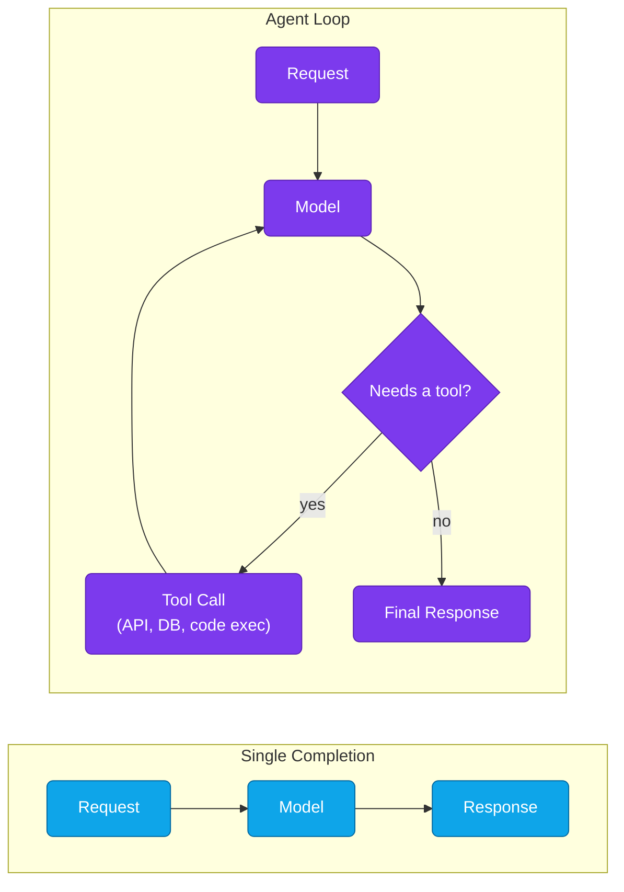

# Lesson 08: LLM Infrastructure for Agentic Systems

Agents change the infrastructure math. A chat completion is one request in, one response out — predictable latency, predictable cost. An agent turns that into a loop: the model calls a tool, waits on it, reads the result, decides what to do next, and repeats — sometimes dozens of times before it produces a final answer. This lesson covers what breaks when you move from serving single completions to serving agent loops, and how to build infrastructure that holds up.

**Prerequisites:** [Introduction to LLM Infrastructure](./01-introduction-llm-infrastructure.md) and [LLM Platform Architecture](./07-llm-platform-architecture.md).

### Contents

1. [Why Agents Are a Different Infra Problem](#why-agents-are-a-different-infra-problem)
2. [Tool-Calling Infrastructure](#tool-calling-infrastructure)
3. [State and Memory](#state-and-memory)
4. [Orchestrating Multi-Step Execution](#orchestrating-multi-step-execution)
5. [Cost and Latency in Agent Loops](#cost-and-latency-in-agent-loops)
6. [Reliability: Retries, Timeouts, and Runaway Loops](#reliability-retries-timeouts-and-runaway-loops)
7. [Observability for Agents](#observability-for-agents)
8. [Security Considerations](#security-considerations)
9. [Practical Exercise](#practical-exercise)
10. [Key Takeaways](#key-takeaways)

---

## Why Agents Are a Different Infra Problem

A single completion has one round trip through the model. An agent loop has an unknown number of round trips, each one depending on something outside the model — an API call, a database query, a sandboxed code execution. That changes several assumptions your existing serving stack was built on:

- **Latency is compounding, not fixed.** Five tool calls at 2 seconds each plus five model turns at 1.5 seconds each is a 17.5-second response, not a 1.5-second one.
- **Cost is per-loop, not per-request.** Every turn resends the growing conversation history as input tokens, so cost grows roughly with the square of the number of steps unless you manage context actively.
- **Failure has more surface area.** The model can fail, but so can any tool it calls, and a bad tool result can send the whole loop off in the wrong direction.
- **"Done" is a judgment call.** A completion ends when the model stops generating. An agent loop ends when the model *decides* it's done — which means an ambiguous prompt or a confusing tool result can keep it looping.

## Tool-Calling Infrastructure

The tool layer is usually the weakest link, not the model. A few things worth building deliberately instead of bolting on later:

- **A tool registry, not inline function defs.** Centralize tool schemas (name, description, JSON schema for arguments) so the same tool works across agents and the model always sees an accurate, versioned description of what it can call.
- **A gateway in front of tools**, the same way you'd put one in front of the model — for auth, rate limiting, input validation, and logging every call the model makes. Never let the model's output reach a shell, database, or filesystem unvalidated.
- **Sandboxed execution** for anything that runs arbitrary code on the agent's behalf (code interpreters, shell access). Treat model-generated code as untrusted input, the same as user input.
- **Structured tool results.** Return errors as structured data the model can reason about ("rate limited, retry in 30s"), not a raw stack trace — the model is your only consumer of that response, and it needs to be able to act on it.

## State and Memory

An agent's "memory" is really three different things with different storage needs:

| Type | What it holds | Typical store |
|---|---|---|
| Working context | The current conversation/task's message history | In request, or Redis for long sessions |
| Short-term memory | Facts from earlier in this session, summarized to save tokens | Redis / in-memory cache |
| Long-term memory | Facts that should persist across sessions (user preferences, past decisions) | Vector DB or a regular database, retrieved like RAG |

Long-term memory is where agent infra and RAG infra overlap — it's the same retrieval pattern (embed, store, search) applied to the agent's own history instead of a document corpus. If you already run a vector DB for RAG, reuse it here rather than standing up a second system.

## Orchestrating Multi-Step Execution

At small scale, a loop running inside your API process is fine. Past a handful of concurrent agents, or steps that take longer than an HTTP timeout, you need something closer to a workflow engine:

- **A step/task queue** (e.g., Celery, Temporal, or a lightweight custom queue) so a long-running agent isn't tying up a web worker for minutes at a time.
- **Checkpointing** after each step, so a crashed worker resumes from the last completed step instead of restarting the whole loop.
- **A hard cap on steps**, enforced by the orchestrator, not just the prompt — never trust "please stop after 10 steps" as your only safeguard.

## Cost and Latency in Agent Loops

Because context resends on every turn, the same three levers from single-completion serving matter even more here:

- **Trim context aggressively.** Summarize or drop tool outputs the model no longer needs instead of letting the transcript grow unbounded.
- **Cache tool results** for idempotent calls (the same search query, the same lookup) so a wasteful loop doesn't re-pay for the same tool call twice.
- **Use a cheaper/smaller model for routing or simple tool selection**, and reserve your best model for the step that actually needs to reason.

## Reliability: Retries, Timeouts, and Runaway Loops

An agent that can call tools can also get stuck calling the same tool forever. Guard against it explicitly:

- **Per-step and total-loop timeouts** — a single tool call and the whole task both need their own ceiling.
- **Max-step limits**, enforced server-side, with a graceful "give your best partial answer" fallback instead of a hard error.
- **Loop detection** — if the last N tool calls are identical, stop and surface that to the user rather than retrying indefinitely.
- **Idempotent tool design** wherever possible, so a retried step doesn't double-charge a card or double-send an email.

## Observability for Agents

Standard request/response logging isn't enough — you need to see the *reasoning trail*, not just the outcome:

- Log every step: the model's intermediate output, which tool it chose, the arguments, the result, and the latency of each.
- Trace a whole agent run as one unit (a single trace ID across every step) so you can replay what happened when something goes wrong.
- Track step count and cost per completed task, not just per API call — a task that silently costs 10x more than expected is a symptom worth alerting on.

## Security Considerations

Tool-calling agents are a new attack surface, not just a new feature:

- **Prompt injection through tool results.** If a tool fetches a webpage or a document, that content can contain instructions aimed at the model. Treat all tool output as untrusted, the same way you'd treat user input.
- **Least-privilege tools.** Scope each tool's permissions to exactly what it needs — a "read customer record" tool should not also be able to delete one.
- **Human-in-the-loop for irreversible actions.** Anything that sends money, deletes data, or sends a message on a user's behalf should require explicit confirmation, not just a model's decision to call the tool.

---

## Practical Exercise

Take a single-completion service you've already built earlier in this module (e.g., your vLLM deployment from Lesson 02) and wrap it in a minimal agent loop with one tool (a web search or a calculator function is enough). Add: a max-step limit, per-step logging with a shared trace ID, and a timeout on the whole loop. Confirm it fails gracefully — with a partial answer, not a hang — when the tool call fails or the step limit is hit.

## Key Takeaways

- Agent loops compound the same latency and cost problems single-completion serving already has — they don't introduce new physics, just more of it, repeated.
- The tool layer, not the model, is usually where reliability and security problems show up first — treat it with the same rigor as any other production API surface.
- Long-term agent memory and RAG are the same underlying pattern; reuse your vector DB infrastructure instead of building a second one.
- Server-enforced step limits, timeouts, and loop detection are not optional — a prompt-level instruction to "stop after N steps" is not a safeguard.

---

**Previous Lesson**: [07-llm-platform-architecture.md](./07-llm-platform-architecture.md) · **Next Lesson**: [09-production-llm-best-practices.md](./09-production-llm-best-practices.md)
