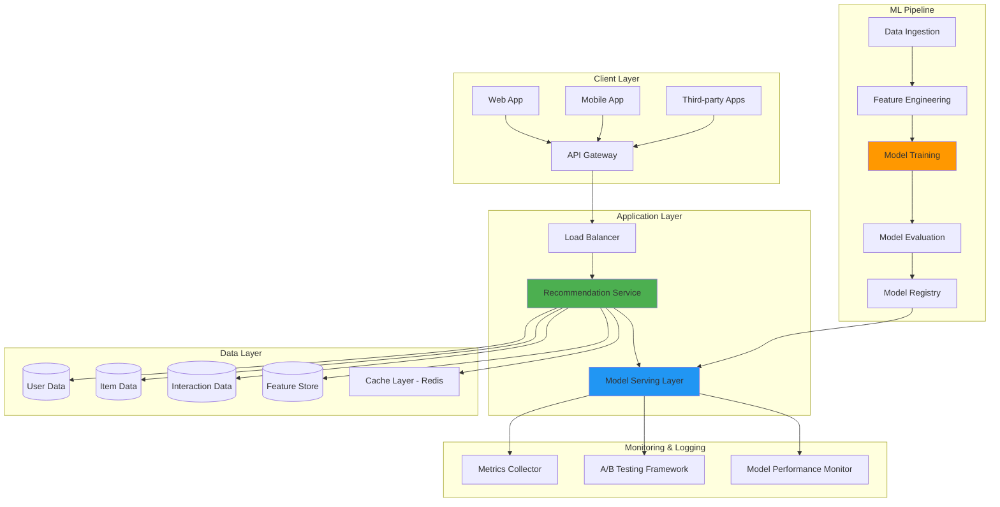
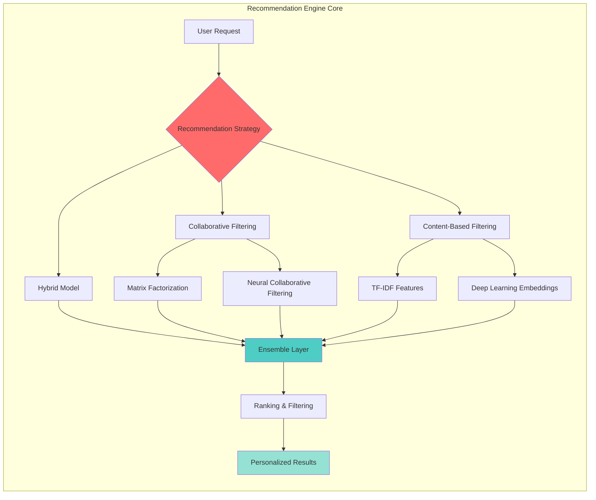
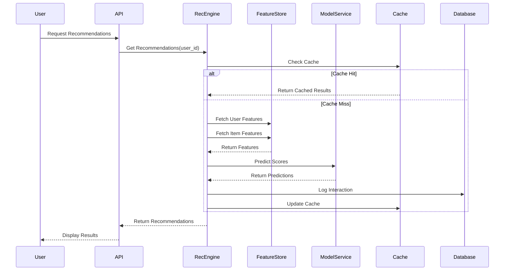
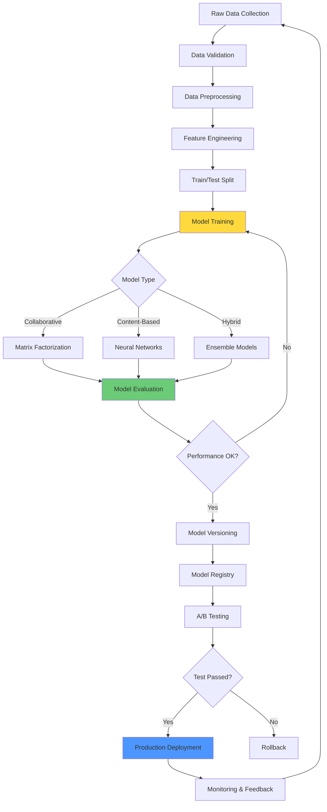
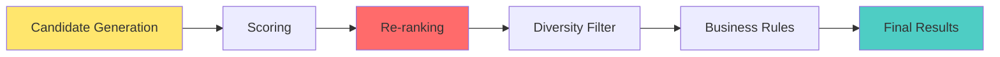
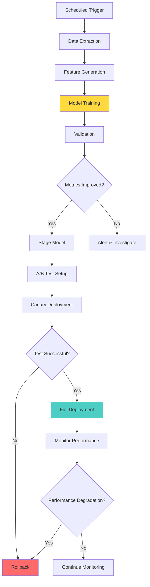

# RecommedX - Intelligent Recommendation Engine

## 🎯 Overview

RecommedX is a scalable, production-ready recommendation engine that combines collaborative filtering, content-based filtering, and hybrid approaches to deliver personalized recommendations. This system is designed to handle millions of users and items with real-time inference capabilities.

---

## 📊 ML System Design & Architecture

### High-Level System Architecture



---

### Detailed Component Architecture



---

### Data Flow Architecture



---

### ML Model Pipeline



---

## 🏗️ System Components

### 1. **Data Ingestion Layer**
- **Purpose**: Collect user interactions, item metadata, and contextual data
- **Technologies**: Apache Kafka, AWS Kinesis
- **Data Types**:
  - User clicks, views, purchases
  - Item attributes (category, price, description)
  - Temporal features (time of day, seasonality)

### 2. **Feature Engineering**
- **User Features**:
  - Demographics (age, location, gender)
  - Behavioral patterns (browsing history, purchase frequency)
  - Engagement metrics (session duration, click-through rate)
  
- **Item Features**:
  - Content attributes (category, brand, price range)
  - Popularity metrics (view count, rating)
  - Temporal features (recency, trending score)

- **Interaction Features**:
  - Implicit feedback (clicks, views, time spent)
  - Explicit feedback (ratings, reviews)
  - Contextual features (device, location, time)

### 3. **Model Architecture**

#### A. Collaborative Filtering Models

**Matrix Factorization (SVD)**
```
User-Item Matrix (R) ≈ User Matrix (U) × Item Matrix (V)ᵀ
Prediction: r̂ᵤᵢ = uᵤᵀ · vᵢ + bᵤ + bᵢ + μ
```

**Neural Collaborative Filtering (NCF)**
```
Input: [user_id, item_id]
↓
Embedding Layer: [user_embedding, item_embedding]
↓
Concatenation/Element-wise Product
↓
Deep Neural Network (Multiple Hidden Layers)
↓
Output: Predicted Score
```

#### B. Content-Based Filtering

**Feature Extraction**
- TF-IDF for text features
- CNN for image features
- Embeddings for categorical features

**Similarity Computation**
```
Cosine Similarity: sim(i, j) = (vᵢ · vⱼ) / (||vᵢ|| × ||vⱼ||)
```

#### C. Hybrid Model

**Weighted Ensemble**
```
Final Score = α × CF_score + β × CB_score + γ × Context_score
where α + β + γ = 1
```

### 4. **Ranking & Filtering**



**Ranking Factors**:
- Relevance score (model prediction)
- Diversity (avoid filter bubbles)
- Freshness (recent items)
- Business constraints (inventory, margins)

### 5. **Serving Infrastructure**

- **Model Serving**: TensorFlow Serving, TorchServe
- **Caching**: Redis for hot recommendations
- **Load Balancing**: NGINX, AWS ELB
- **API**: FastAPI, Flask

---

## 📈 Performance Metrics

### Offline Metrics
- **Precision@K**: Proportion of relevant items in top-K
- **Recall@K**: Proportion of relevant items retrieved
- **NDCG@K**: Normalized Discounted Cumulative Gain
- **MAP**: Mean Average Precision
- **AUC-ROC**: Area Under ROC Curve

### Online Metrics
- **Click-Through Rate (CTR)**
- **Conversion Rate**
- **Average Order Value (AOV)**
- **User Engagement** (time spent, pages viewed)
- **Revenue Impact**

### System Metrics
- **Latency**: p50, p95, p99 response times
- **Throughput**: Requests per second
- **Cache Hit Rate**
- **Model Inference Time**

---

## 🔄 Training & Deployment Pipeline



---

## 🛡️ Challenges & Solutions

### Challenge 1: Cold Start Problem
**Solution**:
- Use content-based filtering for new users/items
- Implement popularity-based recommendations
- Leverage demographic information
- Active learning to quickly gather preferences

### Challenge 2: Scalability
**Solution**:
- Approximate nearest neighbor search (FAISS, Annoy)
- Distributed computing (Spark, Dask)
- Model compression and quantization
- Hierarchical clustering for candidate generation

### Challenge 3: Real-time Updates
**Solution**:
- Incremental learning
- Online learning algorithms
- Stream processing (Kafka Streams, Flink)
- Periodic batch updates with real-time adjustments

### Challenge 4: Diversity vs Relevance
**Solution**:
- Multi-objective optimization
- Diversity-aware ranking (MMR, DPP)
- Exploration-exploitation strategies
- Contextual bandits


---

## 📚 References & Resources

- [Netflix Recommendation System](https://research.netflix.com/research-area/recommendations)
- [Amazon Personalize](https://aws.amazon.com/personalize/)
- [Google Recommendations AI](https://cloud.google.com/recommendations)
- [Collaborative Filtering for Implicit Feedback Datasets](http://yifanhu.net/PUB/cf.pdf)
- [Neural Collaborative Filtering](https://arxiv.org/abs/1708.05031)
- [Deep Learning Recommendation Model (DLRM)](https://arxiv.org/abs/1906.00091)
