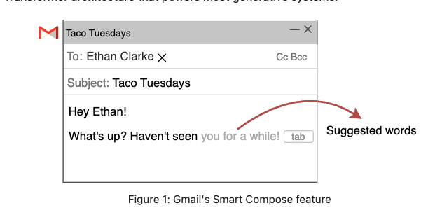
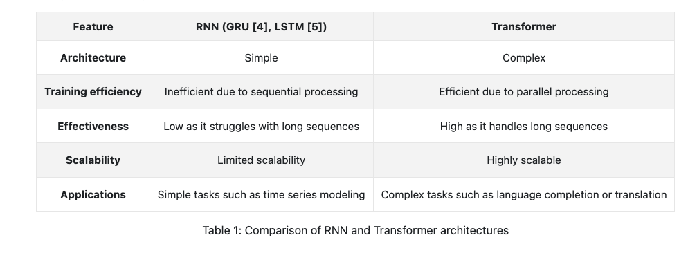
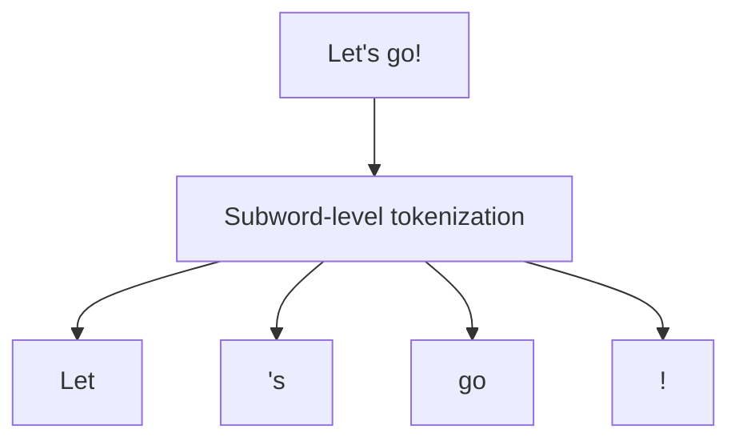
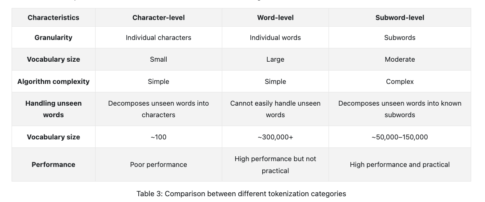
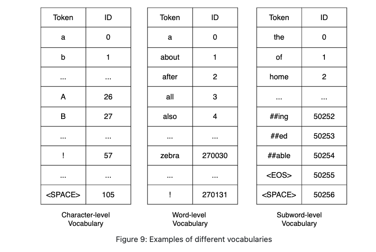
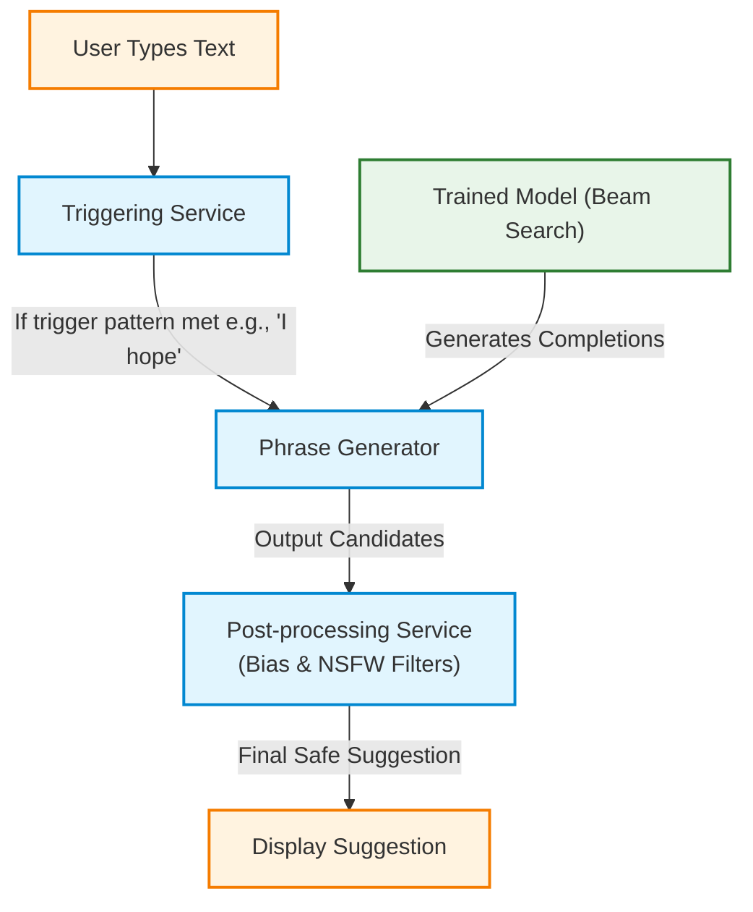
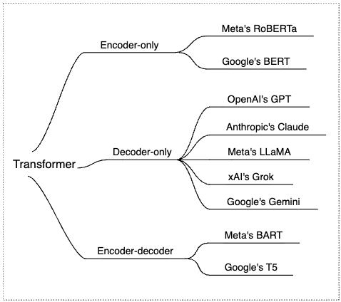
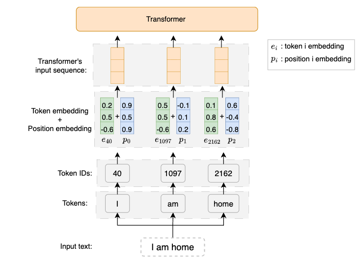

# Gmail Smart Compose System Design

Gmail Smart Compose suggests sentence completions as users write emails. This document outlines the requirements, data preparation, model development, system architecture, and evaluation metrics for the system, based on the reference technical interview prep materials.


<p align="center">
  
</p>

---

## 1. Requirements & System Constraints

### Business Objectives & UX
*   **Core Goal**: Assist users by suggesting the next few words as they write an email.
*   **UX Flow**: inline suggested words appear in light gray. Users press `Tab` to accept the suggestion.
*   **Personalization**: For simplicity, personalization (different writing styles per user) is out of scope.
*   **Confidence**: The system should only make suggestions when it is highly confident in its prediction.
*   **Bias & Safety**: The system must not make biased assumptions or generate inappropriate/offensive suggestions.

### Technical & Scale Constraints
*   **Scale**: Gmail has about 1.8 billion active users. A single user can send as many as 500 emails in a day.
*   **Latency**: The expected latency must be imperceptible (target: around $100\text{ ms}$).
*   **Languages**: The initial release is focused on English.
*   **Dataset Scale**: The training data consists of approximately 1 billion email messages.

---

## 2. Problem Formulation

### Inputs and Outputs
*   **Input**: A sequence of words typed by the user (the email body) combined with additional context (email subject, sender, recipient, and previous emails in the thread).
*   **Output**: A continuation sequence representing the words the user is likely to type next.

### ML Approach
The task is framed as a **Text Generation** task. 

Two popular architectures for **Text Generation** task.   are recurrent neural networks (RNNs)  and Transformers [3].

*   **Architecture Selection**: A **Decoder-only Transformer** (e.g., GPT, LLaMA, Gemini) is selected over Recurrent Neural Networks (RNNs/LSTMs) for the following reasons:
    *   *Parallelism*: RNNs process sequentially step-by-step, whereas Transformers process all input tokens simultaneously through self-attention, making training highly efficient.
    *   *Long Sequence Handling*: Transformers use self-attention to focus on any part of a sequence regardless of distance, avoiding the vanishing gradient issues that cause RNNs to struggle with long-range dependencies.



> [!NOTE]  
> To learn more about Transformer architectures and LLM interview preparation, check out the resources at [LLM & ML Job Interview Resources](https://mimansajaiswal.github.io/posts/llm-ml-job-interviews-resources/#llms).

---

## 3. Data Preparation & Engineering

Two sources of data are available for training our model: general data and email data. General data includes publicly available text from sources such as books, websites, and social media posts. This data is important for training language models because it contains diverse vocabulary, syntax, and contexts.

To convert raw text into a numerical format suitable for training:

### Text Cleaning & Normalization
1.  **Remove Non-English Text**: Apply language identification methods to filter out non-English content.
2.  **Remove Confidential Information (PII)**: Replace personal names, URLs, email addresses, and phone numbers with placeholders (e.g., `john@gmail.com` $\rightarrow$ `##@gmail.com`) to prevent the model from learning or exposing private details.
3.  **Remove Irrelevant Characters**: Strip out symbols like `©`, `™`, and emojis that do not contribute to text meaning.
4.  **Remove Duplicate Data**: Remove duplicate emails to prevent the model from becoming biased or skewing the learning process.
5.  **Text Normalization**: Standardize inconsistent text formats (e.g., mapping various phone number formats like `(123) 456-7890` or `123-456-7890` to a single format like `1234567890`).

### Tokenization & Indexing

#### Subword-level Tokenization
The system uses subword-level tokenization (BPE or SentencePiece via libraries like `tiktoken` or `sentencepiece`) over character-level or word-level tokenization.

Subword-level tokenization splits text into smaller units called subwords. It is based on the principle that a frequently used word should not be split into smaller subwords, but a rare word should be split into smaller meaningful subwords. For example, `"unhappily"` might be considered a rare word and thus be split into `"unhappy"` and `"ly."` Both `"unhappy"` and `"ly"` are more frequently used in text data, making it easier for the model to learn a meaningful representation for each.



While subword-level tokenization can be complex to implement, it has several benefits. First, it leads to a manageable vocabulary size, thus reducing the cost of the model learning representations for each subword. Second, subword-level tokenization allows the model to represent unfamiliar words by decomposing them into known subwords.

#### Core Logic: Byte-Pair Encoding (BPE)
Byte-Pair Encoding (BPE) is a data compression algorithm adapted for subword tokenization. Its core operational logic proceeds as follows:
1. **Initialization**: Build the initial vocabulary containing all individual characters (base symbols) plus a special end-of-word indicator.
2. **Base Representation**: Represent every word in the training corpus as a sequence of these base characters.
3. **Frequent Pair Counting**: Scan the corpus to find the most frequently co-occurring pair of adjacent symbols (e.g., the characters `l` and `e` forming `le`).
4. **Iterative Merge**: Merge this highly frequent pair to create a new vocabulary entry (e.g., `'le'`), and replace all occurrences of this pair in the corpus with the new merged token.
5. **Termination**: Repeat steps 3 and 4 iteratively. Stop when the vocabulary reaches a predefined target size (e.g., 50,000 subwords) or when no pair frequency exceeds a minimum threshold.

#### Alternative Tokenization Approaches
To understand why subword-level tokenization is preferred for Smart Compose, we compare it against alternative approaches:


#### Token Indexing
Token indexing is the process of converting textual tokens into integer numbers.

To prepare for token indexing, the tokenization algorithm first builds a vocabulary—a collection of all unique tokens—from the training text data and then stores it in a table. Figure 9 shows examples of vocabularies for different tokenization categories. The order and ID values are chosen arbitrarily for demonstration purposes.




---

## 4. Overall System Design

The system coordinates three key components to serve predictions:



### 1. Triggering Service
*   Monitors user activity (keystrokes) in real time.
*   Decides when to activate the phrase generator based on criteria like character count or specific keywords (e.g., typing `I` will not trigger a suggestion, but typing `I hope` will trigger it because the context is sufficient for a useful completion).

### 2. Phrase Generator
*   Interacts with the trained model to generate the top-$k$ most probable completions using **Beam Search** (typically terminating at an `<EOS>` token).
*   Applies filters to candidates:
    *   *Long-sequence filtering*: Removes completions that are too long, as short suggestions are easier to read and less likely to be overly specific.
    *   *Low-confidence filtering*: Discards completions with confidence scores below a predefined threshold.
*   Passes the remaining completion with the highest confidence score to the post-processing service.

### 3. Post-Processing Service
Addresses potential biases and safety before suggestions are rendered to the user:
*   *Pronoun replacement*: Replaces gender-specific pronouns (e.g., `he` or `she` $\rightarrow$ `they`) where gender is unspecified.
*   *Gender-neutral word replacement*: Replaces gendered terms with neutral alternatives (e.g., `chairman` $\rightarrow$ `chairperson`).
*   *Lexical analysis*: Adjusts terms that imply age, race, or disability biases.
*   *NSFW content filtering*: Automated filters check candidates against blocklists to block explicit language.

---

## 5. Model Development & Training

### 1. Transformer Architecture Selection
To choose a suitable ML model, we compare the primary variations of the Transformer architecture 

*   **Encoder-only (e.g., BERT, RoBERTa)**: Processes the input sequence as a whole to understand text meaning. Typically used for sentence classification and named entity recognition. Not suited for text generation.
*   **Decoder-only (e.g., GPT, LLaMA, Gemini)**: Processes input sequences and generates a new sequence iteratively, one token at a time. This variation is ideal for text generation tasks like Smart Compose.
*   **Encoder-decoder (e.g., T5, BART)**: Processes input using an encoder and generates output using a decoder. Suited for sequence transformation tasks (e.g., translation).


<p align="center">
  
</p>

For Smart Compose, a **Decoder-only Transformer** is selected because it is optimized for text completion and next-token prediction based on preceding tokens.

---

### 2. Decoder-Only Transformer Components
A decoder-only Transformer consists of the following key components:

1.  **Text Embedding**: Converts token IDs into fixed-length dense vectors (embeddings). This addresses two key limitations:
    *   *Sparsity*: Avoids the inefficiency of high-dimensional one-hot encodings.
    *   *Semantic Information*: Maps words with similar meanings (e.g., `"happy"` and `"joyful"`) closer together in the learned embedding space.
2.  **Positional Encoding**: Added because the self-attention mechanism is permutation-invariant. Positional encodings provide the order of tokens in the sequence. Two common methods:
    *   *Fixed Positional Encoding*: Uses mathematical sine-cosine functions at different frequencies. It is computationally efficient (no extra trainable parameters) and generalizes to sequences longer than those seen in training. However, it uses predefined limits and can result in suboptimal performance.
    *   *Learned Positional Encoding*: A trainable weight matrix $P \in \mathbb{R}^{N \times d}$ (where $N$ is maximum sequence length and $d$ is embedding dimension) optimized alongside other parameters. It yields optimal performance for the task but is computationally inefficient and risks overfitting to specific sequence lengths.
    *   *Our Choice*: The system employs **fixed sine-cosine positional encoding**.

    > [!NOTE]
    > To learn more about other positional encoding techniques (such as Relative Positional Encoding and Rotary Position Embedding), you can refer to the [Transformers Positional Encoding Primer](https://aman.ai/primers/ai/transformers/#positional-encoding).

    <p align="center">
      
    </p>
3.  **Transformer Stack**: A stack of blocks, each containing:
    *   *Multi-head Attention (Self-attention)*: Captures relationships by allowing each token's embedding to attend to all preceding token embeddings.
    *   *Feed-forward Neural Network*: Applies two linear transformations with a ReLU activation in between to each embedding independently.
    *   *Residual Connections & Normalization*: Includes residual connections and layer normalization to stabilize training.
4.  **Prediction Head**: The final linear and softmax layers that translate the Transformer stack output into probabilities for every token in the vocabulary.

---

### 3. Two-Stage Training Strategy
Training adjusts the decoder-only Transformer's parameters using email data. Once the training process is complete, the model can suggest likely completions.

However, directly training the model on a task-specific dataset, such as email data, is not a good strategy. This direct training has several challenges:
*   **Lack of large training data**: Task-specific datasets are usually limited in size. This limitation can hinder the model's ability to learn effectively.
*   **Risk of overfitting**: When a model is trained on a task-specific dataset, it runs a high risk of overfitting. Overfitting occurs when a model memorizes the training data to the extent that it cannot generalize to unseen data.
*   **Expensive and lengthy training**: Training a large model from scratch requires significant computational resources and time. This is because the model has to learn different aspects of language, which is a complex and resource-intensive process.

To address the above issues, a two-stage training strategy is commonly employed: pretraining, followed by finetuning. In the pretraining stage, the model is trained on a large amount of general data to learn the structure of the language. In the finetuning stage, the pretrained model is then finetuned on data specific to the task at hand (e.g., email completion). Therefore, we use a two-stage training strategy:

```
[ General Data (Common Crawl) ] ──> [ 1. Pretraining ] ──> [ Base Model ]
                                                                 │
                                                                 ▼
[ Email Data (1B Conversations) ] ──> [ 2. Finetuning ] ──> [ Final Model ]
```

#### Stage A: Pretraining (Unsupervised)
*   **Data**: A large volume of general text from the web (e.g., Common Crawl), providing diverse vocabulary and grammar structures.
*   **Objective**: Next-token prediction (predicting the next token given previous tokens, such as predicting `"well"` given `"I hope you are "` ).
*   **Loss Function**: Cross-Entropy loss.
*   **Parallelization**: In training, the model computes the loss for all token positions simultaneously rather than sequentially, which significantly speeds up training.

#### Stage B: Finetuning (Supervised)
*   **Data**: Approximately 1 billion email conversations, capturing email formats, formal/informal tones, and specific vocabularies.
*   **Context Engineering**: Relying on the email body alone is insufficient (e.g., predicting recipient names in greetings like `"Dear John"`). We provide the model with additional context: subject line, sender/recipient emails, and previous thread history.
*   **Combining Inputs (Prompt Engineering)**: Multiple text inputs are combined into a single sequence using tags:
    ```text
    [Text] Hi John, I'm reaching out regarding our
    [Subject] Follow-up on collaboration?
    [Recent Emails] 07/10/2024: "Discussion on partnership plans"
    Output: collaboration
    ```
*   **Objective & Loss**: Next-token prediction on email-specific text using Cross-Entropy loss.

---

### 4. Text Generation & Sampling Strategies
Once trained, the model generates text by predicting probabilities and sampling tokens one at a time until an `<EOS>` (End of Sequence) token is reached.

#### Deterministic vs. Stochastic Generation
*   **Stochastic**: Samples from the predicted distribution with randomness. It offers diversity and novelty (good for creative dialogue) but is inconsistent and can generate inappropriate completions.
*   **Deterministic**: Generates text without randomness (always selects from the highest probabilities). It is preferred for Smart Compose to guarantee:
    *   *Consistency*: Users expect predictable suggestions for similar inputs.
    *   *Safety*: Lowers the risk of generating inappropriate or NSFW completions.

#### Greedy Search vs. Beam Search
We evaluate two deterministic generation algorithms:
*   **Greedy Search**: Simplest algorithm. Selects the single token with the absolute highest probability at each step.
    *   *Cons*: Fails to consider alternative paths, leading to repetitive or incoherent sentences. Rarely used in practice.
*   **Beam Search**: Tracks multiple potential sequences simultaneously. The number of sequences tracked is the beam width ($k$).
    *   *Step-by-Step Flow (Beam Width = 3)*:
        1.  *Initialization*: Start with the prefix. Predict the next token probability distribution and select the top 3 tokens with the highest probabilities.
        2.  *Expansion*: Pass each of the top 3 sequences back to the model to generate the probability distribution for the next token.
        3.  *Pruning*: Calculate cumulative probabilities for all expanded paths and select the top 3 most probable sequences.
        4.  *Termination*: Repeat expansion and pruning until the sequences reach `<EOS>` or maximum length. Select the sequence with the highest cumulative probability as the final suggestion.

---

## 6. Evaluation

### Offline Metrics
*   **Perplexity**: Standard metric measuring how accurately the model predicts the sequence of tokens in historical test data (exponential of average negative log-likelihood). Lower perplexity indicates a better model.
*   **ExactMatch@N**: Percentage of generated phrases that are exactly $N$ words long and match the first $N$ words of the ground-truth text.

### Online Metrics (A/B Testing)
*   **User Engagement**:
    *   *Acceptance Rate*: The percentage of suggestions rendered that are accepted by the user (via `Tab`).
    *   *Usage Rate*: The percentage of composed emails that utilize the Smart Compose feature.
*   **Effectiveness**:
    *   *Average Completion Time*: Tracks the average time taken to write emails with vs. without Smart Compose to verify if it speeds up composition.
*   **Latency**:
    *   *System Response Time*: The delay between typing and suggestion rendering (must remain below the expected $\sim 100\text{ ms}$ threshold).
*   **Quality**:
    *   *Feedback Rate*: Rates of user-provided feedback on suggestions.
    *   *Human Evaluation*: Qualitative assessments of usefulness through user studies.
