# Retrieval-Augmented Generation (RAG) System Design

We design a **ChatPDF**-style system: employees ask questions in natural language and receive answers grounded in internal company documents (Wiki pages, forum posts) instead of digging through FAQs themselves. This document covers requirements, data preparation, model architecture, training, sampling, and evaluation for a production RAG system, based on the reference technical interview prep materials.

---

## 1. Requirements & System Constraints

### How to Open the Interview: Clarifying Requirements

Before designing anything, a candidate should pin down scope by asking questions. This is what that exchange looks like in practice:

> **Candidate**: What does the knowledge base consist of, and what format is it in?
> **Interviewer**: Company Wiki pages and an internal forum, all in PDF, containing text, tables, and diagrams — no fixed template, so layouts vary (single-column, double-column, mixed).
>
> **Candidate**: What's the scale, and how fast is it growing?
> **Interviewer**: Around 5 million pages today, growing roughly 20% annually.
>
> **Candidate**: Does the system need to cite its sources, and how much latency can users tolerate?
> **Interviewer**: Yes, citations are required. A delay of a few seconds is acceptable — no hard real-time requirement.
>
> **Candidate**: Any constraints on language, or on supporting follow-up questions?
> **Interviewer**: English only for now. No follow-up/feedback support initially, but the design should leave room to add it later.

**Distilled requirements** from the exchange above:
*   **Knowledge base**: Company Wiki pages plus a Stack-Overflow-style internal forum, in PDF format, containing text, tables, and diagrams. No fixed template — some single-column, some double-column, some mixed.
*   **Scale**: ~5 million pages, growing ~20% annually.
*   **References**: The system **must** cite the documents it draws from.
*   **Latency**: A few seconds of delay is acceptable — no hard real-time requirement.
*   **Languages**: English only, for simplicity.
*   **Extensibility**: No follow-up/feedback support initially, but the design must leave room for it.
*   **Safety**: Matters, but the interview prioritizes data handling, architecture, and performance efficiency over safety tuning.

### Framing the Problem as an ML Task

**Input**: A text prompt from the user, alongside a continuously updated document database (text + images).
**Output**: A text-based response that accurately addresses the query.

  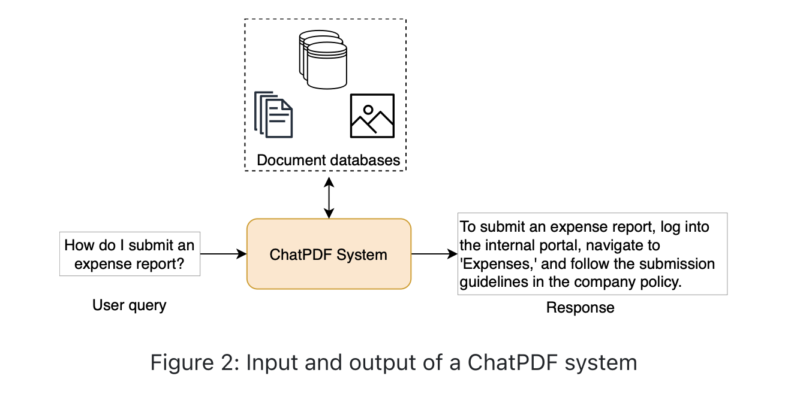

### Choosing an ML Approach

Three approaches can adapt a general-purpose LLM to company-specific data:

#### 1. Finetuning
A pretrained general-purpose LLM is finetuned on company-specific data so its weights adapt to the company's terminology, processes, and FAQs.

*   **Pros**
    *   *Customizable*: generates responses tailored to specific domains.
    *   *Enhanced accuracy*: more accurate on niche, specialized topics.
*   **Cons**
    *   *Computationally expensive*: updating all model parameters needs significant compute.
    *   *Frequent retraining*: needs to be redone regularly to stay current.
    *   *Requires technical expertise*: needs ML/LLM architecture knowledge.
    *   *Extensive data requirement*: needs a large, high-quality dataset that's costly to collect.
    *   *Lack of references*: finetuned models generally **can't cite** where an answer came from, making it hard to verify or trace.

#### 2. Prompt Engineering
Keeps the LLM's weights frozen and instead crafts prompts that inject relevant information (e.g., a company policy summary) directly into the input.

*   **Pros**
    *   *Ease of use*: no technical skill required, works for a wide range of users.
    *   *Cost-effectiveness*: minimal compute compared to finetuning.
    *   *Flexibility*: prompts can be tweaked instantly without retraining.
*   **Cons**
    *   *Inconsistency*: response quality varies with how the prompt is phrased.
    *   *Limited customization*: bounded by prompt design creativity, not as deep as finetuning.
    *   *Limited to the LLM's existing knowledge*: confined to what the model already learned, weak on highly specialized or very current information.

#### 3. Retrieval-Augmented Generation (RAG)
Combines a general-purpose LLM with a real-time retrieval system: it retrieves relevant information from external sources (e.g., internal docs) and feeds it into the LLM at inference time, rather than relying purely on pretrained knowledge.

*   **Pros**
    *   *Access to current information*: pulls from up-to-date external sources.
    *   *Contextual relevance*: retrieved context makes responses more detailed and relevant.
*   **Cons**
    *   *Implementation complexity*: two subsystems (retrieval + generation) must work together smoothly.
    *   *Dependence on retrieval quality*: response quality is capped by how relevant/accurate the retrieved chunks are.

**Which approach fits ChatPDF?** Finetuning generates more specialized responses but is expensive and — critically — can't reference the original documents, disqualifying it for our "must cite sources" requirement. Prompt engineering is simple and flexible but isn't scalable: stuffing all 5M pages of context into a single prompt would blow past any LLM's context window. **RAG** offers the best balance of setup cost, scalability, and up-to-date, cited answers — making it the right choice for an internal, evolving, large-scale document base like this one.

  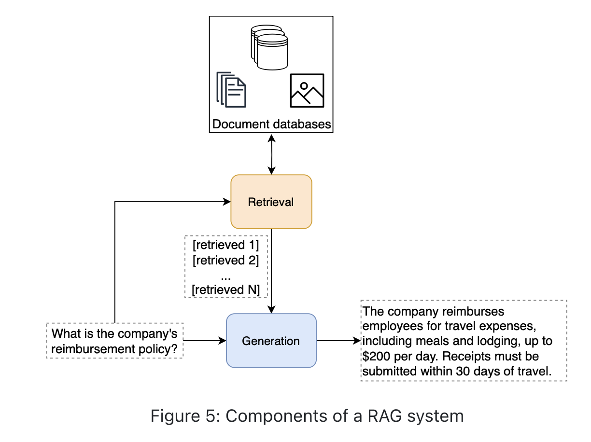

---

## 2. Data Preparation

RAG performance is bounded by the quality of the knowledge base and how it's indexed. Preparing PDFs is a three-step pipeline: **document parsing → chunking → indexing**.

### Document Parsing

Converts a PDF's text, images, and other elements into a structured format an LLM can consume. There are two ways to do this:

#### Option 1: Rule-Based Parser
Applies predefined rules/patterns based on the layout and structure of the document — it "calculates" the layout and extracts content accordingly.

*   **Pros**: easy to implement when the document format is consistent and predictable.
*   **Cons**: struggles badly with a wide range of PDF types. If a document doesn't match the expected format, extraction mistakes follow — a poor fit for differing or complex layouts.
*   **Verdict for us**: Not viable — our documents mix single-column, double-column, and mixed layouts.

#### Option 2: AI-Based Parser
Uses object detection + OCR to identify text, tables, and diagrams regardless of layout, handling a much wider variety of document formats.

*   **Tools**: Dedoc (standardizes many document formats into a consistent structure), Layout-Parser (high precision, but large/slower models), or managed services like Google Cloud Document AI and PDF.co.
*   **Production-grade example — [Baidu Unlimited-OCR](https://github.com/baidu/Unlimited-OCR)**: a real, open-source implementation of this idea, built for "one-shot long-horizon parsing" — it runs as a vLLM/SGLang-served model that ingests a page image and outputs structured Markdown/JSON in a single pass, batching across multi-page PDFs. It's the kind of tool a production RAG pipeline would actually run for document parsing instead of hand-rolling layout detection + OCR from scratch.
*   **Verdict for us**: The right choice — it handles our mixed, unpredictable layouts.

**How an AI-based parser works — the classic multi-stage pipeline (Layout-Parser), step by step:**

1.  **Layout detection** — an object detection model scans the page and draws bounding boxes around content regions: paragraphs, tables, images, headers.
2.  **Text extraction** — OCR reads the content inside each box. The bounding-box coordinates keep the text in the correct reading order, preserving the document's original structure.
3.  **Structured output generation** — the parser emits two kinds of blocks:
    *   **Text blocks**: coordinates, extracted text, reading order, and metadata.
    *   **Non-text blocks**: coordinates of figures/images.

**Where a one-shot model like Baidu Unlimited-OCR differs**: it collapses these three separate stages into a single forward pass — one vision-language model reads the page image and directly emits structured Markdown/JSON, without a distinct "detect boxes, then OCR each box" pipeline. This tends to be faster and simpler to operate (one model to serve, not a detector + a separate OCR engine), at the cost of being less inspectable step-by-step than the classic pipeline above. Both are valid "AI-based parser" choices — the multi-stage approach is useful to understand *why* AI-based parsing works, while a one-shot tool like Unlimited-OCR is closer to what you'd actually deploy in production.

**Given the mixed, unpredictable layouts in this problem, an AI-based parser — either flavor — is the right choice.**

> [!NOTE]
> **Bonus point — recent development: Google's Open Knowledge Format (OKF)**
>
> Everything above (rule-based vs. AI-based parsing) is about *reverse-engineering* structure out of raw, unstructured PDFs. In 2026, Google introduced **[OKF](https://cloud.google.com/blog/products/data-analytics/how-the-open-knowledge-format-can-improve-data-sharing)**, an open, vendor-neutral spec that flips this: instead of parsing messy PDFs after the fact, source content is packaged upfront as a directory of **Markdown files with YAML frontmatter** — one file per "concept" (a doc, a table, a runbook, an API, a metric).
>
> If our company's Wiki/forum content were authored or exported directly into OKF bundles, several steps in this pipeline get simpler or disappear entirely:
> *   **Parsing becomes unnecessary** — content is already structured text, not a PDF needing layout detection + OCR.
> *   **Chunk boundaries are already defined** by the format, rather than something our chunking strategy has to infer.
> *   **Embeddings can ship pre-computed** in the bundle, along with metadata on which model/version/dimensionality produced them — the indexing step can reuse them instead of re-embedding from scratch.
> *   **Trust signals** (added in OKF v0.2) give the retrieval layer a built-in way to weight or filter low-confidence sources.
>
> **In short**: OKF doesn't replace RAG — it just makes the input to RAG cleaner. Bad parsing produces bad chunks, which produces bad answers ("garbage in, garbage out"); OKF avoids that by fixing the structure *before* parsing even happens, instead of after.
>
> **Production example — a self-updating knowledge base**: imagine our internal chatbot answers a question, and an employee replies "actually the reimbursement limit changed to $250." In a plain-PDF pipeline, someone has to manually edit the PDF, re-run the whole parse → chunk → re-embed pipeline, and wait for the index to refresh. With an OKF bundle, the agent can write the correction directly back into the relevant concept's Markdown file — a small, structured edit, not a PDF re-export. The v0.2 trust-signal fields even let the system flag that update as "agent-written, unverified" until a human confirms it, so future retrievals can weigh it accordingly. That's the loop this format is built for: agents don't just *read* the knowledge base, they can also *maintain* it, and each write stays cheap and auditable instead of retriggering the full ingestion pipeline.
>
> Learn more: [Google Cloud Blog — How OKF can improve data sharing](https://cloud.google.com/blog/products/data-analytics/how-the-open-knowledge-format-can-improve-data-sharing) · [Google Cloud Blog — OKF v0.2 adds trust signals](https://cloud.google.com/blog/products/data-analytics/okf-v0-2-adds-trust-signals)

### Document Chunking

Indexing an entire report or book as one embedding loses detail (the vector captures only general context) and can exceed the LLM's context window (e.g., 128K tokens for GPT-4o). Chunking splits text into smaller, retrievable pieces.

*   **Length-based chunking**: Split by character count, with optional overlap (e.g., LangChain's `CharacterTextSplitter`, `RecursiveCharacterTextSplitter`). Simple, but can cut sentences mid-way.
*   **Regex-based chunking**: Split on sentence-ending punctuation. Preserves logical breaks, but no deeper semantic understanding.
*   **Structure-aware splitters**: For HTML/Markdown/code, split at element boundaries (headers, list items, code blocks) — e.g., LangChain's `MarkdownHeaderTextSplitter`, `HTMLHeaderTextSplitter`, `PythonCodeTextSplitter`.

  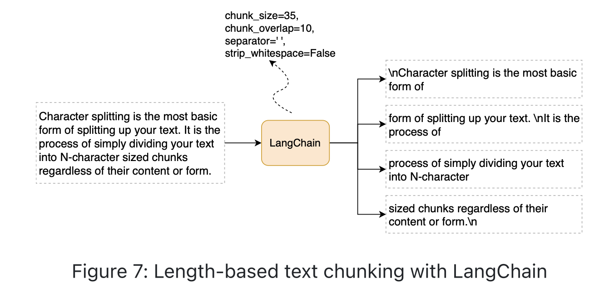

### Indexing

After parsing and chunking, the final step is indexing — organizing the chunked data into a structure that enables fast, accurate retrieval, so the system can quickly locate the relevant chunks when a query comes in. Choosing the right indexing process starts with understanding the available retrieval techniques and picking the one that best fits the task.

**Quick comparison of the four retrieval techniques:**

| Technique | How it works | Limitation |
|---|---|---|
| Keyword-based | Exact term matching | No semantic understanding, misses synonyms |
| Full-text search (e.g., Elasticsearch) | Scans full document content, supports phrase search | High compute overhead at scale; still not semantic |
| Knowledge graph–based | Retrieves via structured entity relationships | Expensive to build/maintain; impractical for large unstructured PDF/Wiki corpora |
| **Vector-based** | Embedding similarity between query and chunks | Requires an embedding + ANN infrastructure |

**In more detail:**

*   **Keyword-based**: The traditional approach — matches exact query terms against document content. Fast and simple, but it has no understanding of *meaning*: it struggles with synonyms and rephrasing, leading to incomplete or irrelevant results. Ineffective at large scale or whenever the goal is semantic similarity rather than literal word overlap.
*   **Full-text search** (e.g., Elasticsearch): A step up — scans entire documents for matches, supporting partial matches and phrase search, so it's more thorough than plain keyword matching. But it comes with higher computational overhead at scale (think millions of PDFs), and while it's good at finding specific text, it's still not doing *semantic* retrieval.
*   **Knowledge graph–based**: Leverages structured relationships between entities (people, places, concepts) to retrieve information based on how those entities connect. Excellent for complex, multi-hop queries and understanding relationships — but building and maintaining a knowledge graph is a significant, ongoing engineering effort, and it's impractical to build one over large, unstructured sources like a 5M-page PDF/Wiki corpus.
*   **Vector-based**: Instead of matching text, this represents each chunk (and the query) as a high-dimensional embedding — a numerical fingerprint of its meaning — and measures similarity between them. This lets it retrieve relevant chunks even when the query's exact wording never appears in the document, making it the most flexible and powerful option for large, evolving datasets.

**Scale math**: ~5M pages × 1,500 chars/page, chunked at 500 chars with 200-char overlap → 5 text chunks/page. Plus 3 image chunks/page. Total: `5M × (1500/(500-200) + 3) ≈ 40M chunks`, growing ~20%/year.

At this scale, keyword and full-text search don't hold up on speed or semantic understanding, and a knowledge graph is too costly to build and maintain over unstructured PDF/Wiki content. **Vector-based retrieval wins** on three fronts:
*   **Semantic understanding** — captures the meaning of a query, so it still retrieves relevant chunks even when the query's wording doesn't literally match the document text.
*   **Scalability** — embedding-based indexes handle large, growing datasets efficiently.
*   **Efficiency** — once chunks are embedded and indexed, retrieval is fast, with no per-query reprocessing of the raw documents.

We choose **vector-based retrieval** and index our 40M+ chunks accordingly.

  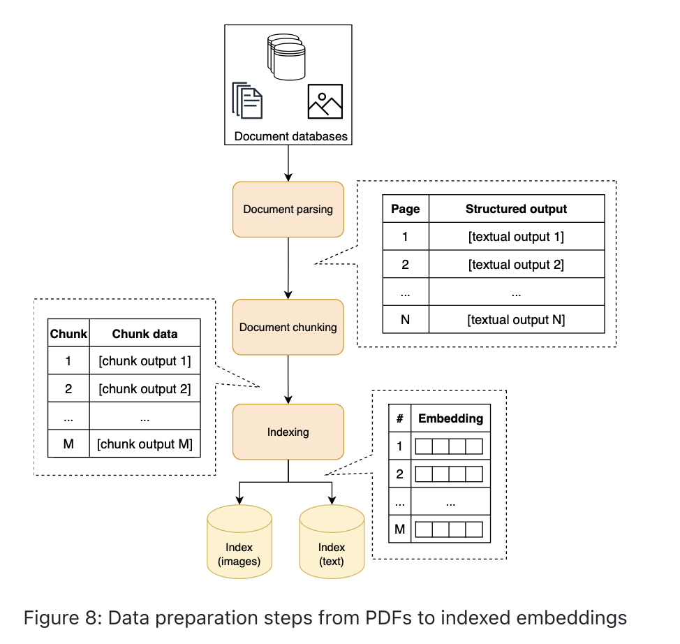

---

## 3. Model Development

### Architecture

A RAG system uses three groups of models across indexing, retrieval, and generation:

  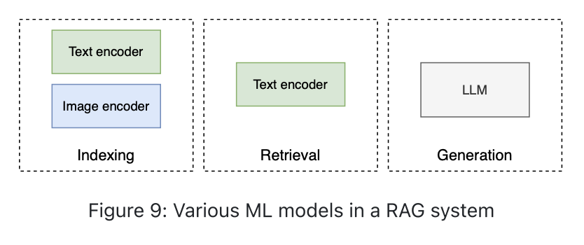

#### The Models Behind Indexing: Text & Image Encoders
Section 2 decided *what kind* of index to build (vector-based). This is *which models* actually produce the vectors that go into it.

*   **Text encoder**: An encoder-only Transformer converts each chunk into a dense embedding capturing semantic meaning.
*   **Image encoder**: CNN- or Transformer-based, converts images into embeddings.
*   **Text–image alignment**: A query like "How many cats are in the company?" must retrieve relevant images. Two approaches:
    1.  **Shared embedding space** — use encoders pretrained into the same space, e.g., **CLIP**, enabling cross-modal retrieval directly.
    2.  **Image captioning** — caption the image with an image-captioning model, then embed the caption text so images and text share the text encoder's space. Useful when text/image encoders are separate or joint training is too costly.

    We use a **pretrained CLIP model** for both text and image encoding — no additional training required.

#### Retrieval
The query is embedded with the *same* text encoder used at indexing time, then compared against stored embeddings to fetch the closest chunks.

#### Generation
An LLM (decoder-only Transformer, or a cloud-hosted API model) produces the response from the query + retrieved context. RAG is architecture-agnostic on the LLM choice.

### Training

Most parts of a RAG system — the text encoder, the image encoder, the base LLM — start out as **pretrained models**. We don't train them from scratch, and we don't jump straight to finetuning the LLM either. Finetuning is the last tool we reach for, not the first.

**Why start with pretrained models?** They already understand general language (and, for CLIP, images) from their original training. In most cases, pairing them with good retrieval and a well-written prompt gets us most of the way to a working system, at a much lower cost than finetuning.

**So when is finetuning actually worth doing?** Only when the system keeps failing even with good retrieval and good prompts. A useful signal to look for: the retrieval step is bringing back the right documents, but the LLM still writes a poor answer from them. That tells us the problem is in how the model *generates* its answer, not in what it's retrieving — and finetuning is the right tool for that specific problem.

#### RAFT (Retrieval-Augmented Fine-Tuning)

**The problem it solves**: retrieval is never perfect. Along with the one document that actually answers the question (the **golden** document), the retriever often also pulls in a few documents that just look related but don't actually help — these are called **distractors**. A model that has never practiced telling the two apart can get confused and mix a distractor's content into its answer, which shows up as a hallucination. RAFT is a finetuning method built to fix exactly this.

**How it works, step by step:**

1.  **Put together a training example.** For each question, gather the golden document (the correct one) along with a few distractor documents (unrelated ones, taken from elsewhere in the corpus). In the reference figure, for the question "Who invented transformers?", the golden document is *"Attention is all you need"*, and the distractors are unrelated documents like `Adam`, `GloVe`, and `Resnet`.
2.  **Show the model everything together.** The question, the golden document, and the distractors are all given to the model at once — not just the golden document by itself. This is the main difference from ordinary finetuning.
3.  **Train it to prefer the right source.** During training, the model is rewarded for answering based on the golden document, and corrected whenever its answer leans on a distractor instead. Over time, it learns to recognize which document actually answers the question.
4.  **Compare with the simpler alternative.** The figure also shows a simpler setup, "Golden Only," where the model only ever sees the correct document during training. It never has to practice ignoring bad information — which is exactly the skill RAFT is trying to teach.
5.  **Test it the way it will really be used.** At test time, the model is given the same kind of top-k retrieval it will see in production — a mix of a few relevant and a few irrelevant documents, from real retrievers like LLaMA2, Sliding Window, or Mistral 7B in the reference example — so it's being evaluated under realistic, imperfect conditions rather than ideal ones.

  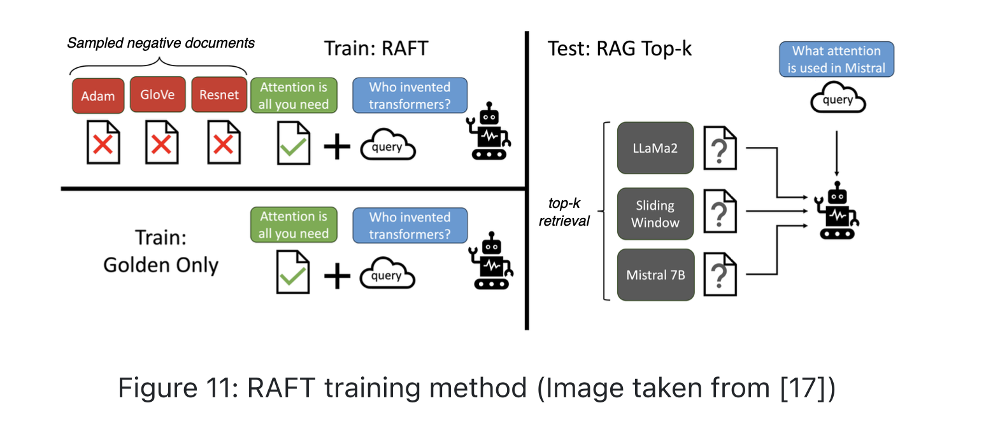

#### RAFT-Finetuned Model vs. a Regular RAG Model

The two systems use the exact same retrieval → generation pipeline at inference time — RAFT doesn't change the architecture at all. The only difference is what the LLM learned during training:

| | Regular RAG (pretrained LLM, no finetuning) | RAFT-finetuned RAG |
|---|---|---|
| **Training** | Just the LLM's original general pretraining — nothing specific to handling noisy retrieval. | Trained specifically on question + golden document + distractor documents together. |
| **When retrieval is clean** | Works fine. | Works fine, too. |
| **When retrieval includes distractors** | Can get confused and blend in irrelevant information. | Learned to recognize and set aside the distractors, and stay grounded in the right document. |
| **Cost** | No extra cost — just retrieval and a pretrained LLM. | An added finetuning step, on top of the retrieval system RAG already needs. |
| **When to use it** | Fine as a starting point, especially if retrieval is already accurate and distractors are rare. | Worth doing once you notice the model getting misled by noisy retrieval results, even though retrieval itself is working. |

In simple terms: a regular RAG system just hopes the LLM can tell good context from bad on its own. RAFT removes the guesswork by teaching that skill directly during training. That's why it's treated as an optional step to add later, once you've actually seen this specific problem show up.

### Sampling (Inference-Time Pipeline)

"Sampling" usually just means generating new output from a model. In a RAG system, though, producing a response to a user's query takes several components working together, not a single generation step. This section walks through those components and the techniques used to get better results out of the retrieval and generation stages.

#### Retrieval: Two Steps
1.  **Compute the query embedding** — pass the user's query through the same text encoder used at indexing time.
2.  **Nearest neighbor search** — find the chunks closest to the query embedding.

**Exact nearest neighbor** (linear search) computes the distance from the query to every item: `O(N × D)`. Guarantees the true nearest neighbors, but at 40M+ chunks this is far too slow for production.

**Approximate nearest neighbor (ANN)** trades a small amount of accuracy for sublinear search time, e.g. `O(log(N) × D)`:

| ANN family | Idea | Examples |
|---|---|---|
| Tree-based | Partition the space (e.g., by feature value) to prune the search | k-d tree, R-trees, Annoy |
| Locality-sensitive hashing (LSH) | Hash nearby points into the same bucket; only search within-bucket | — |
| **Clustering-based** | Group into clusters; search cluster centroids first (inter-cluster), then items within the chosen cluster(s) (intra-cluster) | — |
| Graph-based | Navigate a proximity graph hierarchically, coarse → fine | HNSW |

**In more detail — clustering-based and graph-based, since these are the two you'll see most in production:**

*   **Clustering-based**: The indexed items are first organized into clusters using a distance metric like cosine similarity or Euclidean distance. A search then happens in two steps:
    1.  **Inter-cluster search** — compare the query embedding against the *centroids* of all clusters, and keep only the clusters that fall within a set distance threshold.
    2.  **Intra-cluster search** — compare the query embedding against the individual items inside just those selected clusters.

    Narrowing the search down to a cluster first, then doing a finer search only within it, cuts the number of comparisons dramatically compared to checking every item in the dataset.

*   **Graph-based** (e.g., **HNSW** — Hierarchical Navigable Small World): The data is structured as a graph, where each point is a node and edges connect points that are close together in the embedding space. HNSW searches this graph hierarchically — it starts at a coarse, high-level layer of the graph and gradually moves down to finer layers, exploring only the nearby nodes at each level. This keeps the search space small at every step, instead of scanning the whole dataset.

**Which category fits a RAG retrieval system?** RAG systems typically index a massive and still-growing number of items — often hundreds of millions of embeddings. Exact nearest neighbor search is simply too slow at that scale, so an ANN approach is necessary. There's no single "best" ANN algorithm — the right pick depends on dataset size, latency requirements, and how much accuracy you're willing to trade for speed. **For simplicity, we use a clustering-based ANN approach** in the retrieval component of this RAG system. Production-ready ANN is also available out-of-the-box via **Elasticsearch**, **FAISS** (Meta), or **ScaNN** (Google), so most teams reach for one of these rather than implementing ANN from scratch.

  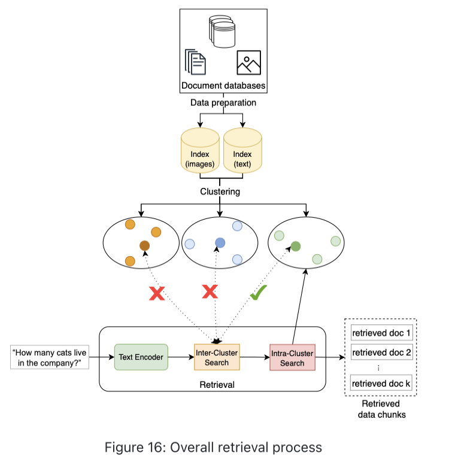

#### Generation: Prompt Engineering

The generation component combines the query, retrieved context, and prompt engineering, then samples a response (top-p sampling) from the LLM.

  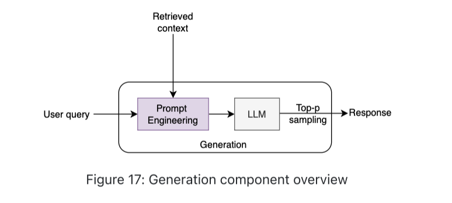

Prompt engineering is what turns a plain user query plus a pile of retrieved chunks into a well-directed request the LLM can act on reliably. Two things matter here: the general **principles** behind writing a good prompt, and specific **techniques** for steering the model's behavior in a RAG setting.

**Design principles** — a checklist for writing the prompt itself:
1.  **Start simple**: begin with a straightforward prompt and only add complexity when you actually need it. Test and refine iteratively — tools like Cohere's Playground make this quick to do.
2.  **Break down complex tasks**: if a request involves several sub-tasks, split them into smaller, explicit steps instead of asking for everything at once. This keeps the model focused instead of overwhelmed.
3.  **Use clear instructions**: prefer explicit, action-oriented commands — "Write," "Summarize," "Translate" — over vague phrasing. Putting instructions up front, separated by a delimiter like `###`, also helps the model tell "instructions" apart from "content."
4.  **Be specific**: say exactly what format, style, or outcome you expect. But specificity has a limit — pile in only what's relevant, not every detail you can think of.
5.  **Watch the prompt length**: too little context leaves the model guessing and produces vague answers; too much buries the actual question and can confuse the model. The right length is "concise, but detailed enough."

**Techniques** — ways to shape *how* the model reasons and responds, once the retrieved context is in hand:

*   **Chain-of-thought (CoT) prompting**: instead of asking directly for a final answer, the prompt asks the model to reason through intermediate steps first. This matters most for multi-hop questions, where the answer requires combining facts from more than one retrieved chunk — for example, *"Given the following documents, explain the step-by-step process of photosynthesis."* CoT has since been extended in two directions: techniques like **Tree of Thoughts**, which let a model explore and compare several reasoning paths before committing to an answer, and **test-time compute scaling** (as seen in OpenAI's o1), where giving the model more computation at inference time — not more training — improves its ability to handle hard, multi-step problems.

*   **Few-shot prompting**: show the model a couple of example question/answer pairs before the real query, so it can infer the expected format and tone from the pattern rather than from an abstract instruction. For example:
    > *Example 1:* Query: "How do plants absorb sunlight?" → Answer: "Plants absorb sunlight using chlorophyll in their leaves."
    > *Example 2:* Query: "How do plants produce oxygen?" → Answer: "During photosynthesis, plants convert carbon dioxide into oxygen."
    > *Query:* "How do plants grow?"

*   **Role-specific prompting**: assign the model a persona or area of expertise so its tone, depth, and vocabulary match the domain. A generic model asked to review a legal clause might hedge or oversimplify; one prompted as *"an experienced contract lawyer with over 20 years of experience... your job is to provide clear and concise legal explanations to clients without a legal background"* is steered toward the right level of authority and plain-language clarity for that specific audience.

*   **User-context prompting**: inject details about the specific user into the prompt — language, role, location, current date/time — so the answer is tailored rather than generic. For example, telling the model the requester is a *"Manjaro Linux user in Mountain View, California, at 2:46 PM on Nov 23, 2024"* changes how it should phrase an OS-specific troubleshooting answer or a time-sensitive one. The instruction should note this profile is used *only when relevant* to the query — not forced into every answer.

Combining all four techniques above with the design principles produces a single, layered prompt — each labeled region below maps back to the technique that put it there:

  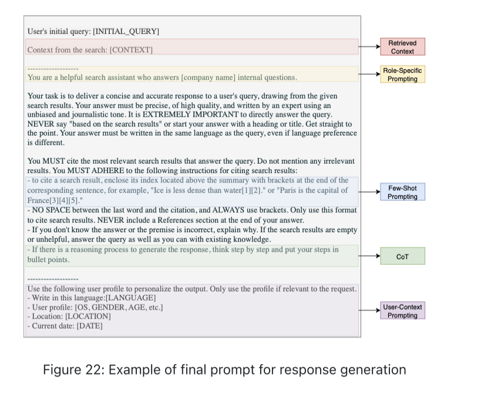

---

## 4. Evaluation

Unlike traditional ML models, which are judged with a handful of well-defined quantitative metrics, evaluating a RAG system is harder — because the quality of the final answer depends on *multiple* components (retrieval and generation) working correctly together. A bad answer could come from bad retrieval, unfaithful generation, or both, and you need to know which. A **triad** captures the relationships between query, retrieved context, and generated result, and gives us four things to check:

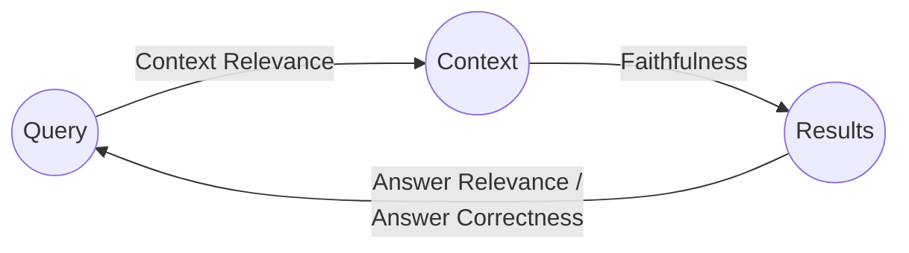

**Quick summary:**

| Aspect | What it measures | How to evaluate |
|---|---|---|
| **Context relevance** | Did retrieval surface the right chunks, ranked well? | Hit rate, Mean Reciprocal Rank (MRR), NDCG, Precision@k |
| **Faithfulness** | Is the answer grounded in the retrieved context (no hallucination)? | Human review; automated fact-checking (Ragas, ARES); consistency checks across repeated queries |
| **Answer relevance** | Does the answer fully and non-redundantly address the query? | LLM-as-judge (e.g., compare Q&A pairs with another model) |
| **Answer correctness** | How closely does the answer match a reference answer? | BLEU, ROUGE, METEOR |

**In more detail:**

*   **Context relevance** — checks the *retrieval* half of the pipeline in isolation: out of everything the retriever returned, how much of it is actually relevant to the query, and is the most relevant material ranked at the top? This matters because even a great LLM can't recover from being handed the wrong documents. It's measured with standard information-retrieval metrics: **hit rate** (did at least one relevant chunk show up at all), **Mean Reciprocal Rank (MRR)** (how high up the first relevant result ranked), **NDCG** (rewards relevant results appearing earlier, weighted by relevance), and **Precision@k** (what fraction of the top-k results were actually relevant).

*   **Faithfulness** — checks whether the generated answer is factually consistent with the retrieved context, or whether the LLM is hallucinating — adding information that isn't actually grounded in what it was given. This is worth catching separately from correctness, because faithfulness failures are the ones that *sound* confident and plausible while being unsupported. It can be assessed through:
    *   **Human evaluation**: reviewers manually cross-check each claim in the answer against the retrieved documents to confirm it's substantiated.
    *   **Automated fact-checking tools** (e.g., Ragas, ARES): compare the generated response against known facts at scale, reducing reliance on manual review.
    *   **Consistency checks**: ask the same underlying question multiple ways and confirm the model gives consistent facts each time — contradictions across repeated queries are a red flag.

    **Example**: given context stating Marie Curie won Nobel Prizes in both Physics and Chemistry, a faithful answer states this correctly; an unfaithful one claims she won only in Physics — a hallucination not supported by the retrieved context, even though it sounds like a perfectly reasonable answer on its own.

*   **Answer relevance** — checks whether the answer actually addresses what was asked, without padding it with irrelevant or redundant information. A response can be fully faithful (nothing in it is false) and still score low here if it dodges the actual question or buries the answer in filler. It's typically evaluated by having another LLM compare the question and the answer and judge how directly the answer addresses it.

    **Example**: asked "What are the main characteristics of a healthy diet?", a high-relevance answer lists concrete characteristics — fruits, vegetables, whole grains, lean proteins, dairy, and why each matters. A low-relevance answer says something true but vague, like "A healthy diet is very important for overall health" — faithful, but not actually answering the question.

*   **Answer correctness** — checks how closely the generated answer matches a known-correct reference answer, using text-similarity metrics like **BLEU**, **ROUGE**, and **METEOR**. This is the most direct "did we get it right" check, useful when you have ground-truth answers to test against (e.g., a curated eval set of question/answer pairs).

    **Example**: asked "When and where was the Eiffel Tower completed?", a high-correctness answer says "1889 in Paris, France" (matching the reference); a low-correctness one gets a fact wrong — e.g., placing it in "London, UK" — even if the sentence structure and tone otherwise sound right.

Checking these four aspects separately, rather than eyeballing "is the answer good," is what lets an engineering team trace a bad answer back to its actual cause — bad retrieval, an unfaithful generation, an off-topic response, or a factually wrong one — instead of guessing.

---

## 5. Overall System Design

  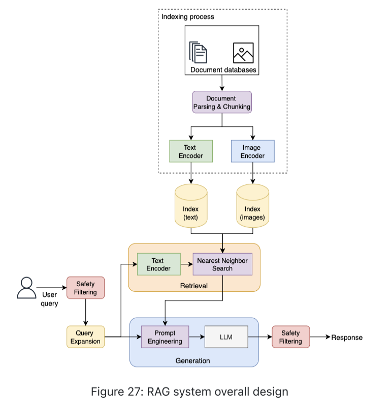

*   **Indexing process**: PDFs → parsing/chunking → CLIP text/image encoders → text and image indexes.
*   **Safety filtering**: Screens both the incoming query and the outgoing response for inappropriate or harmful content.
*   **Query expansion**: Cleans up the raw query (typos, grammar) and broadens it to surface additional relevant chunks that a literal reading might miss.
*   **Retrieval**: Query → CLIP text encoder → ANN search over the index.
*   **Generation**: Retrieved chunks + query → prompt engineering (e.g., CoT) → LLM → top-p sampled response.

---

## Summary

  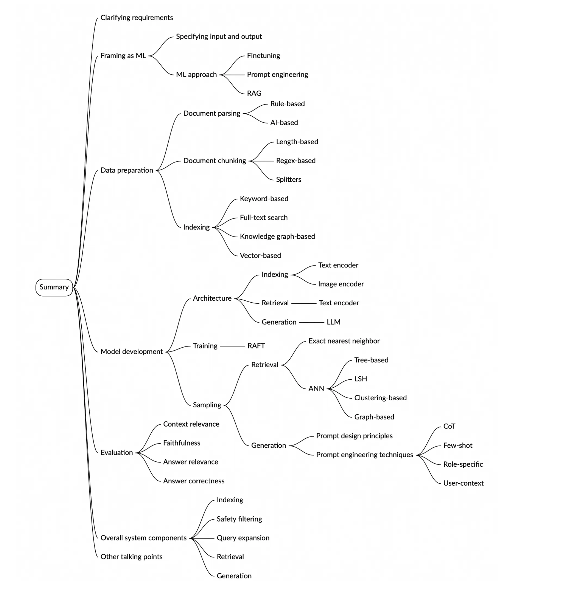

1.  **Requirements**: internal-doc chatbot, ~5M PDF pages growing 20%/yr, must cite sources, seconds-level latency is fine, English-only.
2.  **ML approach**: RAG chosen over finetuning (no citations, costly) and prompt engineering (doesn't scale to context window).
3.  **Data prep**: AI-based document parsing (handles inconsistent layouts) → chunking (length/regex/structure-aware) → vector-based indexing (scales to 40M+ chunks with semantic search).
4.  **Architecture**: CLIP text/image encoders for indexing and retrieval; an LLM for generation.
5.  **Training**: start from pretrained components; finetune (optionally via RAFT) only if retrieval + prompting isn't enough.
6.  **Sampling**: query embedding → ANN search (clustering-based here; FAISS/ScaNN/Elasticsearch in practice) → prompt-engineered generation (CoT, few-shot, role- and user-context prompting).
7.  **Evaluation**: context relevance, faithfulness, answer relevance, answer correctness — no single metric captures RAG quality.
8.  **System design**: adds safety filtering and query expansion around the core retrieval/generation loop.

---

## Reference Material

*   [Perplexity.ai](https://www.perplexity.ai/) · [ChatPDF](https://www.chatpdf.com/)
*   [LoRA: Low-Rank Adaptation of LLMs](https://arxiv.org/abs/2106.09685)
*   [LayoutParser: A Unified Toolkit for DL-Based Document Image Analysis](https://arxiv.org/abs/2103.15348)
*   [Dedoc](https://github.com/ispras/dedoc) · [Google Cloud Document AI](https://cloud.google.com/document-ai/docs/layout-parse-chunk) · [PDF.co](https://developer.pdf.co/api/document-parser/index.html)
*   [Elasticsearch](https://www.elastic.co/elasticsearch) · [Faiss](https://faiss.ai/) · [ScaNN](https://research.google/blog/announcing-scann-efficient-vector-similarity-search/)
*   [CLIP: Learning Transferable Visual Models From Natural Language Supervision](https://arxiv.org/abs/2103.00020)
*   [RAFT: Adapting Language Model to Domain Specific RAG](https://arxiv.org/abs/2403.10131)
*   [HNSW: Efficient and Robust ANN Search](https://arxiv.org/abs/1603.09320) · [Annoy](https://github.com/spotify/annoy)
*   [Chain-of-Thought Prompting Elicits Reasoning in LLMs](https://arxiv.org/abs/2201.11903)
*   [Tree of Thoughts](https://arxiv.org/abs/2305.10601) · [OpenAI o1](https://openai.com/index/learning-to-reason-with-llms/) · [Scaling LLM Test-Time Compute Optimally](https://arxiv.org/abs/2408.03314)
*   [Ragas](https://docs.ragas.io/en/stable/) · [ARES](https://arxiv.org/abs/2311.09476)
*   [Query2doc: Query Expansion with LLMs](https://arxiv.org/abs/2303.07678) · [Precise Zero-Shot Dense Retrieval (HyDE)](https://arxiv.org/abs/2212.10496)
*   [Active Retrieval Augmented Generation](https://arxiv.org/abs/2305.06983) · [Self-RAG](https://arxiv.org/abs/2310.11511)

