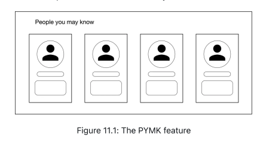
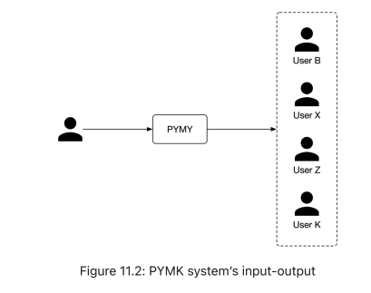
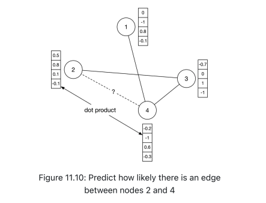
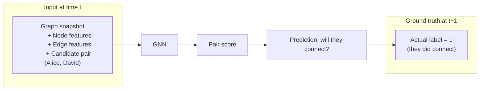
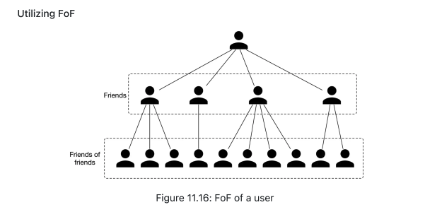
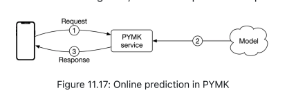
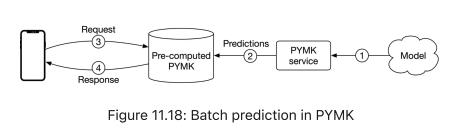
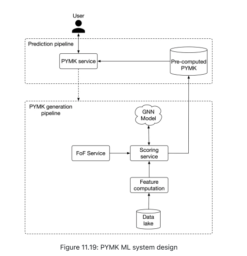
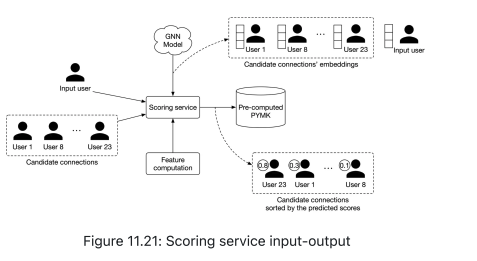
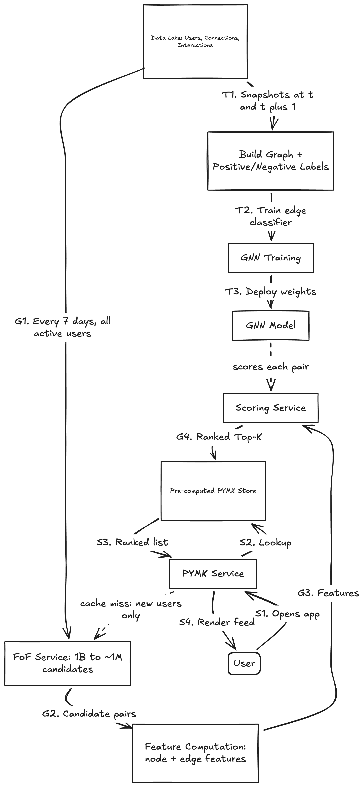

# People You May Know (PYMK) System Design

A large-scale friend/connection recommendation system (similar to LinkedIn) that recommends a ranked list of potential connections to a user based on their profile, social graph, and interaction history to help users discover and grow their network.

---

## 1. Requirements & System Constraints

### Business Objectives
*   **Core Goal:** Help users discover potential connections and grow their professional network.
*   **UX Flow:** Recommends a ranked list of potential connections on the user's homepage / PYMK widget.
*   **Connection Semantics:** Friendship is **symmetrical** — a connection only forms once the recipient accepts the sender's request.

### Technical & Scale Constraints
*   **Scale:** ~1 billion total users, ~300 million daily active users (DAU).
*   **Social Graph Density:** An average user has ~1,000 existing connections.
*   **Graph Dynamics:** The social graph is not very dynamic — a user's connections don't change significantly over short periods (recommendations can be safely cached/pre-computed).
*   **Focus:** Prioritize the most predictive signal groups — educational background, work experience, and social context (mutual connections) — over the full long tail of possible features (location, activity, etc.).

---

## 2. Problem Formulation

### Business & ML Objective
*   **Primary Objective:** Maximize the number of *formed* connections between users (not just sent requests), which drives network growth.

### Define Inputs and Outputs
*   **Input:** A user (the target user requesting recommendations).
*   **Output:** A ranked list of other users, ordered by relevance/likelihood of forming a connection.

### Choose the ML Category

#### A Simple Example: Why Just Looking at Two Users Isn't Enough
Say we want to guess if **User A** and **User B** will connect. Just looking at their own profiles doesn't tell us much. So instead, let's look at their friends.

*   **Scenario 1:** User A and User B each already know the same 4 people (C, D, E, F) — and those 4 people all know each other too. So A and B are basically in the same friend group.
*   **Scenario 2:** User A and User B each have 2 friends, but none of those friends know each other or know anyone in common.

It's easy to see that **Scenario 1** is much more likely to lead to a connection than **Scenario 2** — even if A and B's own profiles (age, school, job) look exactly the same in both cases. The important clue here isn't about A or B individually — it's about how their friend circles overlap. So whatever model we build needs to be able to look at a user's friends (and friends of friends), not just the two users on their own.

Two candidate formulations are commonly considered:

1.  **Pointwise Learning-to-Rank (Binary Classification, Pairwise Input):** A binary classification model takes **two users** as input (e.g., User A, User B) and outputs the probability that the pair will form a connection.
    *   *Drawback:* Treats the pair in isolation and ignores the surrounding **social context** described above. Scenario 1 and Scenario 2 from our example would be scored identically, even though real-world outcomes differ sharply between them.

2.  **Edge Prediction on a Graph (Chosen):** Model the entire social network as a **graph** — nodes are users, edges are formed connections — and predict the probability that an edge exists (or will form) between two specific nodes, using the full graph as context.
    *   This is an instance of **edge-level prediction**, one of three general graph ML task types:
        *   *Graph-level:* Predict a property of an entire graph (e.g., is this molecule an enzyme).
        *   *Node-level:* Predict a property of a single node (e.g., is this user a spammer).
        *   *Edge-level (Our Choice):* Predict whether an edge exists/will exist between two nodes.
    *   **Why this wins:** By incorporating a user's one-hop (and optionally two/three-hop) neighborhood, the model can leverage mutual-connection structure — e.g., two users sharing 4 mutual connections that are also mutually connected to each other is a much stronger signal than two isolated friends with no shared context.

---

## 3. Data Preparation & Engineering

To actually build the model from our example above, we need to turn "User A and User B share 4 friends who all know each other" into real data the model can use. That means collecting three things: who our users are, who they're already connected to, and how they've been interacting on the platform. Let's go through each.

### Data Sources
We pull from three raw tables:

**1. Users Table** — who the user is: demographics plus their education and work history.

| User ID | School | Degree | Major | Start Date | End Date |
|---|---|---|---|---|---|
| 11 | Waterloo | M.Sc | Computer Science | Aug 2015 | May 2017 |
| 11 | Harvard | M.Sc | Physics | May 2004 | Aug 2006 |

**2. Connections Table** — who is already friends with whom, and since when.

| User ID 1 | User ID 2 | Timestamp Connection Formed |
|---|---|---|
| 28 | 3 | 1658451341 |
| 11 | 25 | 1659312942 |

**3. Interactions Table** — everything a user *does* on the platform (sends a request, accepts one, views a profile, searches, comments, reacts).

| User ID | Interaction Type | Value | Timestamp |
|---|---|---|---|
| 11 | Connection request | user_id_8 | 1658450539 |
| 8 | Accepted connection | user_id_11 | 1658451341 |
| 11 | Profile view | user_id_21 | 1658451849 |

### Data Standardization
*   **The Problem:** The same thing can be written in different ways — "Computer Science" and "CS" mean the same major, but a model would treat them as two unrelated categories unless we fix this first.
*   **How to Fix It:**
    *   **Force a dropdown:** Let users pick from a predefined list instead of typing free text, so there's only ever one spelling.
    *   **Rule-based grouping:** Maintain a lookup table of known synonyms/abbreviations and map them to one canonical value.
    *   **ML-based grouping:** For messier, larger vocabularies, use clustering or language-model embeddings to automatically group similar-meaning values together.

### Feature Engineering
Now we turn the raw tables above into numbers the model can actually learn from. There are two groups: features about a single user, and features about *how two users relate to each other* (the second group is what powers our friend-overlap example from Section 2).

#### Step 1: User (Node) Features
These describe one user on their own.

| Feature | Why It Matters |
|---|---|
| **Demographics** (age, gender, city, country) | People tend to connect with others who are demographically similar; missing values need explicit handling rather than being dropped. |
| **Network size** (connections, followers, following, pending requests) | Users with bigger networks are simply easier to discover and more likely to attract new connections. |
| **Account age** | A brand-new account is statistically more likely to be spam or low-trust, so very young accounts should be down-weighted or excluded from recommendations. |
| **Recent engagement** (likes/shares/comments received in the last 7 days) | Active, "alive" accounts are more attractive connections than dormant ones. |

#### Step 2: User-User Affinity (Edge) Features
These describe the *relationship* between a specific pair of users — this is the group that actually captures the "how much do A and B's circles overlap" signal from our earlier example.

| Feature | Why It Matters |
|---|---|
| **Schools in common** | People tend to connect with others from the same school. |
| **Overlapping years at school** | Two alumni who actually overlapped in time are far more likely to know each other than alumni 20 years apart. |
| **Same major / same industry** | Shared academic or professional background is a natural conversation starter and connection driver. |
| **Companies in common** | Coworkers (current or past) are one of the most common sources of new connections. |
| **Profile visits** | If A keeps visiting B's profile, that's a strong hint A is interested in connecting. |
| **Mutual connections (count)** | One of the single strongest predictive features overall — the more friends two people share, the more likely they are to connect (this is exactly the "4 shared friends" signal from our earlier example). |
| **Time-discounted mutual connections** | Weighs each mutual connection by *how recently* it formed. If A's network grew a few days ago, A is likely still in an active "connecting" phase; if A's mutual connections with B are years old, A has probably already noticed B and simply chosen not to connect. |

---

## 4. Model Development & Training

We've decided *what* to predict (edges on a graph) and *what data* feeds it (users, connections, and the affinity features between them). Now we need a model that can actually take a graph as input and learn from it. A normal neural network expects a fixed list of numbers as input — it has no idea what to do with "a user and their web of friends." That's exactly the gap a **Graph Neural Network (GNN)** is built to fill.

### Model Selection: Graph Neural Networks (GNNs)

**What is a GNN, in plain terms?** A normal neural network takes a fixed-size list of numbers as input — like a row in a spreadsheet — and has no built-in way to represent "this thing is connected to these other things." A **Graph Neural Network (GNN)** is simply a neural network redesigned to take a *graph* as input instead: a set of nodes (here, users) plus the edges between them (here, connections), each carrying their own feature vectors. Its whole job is to output one updated vector (an **embedding**) per node that captures both that node's own attributes *and* a summary of its neighborhood — which is exactly the "who does this person know" signal we care about for PYMK.

GNNs are a good fit here for two reasons:
*   They operate **natively on graph-structured data**, so we don't need to hand-engineer a way to flatten a user's neighborhood into a fixed-size feature vector — the model learns that summarization itself.
*   They generalize across all three graph ML task types, so the same underlying model family works whether we need a **graph-level** prediction (e.g., is this whole network a bot ring), a **node-level** prediction (e.g., is this one user a spammer), or our case — an **edge-level** prediction (will these two specific users connect).

### How a GNN Actually Scores a Connection, Step by Step

**Step 1 — Start with raw features.**
Every user (node) starts with their own feature vector — age, gender, account age, connection count, etc. Every existing connection (edge) starts with its own affinity vector — mutual connections, profile visits, and so on. This is exactly the data we built in Section 3; nothing new to compute here.

**Step 2 — Let each node "listen" to its neighbors.**
The GNN runs several rounds where every node collects information from its direct neighbors and blends it into its own representation. This is often called *message passing* or *neighborhood aggregation*. Think of it as each user quietly absorbing a summary of who their friends are.

**Step 3 — Produce a learned embedding per node.**
After a few rounds of "listening," each user ends up with a single dense vector (their **embedding**) that encodes not just their own profile, but a compressed summary of their friend circle — exactly the "who do A and B both know" signal from our earlier example.

**Step 4 — Score any candidate pair with a dot product.**
To predict whether User A and User B will connect, take their two learned embeddings and compute a similarity score — typically a simple **dot product**. A higher score means a higher predicted probability of a future connection. The figure below shows this concretely: to check whether an edge should exist between node 2 and node 4, we just take the dot product of their two embedding vectors.

**Which architecture actually does Steps 2–3?** Common GNN architecture families — GCN, GraphSAGE, GAT, and GIN — differ mainly in *how* they aggregate neighbor information; picking one requires empirical experimentation.

### Constructing the Training Dataset

A GNN needs *examples* to learn from, just like any other model — but here, an "example" isn't a single row, it's a whole graph at two different points in time. The core idea: look at the graph a while ago, then check who actually became connected since then, and teach the model to predict that.

**Step 1 — Take a snapshot of the graph at time $t$.**
Capture the entire social graph exactly as it existed at some past point in time, $t$ — every user and every connection that existed then.

**Step 2 — Compute the initial node and edge features for that snapshot.**
For every user (node) in the snapshot, compute their feature vector (age, gender, account age, connection count, etc.). For every existing connection (edge) at time $t$, compute its affinity vector (mutual connections, profile visits, schools/tenure overlap, etc.). This is the model's input.

**Step 3 — Look at a later snapshot, at time $t+1$, to create labels.**
Now compare the graph at $t$ to how it looked later, at $t+1$, and label candidate user pairs based on what actually happened between those two points:
*   **Positive Label:** Two users had **no connection at $t$**, but **did connect by $t+1$** — this is a "yes, they became friends" example.
*   **Negative Label:** Two users had **no connection at $t$** and **still have no connection at $t+1$** — this is a "no, they didn't connect" example.

Putting Steps 1–3 together, here's what one training example looks like end-to-end, for a candidate pair like (Alice, David):

### Loss Function
Since every training example ultimately boils down to a yes/no outcome — did this pair connect or not — the GNN is trained as a simple **edge-level binary classifier**. We use a standard binary classification loss (e.g., binary cross-entropy) computed over all the positive and negative pairs constructed in Step 3 above, comparing each **Prediction** against its **Actual label** as shown above.

---

## 5. Evaluation

Training the model is only half the job — before it ever reaches a real user, we need to check it's actually good (**offline evaluation**), and once it's live, we need to confirm it's driving the outcome we actually care about (**online evaluation**). These answer two different questions: "is the model technically accurate?" vs. "is the product actually working?" — and it's entirely possible to do well on the first and still fail the second, so we need both.

### Offline Metrics

| Component | Metric | Why This One |
|---|---|---|
| **GNN Model** (the edge classifier) | **ROC-AUC** | The GNN's job is a plain binary classification — will an edge form or not — so ROC-AUC is the natural fit: it measures how well the model separates the "will connect" pairs from the "won't connect" pairs, across every possible decision threshold. |
| **PYMK System** (the ranked list a user sees) | **mAP** (Mean Average Precision) | The system's job is different from the model's job — it's not just "is this pair a match," it's "did we put the right people near the *top* of the list." Since a user's real-world response is binary (connect or ignore), mAP is the standard choice for scoring binary-relevance ranked lists. |

**Why check both, not just one?** The GNN itself might score great on ROC-AUC. But before it even sees a candidate, the FoF step (Section 6) has already narrowed the list down — and if that step accidentally drops good matches early, the final PYMK list can still turn out bad, even though the model did its job well. Checking mAP on the full system catches problems like this that looking at the model alone would miss.

### Online Metrics (A/B Testing)

Offline metrics tell us the model looks good on paper. But the only way to know if PYMK is really helping is to test it on real users. There are two obvious metrics to look at — but only one of them can be trusted on its own.

*   **Connection requests sent (last $X$ days):** Easy to measure — did people send more requests after we launched the new model? A 5% jump looks like a win at first glance. But it's a shaky signal: a user could send 1,000 requests and have almost none of them accepted. If the model recommends a lot of bad matches, this number can still go up, even though nobody's network actually grew. More requests sent doesn't mean more real connections — it might just mean more noise.
*   **Connection requests accepted (last $X$ days) (Primary Metric):** A connection only becomes real once the other person accepts. So this number tells us what actually happened, not just what was attempted. It's much harder to fake, which is why we treat it as the main metric — and just use "requests sent" as a secondary, supporting signal.

---

## 6. Deployment, Serving & Monitoring

We now have a trained GNN that can score how likely any two users are to connect. But there's a big gap between "the model works" and "the model can actually serve 300 million people a day." If we tried to run this model live for every user the moment they open the app, we'd hit a wall almost immediately: for a single user, comparing them against all 1 billion other users on the platform is far too slow to do in real time, and doing that for every active user, every single time they load their homepage, is simply not realistic.

So this section is about closing that gap — how do we take a model that works in theory and turn it into something that responds instantly, at massive scale, without recomputing everything from scratch on every request? The short answer, which we'll unpack below, is two ideas working together: first, shrink the number of candidates we ever need to score (using the **Friends-of-Friends** trick from the previous section), and second, do the heavy scoring work ahead of time rather than the moment a user shows up (**pre-computation**), so serving a request becomes a fast lookup instead of a live computation.

### Efficiency: Narrowing the Search Space

**What is "Friends of Friends" (FoF)?** It's exactly what it sounds like: your friends' friends. If Alice is your friend, and Alice is friends with Bob, then Bob is one of your "friends of friends" — even though you and Bob have never directly connected.

**Why does this matter for PYMK?** Checking every one of the platform's 1 billion users as a possible match for you would be far too slow. But most people don't randomly connect with total strangers — they connect with people who are already close to their existing circle. So instead of searching the whole platform, we only look at your friends-of-friends as candidates.

**Does this actually shrink the problem enough?** Yes, dramatically. If the average person has ~1,000 connections, then their friends-of-friends pool is roughly:

$$1{,}000 \text{ friends} \times 1{,}000 \text{ friends each} = \sim 1{,}000{,}000 \text{ friends-of-friends}$$

That takes the search space from **1 billion users down to about 1 million** — a 1000x reduction — just by using information we already have (the connections table).

**But are we throwing away good candidates by doing this?** Barely. In practice, roughly **92% of new connections form through a friend-of-friend**, so restricting candidates this way loses very little — we're not guessing which users to skip, we're skipping the ones that were extremely unlikely to connect anyway.

### Batch vs. Online Prediction

There are two ways to generate a user's PYMK list: compute it the moment they ask for it (**online**), or compute it ahead of time and just hand it over when asked (**batch**).

| Approach | How it works | Verdict |
|---|---|---|
| **Online Prediction** | Score candidates live, right when the user opens the app. | ❌ Rejected — scoring for 300M daily users on demand is too slow for good UX, and wastes compute on the many users who never even load the page. |
| **Batch Prediction** | Score candidates for all (or all active) users ahead of time, on a schedule, and just look up the result when a request comes in. | ✅ Chosen — serving becomes a fast lookup, not a live computation. |

**Why batch works well here:** the social graph barely changes hour to hour, so a recommendation computed today is usually still valid a week from now. That means we can pre-compute PYMK on a schedule — say, every 7 days for most users, and more often (e.g., daily) for new users, whose networks are still forming quickly. To avoid showing the same faces every time, we also pre-compute a few extra candidates and simply skip any ones the user has already seen.

---

## 7. Final ML System Design

Putting everything from this document together — the data (Section 3), the GNN (Section 4), and the two efficiency tricks above (FoF narrowing + batch pre-computation) — here's what the complete, end-to-end system looks like:

The system is really just these two pipelines working as a pair: one does the heavy lifting ahead of time, and the other serves that work back to the user instantly.

### PYMK Generation Pipeline
This pipeline runs continuously in the background, building (and refreshing) the PYMK list for every user ahead of time:
*   **FoF Service:** For a given user, first narrows the entire platform down to just their friends-of-friends — the 2-hop candidate pool from the previous section.
*   **Feature Computation:** Computes the node and edge features (Section 3) for that user and each of their candidates.
*   **Scoring Service:** Runs each candidate through the trained GNN, gets a score for each one, and sorts them into a ranked list.
*   **Result:** The ranked list is written to the Pre-computed PYMK store, ready to be served the moment it's asked for.

### Prediction Pipeline
This is the lightweight path that actually runs when a user opens the app:
*   The PYMK Service first checks the Pre-computed PYMK store for that user.
*   **Cache hit** (the normal case): the pre-computed list is returned immediately — no model call needed.
*   **Cache miss** (e.g., a brand-new user with nothing pre-computed yet): the service makes a one-time on-demand call into the Generation Pipeline to compute a list right away, so the user isn't left with an empty page.

### Further Optimizations (Discussion Points)
This is a simplified system. If asked to push it further in an interview, here are a few good talking points:
*   **Only pre-compute for active users** — no point spending compute on the long tail of accounts that never log in.
*   **Add a lightweight ranker before the GNN** — cheaply cut the FoF candidate pool down further before running the expensive GNN scoring pass on it.
*   **Add a re-ranking step for diversity** — so the final list isn't dominated by one tight friend cluster.

### Other Talking Points
*   **Personalized Random Walk:** a cheaper, non-GNN way to generate candidates — useful as a fast baseline.
*   **Exposure/Fairness Bias:** already well-connected users show up as positive examples more often, so the model learns to recommend them even more — a rich-get-richer loop worth actively correcting for.
*   **Repeated-Ignore Handling:** if a user keeps ignoring the same suggested connection, that pair should rank lower next time instead of being shown forever.
*   **Delayed Feedback:** people don't always accept a request right away — sometimes it takes weeks. So we need a policy for how long to wait before treating an unanswered recommendation as a "no."

## Appendix: Interview Whiteboard Design Sketch

The system splits into three flows on three different clocks: **training** (periodic), **generation** (batch, every ~7 days), and **serving** (online, per request).

