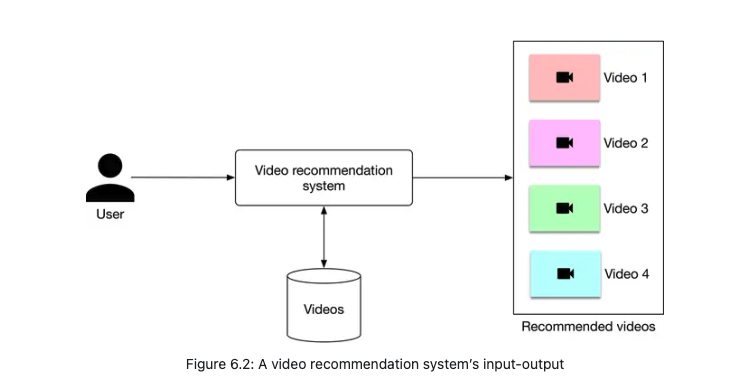
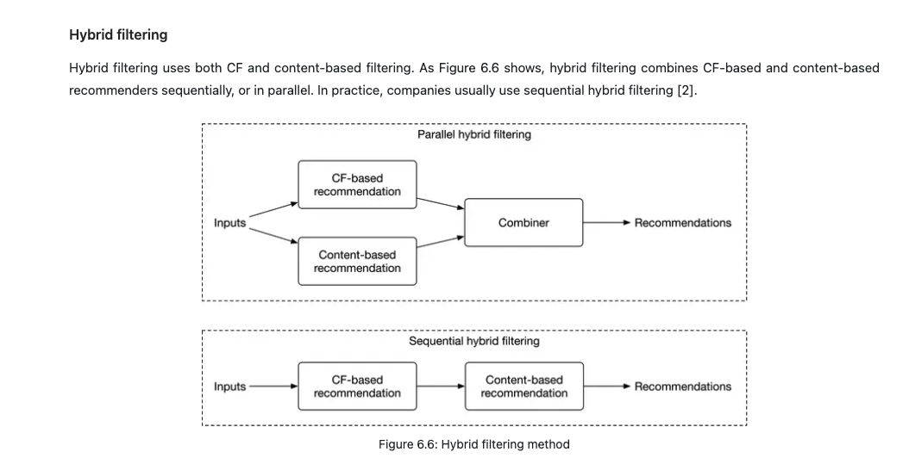
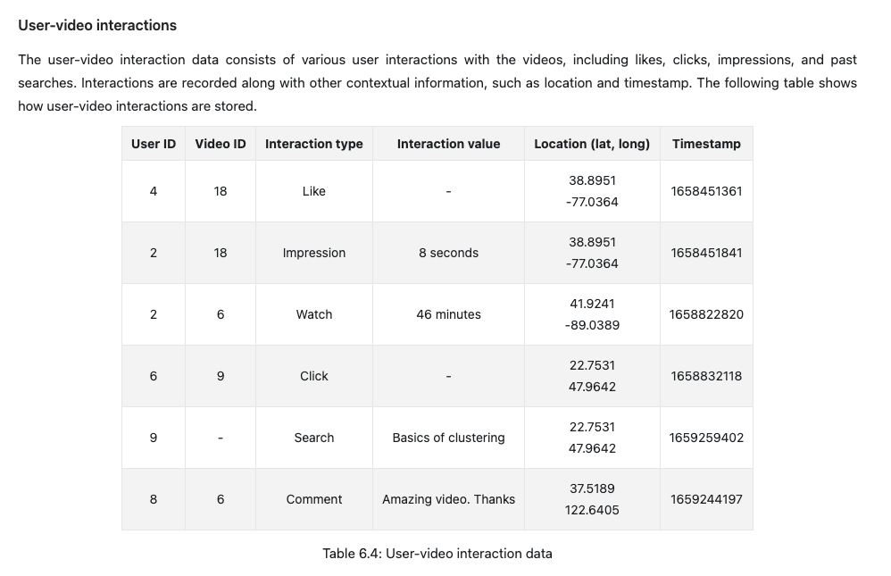
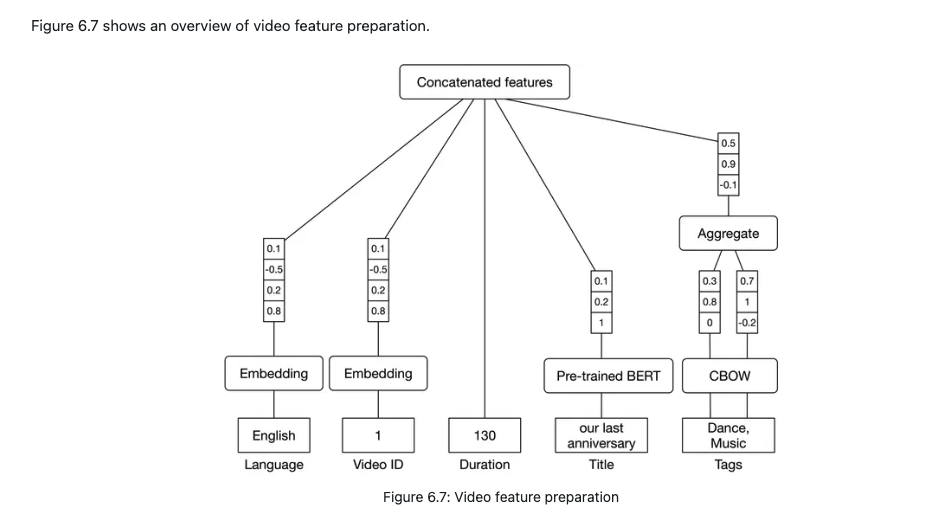
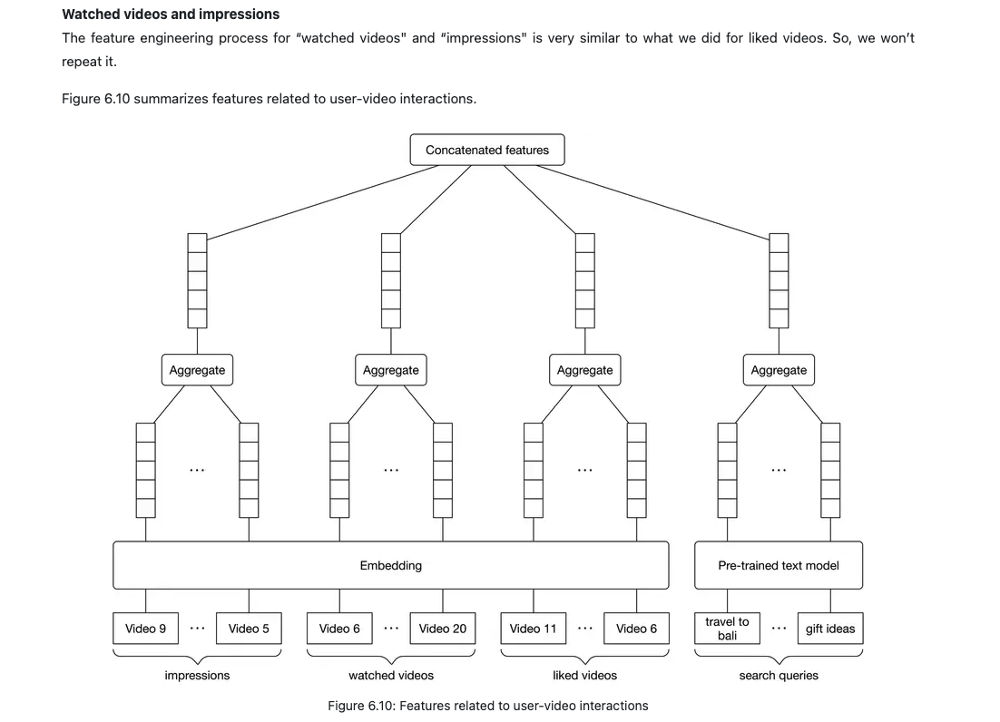
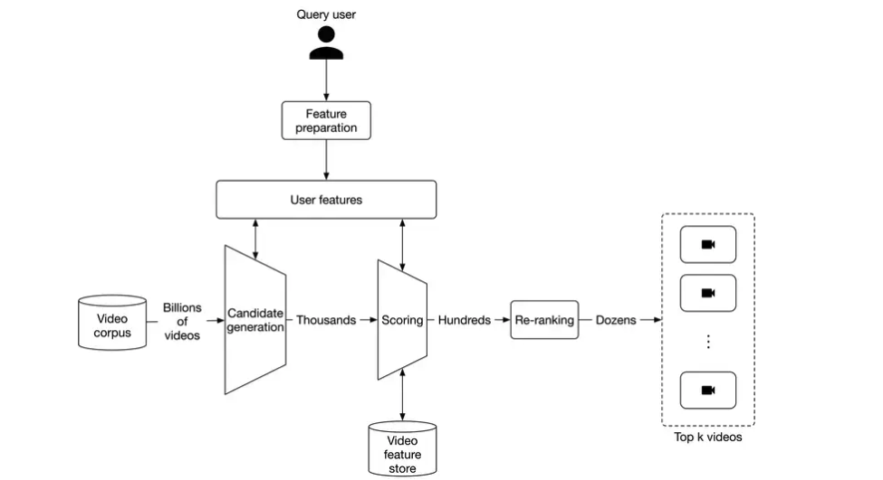
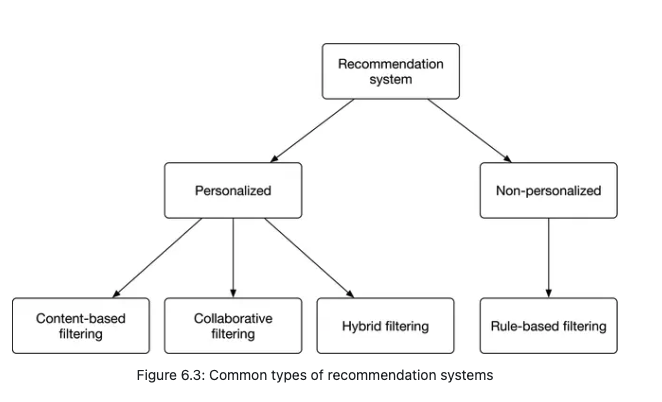
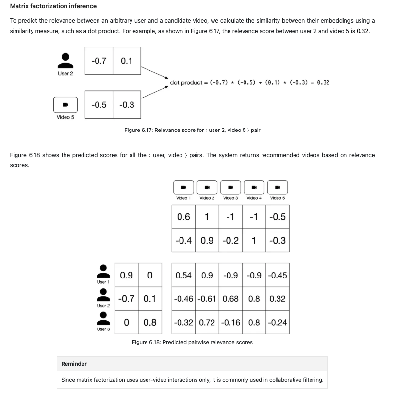
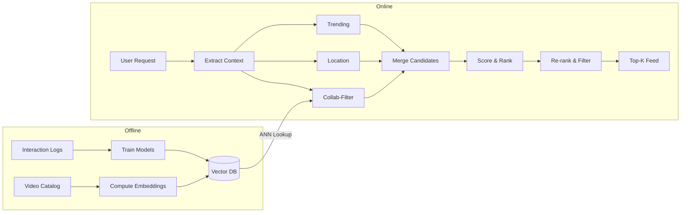
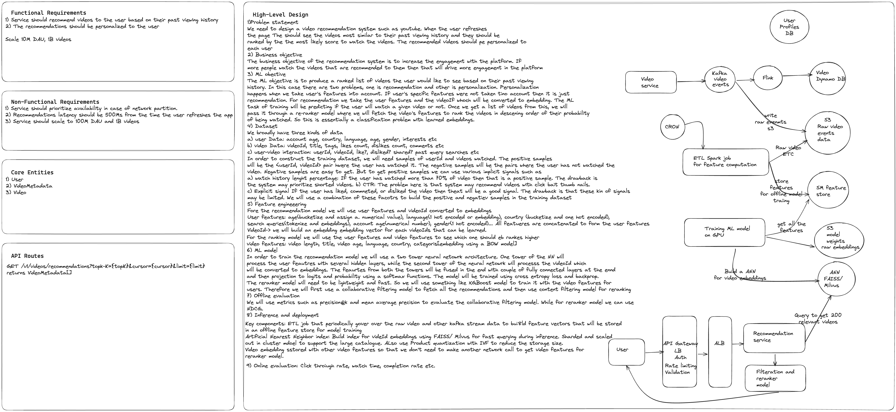

# Video Recommendation System System Design

A large-scale video recommendation system (similar to YouTube) that personalizes the user's homepage feed based on their profile, historical interactions, and context to maximize long-term user engagement.

---

## 1. Requirements & System Constraints

### Business Objectives
*   **Core Goal:** Increase user engagement (long-term satisfaction, not just short-term clicks).
*   **UX Flow:** Recommends a personalized list of videos on the user's homepage when the homepage is loaded.
*   **Feedback Mechanism:** Incorporates both implicit signals (clicks, watch time, impressions, comments) and explicit signals (likes, dislikes).

### Technical & Scale Constraints
*   **Scale:** 10 billion videos in the catalog, with a global user base located worldwide.
*   **Latency:** Recommendations must be served quickly, with a target budget of $\leq 200\text{ ms}$ at query time.
*   **Languages:** Support for multilingual users and videos.
*   **Simplifications:** Playlists and grouping features are out-of-scope for the core recommendation engine model.

---

## 2. Problem Formulation

### Business & ML Objective
*   **Primary Objective:** Maximize long-term user engagement (measured by total watch time and active days).
*   **Secondary Objective (Retention & Trust):** Improve user satisfaction and safety by promoting diverse content and filtering out duplicates, clickbait, and misinformation.

### Define Inputs and Outputs
*   **Input:** User profile (demographics, interaction history), candidate video, and current context (device, time, location).
*   **Output:** A predicted probability of relevance for each candidate video, which is then sorted to output a ranked list of recommendations.

### Choose the ML Category
To optimize the system under strict scale (10 billion videos) and latency ($\leq 200\text{ ms}$) constraints, we split the task into a two-stage pipeline and map them to standard ML tasks:
1.  **Retrieval Stage (Candidate Generation):** Formulated as **Extreme Multiclass Classification**. The model treats every video ID in the catalog as a class and predicts which video the user is most likely to watch next.
2.  **Ranking Stage (Scoring):** Formulated as **Binary Classification**. The model predicts the probability of relevance $y \in [0, 1]$ for the retrieved candidates, where:
    *   **$y = 1$ (Positive):** User liked the video or watched at least 50% of it.
    *   **$y = 0$ (Negative):** Video was shown but skipped, or explicitly disliked.

## 3. Data Preparation & Engineering

### Data Sources
1.  **Videos Metadata Table:** Includes static/upload metadata (Video ID, duration, language, manual tags, title, likes, views).
2.  **Users Schema Table:** User demographics and preferences (User ID, username, age, gender, city, country, language preference, timezone).
3.  **User-Video Interactions Log:** Historical impressions, clicks, watches, likes, dislikes, comments, and search queries, logged with location (lat, long) and timestamp.

### Dataset Construction & Imbalance Handling
To construct a training dataset, we pair user history and context with video candidates and assign labels.
*   **Imbalance Challenge:** Because users interact with only a tiny fraction of the 10 billion videos, negative samples heavily dominate the dataset.
*   **Negative Downsampling:** We train the model on a balanced subset by downsampling the majority class (unclicked impressions) and combining them with all positive interactions (clicks, likes, completed watches).
*   **Constructing Negatives (Crucial Interview Point):**
    *   *Explicit Negatives:* Videos the user disliked or dismissed.
    *   *Implicit Negatives:* Videos shown in the feed (impressions) but not clicked.
    *   *Random Negatives:* Randomly sampled videos from the catalog that were not shown to the user (helps the retrieval stage learn what the user *does not* interact with).

### Feature Engineering
We transform raw features into fixed-size numeric vectors ready for the deep learning models using a systematic step-by-step workflow:

#### Step 1: Video Feature Engineering
*   **Video ID & Language:** Mapped via a learned **Embedding Layer** to capture latent categories.
*   **Video Duration:** Processed using **Log Scaling** to normalize skewed video lengths.
*   **Video Tags:** Converted using a pre-trained **CBOW (Continuous Bag of Words)** model, then aggregate-pooled.
*   **Video Title:** Encoded using a pre-trained **BERT** model to capture semantic, context-aware sentence embeddings.
*   *Assembly:* All processed video features are concatenated into a single dense feature vector.

    

#### Step 2: User & Context Feature Engineering
*   **User ID, City, Country, & Day of the Week:** Categorical variables mapped via learned **Embedding Layers**.
*   **User Age & Time of Day:** Continuous values converted to intervals via **Bucketing**, then encoded via **One-Hot Encoding**.
*   **User Gender & Serving Device:** Low-cardinality categorical variables mapped directly via **One-Hot Encoding**.

#### Step 3: Historical Interaction Pooling
To represent variable-sized interaction history lists as fixed-size user profile vectors:
1.  **Search History:** Mapped via pre-trained **BERT**, then averaged using **Average Pooling** to get a single vector.
2.  **Liked / Watched / Impression History:** Video IDs in the history are mapped to their video embeddings, then averaged using **Average Pooling** to capture user interest.

    
---

## 4. System Architecture

Below is the conceptual system architecture sketch including the offline training, ETL, and online serving flows:

### Component Details

Our system employs a **sequential hybrid filtering** architecture, combining the retrieval speed of collaborative filtering with the precision of content-based features:

1.  **Candidate Generation (Retrieval - Collaborative Filtering):**
    *   **Approach:** Reduces the catalog of 10 billion videos down to a few thousand candidates. It leverages **Collaborative Filtering** to match users and videos based on historical interaction similarity (using matrix factorization or Two-Tower ID embeddings) and performs fast retrieval via Approximate Nearest Neighbor (ANN) search.
    *   *Pros:* Computationally efficient; does not require domain feature engineering; helps users discover new areas of interest.
    *   *Cons:* Cold-start problem for brand-new users and videos with no interaction data.
2.  **Scoring (Ranking - Content-Based Filtering):**
    *   **Approach:** Runs a heavy **Content-Based** deep neural network (e.g., a Two-Tower model using full features) to rank the thousands of candidates. It incorporates rich content features like BERT title embeddings, CBOW tag vectors, duration, and language.
    *   *Pros:* Highly precise; handles new video cold-starts since predictions rely directly on video attributes.
    *   *Cons:* Computationally expensive; can cause a "filter bubble" (limiting recommendations to similar items).
3.  **Re-ranking (Diversity & Business Logic):**
    *   **Approach:** Applies business filters (region-restrictions, duplicate/near-duplicate removal, clickbait/misinformation detection) and ensures category diversity before returning the final top-$k$ feed.

---

## 5. Model Development & Training

Following the Model Development Strategy in our foundation framework, we systematically iterate from simple baseline heuristics to complex deep learning architectures:

$$\text{Simple Heuristic Baseline (Popularity)} \longrightarrow \text{Baseline ML Model (Matrix Factorization)} \longrightarrow \text{Refined ML Model (Two-Tower Network)}$$

*   **Baseline Heuristic (Level 0):** Recommends the globally most-viewed or trending videos (serves as a performance lower bound and fallback system).
*   **Baseline ML Model (Matrix Factorization):** Our starting recommendation model. It uses Collaborative Filtering to decompose user-video interactions into static embeddings, enabling fast dot-product candidate retrieval.
    *   *Limitations:* Cannot handle side features (e.g., age, device) or cold-start users/videos.
*   **Refined ML Model (Two-Tower DNN):** Our next-generation refinement. It replaces the static embeddings with deep user and video encoder towers to ingest rich demographic, context, and content metadata, solving the cold-start problem.

---

### 1. Matrix Factorization (First-Generation Collaborative Filtering Flow)
For collaborative filtering, we model user-video interactions using Matrix Factorization, progressing step-by-step:

#### Step A: Feedback Matrix Construction (Utility Matrix)
*   **Concept:** A user-video feedback matrix $A$ where rows represent users and columns represent videos.
*   **Feedback Selection:**
    *   *Explicit Feedback (e.g., Likes):* Highly accurate but extremely sparse (hard to train).
    *   *Implicit Feedback (e.g., Clicks, Watch Time):* High density but noisy (harder to capture exact user sentiment).
    *   *Our Choice (Combined Heuristic):* We combine both, setting $A_{ij} = 1$ if watch time $\geq 50\%$ OR explicit Like, and $0$ (or unobserved) otherwise.

#### Step B: Latent Matrix Decomposition
*   We decompose the sparse matrix $A$ (dimension $M \times N$) into two low-dimensional dense matrices:
    *   **User Embeddings ($U$):** Dimension $M \times d$
    *   **Video Embeddings ($V$):** Dimension $N \times d$
*   Relevance prediction for user $i$ and video $j$ is calculated via their dot product: $\hat{A}_{ij} = U_i \cdot V_j^T$.

#### Step C: Loss Function Selection (Observed vs. Unobserved Pairs)
1.  **Sum of Squared Errors over Observed Pairs Only:**
    $$\text{Loss} = \sum_{(i,j) \in \text{obs}} (A_{ij} - U_i \cdot V_j^T)^2$$
    *Drawback:* No penalty for unobserved pairs; the model learns trivial weights (e.g., all-ones matrices) and cannot generalize to unseen user-video pairs.
2.  **Sum of Squared Errors over All Pairs (Observed + Unobserved):**
    $$\text{Loss} = \sum_{(i,j)} (A_{ij} - U_i \cdot V_j^T)^2$$
    *Drawback:* Sparing unobserved pairs (zeros) dominate training, forcing all predictions toward zero.
3.  **Weighted Combination Loss (Chosen):**
    $$\text{Loss} = \sum_{(i,j) \in \text{obs}} (A_{ij} - U_i \cdot V_j^T)^2 + W \sum_{(i,j) \notin \text{obs}} (A_{ij} - U_i \cdot V_j^T)^2$$
    *Why:* The hyperparameter $W$ scales down the impact of unobserved pairs so they don't dominate training, balancing accuracy and generalization.

#### Step D: Optimization (WALS vs. SGD)
*   **Stochastic Gradient Descent (SGD):** Minimizes loss by updating parameters row-by-row, but can be slow to converge.
*   **Weighted Alternating Least Squares (WALS) (Chosen):** 
    1. Fix $U$ (User embeddings), solve quadratic optimization to find optimal $V$ (Video embeddings).
    2. Fix $V$, solve to find optimal $U$.
    3. Repeat until convergence.
    *Why WALS:* It converges significantly faster than SGD and is highly parallelizable across distributed systems.

#### Step E: End-to-End Operational Flow

##### Training Phase
1.  **Build Feedback Matrix:** Construct the interaction matrix $A$ from user history logs.
2.  **Initialize Embeddings:** Randomly initialize user embeddings ($U$) and video embeddings ($V$).
3.  **Predict Scores:** Compute predictions via dot product: $\hat{A}_{ij} = U_i \cdot V_j^T$.
4.  **Compute Weighted Loss:** Calculate loss using the weighted combination formula.
5.  **Optimize Embeddings:** Run WALS to alternate optimizing $U$ and $V$.
6.  **Repeat:** Iterate steps 3–5 until convergence.
*   **Output:** Learned static user embeddings ($U$) and video embeddings ($V$).

##### Inference Phase
$$\text{User Embedding} \cdot \text{Video Embedding} \longrightarrow \text{Relevance Score} \longrightarrow \text{Rank Videos} \longrightarrow \text{Recommend Top-K}$$

1.  **Lookup Vectors:** Retrieve the user embedding and candidate video embeddings.
2.  **Calculate Relevance:** Compute the dot product ($U_i \cdot V_j^T$) as the relevance score.
3.  **Rank Candidates:** Sort candidate videos in descending order of their predicted relevance scores.
4.  **Recommend Feed:** Return the top-$k$ videos.

---

### 2. Next-Generation Model: Two-Tower Neural Network (Modern Standard)
To overcome Matrix Factorization's limitations (inability to handle cold-starts and side features), modern recommendation engines utilize deep Two-Tower architectures:

#### Step A: Dual Encoder Architecture
*   **User Tower Encoder ($E_u$):** A deep neural network (DNN) that takes user profile features (demographics, context, interaction history) and outputs a dense user embedding vector.
*   **Video Tower Encoder ($E_v$):** A DNN that takes video content features (Video ID, duration, titles, tags) and outputs a dense video embedding vector.
*   **Relevance Prediction:** The relevance score is computed as the similarity (cosine similarity or dot product) between the user embedding and the video embedding: $\text{Similarity}(E_u, E_v)$.

#### Step B: Loss Function Selection
*   **Classification Formulation:** The network is trained as a binary classification task to predict user action (like/click).
*   **Binary Cross-Entropy Loss:**
    $$\text{Loss} = -\frac{1}{N} \sum_{i=1}^N \left[ y_i \log(\hat{y}_i) + (1 - y_i) \log(1 - \hat{y}_i) \right]$$
    where $\hat{y}_i = \sigma(E_u \cdot E_v^T)$ is the predicted probability.

#### Step C: Optimization
*   **Gradient Descent:** Parameters of both towers are trained simultaneously using backpropagation with modern optimizers (Adam or AdaGrad) on distributed GPU clusters.

---

## 6. Evaluation

### Offline Metrics
*   **Precision@k:** Measures the proportion of relevant videos in the top-$k$ recommendations.
*   **mAP (Mean Average Precision):** Evaluates ranking quality of the binary relevance labels.
*   **Diversity:** Average pairwise cosine similarity or dot product between recommended videos in the list (lower similarity indicates a more diverse recommendation set).

### Online Metrics (A/B Testing)
*   **Click-Through Rate (CTR):** $\text{CTR} = \frac{\text{clicks}}{\text{impressions}}$ (monitored, but cautious of clickbait bias).
*   **Total Watch Time:** Primary metric of user engagement.
*   **Number of Completed Videos:** Indicates how often the user is highly satisfied with recommended videos.
*   **Explicit Feedback:** Click rates of Likes vs. Dislikes.

---

## 7. Deployment, Serving & Monitoring

To serve recommendations to billions of users within a strict latency budget of $\leq 200\text{ ms}$, we partition the architecture into distinct **Offline Training** and **Online Serving (Production)** pipelines.

### Offline Pipeline
*   **Train Models** — Train retrieval (Two-Tower) and scoring models on GPU clusters using interaction logs.
*   **Compute Embeddings** — Run the video catalog through the video tower to produce static video vectors.
*   **Vector DB** — Index all video embeddings in an ANN index (HNSW / IVF-PQ) for sub-ms lookup.

### Online Pipeline (≤ 200 ms)

**Stage 1 — Candidate Generation** (10B → ~1K videos)
*   Three parallel threads query candidates simultaneously to cut latency:
    *   **Collab-Filter** — ANN lookup in Vector DB using the user's embedding.
    *   **Location** — Region/demographic-popular videos.
    *   **Trending** — Globally popular videos (fallback if model fails).
*   Results are merged & deduplicated into one candidate pool.

**Stage 2 — Score & Rank** (~1K → ~100 videos)
*   A heavy neural ranker scores each candidate using user history, real-time context (device, time), and video metadata (BERT titles, CBOW tags).

**Stage 3 — Re-rank & Filter** (~100 → Top-K)
*   Deduplication, freshness decay, clickbait/safety filters, and category interleaving to ensure a diverse, high-quality feed.

### Cold-Start Handling
*   **New Users** — Two-Tower user encoder falls back to demographics (age, location, language).
*   **New Videos** — Content-based features (BERT/CBOW embeddings) + random exploration injection.

### Model Updates
*   **Warm-start fine-tuning** on streaming logs (no full retrains).
*   **Canary deploy** (5% traffic) → **A/B test** → full rollout.

## Appendix: Interview Whiteboard Design Sketch

