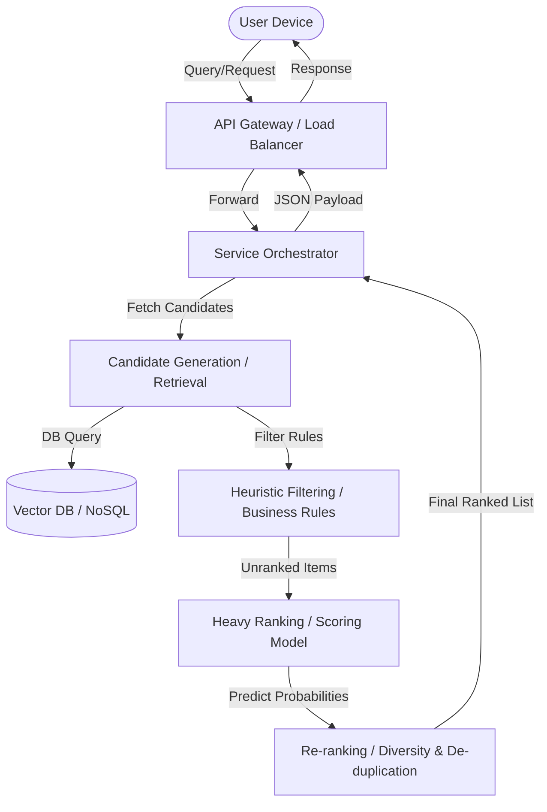

# Sales Forecasting System Design

> Provide a brief 2-3 sentence overview of what the system does and its core objective.

---

## 1. Requirements & System Constraints

### Business Objectives
*   What is the core business goal? (e.g., maximize CTR, engagement, sales, user retention)
*   Define the user experience (UX) and how the model interacts with the user.

### Technical & Scale Constraints
*   **Scale:** Number of daily/monthly active users (DAUs/MAUs), size of the item catalog.
*   **Latency:** Inference time limit (e.g., < 50ms for real-time rankers).
*   **Throughput:** Expected QPS (Queries Per Second).
*   **Resources:** Cloud serving vs. Edge/On-device constraints.

---

## 2. Problem Formulation

### ML Task Mapping
*   **Target Label:** What are we predicting? (e.g., binary click $y \in \{0, 1\}$, continuous watch time $y \in \mathbb{R}$).
*   **ML Category:** Supervised (classification/regression), unsupervised, reinforcement learning, or ranking.

### Input & Output Data
*   **Input:** High-level description of input queries/contexts.
*   **Output:** Model output format and score.

---

## 3. Data Preparation & Engineering

### Data Sources
*   Where does data come from? (e.g., user interaction logs, item metadata database).
*   How are positive/negative labels collected? (Implicit vs. Explicit feedback).

### Feature Engineering
*   **User Features:** Demographics, historical interactions, real-time context.
*   **Item Features:** Content metadata, static statistics (e.g., popularity).
*   **Contextual Features:** Device, time of day, location.
*   **Cross/Interaction Features:** User-item interaction history.
*   **Handling Sparsity/Imbalance:** (e.g., negative downsampling, focal loss).

---

## 4. System Architecture

### High-Level Components
*   **Retrieval / Candidate Generation:** Quickly reduce catalog size (e.g., from millions to hundreds) using fast models or vector search (ANN).
*   **Filtering:** Apply business logic constraints (e.g., exclude blocked items, out-of-stock products).
*   **Ranking / Scoring:** Run a complex deep learning model to score the remaining candidates.
*   **Re-ranking / Diversity:** Apply de-duplication, fairness filters, or ad injection.

---

## 5. Model Development & Training

### Model Selection
*   **Baseline:** Non-ML heuristic (e.g., most popular, chronological).
*   **V1 Model:** Simple interpretable model (e.g., Logistic Regression, Decision Tree).
*   **Deep Learning/Advanced V2:** (e.g., Two-Tower Network, DLRM, Deep & Cross, XGBoost).

### Training Pipeline
*   **Loss Function:** (e.g., Cross-Entropy, Pairwise Ranking Loss).
*   **Validation Strategy:** Time-based splitting to prevent data leakage.
*   **Offline Training Setup:** Batch size, optimizer, distributed training strategies.

---

## 6. Evaluation

### Offline Metrics
*   **Classification:** ROC-AUC, PR-AUC, F1-Score.
*   **Ranking:** NDCG, MAP, MRR.

### Online Metrics
*   **Business KPIs:** CTR, conversion rate, total revenue, average session length.
*   **A/B Testing Strategy:** Cohort splitting, test duration, metric statistical significance.

---

## 7. Deployment, Serving & Monitoring

### Inference Strategy
*   **Real-time (Online) Serving:** On-demand feature store lookups and model scoring.
*   **Batch Prediction:** Precompute scores daily/hourly and load into a fast key-value store (e.g., Redis).
*   **Hybrid:** Retrieve pre-computed candidates and rank them in real-time.

### Monitoring & Feedback Loops
*   **Data Drift:** Covariate and concept drift monitoring.
*   **System Performance:** QPS, latency, memory utilization, error rates.
*   **Model Retraining Loop:** Frequency and triggers for retraining.
